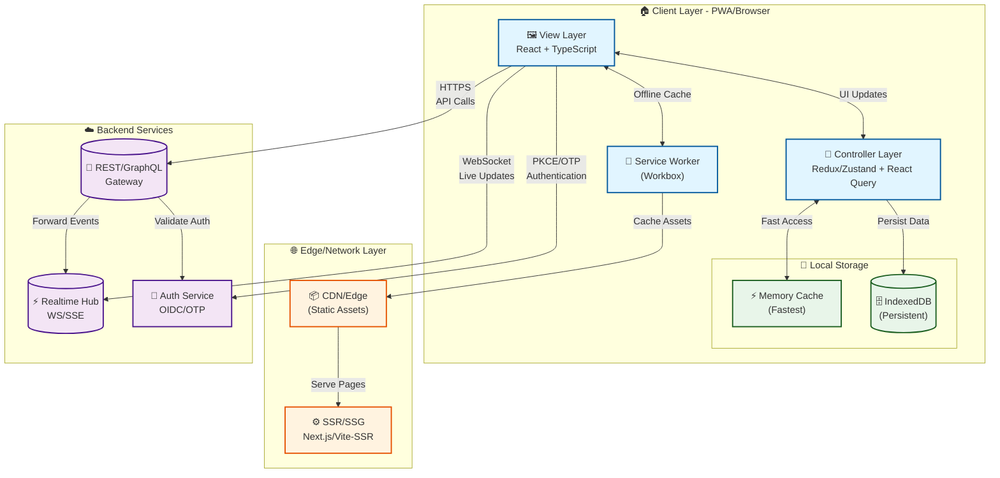
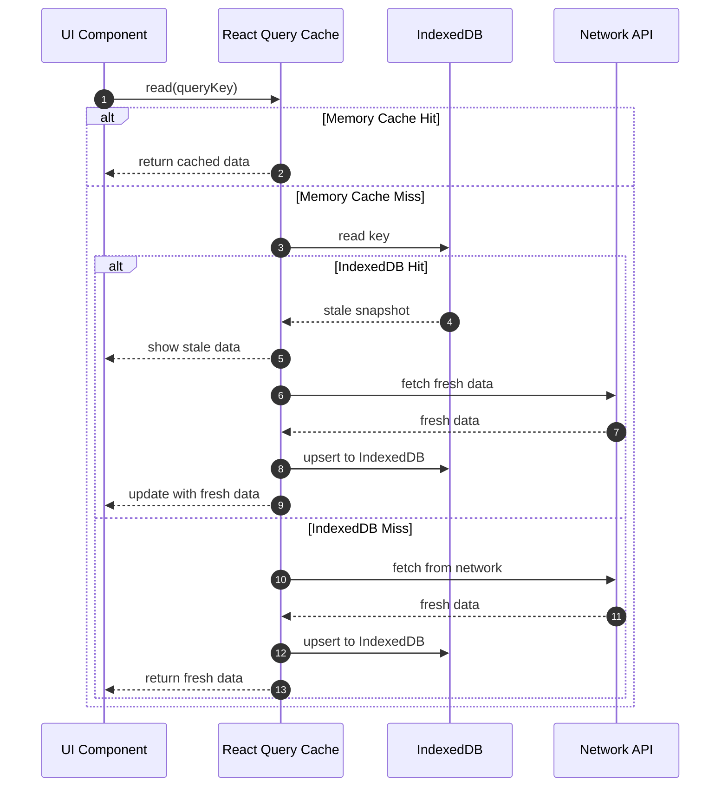
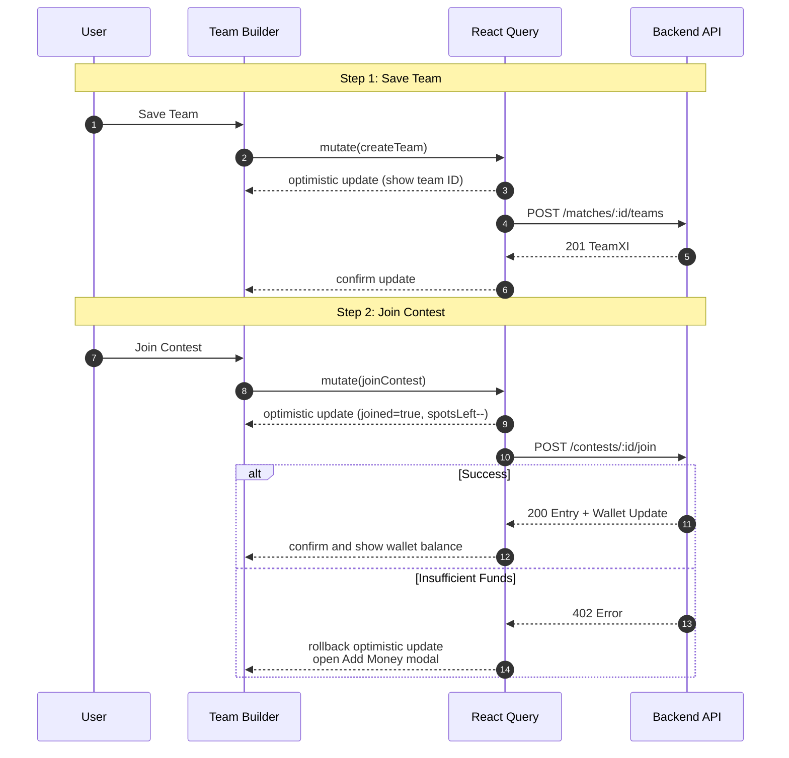
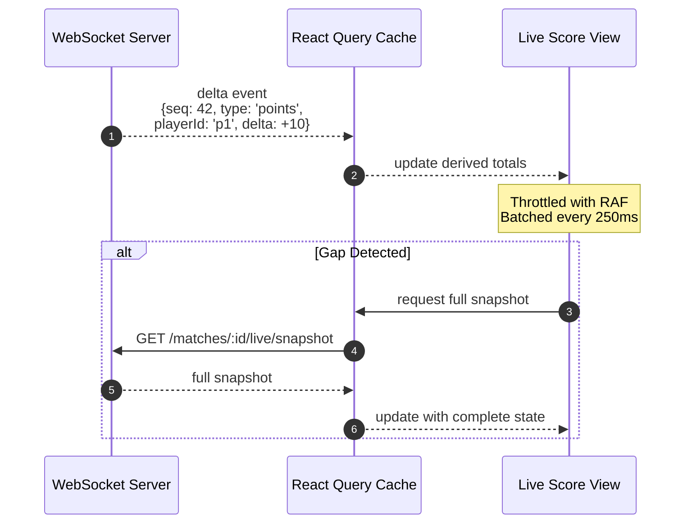
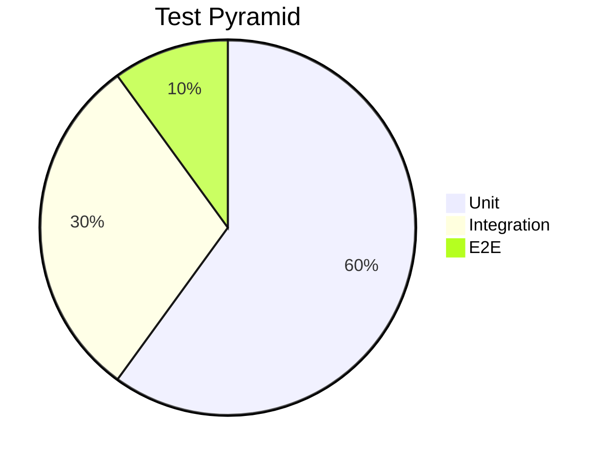

# Dream11‑Style Fantasy Sports Frontend — High‑Level Design (HLD)

> **Scope:** Modern web/PWA frontend for large‑scale fantasy sports (e.g., cricket/football/kabaddi). This is an **HLD** that a front‑end team can execute and evolve. It includes requirements, architecture, data models, API contracts (REST/GraphQL), implementation details, testing, observability, and release checklists.

## Quick Summary for Interviews

**What We're Building:** A fantasy sports platform where users create teams, join contests, and track live scores in real-time.

**Key Challenges:**
1. **Real-time Updates:** Live score updates with minimal latency (< 1s)
2. **Offline Support:** Users can draft teams offline, join contests when online
3. **Scale:** Handle 1M+ concurrent users during peak matches
4. **Performance:** Fast initial load (LCP ≤ 2s), smooth interactions (INP ≤ 200ms)
5. **Reliability:** Graceful degradation when real-time connection fails

**Core Architecture:**
- **View Layer:** React + Next.js (SSR/ISR for SEO, CSR for live updates)
- **State Management:** React Query for server state, Zustand/Redux for app state
- **Caching:** 3-tier (Memory → IndexedDB → Network) for offline support
- **Real-time:** WebSocket/SSE for live scores with polling fallback
- **Offline:** Service Worker + IndexedDB for offline team building

---

## Table of Contents

1. [Requirements](#1-requirements)
   - 1.1 [Functional](#11-functional-requirements)
   - 1.2 [Non‑Functional](#12-non-functional-requirements)
2. [Architecture](#2-architecture)
   - 2.1 [High‑Level Diagram](#21-high-level-diagram)
   - 2.2 [View Layer](#22-view-layer)
   - 2.3 [Controller Layer](#23-controller-layer)
   - 2.4 [IndexedDB & Caching](#24-indexeddb--caching)
   - 2.5 [Service Layer](#25-service-layer)
3. [Data Models](#3-data-models)
4. [APIs: REST vs GraphQL](#4-apis-rest-vs-graphql)
   - 4.1 [REST Examples](#41-rest-examples)
   - 4.2 [GraphQL Examples](#42-graphql-examples)
5. [Implementation Details](#5-implementation-details)
6. [Testing](#6-testing)
   - 6.1 [Unit](#61-unit) • 6.2 [Integration](#62-integration) • 6.3 [E2E](#63-e2e) • 6.4 [Contract & Visual](#64-contract--visual) • 6.5 [Performance & A11y](#65-performance--a11y) • 6.6 [Synthetic Live Replay](#66-synthetic-live-replay)
7. [Observability & Analytics](#7-observability--analytics)
8. [Release & Delivery](#8-release--delivery)
9. [Risks & Mitigations](#9-risk-register--mitigations)
10. [Checklists](#10-checklists)
11. [Appendix: Snippets](#11-appendix--snippets)

---

## 1) Requirements

### 1.1 Functional Requirements

**Auth & Onboarding:** Users can log in with OTP (phone/email) or social login. System prompts for KYC when needed and supports referral flows.

**Home/Discover:** Shows upcoming matches organized by sport and league. Displays promotions and includes search functionality.

**Match Details:** Shows team squads, probable playing XI, player credit values, venue/pitch info, toss/lineup status, and lock countdown timer.

**Contest Catalog:** Supports multiple contest types (mega, head-to-head, winner-takes-all, practice, private). Users can filter by entry fee, contest size, multi-entry options, and prize pool. Includes join/leave rules.

**Team Builder:** Users select 11 players within credit cap. Supports captain/vice-captain multipliers, formation rules, auto-pick, team cloning, and validation.

**Join Contests:** Users select team(s) and number of entries. Payment via wallet/UPI/card. Supports coupons and displays taxes. Uses idempotent joins to prevent duplicates.

**Live Mode:** Shows real-time events (ball/raid/goal), player points, user ranks, leaderboards, team comparison, and notifications.

**Results & Winnings:** Displays post-match settlement, winnings breakdown, and transaction history.

**Wallet & Payments:** Users can add/withdraw money via UPI/cards. Handles payment failures with retry logic. KYC gating for certain transactions.

**Profile & Settings:** Language selection, theme preferences, favorite teams/players, responsible play settings, and state-specific restriction messaging.

### 1.2 Non‑Functional Requirements

**Performance KPIs:** Largest Contentful Paint (LCP) under 2.0s on entry routes, Interaction to Next Paint (INP) under 200ms, Cumulative Layout Shift (CLS) below 0.1. JavaScript bundle under 300KB gzipped on first route.

**Realtime:** Live rank and points updates arrive within 1 second. System handles back-pressure gracefully.

**Reliability:** Offline reads work for schedules and saved teams. Live mode gracefully falls back when connection fails. Target 99.9% uptime.

**Scalability:** Handles 1M+ concurrent users during peak matches. Uses SSR/ISR for performance and CDN for global distribution.

**Security:** Content Security Policy (CSP), Subresource Integrity (SRI), HTTPS/HSTS, SameSite cookies, token rotation. Basic anti-automation measures.

**Accessibility:** WCAG 2.2 AA compliance. Color-safe heatmaps for score visualization. Supports reduced motion preferences.

**Privacy/Compliance:** User consent management, PII minimization, KYC flows, audit logs for compliance.

**Observability:** Real User Monitoring (RUM), structured logs, distributed traces. Error tracking with source maps for debugging.

---

## 2) Architecture

### 2.1 High‑Level Diagram

**Architecture Overview:** We use a layered architecture that separates concerns for better maintainability. The system includes client-side caching, offline support, and real-time updates through WebSocket connections.



**Architecture Layers Explained:**

**1. Client Layer (Browser/PWA):**
- **View Layer:** React components render the UI and handle user interactions
- **Controller Layer:** Zustand/Redux manages app state (like theme, sidebar), while React Query handles server data (matches, contests)
- **Storage:** Memory cache gives instant access (< 1ms) for frequently used data. IndexedDB stores data persistently for offline access
- **Service Worker:** Handles offline caching, background sync when connection returns, and push notifications

**2. Edge/Network Layer:**
- **CDN:** Serves static assets (JS, CSS, images) from edge locations worldwide for faster loads
- **SSR/SSG:** Server-side rendering helps with SEO and initial page load. Static generation caches pages for even better performance

**3. Backend Services:**
- **API Gateway:** REST/GraphQL endpoints for fetching data like matches, contests, user teams
- **Realtime Hub:** WebSocket or Server-Sent Events for live score updates
- **Auth Service:** OAuth/OIDC for social logins, OTP for phone/email authentication

**Data Flow:**
1. **Initial Load:** CDN serves static assets → SSR generates HTML → Browser renders
2. **Data Fetch:** UI makes API call → Backend responds → React Query caches the response
3. **Live Updates:** UI connects via WebSocket → Server pushes updates → UI updates in real-time
4. **Offline:** UI saves to IndexedDB → When online, Service Worker syncs queued actions

**Key Design Decisions:**
- **Layered Architecture:** Keeps view, controller, and service logic separate for easier maintenance
- **3-Tier Caching:** Memory (fastest) → IndexedDB (persistent) → Network (fresh) ensures instant UI with offline support
- **Real-time:** WebSocket/SSE for live updates, with polling as fallback if WebSocket fails
- **Offline Support:** Service Worker + IndexedDB lets users build teams offline and sync when online

### 2.2 View Layer

**Technology Choices:**
- **Framework:** React with TypeScript for type safety. Next.js handles SSR/ISR for SEO and performance
- **Design System:** Design tokens (colors, spacing, typography) ensure consistency. Tailwind CSS + shadcn/ui components
- **Styling:** Utility-first CSS (Tailwind) keeps styles consistent and performant

**Rendering Strategy:**
- **Public Pages (SSR/ISR):** Home page and match listings use server-side rendering for SEO and fast initial load
- **Interactive Pages (CSR):** Live scores and team builder use client-side rendering for real-time updates
- **Long Lists (Virtualization):** Contest lists and leaderboards only render visible items to improve performance

**Accessibility:**
- Semantic HTML for better screen reader support. ARIA live regions announce score changes. Keyboard-first navigation throughout

### 2.3 Controller Layer

**State Management Strategy (Key Interview Point):**
- **App State (Zustand/Redux):** Manages session, feature flags, UI preferences. Examples: user auth state, theme preference, sidebar open/close
- **Server State (React Query):** Handles API data with automatic caching, pagination, and invalidation. Examples: matches list, contest catalog, user teams (auto-refetches when window regains focus)
- **Form State (React Hook Form):** Local form state with validation using Zod schemas. Examples: team builder form, OTP input with real-time validation

**Key Patterns:**
- **Optimistic Updates:** UI updates instantly for better UX, then rolls back if server rejects. Example: Join contest → immediately shows "Joined", confirms with server response
- **Debounced Queries:** Reduces API calls for search/filtering. Example: Contest search waits 300ms after user stops typing
- **Idempotent Mutations:** Safe retries with idempotency keys prevent duplicate operations. Example: Join contest includes idempotency key to prevent double-joins
- **Error Boundaries:** Graceful degradation when errors occur. Example: If live scores API fails, show cached data with error message

### 2.4 IndexedDB & Caching

**Caching Strategy:** We use a three-tier caching system. Memory cache is fastest, IndexedDB persists data, and network provides fresh data when needed.



**Why This Approach?**
- **Instant UI:** Memory cache provides sub-millisecond access for immediate display
- **Offline Support:** IndexedDB lets users view cached data even when offline
- **Stale-While-Revalidate:** Shows cached data immediately, then updates in background when fresh data arrives
- **Storage Limits:** IndexedDB stores critical data (matches, teams) for offline access without bloating memory

**IDB Stores:** `matches`, `contests`, `teams`, `players`, `sportConfig`, `userPrefs`, `walletSnapshot`, `mutationsQueue`

**Offline Policy:** Users can draft teams offline. Joins and payments require online connection. Mutations queue up and sync when connection returns.

**Service Worker:** Pre-caches app shell for instant loads. Uses `stale-while-revalidate` for images, `network-first` for API data.

### 2.5 Service Layer

Thin wrapper over `fetch` that adds auth headers, trace IDs for debugging, automatic retries with backoff, 429 (rate limit) handling, timeouts, and standardized error format (RFC7807).

Codegen generates TypeScript types from OpenAPI/GraphQL schemas. WebSocket client includes automatic reconnection and sequence gap detection for reliable real-time updates.

---

## 3) Data Models

```typescript
export type ID = string;

export interface User {
  id: ID;
  phone?: string;
  email?: string;
  name?: string;
  kycStatus: 'none' | 'pending' | 'verified';
  locale: string;
}

export interface SportConfig {
  sport: 'cricket' | 'football' | 'kabaddi';
  maxPlayers: number;
  credits: number;
  roles: string[];
  rules: {
    cMultiplier: number;
    vcMultiplier: number;
    constraints: Record<string, any>;
  };
}

export interface Match {
  id: ID;
  sport: SportConfig['sport'];
  league: string;
  teams: { a: string; b: string };
  startAt: string;
  lockAt: string;
  status: 'upcoming' | 'live' | 'completed';
  venue?: string;
}

export interface Player {
  id: ID;
  matchId: ID;
  name: string;
  role: 'BAT' | 'BWL' | 'AR' | 'WK' | 'GK' | 'DEF' | 'MID' | 'RAIDER' | 'ALL';
  credit: number;
  team: 'a' | 'b';
  playingProb?: number;
  injury?: 'fit' | 'doubtful' | 'out';
}

export interface TeamXI {
  id: ID;
  matchId: ID;
  userId: ID;
  picks: {
    playerId: ID;
    isCaptain?: boolean;
    isViceCaptain?: boolean;
  }[];
  totalCredit: number;
  createdAt: string;
}

export interface Contest {
  id: ID;
  matchId: ID;
  type: 'mega' | 'h2h' | 'winner_takes_all' | 'practice' | 'private';
  entryFee: number;
  prizePool: number;
  size: number;
  multiEntry: boolean;
  spotsLeft: number;
  joined?: boolean;
}

export interface Entry {
  id: ID;
  contestId: ID;
  teamId: ID;
  userId: ID;
  status: 'joined' | 'refunded' | 'settled';
}

export interface Wallet {
  balance: number;
  bonus: number;
  winnings: number;
  currency: 'INR';
  updatedAt: string;
}

export interface LiveEvent {
  matchId: ID;
  ts: string;
  feedSeq: number;
  kind: 'ball' | 'goal' | 'card' | 'raid';
  payload: Record<string, any>;
}

export interface LiveSnapshot {
  matchId: ID;
  points: Record<ID, number>;
  userRanks?: { [contestId: ID]: number };
  updatedAt: string;
}
```

---

## 4) APIs: REST vs GraphQL

**When to Choose REST:** Use REST for cacheable resources and simpler CDN behavior. Works well for standard CRUD operations.

**When to Choose GraphQL:** Use GraphQL for complex, composite views where you need multiple related resources in one request. Also good for subscriptions.

### 4.1 REST Examples

**Base URL:** `https://api.example.com/v1`

**Auth (OTP):**
- `POST /auth/otp/start` — Request: `{ phone }` → Response: `202 { txnId }`
- `POST /auth/otp/verify` — Request: `{ txnId, code }` → Response: `200 { accessToken, refreshToken, user }`

**Matches:**
- `GET /sports/{sport}/matches?status=upcoming` → `200 Match[]`
- `GET /matches/{id}` → `200 Match`

**Players:**
- `GET /matches/{id}/players` → `200 Player[]`

**Contests:**
- `GET /matches/{id}/contests?type=mega&limit=50&cursor=...` → `200 { items: Contest[], nextCursor }`
- `POST /contests/{id}/join` — Request: `{ teamId }` → `200 Entry` or `402 { code: 'INSUFFICIENT_FUNDS' }`

**Teams:**
- `GET /matches/{id}/teams/my` → `200 TeamXI[]`
- `POST /matches/{id}/teams` — Body: `TeamXI` → `201 TeamXI`

**Wallet:**
- `GET /wallet` → `200 Wallet`
- `POST /wallet/add` — `{ amount, method }` → `303 Redirect`

**Live:**
- `GET /matches/{id}/live/snapshot` → `200 LiveSnapshot`
- `wss://rt.example.com/live?matchId=...` → Deltas: `{ type:'points', playerId, delta, seq }`

**Errors:** Uses RFC7807 Problem Details format: `{ type, title, status, detail, traceId }`

**Caching:** Uses `ETag` and `If-None-Match` headers. Appropriate `Cache-Control` directives for each resource type.

### 4.2 GraphQL Examples

**Endpoint:** `POST /graphql` (with Automatic Persisted Queries for better caching)

**Query — Hub (Fetches multiple related resources):**

```graphql
query MatchHub($matchId: ID!, $after: String) {
  match(id: $matchId) {
    id
    sport
    lockAt
    teams { a b }
  }
  contests(matchId: $matchId, first: 50, after: $after) {
    edges {
      node {
        id
        type
        entryFee
        prizePool
        size
        spotsLeft
        joined
        multiEntry
      }
    }
    pageInfo {
      endCursor
      hasNextPage
    }
  }
  myTeams(matchId: $matchId) {
    id
    totalCredit
    picks {
      playerId
      isCaptain
      isViceCaptain
    }
  }
  wallet {
    balance
    bonus
    winnings
  }
}
```

**Mutation — Join Contest:**

```graphql
mutation Join($contestId: ID!, $teamId: ID!) {
  joinContest(contestId: $contestId, teamId: $teamId) {
    entry {
      id
      status
    }
    wallet {
      balance
      bonus
      winnings
    }
  }
}
```

**Subscription — Live Updates:**

```graphql
subscription Live($matchId: ID!) {
  livePoints(matchId: $matchId) {
    playerId
    delta
    seq
    updatedAt
  }
}
```

---

## 5) Implementation Details

**Tech Stack:** Next.js (SSR/ISR) • React 18 • TypeScript • React Query + Zustand/Redux • Tailwind + shadcn/ui • Workbox PWA • Playwright/MSW • Sentry/Analytics

**Project Structure:**

```
src/
  app/            # providers, routes, i18n, error boundaries
  features/        # match, contests, team-builder, live, wallet, auth
  entities/        # models, adapters, query keys
  service/         # api clients, ws client, codegen outputs
  shared/          # ui components, hooks, utils, config
  sw/              # service worker
  tests/           # test utils, fixtures, e2e
```

**Key Flows**

**Build Team & Join (Optimistic):**

**Flow Explanation:** Optimistic updates make the UI feel instant. We update the UI immediately, then confirm with the server. If the server rejects, we roll back the change.



**Live Deltas → Snapshot:**

**Flow Explanation:** Real-time updates come as small deltas (changes). We batch these updates for performance. If we detect missing updates, we request a full snapshot to sync.



**Performance Optimizations:**
- **RequestAnimationFrame (RAF):** Throttles DOM updates to match screen refresh rate (60fps)
- **Batching:** Groups multiple delta updates every 250ms to reduce render cycles
- **Snapshot Recovery:** Detects sequence gaps and fetches full state to ensure accuracy

**Performance Budget & Tactics**

- Code-split by route/component. Only hydrate interactive islands for faster initial load
- Virtualize long lists. Memoize expensive rank calculations from deltas
- Media: Use AVIF/WebP formats with `srcset` for responsive images. Lazy load below fold. Use icon sprites
- Fonts: Prefer system fonts or subset custom fonts. Use `display: swap` to prevent invisible text

**Security & Anti‑Abuse (Frontend)**

- Use SameSite/HttpOnly cookies for sessions. Include CSRF tokens if using cookies
- Collect device signals for risk scoring (no PII stored). Rate-limit sensitive actions like payments
- Include idempotency keys on payments/joins. Add `x-trace-id` for request tracing

**Accessibility & Internationalization**

- Make team builder keyboard-navigable. Use ARIA live regions to announce score changes
- Use Intl APIs for dates/numbers. Support ICU plurals. Ensure CSS works for RTL languages

**Error Handling**

- Use unified problem model (RFC7807) → Show toast notifications + inline error messages. Include payment resume flow for failed transactions

---

## 6) Testing

### 6.1 Unit

**Scope:** Test lineup validators, credit calculators, reducers/selectors, and pure hooks in isolation.

**Tools:** Vitest/Jest for test runner, React Testing Library for component testing.

### 6.2 Integration

**Scope:** Test team builder rules, join mutation with wallet updates, WebSocket → cache pipeline.

**Tools:** React Testing Library + MSW (Mock Service Worker) for REST/GraphQL mocking, fake WebSocket server for real-time testing.

### 6.3 E2E

**Scope:** Test complete flows: OTP login (stubbed), create team, join contest, payment success/failure, live score display, results view.

**Tools:** Playwright for end-to-end tests. Run on preview environment. Save traces/videos for debugging.

### 6.4 Contract & Visual

**Contract Testing:** Use Pact for consumer-driven contract testing against API gateway stubs.

**Visual Testing:** Storybook + Chromatic/Playwright snapshots for design system components.

### 6.5 Performance & Accessibility

**Performance:** Lighthouse CI enforces performance budgets. Web Vitals RUM gates in CI pipeline.

**Accessibility:** axe-core for automated checks. Manual screen reader passes on key user flows.

### 6.6 Synthetic Live Replay

Record `{seq, delta}` streams + snapshots. Deterministic replay verifies ranking/points calculation and UI throttling behavior.

**Test Pyramid**



---

## 7) Observability & Analytics

**Real User Monitoring (RUM):** Track TTFB, LCP, CLS, INP. Monitor route timings. Track WebSocket reconnects and gaps.

**Error Tracking:** Sentry with source maps for production debugging. Group errors by `traceId` for easier investigation.

**Analytics Events:** Track `match_view`, `team_saved`, `contest_joined`, `payment_attempted`, `payment_succeeded`, `payment_failed`, `live_view_open`, `notification_click`.

**Dashboards:** Monitor join funnel, conversion rates, live update latency, error rates, JavaScript bundle size.

---

## 8) Release & Delivery

**CI Pipeline:** Typecheck, lint, unit/integration tests, build, Lighthouse checks, bundle size analysis.

**Preview Deploys:** Each PR gets a preview deployment with seeded test data and stubbed payment flows.

**Rollout Strategy:** Feature flags + canary deployments. Progressive rollout: 5% → 25% → 100% of users.

**CDN/Cache:** Immutable assets cached for 1 year. HTML uses ISR with 30–120s revalidation before match lock.

---

## 9) Risk Register & Mitigations

| Risk                   | Impact                            | Mitigation                                                                |
| ---------------------- | --------------------------------- | ------------------------------------------------------------------------- |
| Clock skew before lock | Users blocked/allowed incorrectly | Server time offset; disable actions at `T‑delta`; show server time source |
| Realtime flood         | UI jank/dropped updates           | Batch 250ms; RAF; snapshot on gap; backoff/reconnect                      |
| Payment interruptions  | Duplicate/unknown status          | Idempotency key; webhook‑driven status; poll/resume flow                 |
| IDB corruption/quota   | Stale UI/failed offline           | Versioned schema; clear‑rebuild path; size guards                        |
| State restrictions     | Legal/UX                          | Backend enforcement; frontend compliant messaging                         |

---

## 10) Checklists

### Readiness

- [ ] Performance budgets enforced
- [ ] Offline team save & recovery verified
- [ ] Live gap recovery works
- [ ] Payment resume flow tested
- [ ] A11y baseline + reduced motion
- [ ] Error boundaries per major route
- [ ] Analytics + consent wired

### Release

- [ ] Flags default safe
- [ ] Smoke E2E green
- [ ] Source maps uploaded
- [ ] Canary rollout + alerts

---

## 11) Appendix — Snippets

**Derived Live Scores Hook**

```typescript
function useLiveScores(matchId: string) {
  const { data: snapshot } = useQuery(
    ['live', matchId, 'snapshot'],
    fetchSnapshot,
    { staleTime: 0 }
  );
  useWsChannel(`live:${matchId}`, onDelta);
  const derived = useMemo(
    () => accumulate(snapshot, deltas),
    [snapshot, deltas]
  );
  return derived;
}
```

**Problem Details Interface**

```typescript
interface Problem {
  type: string;
  title: string;
  status: number;
  detail?: string;
  traceId?: string;
}
```

**Workbox Strategies**

```javascript
workbox.routing.registerRoute(
  ({ request }) => request.destination === 'image',
  new workbox.strategies.StaleWhileRevalidate()
);

workbox.routing.registerRoute(
  ({ url }) => url.pathname.startsWith('/v1/'),
  new workbox.strategies.NetworkFirst({
    cacheName: 'api',
    plugins: [
      new workbox.broadcastUpdate.BroadcastUpdatePlugin()
    ]
  })
);
```

> **Note:** Replace `api.example.com` with real endpoints; wire codegen for types; adapt KPIs and budgets to your product SLOs.
