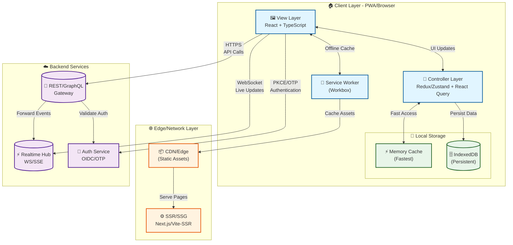
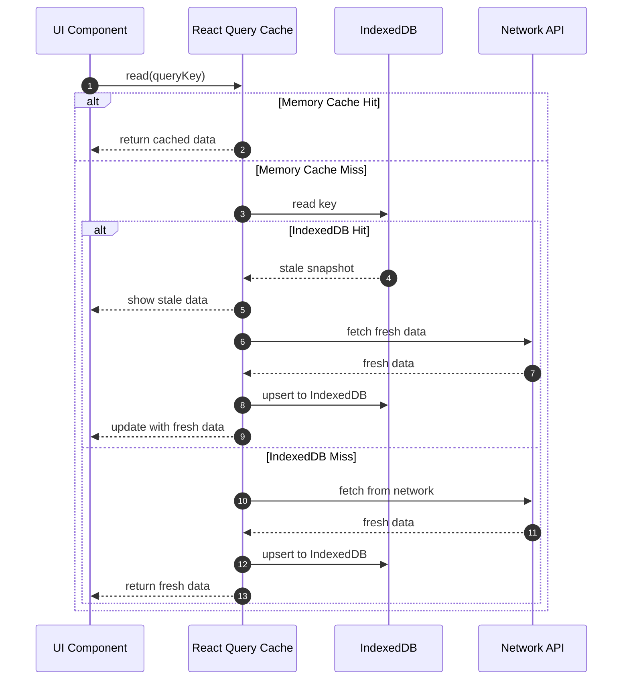
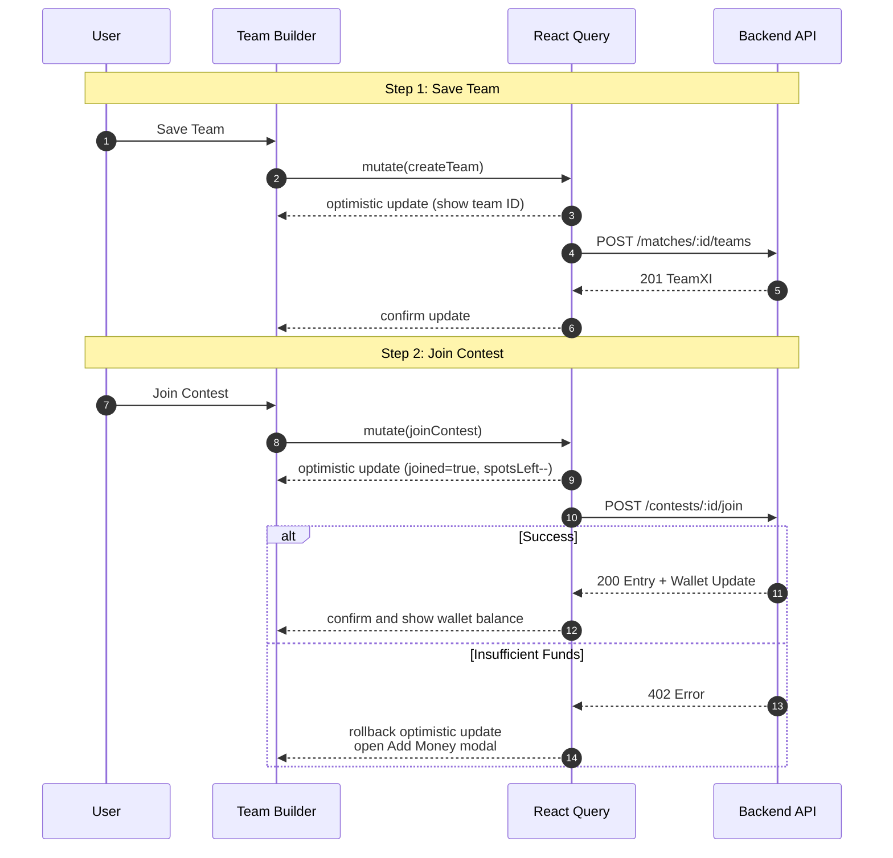
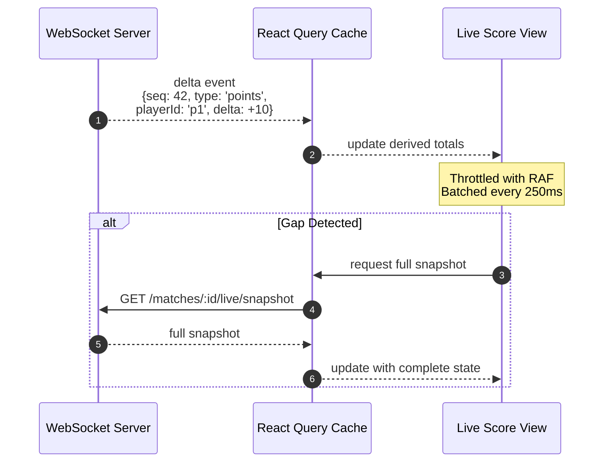
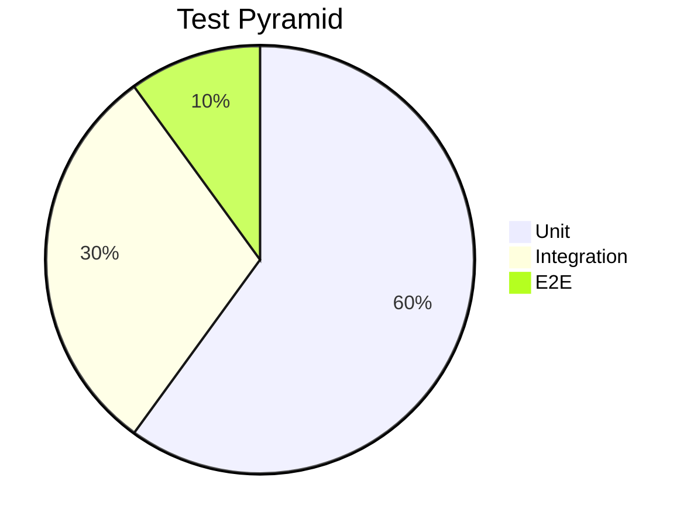

# Dream11‑Style Fantasy Sports Frontend — High‑Level Design (HLD)

> **Scope:** Modern web/PWA frontend for large‑scale fantasy sports (e.g., cricket/football/kabaddi). This is an **HLD** that a front‑end team can execute and evolve. It includes requirements, architecture, data models, API contracts (REST/GraphQL), implementation details, testing, observability, and release checklists.

## Quick Summary for Interviews

**What We're Building:** A fantasy sports platform where users create teams, join contests, and track live scores in real-time.

**Key Challenges:**
1. **Real-time Updates:** Live score updates with minimal latency (< 1s)
2. **Offline Support:** Users can draft teams offline, join contests when online
3. **Scale:** Handle 1M+ concurrent users during peak matches
4. **Performance:** Fast initial load (LCP ≤ 2s), smooth interactions (INP ≤ 200ms)
5. **Reliability:** Graceful degradation when real-time connection fails

**Core Architecture:**
- **View Layer:** React + Next.js (SSR/ISR for SEO, CSR for live updates)
- **State Management:** React Query for server state, Zustand/Redux for app state
- **Caching:** 3-tier (Memory → IndexedDB → Network) for offline support
- **Real-time:** WebSocket/SSE for live scores with polling fallback
- **Offline:** Service Worker + IndexedDB for offline team building

---

## Table of Contents

1. [Requirements](#1-requirements)
   - 1.1 [Functional](#11-functional-requirements)
   - 1.2 [Non‑Functional](#12-non-functional-requirements)
2. [Architecture](#2-architecture)
   - 2.1 [High‑Level Diagram](#21-high-level-diagram)
   - 2.2 [View Layer](#22-view-layer)
   - 2.3 [Controller Layer](#23-controller-layer)
   - 2.4 [IndexedDB & Caching](#24-indexeddb--caching)
   - 2.5 [Service Layer](#25-service-layer)
3. [Data Models](#3-data-models)
4. [APIs: REST vs GraphQL](#4-apis-rest-vs-graphql)
   - 4.1 [REST Examples](#41-rest-examples)
   - 4.2 [GraphQL Examples](#42-graphql-examples)
5. [Implementation Details](#5-implementation-details)
6. [Testing](#6-testing)
   - 6.1 [Unit](#61-unit) • 6.2 [Integration](#62-integration) • 6.3 [E2E](#63-e2e) • 6.4 [Contract & Visual](#64-contract--visual) • 6.5 [Performance & A11y](#65-performance--a11y) • 6.6 [Synthetic Live Replay](#66-synthetic-live-replay)
7. [Observability & Analytics](#7-observability--analytics)
8. [Release & Delivery](#8-release--delivery)
9. [Risks & Mitigations](#9-risk-register--mitigations)
10. [Checklists](#10-checklists)
11. [Appendix: Snippets](#11-appendix--snippets)

---

## 1) Requirements

### 1.1 Functional Requirements

- **Auth & Onboarding:** OTP (phone/email), social/OIDC; KYC prompts; referrals.

- **Home/Discover:** upcoming matches by sport/league; promos; search.

- **Match Details:** squads, probable XI, credit values, venue/pitch, toss/lineup badges, lock countdown.

- **Contest Catalog:** mega, H2H, WTA, practice/private; filters (fee/size/multi‑entry/prize pool); join/leave rules.

- **Team Builder:** select XI with credit cap; C/VC multipliers; formation rules; auto‑pick; clone; validation.

- **Join Contests:** select team(s), entries; payment (wallet/UPI/card); coupons; taxes display; idempotent joins.

- **Live Mode:** ball/raid/goal events; points; ranks; leaderboards; team compare; notifications.

- **Results & Winnings:** post‑match settlement; winnings; transactions.

- **Wallet & Payments:** add/withdraw; UPI intent; failure/retry; KYC gating.

- **Profile & Settings:** language, theme, favorites; responsible play; state restrictions messaging.

### 1.2 Non‑Functional Requirements

- **Performance KPIs:** LCP ≤ **2.0s** (entry routes), INP ≤ **200ms**, CLS < **0.1**; JS ≤ **300KB gz** on first route.

- **Realtime:** ≤ **1s** latency for rank/points deltas; back‑pressure tolerant.

- **Reliability:** offline reads (schedules/teams), graceful live fallback; 99.9% target.

- **Scalability:** 1M+ concurrents at peak; SSR/ISR + CDN.

- **Security:** CSP, SRI, HTTPS/HSTS, SameSite cookies, token rotation; anti‑automation basics.

- **Accessibility:** WCAG 2.2 AA; color‑safe heatmaps; reduced motion.

- **Privacy/Compliance:** consent, PII minimization, KYC flows, audit logs.

- **Observability:** RUM, logs, traces; error tracking with source maps.

---

## 2) Architecture

### 2.1 High‑Level Diagram

**Architecture Overview:** The system follows a layered architecture with client-side caching, offline support, and real-time capabilities.



**Architecture Layers Explained:**

**1. Client Layer (Browser/PWA):**
- **View Layer:** React components rendering UI, handles user interactions
- **Controller Layer:** State management (Zustand/Redux) + Server state (React Query)
- **Storage Layer:**
  - **Memory Cache:** Fastest access (< 1ms), stores hot data (current match, active team)
  - **IndexedDB:** Persistent storage for offline access (teams, matches, preferences)
- **Service Worker:** Offline caching, background sync, push notifications

**2. Edge/Network Layer:**
- **CDN:** Serves static assets (JS, CSS, images) from edge locations
- **SSR/SSG:** Server-side rendering for SEO, static generation for performance

**3. Backend Services:**
- **REST/GraphQL Gateway:** API endpoints for data fetching (matches, contests, wallet)
- **Realtime Hub:** WebSocket/SSE connection for live score updates
- **Auth Service:** OAuth/OIDC for social login, OTP for phone/email verification

**Data Flow:**
1. **Initial Load:** CDN → SSR → Browser (static HTML + JS)
2. **Data Fetch:** UI → API → Backend (with caching via React Query)
3. **Live Updates:** UI ↔ RT (bidirectional WebSocket)
4. **Offline:** UI → IndexedDB → Background Sync when online

**Key Design Decisions:**
- **Layered Architecture:** Separation of concerns (View, Controller, Service)
- **Caching Strategy:** 3-tier (Memory → IndexedDB → Network) for performance
- **Real-time:** WebSocket/SSE for live updates with polling fallback
- **Offline Support:** Service Worker + IndexedDB for offline team building

### 2.2 View Layer

**Technology Choices:**
- **Framework:** React + TypeScript; **Next.js** for SSR/ISR
- **Design System:** Design tokens (color/spacing/typography), Tailwind + shadcn/ui
- **Styling:** Utility-first CSS (Tailwind) for consistency and performance

**Rendering Strategy (Interview Point):**
- **Public Pages (SSR/ISR):** Home, match listing pages for SEO and fast initial load
  - Example: `/matches` page server-rendered, revalidated every 30s (ISR)
- **Interactive Pages (CSR):** Live scores, team builder for real-time updates
  - Example: `/live/:matchId` client-side rendered with WebSocket streaming
- **Long Lists (Virtualization):** Contest list, leaderboards for performance
  - Example: Virtual scrolling for 10k+ contests, renders only visible items

**Accessibility:**
- Semantic HTML, ARIA live regions for score changes, keyboard-first navigation
- WCAG 2.2 AA compliance for color contrast, screen reader support

### 2.3 Controller Layer

**State Management Strategy (Interview Point):**
- **App State (Zustand/Redux):** Session, feature flags, UI preferences
  - Example: User authentication state, theme preference, sidebar open/close
- **Server State (React Query):** API data with caching, pagination, invalidation
  - Example: Matches list, contest catalog, user teams (auto-refetch on window focus)
- **Form State (React Hook Form):** Local form state with validation (Zod schema)
  - Example: Team builder form, OTP input with real-time validation

**Key Patterns:**
- **Optimistic Updates:** UI updates instantly, rolls back if server rejects
  - Example: Join contest → immediately shows "Joined", confirms with server response
- **Debounced Queries:** Reduces API calls for search/filtering
  - Example: Contest search debounced 300ms to avoid excessive API calls
- **Idempotent Mutations:** Safe retries with idempotency keys
  - Example: Join contest mutation includes idempotency key to prevent duplicate joins
- **Error Boundaries:** Graceful degradation per route
  - Example: If live scores API fails, show cached data with error message

### 2.4 IndexedDB & Caching

**Caching Strategy:** Multi-tier caching with memory cache (fastest), IndexedDB (persistent), and network (fresh data).



**Why This Approach?**
- **Instant UI:** Memory cache provides sub-millisecond access
- **Offline Support:** IndexedDB allows viewing cached data when offline
- **Stale-While-Revalidate:** Shows cached data immediately, updates in background
- **Storage Limits:** IndexedDB stores critical data (matches, teams) for offline access

**IDB Stores:** `matches`, `contests`, `teams`, `players`, `sportConfig`, `userPrefs`, `walletSnapshot`, `mutationsQueue`

**Offline Policy:** drafting teams allowed offline; joins/payments require online; queued mutations with Background Sync

**SW:** precache shell; runtime `stale‑while‑revalidate` (images), `network‑first` (data)

### 2.5 Service Layer

- Thin wrapper over `fetch` with: auth headers, `x-trace-id`, retries/backoff, 429 handling, timeouts, error normalization (RFC7807).

- Codegen types from OpenAPI/GraphQL; WebSocket client with reconnect + seq gap detection.

---

## 3) Data Models

```typescript
export type ID = string;

export interface User {
  id: ID;
  phone?: string;
  email?: string;
  name?: string;
  kycStatus: 'none' | 'pending' | 'verified';
  locale: string;
}

export interface SportConfig {
  sport: 'cricket' | 'football' | 'kabaddi';
  maxPlayers: number;
  credits: number;
  roles: string[];
  rules: {
    cMultiplier: number;
    vcMultiplier: number;
    constraints: Record<string, any>;
  };
}

export interface Match {
  id: ID;
  sport: SportConfig['sport'];
  league: string;
  teams: { a: string; b: string };
  startAt: string;
  lockAt: string;
  status: 'upcoming' | 'live' | 'completed';
  venue?: string;
}

export interface Player {
  id: ID;
  matchId: ID;
  name: string;
  role: 'BAT' | 'BWL' | 'AR' | 'WK' | 'GK' | 'DEF' | 'MID' | 'RAIDER' | 'ALL';
  credit: number;
  team: 'a' | 'b';
  playingProb?: number;
  injury?: 'fit' | 'doubtful' | 'out';
}

export interface TeamXI {
  id: ID;
  matchId: ID;
  userId: ID;
  picks: {
    playerId: ID;
    isCaptain?: boolean;
    isViceCaptain?: boolean;
  }[];
  totalCredit: number;
  createdAt: string;
}

export interface Contest {
  id: ID;
  matchId: ID;
  type: 'mega' | 'h2h' | 'winner_takes_all' | 'practice' | 'private';
  entryFee: number;
  prizePool: number;
  size: number;
  multiEntry: boolean;
  spotsLeft: number;
  joined?: boolean;
}

export interface Entry {
  id: ID;
  contestId: ID;
  teamId: ID;
  userId: ID;
  status: 'joined' | 'refunded' | 'settled';
}

export interface Wallet {
  balance: number;
  bonus: number;
  winnings: number;
  currency: 'INR';
  updatedAt: string;
}

export interface LiveEvent {
  matchId: ID;
  ts: string;
  feedSeq: number;
  kind: 'ball' | 'goal' | 'card' | 'raid';
  payload: Record<string, any>;
}

export interface LiveSnapshot {
  matchId: ID;
  points: Record<ID, number>;
  userRanks?: { [contestId: ID]: number };
  updatedAt: string;
}
```

---

## 4) APIs: REST vs GraphQL

**Choose REST** for cacheable resources and simpler CDN behavior. **Choose GraphQL** for complex, composite views and subscriptions.

### 4.1 REST Examples

**Base:** `https://api.example.com/v1`

**Auth (OTP):**
- `POST /auth/otp/start` — req: `{ phone }` → `202 { txnId }`
- `POST /auth/otp/verify` — req: `{ txnId, code }` → `200 { accessToken, refreshToken, user }`

**Matches:**
- `GET /sports/{sport}/matches?status=upcoming` → `200 Match[]`
- `GET /matches/{id}` → `200 Match`

**Players:**
- `GET /matches/{id}/players` → `200 Player[]`

**Contests:**
- `GET /matches/{id}/contests?type=mega&limit=50&cursor=...` → `200 { items: Contest[], nextCursor }`
- `POST /contests/{id}/join` — req: `{ teamId }` → `200 Entry` or `402 { code: 'INSUFFICIENT_FUNDS' }`

**Teams:**
- `GET /matches/{id}/teams/my` → `200 TeamXI[]`
- `POST /matches/{id}/teams` — body: `TeamXI` → `201 TeamXI`

**Wallet:**
- `GET /wallet` → `200 Wallet`
- `POST /wallet/add` — `{ amount, method }` → `303 Redirect`

**Live:**
- `GET /matches/{id}/live/snapshot` → `200 LiveSnapshot`
- `wss://rt.example.com/live?matchId=...` → deltas `{ type:'points', playerId, delta, seq }`

**Errors:** RFC7807 Problem Details `{ type, title, status, detail, traceId }`

**Caching:** `ETag`, `If-None-Match`, appropriate `Cache-Control`

### 4.2 GraphQL Examples

**Endpoint:** `POST /graphql` (with APQ)

**Query — Hub**

```graphql
query MatchHub($matchId: ID!, $after: String) {
  match(id: $matchId) {
    id
    sport
    lockAt
    teams {
      a
      b
    }
  }
  contests(matchId: $matchId, first: 50, after: $after) {
    edges {
      node {
        id
        type
        entryFee
        prizePool
        size
        spotsLeft
        joined
        multiEntry
      }
    }
    pageInfo {
      endCursor
      hasNextPage
    }
  }
  myTeams(matchId: $matchId) {
    id
    totalCredit
    picks {
      playerId
      isCaptain
      isViceCaptain
    }
  }
  wallet {
    balance
    bonus
    winnings
  }
}
```

**Mutation — Join**

```graphql
mutation Join($contestId: ID!, $teamId: ID!) {
  joinContest(contestId: $contestId, teamId: $teamId) {
    entry {
      id
      status
    }
    wallet {
      balance
      bonus
      winnings
    }
  }
}
```

**Subscription — Live**

```graphql
subscription Live($matchId: ID!) {
  livePoints(matchId: $matchId) {
    playerId
    delta
    seq
    updatedAt
  }
}
```

---

## 5) Implementation Details

**Stack:** Next.js (SSR/ISR) • React 18 • TypeScript • React Query + Zustand/Redux • Tailwind + shadcn/ui • Workbox PWA • Playwright/MSW • Sentry/Analytics

**Structure:**

```
src/
  app/            # providers, routes, i18n, error boundaries
  features/        # match, contests, team-builder, live, wallet, auth
  entities/        # models, adapters, query keys
  service/         # api clients, ws client, codegen outputs
  shared/          # ui components, hooks, utils, config
  sw/              # service worker
  tests/           # test utils, fixtures, e2e
```

**Key Flows**

- **Build Team & Join (Optimistic):**

**Flow Explanation:** Optimistic updates provide instant feedback while API calls happen in background. If server rejects, UI rolls back.



- **Live Deltas → Snapshot:**

**Flow Explanation:** Real-time updates arrive as deltas (small changes). UI batches updates for performance and requests full snapshot if gaps detected.



**Performance Optimizations:**
- **RequestAnimationFrame (RAF):** Throttles DOM updates to screen refresh rate
- **Batching:** Groups multiple delta updates every 250ms
- **Snapshot Recovery:** Detects sequence gaps and fetches full state

**Performance Budget & Tactics**

- Code‑split by route/component; hydrate only interactive islands.

- Virtualize lists; memoize rank derivation from deltas.

- Media: AVIF/WebP + `srcset`; lazyload; icon sprite.

- Fonts: system default or subset; `display: swap`.

**Security & Anti‑Abuse (frontend)**

- SameSite/HttpOnly session cookies; CSRF tokens if cookies used.

- Device signals for risk scoring (no PII in storage); rate‑limit sensitive actions.

- Idempotency keys on payments/joins; include `x-trace-id`.

**A11y & i18n**

- Keyboard‑navigable builder; ARIA live regions for scores.

- Intl APIs for dates/numbers; ICU plurals; RTL‑safe CSS.

**Error Handling**

- Unified problem model → toast + inline remediation; payment resume flow.

---

## 6) Testing

### 6.1 Unit

- **Scope:** lineup validators, credit calculators, reducers/selectors, pure hooks.

- **Tools:** Vitest/Jest + React Testing Library.

### 6.2 Integration

- **Scope:** team builder rules; join mutation with wallet updates; ws→cache pipeline.

- **Tools:** RTL + **MSW** (REST/GraphQL) + fake WS server.

### 6.3 E2E

- **Scope:** OTP login (stub), create team, join contest, payment success/failure, live sanity, results view.

- **Tools:** Playwright; run on preview env; save traces/videos.

### 6.4 Contract & Visual

- **Contract:** Pact (consumer) vs API gateway stubs.

- **Visual:** Storybook + Chromatic/Playwright snapshots for design system.

### 6.5 Performance & A11y

- **Lighthouse CI** budgets; **Web Vitals RUM** gates in CI.

- **axe-core** automated checks; manual SR passes on key flows.

### 6.6 Synthetic Live Replay

- Record `{seq, delta}` streams + snapshots; deterministic replay to verify ranking/points and UI throttling.

**Test Pyramid**



---

## 7) Observability & Analytics

- **RUM:** TTFB, LCP, CLS, INP; route timings; ws reconnects/gaps.

- **Errors:** Sentry with source maps; grouped by `traceId`.

- **Analytics Events:** `match_view`, `team_saved`, `contest_joined`, `payment_attempted`, `payment_succeeded`, `payment_failed`, `live_view_open`, `notification_click`.

- **Dashboards:** join funnel, conversion, live latency, error rate, JS weight.

---

## 8) Release & Delivery

- **CI:** typecheck, lint, unit/integration, build, Lighthouse, bundle stats.

- **Preview Deploys:** per PR with seeded fixtures & stubbed payments.

- **Rollout:** flags + canaries; progressive (5% → 25% → 100%).

- **CDN/Cache:** immutable assets (1y); HTML ISR 30–120s pre‑lock.

---

## 9) Risk Register & Mitigations

| Risk                   | Impact                            | Mitigation                                                                |
| ---------------------- | --------------------------------- | ------------------------------------------------------------------------- |
| Clock skew before lock | Users blocked/allowed incorrectly | Server time offset; disable actions at `T‑delta`; show server time source |
| Realtime flood         | UI jank/dropped updates           | Batch 250ms; RAF; snapshot on gap; backoff/reconnect                      |
| Payment interruptions  | Duplicate/unknown status          | Idempotency key; webhook‑driven status; poll/resume flow                 |
| IDB corruption/quota   | Stale UI/failed offline           | Versioned schema; clear‑rebuild path; size guards                        |
| State restrictions     | Legal/UX                          | Backend enforcement; frontend compliant messaging                         |

---

## 10) Checklists

### Readiness

- [ ] Performance budgets enforced
- [ ] Offline team save & recovery verified
- [ ] Live gap recovery works
- [ ] Payment resume flow tested
- [ ] A11y baseline + reduced motion
- [ ] Error boundaries per major route
- [ ] Analytics + consent wired

### Release

- [ ] Flags default safe
- [ ] Smoke E2E green
- [ ] Source maps uploaded
- [ ] Canary rollout + alerts

---

## 11) Appendix — Snippets

**Derived Live Scores Hook**

```typescript
function useLiveScores(matchId: string) {
  const { data: snapshot } = useQuery(
    ['live', matchId, 'snapshot'],
    fetchSnapshot,
    { staleTime: 0 }
  );
  useWsChannel(`live:${matchId}`, onDelta);
  const derived = useMemo(
    () => accumulate(snapshot, deltas),
    [snapshot, deltas]
  );
  return derived;
}
```

**Problem Details Interface**

```typescript
interface Problem {
  type: string;
  title: string;
  status: number;
  detail?: string;
  traceId?: string;
}
```

**Workbox Strategies**

```javascript
workbox.routing.registerRoute(
  ({ request }) => request.destination === 'image',
  new workbox.strategies.StaleWhileRevalidate()
);

workbox.routing.registerRoute(
  ({ url }) => url.pathname.startsWith('/v1/'),
  new workbox.strategies.NetworkFirst({
    cacheName: 'api',
    plugins: [
      new workbox.broadcastUpdate.BroadcastUpdatePlugin()
    ]
  })
);
```

> **Note:** Replace `api.example.com` with real endpoints; wire codegen for types; adapt KPIs and budgets to your product SLOs.


