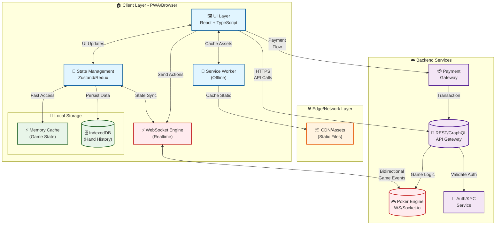

# Poker Frontend System Design — HLD (Cash Tables & Normal Games)

> **Scope:** Web/PWA frontend architecture for an online poker platform supporting **cash games** and **normal/freeroll tables**. Includes requirements, architecture, real‑time engine, state & rendering model, data contracts, implementation strategy, testing, performance, and compliance.

## Quick Summary for Interviews

**What We're Building:** A real-time online poker platform with cash games and tournaments, supporting multiple game types (Texas Hold'em, Omaha).

**Key Challenges:**
1. **Ultra-Low Latency:** Game actions must reach server in < 200ms, render updates in < 100ms
2. **Real-time Sync:** WebSocket-based game state synchronization with lag compensation
3. **Fair Play:** Server-authoritative game logic, anti-cheat measures, secure RNG
4. **Scale:** 50k+ concurrent players, 2k+ active tables
5. **Performance:** 60fps animations, GPU-accelerated chip movements
6. **Compliance:** KYC, responsible gaming, geo-fencing, anti-money laundering

**Core Architecture:**
- **WebSocket-First:** Persistent connection for real-time game state updates
- **State Management:** Centralized store (Zustand/Redux) for table state and player actions
- **Optimistic UI:** Instant feedback for player actions (fold/check/call) before server confirmation
- **Server-Authoritative:** Client displays game state, server validates all actions
- **Persistence:** IndexedDB for hand history and player preferences

---

## Table of Contents

1. [Requirements](#1-requirements)
   - 1.1 [Functional](#11-functional-requirements)
   - 1.2 [Non‑Functional](#12-non-functional-requirements)
2. [Architecture](#2-architecture)
   - 2.1 [System Diagram](#21-system-diagram)
   - 2.2 [View Layer](#22-view-layer)
   - 2.3 [Controller Layer](#23-controller-layer)
   - 2.4 [Data Storage / Offline](#24-data-storage--offline)
   - 2.5 [Realtime Event Engine](#25-realtime-event-engine)
3. [Data Models](#3-data-models-simplified)
4. [APIs & WebSocket Events](#4-apis--websocket-events)
5. [Implementation](#5-implementation)
6. [Testing](#6-testing)
7. [Performance & UX Strategy](#7-performance--ux-strategy)
8. [Compliance & Fair Play](#8-compliance--fair-play)
9. [Future Extensions](#9-future-extensions)

---

## 1) Requirements

### 1.1 Functional Requirements

- **Auth & Player Identity**
  - Email/Phone login (OTP), OAuth optional
  - Profile, avatar, nickname, player stats
  - KYC for cash games

- **Lobby System**
  - Game types: Texas Hold'em (primary), Omaha (optional)
  - Table Formats: Cash tables, Freeroll/Normal tables
  - Stakes & blinds filter
  - Table size: 2/6/9 players
  - Seat availability, waiting list, auto‑seat option
  - Game mode: Classic, Turbo, Private table

- **Table Gameplay**
  - Real‑time card dealing & animations
  - Phases: Pre‑flop → Flop → Turn → River → Showdown
  - Bet actions: Check, Call, Fold, Bet, Raise (slider + presets)
  - Chip animations, pot updates
  - Timer per move, auto fold/fill actions
  - Chat & emojis
  - Rebuy, auto top‑up for cash tables

- **Wallet & Transactions**
  - Balance split: real cash + bonus + winnings
  - Add/withdraw money (UPI/cards/net‑banking)
  - Buy‑in modal for table entry
  - Transaction history

- **Player Features**
  - Player notes, mute players
  - Show cards on win (optional)
  - Hand history and replay
  - Leaderboards, rewards (loyalty points)

- **Tournament/Normal Game Features** (future expand)
  - Registration/unregister
  - Blind increase at intervals
  - Rebuy/add‑on periods
  - Final payout table

### 1.2 Non‑Functional Requirements

- **Low‑latency realtime:** round‑trip < 200ms, tick sync < 50ms

- **Fair gameplay:** secure RNG, anti‑bot, anti‑collusion

- **Concurrency:** 50k+ active players, 2k+ concurrent tables

- **Rendering:** 60fps animations, GPU accelerated

- **Security:** device fingerprint, cheat detection, encrypted tokens

- **Compliance:** KYC, responsible gaming, geo‑fencing, anti‑money laundering

---

## 2) Architecture

### 2.1 System Diagram

**Architecture Overview:** Real-time poker platform with WebSocket-based game engine, client-side state management, and persistent storage.



**Architecture Layers Explained:**

**1. Client Layer (Browser/PWA):**
- **UI Layer:** React components for table view, cards, chips, action panel
- **State Management:** Centralized store (Zustand/Redux) for table state, player actions
- **WebSocket Engine:** Handles real-time game events, reconnection, lag compensation
- **Storage Layer:**
  - **Memory Cache:** Fast access to current game state (< 1ms)
  - **IndexedDB:** Persistent storage for hand history, player preferences
- **Service Worker:** Offline asset caching, background sync

**2. Edge/Network Layer:**
- **CDN:** Serves static assets (JS, CSS, images, card sprites)

**3. Backend Services:**
- **API Gateway:** REST/GraphQL endpoints for lobby, wallet, player data
- **Poker Engine:** WebSocket server handling game logic, state synchronization
- **Auth/KYC Service:** Authentication, identity verification for cash games
- **Payment Gateway:** Secure payment processing (UPI, cards, net banking)

**Data Flow:**
1. **Initial Load:** CDN → Browser (static assets + JS bundle)
2. **Game Events:** UI ↔ WebSocket ↔ Poker Engine (bidirectional real-time updates)
3. **API Calls:** UI → API Gateway (lobby, wallet, hand history)
4. **State Sync:** Store ↔ Memory Cache ↔ IndexedDB (multi-tier caching)
5. **Offline:** UI → IndexedDB (hand history persists locally)

**Key Design Decisions:**
- **WebSocket-First:** Real-time game state via persistent WebSocket connection
- **State Management:** Centralized store for table state, player actions, and UI state
- **Optimistic Updates:** Instant UI feedback for player actions (fold/check/call)
- **Server-Authoritative:** Client displays state, server validates all game actions
- **Persistence:** IndexedDB stores hand history and player preferences
- **Security:** Encrypted tokens, device fingerprinting, anti-cheat measures

### 2.2 View Layer

- React + TypeScript + Tailwind/shadcn UI

- WebGL/canvas based chip animations (Pixi.js or pure CSS/GPU)

- Component model:
  - Table layout
  - Seats & avatars
  - Timer ring
  - Cards & deck engine
  - Chips & pots
  - Action panel & sliders
  - Dealer button, blinds badges
  - Hand history modal

### 2.3 Controller Layer

**State Management Strategy (Interview Point):**
- **Centralized Store (Zustand/Redux):** Single source of truth for table state
  - Stores: table state, player positions, pot size, current action, timer
  - Example: `tableState.players[seat].stack`, `tableState.currentTurn`, `tableState.pot`

**WebSocket State Reducer:**
- Receives server events (`TABLE_STATE`, `ACTION_REQUEST`, `POT_UPDATE`)
- Applies state updates with sequence number for ordering
- Handles reconciliation when client/server state diverges

**Action Middleware (Critical for Real-time):**
- **Lag Compensation:** Predicts server response, applies action optimistically
  - Example: Player clicks "call" → UI updates immediately, server confirms later
- **Debouncing:** Prevents accidental rapid-fire actions
  - Example: Raise slider updates debounced 100ms before sending to server
- **Action Queuing:** Queues actions during WebSocket reconnection
  - Example: Player action saved in queue, sent when connection restored

**Optimistic UI:**
- Local actions (fold/check/call) update UI instantly before server confirmation
- If server rejects, UI rolls back to previous state
- Example: Click "fold" → player immediately shows as folded, server confirms in 50-200ms

### 2.4 Data Storage / Offline

- IndexedDB for:
  - hand history
  - settings, audio, UI prefs
  - partial player cache

- Local persistence only, gameplay is server‑driven (no offline play)

### 2.5 Realtime Event Engine

- WebSocket duplex stream

- Event model: `TABLE_STATE`, `ACTION_REQUIRED`, `PLAYER_EVENT`, `POT_UPDATE`, `SHOWDOWN`, `CHAT`

- Heartbeat + lag detection

- Packet ordering by `server_seq` field

- Reconciliation logic on desync

---

## 3) Data Models (Simplified)

```typescript
interface Player {
  id: string;
  name: string;
  avatar: string;
  stack: number;
  seat: number;
  status: 'active' | 'folded' | 'allin' | 'sitout';
}

interface TableState {
  tableId: string;
  bb: number;
  sb: number;
  pot: number;
  players: Player[];
  communityCards: Card[];
  dealerSeat: number;
  currentTurn: number;
  timeLeftMs: number;
}

interface ActionRequest {
  tableId: string;
  playerId: string;
  allowed: ('fold' | 'check' | 'call' | 'bet' | 'raise')[];
  minBet: number;
  maxBet: number;
  timeLeftMs: number;
}

interface Card {
  suit: 'hearts' | 'diamonds' | 'clubs' | 'spades';
  rank: 'A' | '2' | '3' | '4' | '5' | '6' | '7' | '8' | '9' | '10' | 'J' | 'Q' | 'K';
}

interface Wallet {
  balance: number;
  bonus: number;
  winnings: number;
  currency: 'INR' | 'USD';
  updatedAt: string;
}

interface HandHistory {
  handId: string;
  tableId: string;
  timestamp: string;
  players: Player[];
  actions: Action[];
  communityCards: Card[];
  winner: string;
  pot: number;
}

interface Action {
  playerId: string;
  action: 'fold' | 'check' | 'call' | 'bet' | 'raise' | 'allin';
  amount?: number;
  timestamp: string;
}
```

---

## 4) APIs & WebSocket Events

### REST (auth, lobby, payments)

**Base:** `https://api.example.com/v1`

**Auth:**
- `POST /auth/otp/start` — req: `{ phone }` → `202 { txnId }`
- `POST /auth/otp/verify` — req: `{ txnId, code }` → `200 { accessToken, refreshToken, user }`

**Lobby:**
- `GET /tables?stakes=low&seats=6&gameType=holdem` → `200 Table[]`
- `GET /tables/{id}` → `200 Table`

**Tables:**
- `POST /tables/{id}/join` — req: `{ buyIn, seat? }` → `200 { tableId, seat }`
- `POST /tables/{id}/leave` → `200`
- `POST /tables/{id}/rebuy` — req: `{ amount }` → `200`

**Wallet:**
- `GET /wallet` → `200 Wallet`
- `POST /wallet/add` — req: `{ amount, method }` → `303 Redirect`
- `POST /wallet/withdraw` — req: `{ amount, method }` → `200 { txnId }`

**Hand History:**
- `GET /tables/{id}/hands?limit=50&cursor=...` → `200 { items: HandHistory[], nextCursor }`

**Errors:** RFC7807 Problem Details `{ type, title, status, detail, traceId }`

### WebSocket Events

**Connection:** `wss://ws.example.com/poker?tableId={id}&token={jwt}`

| Event            | Direction       | Payload                                    |
| ---------------- | --------------- | ------------------------------------------ |
| `JOIN_SUCCESS`   | Server → Client | `{ tableId, seat, snapshot: TableState }`   |
| `TABLE_STATE`    | Server → Client | `{ tableId, state: TableState, seq }`      |
| `ACTION_REQUEST` | Server → Client | `{ tableId, playerId, request: ActionRequest }` |
| `PLAYER_ACTION`  | Client → Server | `{ tableId, action: 'call', amount?, seq }` |
| `POT_UPDATE`     | Server → Client | `{ tableId, pot, sidePots? }`              |
| `CARDS_DEAL`     | Server → Client | `{ tableId, type: 'hole'\|'community', cards, seat? }` |
| `SHOWDOWN`       | Server → Client | `{ tableId, winners, hands, pot }`         |
| `PLAYER_EVENT`   | Server → Client | `{ tableId, playerId, event: 'fold'\|'allin'\|'leave', stack? }` |
| `CHAT`           | bi‑dir          | `{ tableId, playerId, message, emoji? }`   |
| `PING/PONG`      | bi‑dir          | `{ timestamp, seq? }`                      |
| `ERROR`          | Server → Client | `{ code, message, traceId }`                |

**Example WebSocket Message Flow:**

```typescript
// Server sends action request
{
  type: 'ACTION_REQUEST',
  tableId: 'table-123',
  playerId: 'player-456',
  request: {
    allowed: ['check', 'call', 'bet', 'fold'],
    minBet: 100,
    maxBet: 5000,
    timeLeftMs: 30000
  },
  seq: 42
}

// Client responds
{
  type: 'PLAYER_ACTION',
  tableId: 'table-123',
  action: 'call',
  amount: 200,
  seq: 42,
  clientSeq: 1
}

// Server confirms with state update
{
  type: 'TABLE_STATE',
  tableId: 'table-123',
  state: { /* updated state */ },
  seq: 43
}
```

---

## 5) Implementation

### Tech

- **FE:** React, TypeScript, Tailwind, Pixi.js (optional), Zustand/Redux

- **Infra:** Next.js SSR, WebSocket client, SW caching

- **Animation:** CSS transforms / WebGL

### Table Render Loop

- Reactive state → incremental React updates

- Snapshots + incremental WS diffs

- GPU accelerated animations

### Inputs

- Slider for bets

- One‑tap check/call/fold buttons

- Shortcut hotkeys

### Anti‑cheat (Frontend)

- Activity tracking

- AFK auto-fold

- Multi‑tab restrictions for cash tables

- Tamper detection

**Key Implementation Patterns:**

```typescript
// WebSocket State Reducer
function tableReducer(state: TableState, event: WebSocketEvent): TableState {
  switch (event.type) {
    case 'TABLE_STATE':
      return reconcileState(state, event.state, event.seq);
    case 'POT_UPDATE':
      return { ...state, pot: event.pot };
    case 'CARDS_DEAL':
      return handleCardDeal(state, event);
    case 'PLAYER_EVENT':
      return updatePlayerState(state, event);
    default:
      return state;
  }
}

// Optimistic Action Handler
function handleAction(action: string, amount?: number) {
  // Optimistic UI update
  dispatch({ type: 'OPTIMISTIC_ACTION', action, amount });
  
  // Send to server
  ws.send({
    type: 'PLAYER_ACTION',
    action,
    amount,
    seq: currentSeq
  });
}

// Lag Compensation
function reconcileState(
  local: TableState,
  server: TableState,
  serverSeq: number
): TableState {
  if (serverSeq > local.seq) {
    // Server is ahead, use server state
    return server;
  } else if (local.pendingActions.length > 0) {
    // Apply pending actions on server state
    return applyPendingActions(server, local.pendingActions);
  }
  return local;
}
```

**Animation System:**

```typescript
// GPU-accelerated chip animation
function animateChips(
  from: Position,
  to: Position,
  amount: number,
  onComplete: () => void
) {
  // Use CSS transforms or WebGL for smooth 60fps
  const chipElements = createChipSprites(amount);
  chipElements.forEach((chip, i) => {
    animate({
      from,
      to,
      duration: 500 + i * 50, // Stagger animation
      easing: 'ease-out',
      onUpdate: (pos) => {
        chip.style.transform = `translate(${pos.x}px, ${pos.y}px)`;
      },
      onComplete
    });
  });
}
```

---

## 6) Testing

### Unit

- **Scope:** game state reducer, hand evaluation utility (mocked), timer logic

- **Tools:** Vitest/Jest + React Testing Library

```typescript
describe('TableReducer', () => {
  it('should handle PLAYER_ACTION correctly', () => {
    const state = createInitialState();
    const action = { type: 'PLAYER_ACTION', action: 'fold', playerId: 'p1' };
    const newState = tableReducer(state, action);
    expect(newState.players[0].status).toBe('folded');
  });
});
```

### Integration

- **Scope:** joining/leaving tables, action requests → UI enable/disable, WS reconnection behavior

- **Tools:** RTL + MSW (REST/WebSocket) + fake WS server

### E2E (Playwright)

- **Scope:** seat → buy‑in → play few hands, rebuy flow, showdown correctness UI

- **Tools:** Playwright; run on preview env; save traces/videos

```typescript
test('should join table and play a hand', async ({ page }) => {
  await page.goto('/lobby');
  await page.click('[data-testid="join-table-btn"]');
  await page.fill('[data-testid="buy-in-input"]', '1000');
  await page.click('[data-testid="confirm-buy-in"]');
  await expect(page.locator('[data-testid="table-view"]')).toBeVisible();
  
  // Wait for action request
  await page.waitForSelector('[data-testid="action-panel"]');
  await page.click('[data-testid="call-btn"]');
  await expect(page.locator('[data-testid="player-action"]')).toContainText('call');
});
```

### Performance

- **Scope:** 60fps table rendering, memory leak checks

- **Tools:** Chrome DevTools Performance, Lighthouse

### Security

- **Scope:** token hijack simulation, bot simulation block

- **Tools:** OWASP ZAP, custom anti-bot tests

---

## 7) Performance & UX Strategy

- **WebSocket compression & binary packets:** Use binary protocol or compressed JSON for WS messages

- **Virtual DOM minimal diff:** React.memo, useMemo for expensive calculations

- **Idle prefetch lobby data:** Preload table list while user is idle

- **Lazy load animations:** Load chip/card sprites on demand

- **Device adaptation:** mobile HUD mode for smaller screens

**Performance Budget:**

- Initial bundle: < 300KB gzipped
- Table render: 60fps consistently
- WebSocket latency: < 200ms round-trip
- Action response: < 100ms UI update
- Memory: < 100MB per table view

**Optimization Techniques:**

```typescript
// Memoized expensive calculations
const playerStats = useMemo(
  () => calculatePlayerStats(players, handHistory),
  [players, handHistory]
);

// Virtualized list for hand history
<VirtualList
  items={handHistory}
  renderItem={(hand) => <HandHistoryItem hand={hand} />}
  itemHeight={100}
/>

// Code splitting for table components
const TableView = lazy(() => import('./features/table/TableView'));
```

---

## 8) Compliance & Fair Play

- **KYC → mandatory for cash tables:** Verify identity before allowing real money games

- **Responsible play prompts:** Set deposit/play limits, cooling-off periods

- **Hand history immutable server logs:** All hands logged server-side, frontend displays readonly replay

- **RNG proof architecture:** Client receives seeds/proofs for verification (transparent RNG)

**Compliance Checklist:**

- [ ] KYC verification before cash table access
- [ ] Responsible gaming limits enforced
- [ ] Geo-fencing for restricted regions
- [ ] Anti-money laundering checks
- [ ] Player self-exclusion mechanisms
- [ ] Age verification (18+)
- [ ] Secure payment processing (PCI-DSS)

**Fair Play Measures:**

- Server-authoritative game state (client only displays)
- Action validation on server
- Anti-collusion detection signals
- Bot detection heuristics (activity patterns, timing analysis)
- Encrypted communication (TLS 1.3)
- Token rotation and session management

---

## 9) Future Extensions

- **Multi‑table view:** Support playing multiple tables simultaneously

- **Tournaments & SNG:** Sit-and-go and scheduled tournament support

- **Observer mode / streaming:** Allow spectators to watch tables

- **Club/private tables:** Invite-only private game rooms

- **Poker replays & auto‑analysis:** Advanced hand analysis, equity calculators

**Architecture Considerations for Extensions:**

```typescript
// Multi-table support
interface MultiTableViewState {
  activeTables: TableViewState[];
  currentFocus: string; // tableId
  layout: 'grid' | 'stack' | 'focus';
}

// Tournament support
interface TournamentState {
  tournamentId: string;
  players: number;
  prizePool: number;
  blindLevel: number;
  levels: BlindLevel[];
  status: 'registration' | 'running' | 'completed';
}

// Observer mode
interface ObserverState {
  tableId: string;
  perspective: 'all' | 'one-player';
  delay?: number; // Optional delay for fairness
}
```

---

## 10) Risk Register & Mitigations

| Risk                    | Impact                         | Mitigation                                                  |
| ----------------------- | ------------------------------ | ----------------------------------------------------------- |
| WebSocket disconnection | Game state desync, player timeout | Auto-reconnect with state sync; queue actions during disconnect |
| Clock skew              | Timer inconsistencies          | Server time synchronization; disable actions at server deadline |
| Cheating attempts       | Unfair advantage, bot activity | Server validation, behavior analysis, rate limiting        |
| Payment failures        | User frustration, revenue loss  | Retry logic, fallback methods, clear error messages         |
| High latency            | Poor UX, timeout issues        | Lag compensation, optimistic UI, action queuing             |
| Memory leaks            | Performance degradation        | Component cleanup, event listener removal, periodic checks |

---

## 11) Checklists

### Readiness

- [ ] WebSocket reconnection tested
- [ ] State reconciliation verified
- [ ] Payment flows tested (success/failure)
- [ ] KYC integration complete
- [ ] Performance budgets met (60fps, < 200ms latency)
- [ ] Security audit passed
- [ ] Compliance checks verified

### Release

- [ ] Smoke E2E tests green
- [ ] Load testing completed (50k+ concurrent)
- [ ] Error tracking configured
- [ ] Monitoring dashboards ready
- [ ] Rollback plan in place

---

> **Note:** This is a platform‑grade poker frontend HLD. Next step: **LLD + architecture diagrams (state machines, reconnection strategy, UI component hierarchy)** and **animation system spec**. Let me know if you want those sections produced next.

