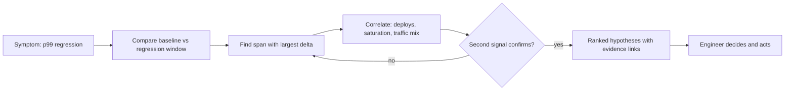
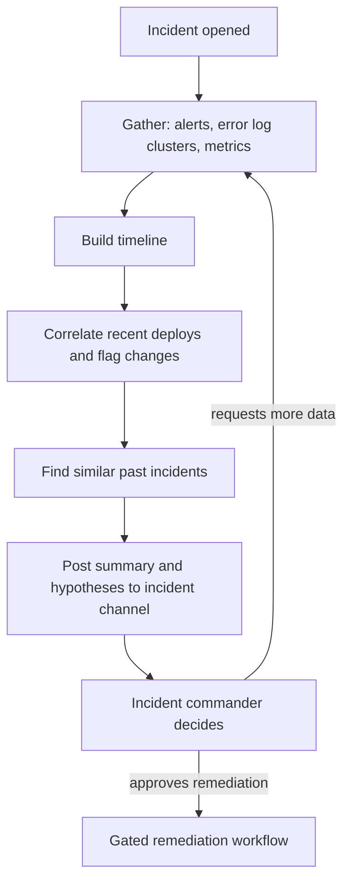
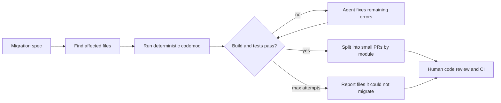

# Agents for Engineering, Scalability, and Operations

> **Reviewed:** 2026-09 · **Level:** Senior / Tech Lead · **Type:** Emerging

These scenarios apply the patterns from earlier pages to real engineering work. The consistent theme: agents gather evidence and produce **drafts for human review** — hypotheses, scripts, plans, PRs. The established engineering controls (read-only by default, sandboxing, review, rollback) make them safe. Treat any claims about how much time these save as something to measure in your own organization. For the general developer-tooling angle, see [AI-assisted development](../../ai/ai-assisted-development/index.md).

Each scenario follows the same template: goal, tools, loop, human gates, and what not to trust the agent with.

## Q1. Bottleneck-analysis assistant that reads metrics and traces

**Short answer:** Goal: given a symptom ("p99 of /search doubled this week"), produce a ranked list of likely bottlenecks with evidence links. Tools are read-only: metrics queries, trace search, profiling snapshots, deploy history, code search. The agent forms hypotheses, queries to confirm or refute each, and outputs a report. No write tools at all; a human decides what to change.

**How it works:**

- **Tools:** `query_metrics(promql-like expr, window)`, `search_traces(service, span, min_duration)`, `get_flamegraph(service, window)`, `list_deploys`, `search_code`. All read-only, scoped to the requester's services.
- **Loop:** establish baseline vs regression window, find the span with the largest latency delta, correlate with deploys and resource saturation (CPU, connection pools, queue depth), verify each hypothesis with a second independent signal.
- **Human gates:** none needed for execution (read-only); a human reviews the report before acting.
- **Output:** hypotheses with evidence links, confidence based on corroborating signals, and suggested next experiments.



**Example:** The agent finds `search.rank` span p99 rose after a deploy that added a per-result database lookup, confirms with a rise in database queries per request, and suggests batching — linking the trace, the metric panel, and the diff.

**Trade-offs and pitfalls:**

- Correlation is not causation; require the agent to state the evidence type.
- Expensive queries during incidents can add load; cap query cost and concurrency.

**What NOT to trust the agent with:** declaring root cause as fact, changing configuration or scaling, or interpreting metrics it cannot see (missing instrumentation looks like "no problem").

**Remember:** Read-only tools, hypotheses with evidence, and a human decision.

## Q2. Load-test generation for human review

**Short answer:** Goal: turn an API spec, recent traffic patterns, and SLOs into a load-test script (k6 or Locust) plus a run plan that an engineer reviews and executes. The agent drafts, validates syntax and a short smoke run against a local or staging mock, and outputs a PR. It never runs full-scale load tests against shared or production environments on its own.

**How it works:**

- **Tools:** read OpenAPI spec, read anonymized traffic mix summary, read SLO definitions, write files in a sandbox, run the script for a few seconds against a mock server.
- **Loop:** evaluator-optimizer — generate script, run a short smoke test, fix errors, repeat up to N times.
- **Human gates:** PR review of the script and plan; a human schedules and starts the real test with the right environment and blast-radius controls.

**Example:**

```javascript
// Draft k6 script produced for review. Stages and thresholds come from SLOs and traffic mix.
import http from "k6/http";
import { check, sleep } from "k6";

export const options = {
  stages: [
    { duration: "2m", target: 50 },   // ramp up
    { duration: "10m", target: 50 },  // steady state at expected peak (from traffic summary)
    { duration: "2m", target: 0 },    // ramp down
  ],
  thresholds: {
    http_req_duration: ["p(99)<500"], // SLO: p99 under 500ms
    http_req_failed: ["rate<0.01"],
  },
};

export default function () {
  // Weighted mix: 80% search, 20% product detail, based on anonymized traffic summary
  const res = Math.random() < 0.8
    ? http.get(`${__ENV.BASE_URL}/search?q=shoes`)
    : http.get(`${__ENV.BASE_URL}/products/123`);
  check(res, { "status is 200": (r) => r.status === 200 });
  sleep(1);
}
```

**Trade-offs and pitfalls:**

- Generated test data can be unrealistic (same query every time hits cache); reviewers must check realism.
- Auth tokens and target URLs must come from environment variables, never hard-coded.

**What NOT to trust the agent with:** choosing the target environment, starting large-scale tests, interpreting results as capacity guarantees, or using real user data.

**Remember:** The agent drafts and smoke-tests the script; humans pick the target, run it, and interpret the results.

## Q3. Incident triage copilot that summarizes logs and signals

**Short answer:** Goal: when an incident opens, quickly give responders a summary: what is broken, since when, blast radius, recent changes, similar past incidents, and candidate causes, updated as new information arrives. Tools are read-only across logs, metrics, traces, deploys, feature flags, and the incident history. It can draft communications, but humans publish them and make every remediation decision.

**How it works:**

- **Tools:** `search_logs` with pattern clustering, `query_metrics`, `list_deploys`, `list_flag_changes`, `search_past_incidents`, `post_to_incident_channel` (only posts to the incident's own channel).
- **Loop:** gather signals, cluster error logs, build a timeline, correlate with changes, rank hypotheses; refresh on new alerts.
- **Human gates:** incident commander owns severity, remediation, and external communication; any remediation suggestion goes through the gated remediation workflow.



**Example:** "Since 14:03, 5xx on checkout up from 0.1% to 6%, only in eu-west. Top log cluster: `PricingClient timeout` (82% of errors). Deploy d-812 at 14:02 enabled a new pricing client in eu-west only. A similar incident last quarter was resolved by disabling the flag. Suggested next step for IC: consider disabling flag `new_pricing_client` in eu-west."

**Trade-offs and pitfalls:**

- Logs contain attacker-controlled strings (user agents, request bodies); treat them as untrusted input that may contain injected instructions.
- Summaries can be confidently wrong; always link raw evidence.

**What NOT to trust the agent with:** severity declaration, customer-facing communication, executing remediations, or closing the incident.

**Remember:** Fast, evidence-linked summaries for responders; humans own severity, fixes, and communication.

## Q4. Capacity-planning draft

**Short answer:** Goal: produce a draft capacity plan for the next quarter: current utilization, growth trend, headroom against peak, projected saturation dates per resource, and recommended changes with cost estimates. The agent pulls metrics and billing data, runs forecasting code in a sandbox, and writes a document for review. Forecast math should be done by code the agent writes and runs — not by the model doing arithmetic in its head.

**How it works:**

- **Tools:** read historical utilization, read business growth assumptions (provided by humans), read pricing data, run Python in a sandbox, write a document draft.
- **Loop:** gather data, run forecast scripts, sanity-check outputs (no negative capacity, trends consistent with history), draft recommendations with explicit assumptions.
- **Human gates:** engineering and finance review the plan; any provisioning change goes through normal change management.

**Example:** The draft states "Primary database CPU at peak is 62% and growing roughly linearly; at the stated growth assumption, it reaches the 80% threshold in about 10 weeks. Options: read replicas for reporting queries (estimated cost X from pricing table) or vertical scale-up (cost Y)." It attaches the notebook used to compute the numbers.

**Trade-offs and pitfalls:**

- Forecasts are only as good as the growth assumptions; make them explicit inputs, not model guesses.
- Seasonal patterns and launches are business knowledge the agent may not have.

**What NOT to trust the agent with:** growth assumptions, purchasing commitments, or reserved-capacity decisions.

**Remember:** Code computes the forecast, assumptions come from humans, and the plan is a draft.

## Q5. Code migration agent with PR output

**Short answer:** Goal: apply a well-defined migration (library upgrade, API rename, deprecated pattern removal) across a codebase and open reviewable PRs. It is one of the better-fit agent tasks because each change is verifiable by compiler and tests, reversible via git, and repetitive. Combine deterministic tooling (codemods, AST transforms) for the mechanical part with the agent for cases the codemod cannot handle.

**How it works:**

- **Tools:** code search, read and edit files in a sandboxed clone, run build and tests, run codemods, create branch and open draft PR under a bot identity.
- **Loop:** plan (list affected files), apply codemod, run build, fix remaining errors file by file, run tests, write PR description summarizing changes and any files it could not migrate.
- **Human gates:** PR review by code owners; CI must pass; merge is human-only; large migrations split into small PRs by module.



**Example:** Migrating from a deprecated HTTP client: the codemod handles 90% of call sites; the agent fixes the rest where retry options had a different shape, and lists two files that use a pattern it cannot safely migrate for a human to handle.

**Trade-offs and pitfalls:**

- Tests that pass do not prove behavior preserved if coverage is weak; flag low-coverage modules.
- Giant PRs are unreviewable; enforce size limits.

**What NOT to trust the agent with:** merging, changing tests to make them pass without explanation, touching files outside the migration scope, or modifying CI configuration.

**Remember:** Codemods for the mechanical part, agent for the leftovers, small PRs, human merge.

## Q6. Test generation agent

**Short answer:** Goal: increase meaningful test coverage for a module by generating tests that exercise real behavior and edge cases. The agent reads code, writes tests, runs them in a sandbox, and keeps only tests that pass on current code and would fail if the behavior changed. Mutation testing is a useful check that generated tests actually assert something.

**How it works:**

- **Tools:** read source, write test files, run test suite with coverage, run mutation testing on the target module.
- **Loop:** identify untested branches, write tests, run, fix, check that tests kill mutants, discard trivial tests.
- **Human gates:** PR review focused on whether tests encode the intended behavior — especially where the agent "discovered" current behavior that might be a bug.

**Example:** For a pricing function, the agent writes boundary tests for discount thresholds. One test reveals that a 100% discount produces a negative total; instead of asserting the buggy value, the agent flags it in the PR description as a suspected bug.

**Trade-offs and pitfalls:**

- Tests generated from the current implementation can lock in bugs; reviewers must check intent.
- Snapshot-heavy or mock-heavy tests raise coverage without catching regressions.

**What NOT to trust the agent with:** deciding intended behavior, deleting or weakening existing tests, or coverage numbers as a quality proxy.

**Remember:** Keep only tests that pass, assert real behavior, and kill mutants. Humans confirm intent.

## References

Reviewed 2026-09.

- [Anthropic — Building effective agents](https://www.anthropic.com/engineering/building-effective-agents)
- [ReAct: Synergizing Reasoning and Acting in Language Models (arXiv)](https://arxiv.org/abs/2210.03629)
- [OWASP Top 10 for LLM Applications](https://owasp.org/www-project-top-10-for-large-language-model-applications/)
- [Model Context Protocol — official site and specification](https://modelcontextprotocol.io/)
