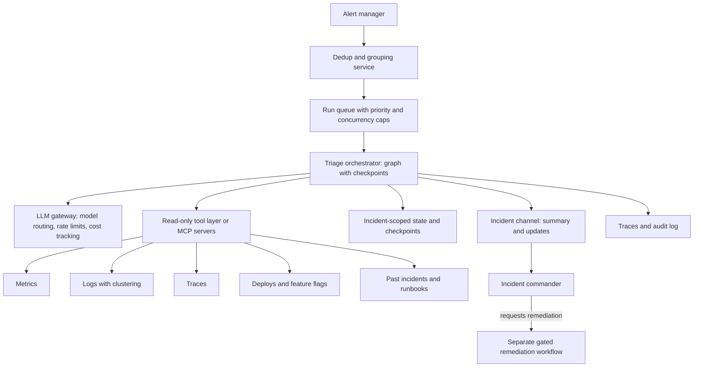
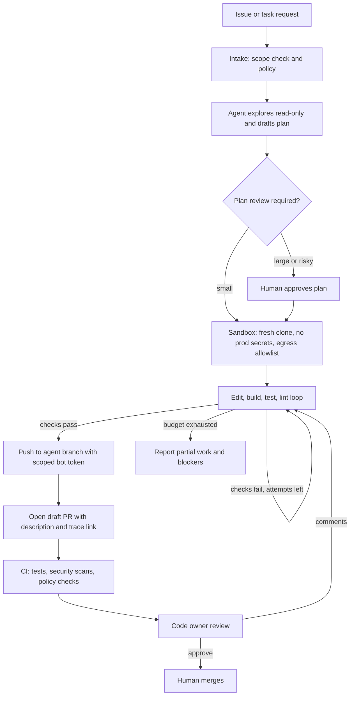

# Agent System Design Interview Questions

> **Reviewed:** 2026-09 · **Level:** Senior / Tech Lead · **Type:** Emerging

Structure agent design answers like any system design: clarify requirements, define scope and non-goals, sketch architecture, then go deep on the risky parts — permissions, human gates, failure modes, evaluation, and cost. Interviewers are usually looking for judgment about **where not to use autonomy**. For classic system design practice, see the [case studies](../../case-studies/index.md).

## Q1. Design an agent that triages production alerts

**Short answer:** Build a read-only investigation agent triggered by alerts that deduplicates related alerts into one incident run, gathers evidence from observability and change systems, posts a ranked, evidence-linked summary to the incident channel within minutes, and optionally proposes a remediation that goes through a separate, human-approved workflow. Key design points: deduplication and rate limits so an outage does not spawn thousands of runs, strict read-only scopes, untrusted-input handling for logs, per-run budgets, and an evaluation set built from past incidents.

**How it works:**

**1. Requirements and scope**

- **Functional:** ingest alerts, group related ones, investigate, post summary and hypotheses, update as new signals arrive, suggest runbook steps.
- **Non-functional:** first summary within a few minutes; must not add meaningful load to observability systems during an outage; full auditability.
- **Non-goals:** autonomous remediation, severity declaration, external communication.

**2. Architecture**

**3. Agent loop and graph**

- **Nodes:** scope (which services, since when), gather (parallel queries), cluster logs, correlate changes, retrieve similar incidents, hypothesize, verify top hypotheses with an independent signal, post summary, wait for new signals or human questions.
- **Budgets:** step cap, token cap, and query-cost cap per run; wrap-up mode near the deadline.
- **Stop:** summary posted and no new alerts for a period, or incident closed.

**4. Tools and permissions**

- Read-only service identity scoped to observability and change APIs; no write tools in this agent at all.
- Query guardrails: max time range, max cardinality, per-run and global concurrency caps.
- Tool outputs summarized and truncated with IDs for drill-down.

**5. Safety and untrusted input**

- Logs and alert annotations can contain attacker-controlled text; label them as untrusted and ensure the agent has no dangerous tools to be manipulated into using.
- Posting only to the incident's channel; output sanitized (no rendered external links or images).

**6. Human gates**

- Humans own severity, remediation, and communication. Remediation suggestions are handed to a separate workflow where each action requires approval with diff and rollback plan.

**7. Evaluation**

- Golden set from past incidents with frozen telemetry snapshots and known root causes.
- Outcome metric: correct component in top-k hypotheses; trajectory checks: query cost, steps, no forbidden tools.
- Shadow mode on live incidents first; track responder feedback ("useful / not useful") and time to first useful summary.

**8. Failure modes**

- **Alert storm:** deduplication and concurrency caps; one run per incident, not per alert.
- **Observability outage:** tools fail; the agent reports "data unavailable" rather than "no issue found."
- **Wrong confident hypothesis:** require evidence links and verification; show competing hypotheses.

**Example:** A cross-region network issue fires 300 alerts. Grouping creates one incident run; the agent notes errors across many services share a single region and a common dependency, flags a provider status change from the change feed, and posts within minutes, linking evidence.

**Trade-offs and pitfalls:**

- Richer investigation means more latency and cost; the first summary should be fast and shallow, with deeper follow-ups.
- Over-reliance: responders may stop investigating independently; present hypotheses, not verdicts.

Follow-up questions

- **How would you add auto-remediation later?** Start with one well-understood, reversible action (for example, disabling a feature flag that was changed in the last hour) behind approval; measure approval acceptance; only then consider policy-based auto-execution for that single action with a kill switch.
- **How do you prevent the agent from making the outage worse?** Global query concurrency caps, cost-bounded queries, backoff on observability errors, and deduplication.
- **Where does MCP fit?** Observability and deploy systems can be exposed as internal MCP servers so the same tools serve IDE assistants and this agent, with centralized auth and audit.

**Remember:** One run per incident, read-only tools, evidence-linked hypotheses, humans own every decision, evaluated on past incidents.

## Q2. Design a coding agent that opens PRs safely

**Short answer:** The agent takes a scoped task (issue or migration spec), works in an isolated sandbox with a fresh clone, edits code, runs build and tests, and opens a draft PR under a bot identity that can push only to agent branches and cannot approve or merge. Safety comes from platform controls — sandboxing, scoped tokens, branch protection, required human review, CI — not from trusting the model. Quality comes from verification loops (build, test, lint), small PRs, and clear PR descriptions of what changed and what remains uncertain.

**How it works:**

**1. Requirements and scope**

- **Functional:** accept task, explore codebase, plan, edit, verify, open PR with description, respond to review comments by pushing new commits.
- **Non-functional:** isolation between runs and tenants, bounded cost per task, full traceability from PR back to run trace.
- **Non-goals:** merging, deploying, changing CI or security configuration, accessing production.

**2. Architecture**

**3. Sandbox and permissions**

- Fresh container or micro-VM per run; resource and time limits; destroyed after.
- Network egress restricted to the code host and package mirrors.
- Git token scoped to one repository, push only to `agent/*` branches, no admin, approve, or merge rights; short-lived.
- No production or cloud credentials in the sandbox.

**4. Agent loop**

- Explore (search and read code), plan (files to change, tests to run), edit, run checks, fix, and repeat within budget.
- Keep a plan and progress artifact to survive context compaction.
- Final self-review: diff against plan, confirm no out-of-scope files changed.

**5. Guardrails on output**

- Diff policy checks: no changes to CI config, CODEOWNERS, secrets files, or dependency lockfiles unless the task explicitly requires it (and then flagged).
- Size limits; split large changes into multiple PRs.
- Secret scanning on the diff.
- PR description lists what was changed, how it was verified, and what the agent was unsure about.

**6. Human gates**

- Plan review for large or risky tasks.
- Required human code-owner approval via branch protection; AI review comments can assist but do not count as approval. See the [automated review process](../../leadership/code-reviews/automated-review-process.md) for how automated checks complement human review.
- Human merge only.

**7. Untrusted input**

- Issue text, code comments, and dependency READMEs may contain injected instructions. The sandbox's lack of secrets and restricted egress limits what an injected instruction can achieve; diff policy catches suspicious changes.

**8. Evaluation and rollout**

- Golden set of historical issues with their merged fixes and tests; outcome = hidden tests pass; trajectory = no forbidden file changes, within budget.
- Track production metrics: PR acceptance rate, review rounds, reverts of agent PRs, and cost per merged PR.
- Roll out to volunteer teams and low-risk repositories first.

**Example:** Task: "Add pagination to the `/orders` endpoint." The agent finds the handler and repository layer, plans changes to three files plus tests, implements, runs tests, and opens a draft PR noting that it chose cursor-based pagination to match an existing endpoint and asking reviewers to confirm the default page size.

**Trade-offs and pitfalls:**

- Reviewer load shifts rather than disappears; many low-quality agent PRs are worse than none. Throttle and measure acceptance.
- Tests the agent wrote can be weak; require existing tests to pass and flag changes to existing tests.
- Agent-authored code still needs ownership: the human requesting the task is accountable for the merged change.

Follow-up questions

- **How do you handle a PR that passes CI but is subtly wrong?** That is what human review and post-merge monitoring are for; track reverts of agent PRs as a quality metric and add failing cases to the golden set.
- **Would you let it auto-merge dependency bumps?** Only for narrowly defined, low-risk classes with strong test coverage, under an existing automated-merge policy, with the same controls you would apply to existing dependency-update bots.
- **How do you stop it from gaming tests?** Diff policy flags edits to test files and test configuration; reviewers see them highlighted; hidden evaluation tests in the golden set detect this offline.

**Remember:** Sandbox with no secrets, scoped push-only token, branch protection, human review and merge. The platform enforces safety; the loop provides quality.

## References

Reviewed 2026-09.

- [Anthropic — Building effective agents](https://www.anthropic.com/engineering/building-effective-agents)
- [Model Context Protocol — official site and specification](https://modelcontextprotocol.io/)
- [OWASP Top 10 for LLM Applications](https://owasp.org/www-project-top-10-for-large-language-model-applications/)
- [LangGraph documentation](https://langchain-ai.github.io/langgraph/)
