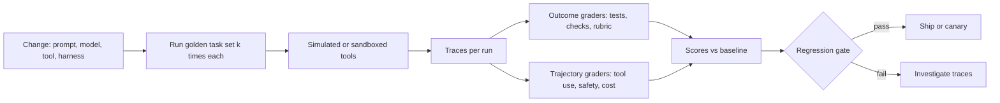

# Evaluating Agents

> **Reviewed:** 2026-09 · **Level:** Senior / Tech Lead · **Type:** Emerging

Testing discipline (fixtures, regression suites, CI gates) is established. Applying it to non-deterministic, multi-step agents is still an emerging practice; there are no universally accepted metrics or benchmarks that predict performance on your tasks. Build your own evaluation on your own tasks.



## Q1. Outcome evaluation vs trajectory evaluation

**Short answer:** Outcome evaluation asks "was the final result correct?" — tests pass, the right ticket was created, the answer matches ground truth. Trajectory evaluation asks "was the path acceptable?" — right tools, no forbidden actions, reasonable number of steps, no wasted cost, approvals requested when required. You need both: a correct outcome reached by deleting and recreating a production table is a failure, and a clean trajectory that ends in the wrong answer is also a failure.

**How it works:**

- **Outcome graders:** deterministic checks first (unit tests, state diffs, schema checks, exact match); LLM-as-judge with a rubric for open-ended text.
- **Trajectory graders:** assertions over the trace — forbidden tools not called, required approval present, steps below a threshold, no repeated identical calls.
- Grade trajectories flexibly: many valid paths exist, so check constraints, not an exact sequence.

**Example:**

```python
# Trajectory assertions over a recorded trace.
def grade_trajectory(trace) -> dict:
    calls = [s.tool for s in trace.steps if s.tool]
    return {
        "no_forbidden_tools": not any(c in {"delete_namespace", "drop_table"} for c in calls),
        "approval_before_write": all(
            trace.approved_before(s) for s in trace.steps if s.risk == "write"
        ),
        "within_step_budget": len(trace.steps) <= 25,
        "no_loops": max_consecutive_identical_calls(trace) < 3,
    }
```

**Trade-offs and pitfalls:**

- Exact trajectory matching is brittle and penalizes valid alternatives.
- LLM judges have biases (length, position, self-preference); calibrate against human labels on a sample.

**Remember:** Grade the outcome and the path. Assert constraints on trajectories, not exact sequences.

## Q2. Golden task sets are the foundation

**Short answer:** A golden set is a curated collection of realistic tasks with known-good outcomes or grading criteria, representative of real traffic including hard and adversarial cases. It is your regression suite. Start small (tens of tasks drawn from real usage), grow it from production failures, and version it alongside prompts and code.

**How it works:**

- Each task: input, environment fixture (repo snapshot, seeded database, mocked APIs), grading function, tags (difficulty, category, risk).
- Sources: real user requests (with consent and redaction), past incidents, bug reports, red-team cases.
- Split into a stable regression set and a rotating exploratory set.

**Example:** For an alert-triage agent: 40 historical incidents with known root causes, each with frozen snapshots of metrics, logs, and deploy history; grading checks whether the top hypothesis names the correct component and whether any write action was attempted.

**Trade-offs and pitfalls:**

- Sets built only from happy paths overestimate quality.
- Overfitting prompts to the golden set is real; keep a held-out portion.
- Environment fixtures drift from production; refresh periodically.

**Remember:** Real tasks, frozen environments, explicit graders, grown from production failures.

## Q3. pass@k vs pass^k: capability vs consistency

**Short answer:** Because agents are non-deterministic, run each task k times. **pass@k** is the probability that at least one of k attempts succeeds — it measures capability and fits workflows where you can verify and pick the best attempt (for example, generate several patches and keep one that passes tests). **pass^k** (pass-hat-k, used in the tau-bench line of agent benchmarks) is the probability that all k attempts succeed — it measures consistency and matters when users get a single attempt, such as a customer-facing or unattended agent. An agent can look strong on pass@k and weak on pass^k.

**How it works:**

- Run n trials per task, count c successes, and estimate per-task success rate p = c / n.
- pass@k is roughly 1 minus (1 minus p) to the power k; pass^k is roughly p to the power k (assuming independent trials; unbiased estimators exist for finite samples).
- Report both, per task category, with the number of trials.

**Example:** A task succeeds 6 of 10 times. With k = 3, pass@3 is about 0.94 (almost always one success if you can verify), but pass^3 is about 0.22 (rarely succeeds three times in a row). For an autonomous nightly job, the second number is the relevant one.

**Trade-offs and pitfalls:**

- Single-run evaluation hides variance; a change can look like a regression or improvement by chance.
- pass@k is only meaningful if you actually have a verifier to select the successful attempt in production.

**Remember:** pass@k measures "can it ever"; pass^k measures "does it reliably." Pick the one that matches how users experience the agent.

## Q4. Trace every step, then evaluate from traces

**Short answer:** Record a structured trace for every run: each model call (inputs, outputs, model version, tokens, latency), each tool call (arguments, results, errors, duration), approvals, and final status. Traces are the substrate for debugging, trajectory grading, cost analysis, and building new golden tasks from production failures. Without traces, agent failures are nearly impossible to diagnose.

**How it works:**

- One trace per run, one span per step, nested spans for model and tool calls.
- Attach prompt version, tool schema version, model ID, and config.
- Sample or redact sensitive payloads according to data policy.
- Link traces to user feedback and outcomes.

**Example:** A spike in "partial completion" statuses leads an engineer to filter traces by status, where they see a new tool error format returned after an API upgrade that the model misreads as success.

**Trade-offs and pitfalls:**

- Full payload logging can capture secrets and PII; redact at write time.
- Trace storage grows quickly; set retention by environment.

**Remember:** If it is not in the trace, you cannot debug or evaluate it.

## Q5. Regression gates and simulated tools make evaluation repeatable

**Short answer:** Treat prompts, tool descriptions, model versions, and harness code as deployable artifacts that must pass an evaluation gate in CI before release. To make runs repeatable and safe, simulate tools: replay recorded responses, use mocks with scripted behaviors (including failures and adversarial content), or run against sandboxed environments. Gates compare against a baseline with tolerance for noise rather than requiring exact equality.

**How it works:**

- **Record/replay:** capture real tool responses once, replay deterministically.
- **Mocks with fault injection:** timeouts, rate limits, malformed data, injected instructions in content.
- **Sandboxes:** real systems in isolated environments (ephemeral databases, test repositories).
- **Gate:** block if success rate on the regression set drops beyond a threshold, if any safety assertion fails, or if cost per task rises significantly.

**Example:**

```yaml
# Illustrative CI gate configuration for an agent change.
agent_eval:
  suite: golden/alert-triage-v7
  trials_per_task: 5
  tools: replay            # recorded responses; no live calls
  fault_injection: [timeout, rate_limit, injected_instruction]
  gates:
    success_rate_min_delta: -0.03   # tolerate small noise vs baseline
    safety_violations_max: 0        # hard gate
    median_cost_increase_max: 0.20  # 20% relative
```

**Trade-offs and pitfalls:**

- Replay breaks when the agent takes a new path that was never recorded; fall back to mocks or sandboxes.
- Model provider updates can shift behavior without any code change; pin model versions where possible and re-run evals on upgrades.
- Evaluation cost is real; run a fast subset per PR and the full suite nightly.

<details>
<summary>Follow-up questions</summary>

- **How do you handle non-determinism in CI?** Multiple trials per task, statistical tolerance vs baseline, hard gates only for safety assertions, and low temperature where the product allows it (which reduces but does not eliminate variance).
- **What triggers a full re-evaluation?** Model version change, tool schema change, system prompt change, and harness changes to context assembly or retries.

</details>

**Remember:** Prompts and models are code. Gate them with repeatable, simulated, multi-trial evaluation.

## References

Reviewed 2026-09.

- [Anthropic — Building effective agents](https://www.anthropic.com/engineering/building-effective-agents)
- [LangGraph documentation](https://langchain-ai.github.io/langgraph/)
- [OWASP Top 10 for LLM Applications](https://owasp.org/www-project-top-10-for-large-language-model-applications/)
