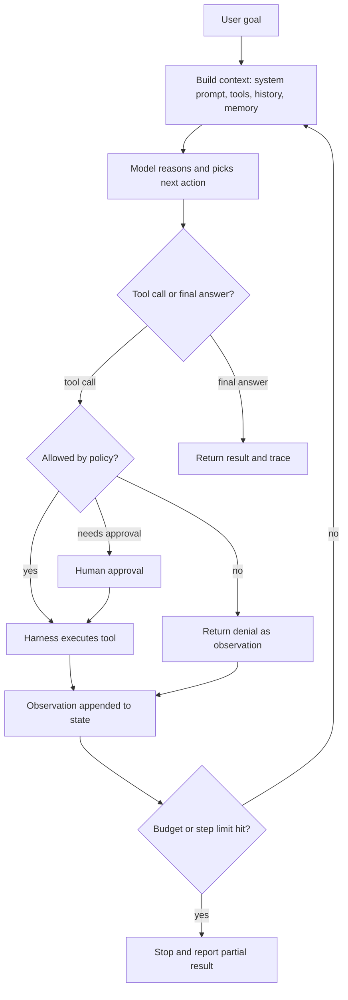

# The Agent Loop

> **Reviewed:** 2026-09 · **Level:** Senior / Tech Lead · **Type:** Foundational

The reason-act-observe loop comes from research (ReAct, 2022) and is now the default shape of most agent harnesses. The loop itself is established; the details of prompting and planning inside it keep changing.



## Q1. The ReAct pattern interleaves reasoning with actions

**Short answer:** ReAct (Yao et al., 2022) showed that letting a model alternate between writing a reasoning step, taking an action, and reading the observation works better on many tasks than reasoning alone or acting alone. Reasoning helps pick and sequence actions; observations ground the reasoning in real data and reduce hallucination. Modern tool-calling APIs implement this natively: the model emits text and structured tool calls, and the harness returns tool results as messages.

**How it works:**

1. **Thought:** the model states what it knows and what it needs next.
2. **Action:** it emits a tool call with arguments.
3. **Observation:** the harness runs the tool and returns the result.
4. Repeat until the model emits a final answer or the harness stops it.

**Example:**

```text
Thought: p99 latency rose at 14:05. I should check deploys around that time.
Action: list_deploys(service="checkout", since="13:30", until="14:30")
Observation: [{"id":"d-812","time":"14:02","change":"enable new pricing client"}]
Thought: A deploy at 14:02 precedes the spike. Check pricing-client span latency.
Action: query_traces(service="checkout", span="pricing.get", window="13:50-14:30")
Observation: p99 went from 40ms to 900ms at 14:03.
Final: Likely cause is deploy d-812; pricing.get p99 rose ~20x right after it.
```

**Trade-offs and pitfalls:**

- Visible reasoning text is not a faithful record of how the model decided; treat it as a helpful log, not proof.
- Each thought-action pair adds a model call; for simple tasks a single call with tools is enough.
- Models may "reason" confidently from a truncated or misread observation; tool output format matters.

**Remember:** Reason, act, observe, repeat. Observations are what keep reasoning honest.

## Q2. Stop conditions are part of the design, not an afterthought

**Short answer:** An agent loop must terminate on success, on explicit failure, and on resource exhaustion. The model's "I'm done" is one signal, but the harness should also enforce max steps, max tokens or cost, wall-clock timeout, repeated-action detection, and task-specific success checks. Without these, loops run away, burn budget, or return partial work that looks complete.

**How it works:**

- **Success:** model emits final answer and, ideally, a verifier confirms it (tests pass, output matches schema).
- **Hard limits:** step count, token budget, dollar budget, wall-clock deadline.
- **Stall detection:** same tool with same arguments N times, or no new information over several steps.
- **Escalation:** on limits, return partial progress with a clear status rather than a fake success.

**Example:**

```python
# Harness-side termination checks, evaluated after every step.
def should_stop(state) -> str | None:
    if state.steps >= state.max_steps:
        return "step_limit"
    if state.cost_usd >= state.max_cost_usd:
        return "cost_limit"
    if time.monotonic() > state.deadline:
        return "timeout"
    last = state.recent_calls[-3:]
    if len(last) == 3 and len({(c.name, c.args_hash) for c in last}) == 1:
        return "repeated_action"  # same call three times in a row
    return None
```

**Trade-offs and pitfalls:**

- Too-tight limits cause many partial completions; tune from traces, not intuition.
- A stop without a status is a silent failure. Always report why the run ended.

**Remember:** Every loop needs success, failure, and budget exits, and every exit needs a reason code.

## Q3. The harness shapes behavior more than the prompt does

**Short answer:** The harness decides which tools exist, how results are formatted and truncated, what happens on errors, what the model can see from history, and what requires approval. These choices constrain the model far more reliably than instructions in a prompt. A senior design puts hard guarantees (permissions, budgets, validation) in code and uses the prompt for soft guidance (style, preferred strategy).

**How it works:**

- **Tool exposure:** tools not offered cannot be called. Scope the tool list per task.
- **Result shaping:** truncate, paginate, and summarize large outputs before returning them.
- **Error handling:** return structured, actionable errors instead of stack traces.
- **Validation:** check tool arguments against a schema and business rules before executing.

**Example:** Instead of prompting "never delete production data," expose a `delete_records` tool only in the staging environment's harness, and have the production harness omit it entirely.

**Trade-offs and pitfalls:**

- Prompt-only guardrails can be bypassed by prompt injection or model error.
- Over-restricting tools makes the agent flail; offer the narrow tool it actually needs.

**Remember:** Put guarantees in code. Prompts are suggestions.

## Q4. Planning up front vs reacting step by step

**Short answer:** A purely reactive loop decides one step at a time; a plan-first approach asks the model to write a plan, then executes it, optionally re-planning when observations diverge. Plans help with long tasks, allow human review before execution, and make progress measurable. Pure reactivity is simpler and adapts better to surprises. Many production systems combine both: an explicit, revisable plan plus a reactive loop per step.

**How it works:**

- **Reactive:** low overhead; can wander on long tasks.
- **Plan then execute:** plan is an artifact that humans and evaluators can inspect.
- **Re-planning:** after each step, check whether the plan still holds; update it explicitly rather than drifting.

**Example:** A migration agent first outputs a checklist of 12 files to change and the test command to run, which a human approves; then it works through the list, marking items done and adding new ones if the compiler reveals extra call sites.

**Trade-offs and pitfalls:**

- Plans made before looking at data are often wrong; allow a short exploration phase before planning.
- A rigid plan executed without re-checking observations compounds early mistakes.

**Remember:** Plans are for inspection and progress tracking; keep them revisable.

## References

Reviewed 2026-09.

- [ReAct: Synergizing Reasoning and Acting in Language Models (arXiv)](https://arxiv.org/abs/2210.03629)
- [Anthropic — Building effective agents](https://www.anthropic.com/engineering/building-effective-agents)
- [OpenAI — Function calling guide](https://platform.openai.com/docs/guides/function-calling)
