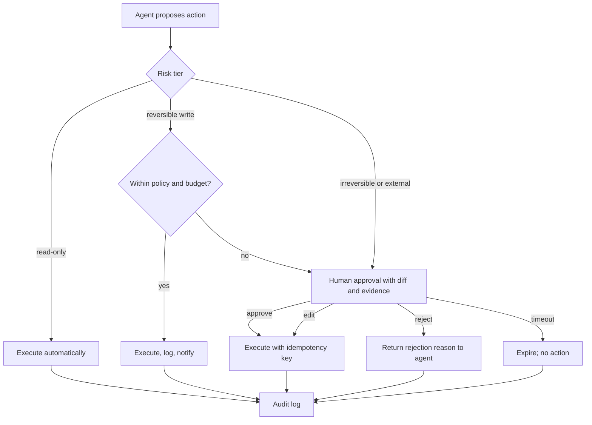

# Human in the Loop: Approvals, Escalation, and Audit

> **Reviewed:** 2026-09 · **Level:** Senior / Tech Lead · **Type:** Foundational (approvals, audit) / Emerging (confidence-based escalation)

Human approval for irreversible actions, separation of duties, and audit trails are long-established controls in operations and finance. What is new is applying them to a non-human actor that is fast, tireless, and occasionally confidently wrong.



## Q1. Put approval checkpoints on destructive, irreversible, and external actions

**Short answer:** Classify each tool action by risk. Reads run freely. Reversible, low-impact writes (creating a draft, pushing to an agent branch) can run automatically within policy. Destructive, irreversible, costly, or externally visible actions — deleting data, deploying to production, sending customer emails, spending money, changing access — require explicit human approval before execution. The classification lives in the harness or policy layer, attached to the tool, not decided by the model at runtime.

**How it works:**

- Risk tier is metadata on the tool definition plus contextual rules (environment, resource, amount).
- Approval is a blocking checkpoint: the run persists state and pauses.
- Approved action is executed exactly as shown (same arguments), with an idempotency key.

**Example:**

```typescript
// Policy attached to tools; the model cannot change it.
const toolPolicy = {
  query_metrics:       { tier: "read" },
  create_draft_pr:     { tier: "reversible" },
  scale_deployment:    { tier: "reversible", autoIf: (a) => a.env !== "prod" && a.replicas <= 10 },
  rollback_release:    { tier: "irreversible_or_prod" }, // always needs approval
  send_customer_email: { tier: "external" },             // always needs approval
} as const;
```

**Trade-offs and pitfalls:**

- "Reversible" is often optimistic; a restart is reversible but drops in-flight requests.
- Letting the model self-declare risk ("this is safe") defeats the control.

**Remember:** Risk tiers belong to tools and policy, not to the model's judgment.

## Q2. Show reviewable plans before execution

**Short answer:** For multi-step tasks with side effects, have the agent produce a plan — steps, tools, targets, expected impact, rollback — and get approval on the plan before executing. Reviewing one plan is cheaper and more meaningful than approving ten individual calls, and it catches wrong-goal errors early. Re-request approval if execution deviates materially from the approved plan.

**How it works:**

- Plan is structured data rendered for humans: what, where, why, blast radius, rollback.
- The harness binds the approval to the plan and rejects actions outside it.
- Material deviation (new target, higher risk tier) triggers a new approval.

**Example:** "Plan: 1) drain node pool B (12 pods move to pool A, capacity check shows 35% headroom), 2) upgrade pool B, 3) uncordon, 4) verify error rate below baseline for 10 min; rollback: revert pool version." The engineer approves; the agent cannot touch pool A.

**Trade-offs and pitfalls:**

- Plan approval does not guarantee correct execution; keep per-step verification.
- Vague plans ("fix the issue") are unreviewable; require concrete targets.

**Remember:** Approve plans, bind execution to them, and re-approve on deviation.

## Q3. Escalation paths and confidence thresholds

**Short answer:** Agents should escalate to a human when they are stuck, when evidence conflicts, when a budget is nearly exhausted, when the request is out of scope, or when a policy rule requires it. Confidence thresholds — escalate if the agent's confidence is below some value — are useful but tricky, because model self-reported confidence is often poorly calibrated. Prefer observable signals (verifier failed, conflicting evidence, novel situation) over the model's own number, and calibrate any score against real outcomes.

**How it works:**

- **Hard triggers:** policy-required approvals, budget thresholds, repeated failures, unknown tool errors.
- **Soft triggers:** classifier or verifier scores calibrated on labeled data.
- **Handoff package:** summary, evidence, what was tried, recommended next step, link to trace.

**Example:** A triage agent escalates to the on-call engineer when its top two hypotheses have similar support, attaching the evidence for each, rather than picking one.

**Trade-offs and pitfalls:**

- Asking the model "how confident are you, 0 to 1" produces numbers that look precise but are often not calibrated; this is an emerging area.
- Too many escalations and humans stop reading them; too few and errors slip through. Tune using outcome data.

**Remember:** Escalate on observable signals; treat self-reported confidence as uncalibrated until proven otherwise.

## Q4. Design approval UX to prevent rubber-stamping

**Short answer:** An approval is only a control if the approver can make an informed decision quickly. Show exactly what will happen (a diff, a command with resolved arguments, affected resources), why (evidence), the blast radius, and how to undo it. Offer approve, edit, and reject with a reason. Limit approval volume by batching low-risk items and auto-approving within policy, so humans reserve attention for decisions that matter.

**How it works:**

- **Content:** concrete action, target, evidence links, risk tier, rollback plan, expiry time.
- **Actions:** approve, edit parameters, reject with reason (fed back to agent), escalate.
- **Channels:** where the approver already works (chat, PR review, incident tool), with authentication.
- **Expiry:** approvals expire if unanswered; stale approvals for changed state are invalid.

**Example:** A chat approval card: "Roll back `checkout` from v142 to v141 in prod-us-east. Evidence: error rate 4x since v142 deploy at 14:02 (link). Rollback tested in staging 3 days ago. Expires in 15 min. [Approve] [Reject] [Open trace]."

**Trade-offs and pitfalls:**

- Approving from mobile without a diff invites mistakes; require richer review for high-risk tiers.
- Showing the agent's summary but not the raw action lets a wrong summary mislead the approver.

**Remember:** Show the exact action, evidence, blast radius, and undo. Minimize volume so each approval gets attention.

## Q5. Audit logs make agent actions accountable

**Short answer:** Every action an agent takes or proposes should be recorded in an append-only audit log: who initiated the run, which agent and version, what was proposed, who approved, what was executed with which arguments, and the result. This supports incident investigation, compliance, and trust. The agent acts on behalf of a human or team; the audit log must make that chain of responsibility clear.

**How it works:**

- Fields: run ID, initiator, agent version, model ID, tool, arguments, risk tier, approval decision and approver, timestamps, result, trace link.
- Store separately from mutable traces; restrict deletion; define retention.
- Actions appear in target systems under an identifiable agent identity, for example commits authored by a bot account with the initiator noted.

**Example:** During a postmortem, the team queries the audit log for all `scale_deployment` calls in the incident window and finds one approved by the on-call engineer and one auto-executed under a policy rule that is then tightened.

**Trade-offs and pitfalls:**

- Logging full arguments may include secrets; redact while keeping enough to reconstruct intent.
- A shared generic service identity makes attribution impossible; use distinct agent identities.

**Remember:** Append-only, attributable, linked to traces. The agent never acts anonymously.

## Q6. Some decisions stay with humans

**Short answer:** Keep humans accountable for decisions involving judgment about people, legal or financial commitments, security posture, irreversible production changes, and trade-offs between competing business goals. Agents can gather evidence, draft options, and recommend, but the decision and accountability stay with a person. In interviews, frame this as responsibility design rather than model capability.

**How it works:**

- **Human-owned:** hiring or performance judgments, customer commitments, pricing, access grants, incident severity declarations with external impact, merges to protected branches.
- **Agent-assisted:** evidence collection, drafting, options with trade-offs, routine reversible changes under policy.
- Revisit periodically with evidence, not by default drift.

**Example:** An incident copilot can draft the customer status-page update, but a human incident commander edits and publishes it.

**Trade-offs and pitfalls:**

- Human review can become symbolic under time pressure; track review depth (time spent, edits made) as a health signal.
- Regulated domains may have explicit requirements for human decision-making; involve compliance early.

**Remember:** Agents recommend; humans decide where judgment, accountability, or irreversibility is involved.

## Q7. Separation of duties: the agent should not approve itself

**Short answer:** The same principal should not both propose and approve a high-risk action. An agent must not be able to approve its own PR, grant its own permissions, or mark its own approval request as satisfied. A second agent approving the first is not a substitute for a human on high-risk actions; it is correlated judgment. Enforce with platform controls such as branch protection, required reviewers, and permission boundaries.

**How it works:**

- Agent identity lacks approve, merge, and IAM-admin permissions.
- Approval records are written by the approval service after authenticating a human, not by the agent.
- LLM reviewers can add signal but do not count toward required approvals.

**Example:** A coding agent opens PRs under a bot account; branch protection requires one human code-owner approval, and the bot cannot approve. See the [automated review process](../../leadership/code-reviews/automated-review-process.md) for how automated checks fit alongside human review.

**Trade-offs and pitfalls:**

- Teams sometimes grant broad bot permissions "temporarily" to unblock demos; audit bot permissions regularly.

**Remember:** Propose and approve must be different principals, enforced by the platform.

## Q8. Interrupt, pause, and take over

**Short answer:** Humans need controls during a run, not just at checkpoints: see live progress, pause, cancel, edit the plan, or take over manually. A kill switch that stops all agent actions for a service or tenant is an operational must-have. Design the run so cancellation leaves a consistent state — either the step completed or it did not — and reports what was done.

**How it works:**

- Live view of the plan and current step from traces.
- Cancel token checked between steps; in-flight tool calls either complete or are aborted safely.
- Global and scoped kill switches (feature flags) disabling write tools.

**Example:** During a major incident, the incident commander flips a flag that disables all agent write tools across production while keeping read-only investigation tools available.

**Trade-offs and pitfalls:**

- Cancellation mid-transaction can leave partial state; prefer atomic tools and compensating actions.

**Remember:** Live visibility, cancel between steps, and a kill switch for write tools.

## References

Reviewed 2026-09.

- [Anthropic — Building effective agents](https://www.anthropic.com/engineering/building-effective-agents)
- [LangGraph documentation](https://langchain-ai.github.io/langgraph/)
- [OWASP Top 10 for LLM Applications](https://owasp.org/www-project-top-10-for-large-language-model-applications/)
