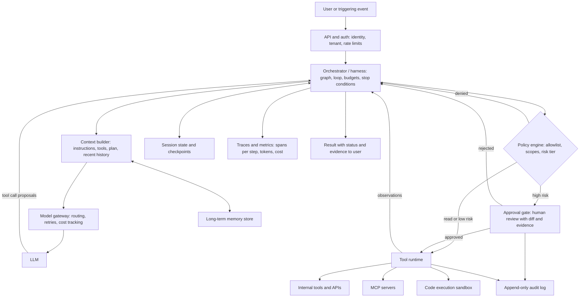

# Agent Systems

> **Reviewed:** 2026-09 · **Level:** Senior / Tech Lead · **Type:** Emerging

This section goes deep on **agent systems**: the harness, tools, orchestration, state, evaluation, human oversight, and operations around a language model that takes actions. Model fundamentals, retrieval, and AI-assisted coding are covered separately in the [AI section](../ai/index.md).

Much of this field is new. The recurring interview theme is to separate **established engineering principles** — least privilege, idempotency, timeouts and budgets, observability, audit logs, human approval for irreversible actions — from **emerging practice** (tool-description design, MCP, agent evaluation methods, prompt-injection defenses) and from **speculation** (fully autonomous long-running agents). Strong candidates say which is which.

## Learning order

1. **Foundations** — what an agent is, when to use one, and the core loop.
   - [What Is an Agent](./foundations/01-what-is-an-agent.md)
   - [The Agent Loop](./foundations/02-agent-loop.md)
2. **Tools and MCP** — how agents act, and how to design and secure tools.
   - [Tool Calling and Design](./tools-and-mcp/01-tool-calling-and-design.md)
   - [Model Context Protocol](./tools-and-mcp/02-model-context-protocol.md)
3. **Orchestration patterns** — composing calls into workflows and agents.
   - [Workflow Patterns](./orchestration-patterns/01-workflow-patterns.md)
   - [Graphs, Retries, and Budgets](./orchestration-patterns/02-control-flow-and-budgets.md)
4. **Memory and state** — context, compaction, checkpoints, and isolation.
   - [Memory and Context](./memory-and-state/01-memory-and-context.md)
5. **Evaluation and reliability** — measuring non-deterministic systems.
   - [Evaluating Agents](./evaluation-and-reliability/01-evaluating-agents.md)
   - [Failure Modes Catalog](./evaluation-and-reliability/02-failure-modes.md)
6. **Human in the loop** — approvals, escalation, and audit.
   - [Approvals and Escalation](./human-in-the-loop/01-approvals-and-escalation.md)
7. **Production and ops** — observability, cost, security, and rollout.
   - [Observability, Cost, Latency](./production-and-ops/01-observability-and-cost.md)
   - [Security, Rollout, Incidents](./production-and-ops/02-security-and-rollout.md)
8. **Applied scenarios** — agents for scalability and operations work, plus system design.
   - [Engineering and Ops Agents](./applied-scenarios/01-engineering-and-ops-agents.md)
   - [System Design Questions](./applied-scenarios/02-system-design-questions.md)

Finish with the [Cheatsheet](./cheatsheet.md) for last-minute review.

## Production agent architecture

The diagram below is a reference architecture that ties the sections together. Not every system needs every box; a simple workflow may only need the orchestrator, model gateway, a few tools, and tracing.

## Established vs Emerging

| Topic | Status | Notes |
|---|---|---|
| Least privilege, scoped credentials | Established | Classic security; the main defense against model error and injection |
| Idempotency, retries with backoff, timeouts | Established | Distributed-systems basics; more important with a non-deterministic caller |
| Tracing, metrics, audit logs | Established | GenAI-specific telemetry conventions are still maturing |
| Human approval for irreversible actions | Established | Change management and separation of duties |
| Sandboxing untrusted code | Established | Same as running user-submitted code |
| Shadow mode, canary, feature flags | Established | Standard progressive delivery applied to agents |
| Function / tool calling APIs | Established | Stable across major providers; details differ |
| Workflow patterns (chaining, routing, orchestrator-workers) | Established to emerging | Vocabulary popularized recently; the ideas are older |
| ReAct-style loop | Established to emerging | Research from 2022; now the default harness shape |
| Graph / state-machine orchestration frameworks | Emerging | Concepts are durable; frameworks change quickly |
| Model Context Protocol | Emerging | Versioned spec that has changed; check current version |
| Tool description design (agent-computer interface) | Emerging | Model-dependent; evaluate every change |
| Agent evaluation (trajectory grading, pass^k) | Emerging | No universal benchmark predicts your tasks |
| Long-term agent memory | Emerging | Write policies and poisoning risks not settled |
| Prompt injection defense | Emerging | No complete solution; defense in depth required |
| Multi-agent systems | Emerging | Use for isolation, parallelism, or privilege separation only |
| Fully autonomous long-running agents in production | Speculative | Treat vendor claims with caution; measure on your tasks |

## How this connects to other sections

- [AI fundamentals](../ai/index.md) for models, retrieval, and prompting basics.
- [DevOps](../devops/index.md) for CI/CD, observability, and incident management practices agents plug into.
- [Case studies](../case-studies/index.md) for classic system design practice to combine with agent designs.

## References

Reviewed 2026-09.

- [Anthropic — Building effective agents](https://www.anthropic.com/engineering/building-effective-agents)
- [Model Context Protocol — official site and specification](https://modelcontextprotocol.io/)
- [OpenAI — Function calling guide](https://platform.openai.com/docs/guides/function-calling)
- [OWASP Top 10 for LLM Applications](https://owasp.org/www-project-top-10-for-large-language-model-applications/)
- [LangGraph documentation](https://langchain-ai.github.io/langgraph/)
- [ReAct: Synergizing Reasoning and Acting in Language Models (arXiv)](https://arxiv.org/abs/2210.03629)
