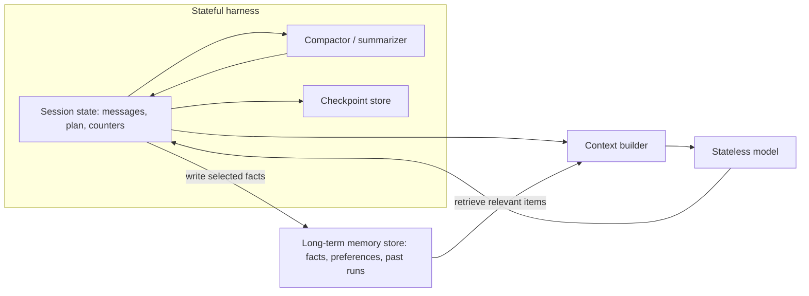

# Memory, State, and Context Management

> **Reviewed:** 2026-09 · **Level:** Senior / Tech Lead · **Type:** Foundational (state and checkpoints) / Emerging (long-term agent memory)

Checkpointing, session isolation, and persistence are established engineering. Long-term "agent memory" — what to remember, how to retrieve it, and when to forget — is an emerging area with no settled best practice. Retrieval techniques themselves are covered in the [AI section](../../ai/index.md).



## Q1. The model is stateless; the harness is stateful

**Short answer:** Each model call is a pure function of the context you send. Anything the agent "remembers" — prior messages, tool results, plan progress — exists only because the harness stored it and re-sent it. This means memory is a data-engineering problem you own: what to persist, where, for how long, and what to include in each call. Some APIs offer server-side conversation state, but it is still state stored by someone and sent to the model.

**How it works:**

- Harness maintains a session record per run: messages, tool calls and results, plan, budget counters.
- Every step, a context builder selects what goes into the next call.
- Persisting the session enables resume, replay, audit, and evaluation.

**Example:** A PR agent crashes mid-run. Because the harness stored state after each step, a new worker loads the session, sees steps 1 through 7 complete, and resumes at step 8 without redoing edits.

**Trade-offs and pitfalls:**

- Treating in-memory process state as the source of truth loses runs on restarts.
- Stored sessions contain sensitive data (code, logs, PII); apply retention and access controls.

**Remember:** Memory is whatever your harness chooses to store and re-send. Own it explicitly.

## Q2. Short-term memory is the context window, and it is a scarce resource

**Short answer:** Short-term memory is the working context for the current run: system prompt, tool definitions, conversation, and recent observations. Context windows are large but finite, cost scales with tokens sent every step, and quality can degrade when relevant information is buried in long contexts. Manage context like memory in a constrained system: keep what the next decision needs, drop or compress the rest.

**How it works:**

- **Budget the window:** reserve space for system prompt, tools, and output; allocate the rest to history and retrieved data.
- **Trim observations:** truncate large tool outputs, keep IDs so the agent can re-fetch details.
- **Prefer references over payloads:** store a big log file externally and give the agent a `read_log_range` tool instead of pasting it.
- **Prompt caching:** many providers cache stable prefixes (system prompt, tools), reducing cost and latency for repeated calls; keep that prefix stable.

**Example:** A trace query returns 5,000 spans. The tool returns the top 20 slowest with span IDs and a count, plus a hint to call `get_span(id)` for details.

**Trade-offs and pitfalls:**

- Aggressive truncation can remove the one line that mattered; give the agent a way to fetch more.
- Reordering or editing early context breaks prefix caching.

**Remember:** Context is a budget. Return summaries with handles, not raw dumps.

## Q3. Summarization and compaction keep long runs alive

**Short answer:** When history approaches the context limit, compact it: replace older turns with a structured summary of decisions, facts learned, open questions, and artifacts produced, while keeping recent turns verbatim. Good compaction preserves what the agent needs to continue and discards exploratory noise. It is lossy by design, so preserve the full raw history in storage for audit and debugging.

**How it works:**

1. Trigger at a threshold (for example a percentage of the window).
2. Summarize older segment into a fixed schema: goal, progress, key findings with sources, decisions, pending steps.
3. Keep the last N turns and any pinned items (the original task, constraints, approvals).
4. Store raw history separately.

**Example:**

```python
# Compaction keeps the task and constraints pinned and summarizes the middle.
def compact(session, keep_recent=6):
    pinned = [session.task, session.constraints, *session.approvals]
    old, recent = session.messages[:-keep_recent], session.messages[-keep_recent:]
    summary = summarize_to_schema(old, schema=["progress", "findings", "decisions", "next_steps"])
    session.archive(old)  # raw history remains available for audit
    session.messages = [*pinned, {"role": "user", "content": f"Summary so far: {summary}"}, *recent]
```

**Trade-offs and pitfalls:**

- Summaries can silently drop constraints ("do not touch the payments module"); pin constraints explicitly.
- Summarization errors become "facts" for the rest of the run; include source references so the agent can re-verify.

**Remember:** Compact with a schema, pin constraints, archive the raw history.

## Q4. Long-term memory stores persist knowledge across sessions

**Short answer:** Long-term memory saves information beyond one run — user preferences, project conventions, facts discovered in earlier investigations — in a store (vector index, key-value, relational, or files) and retrieves relevant items into future contexts. It can improve personalization and reduce repeated discovery. It also introduces stale data, privacy risks, and memory poisoning, where a malicious or wrong fact persists and affects future runs. This area is emerging; keep it explicit, scoped, and editable.

**How it works:**

- **Write policy:** what qualifies as memory (explicit user statements, verified facts), who approves it.
- **Types:** semantic facts, episodic records of past runs, procedural notes ("tests for this repo run with `make test`").
- **Retrieval:** by similarity, recency, and scope (user, team, repo).
- **Lifecycle:** timestamps, sources, expiry, and a UI to view and delete memories.

**Example:** A repo-scoped memory note "integration tests need `docker compose up db` first" saves each future coding run several failed attempts. It is stored with the commit hash where it was learned so it can be re-validated when the build changes.

**Trade-offs and pitfalls:**

- Writing memories from untrusted content (web pages, tickets) enables persistent prompt injection.
- Cross-user memory leakage is a privacy incident; scope memories strictly.
- More memory is not better; irrelevant retrieved items distract the model.

**Remember:** Long-term memory needs a write policy, scope, provenance, and deletion. Treat it as a database, not magic.

## Q5. Checkpoints enable resume, replay, and human pauses

**Short answer:** A checkpoint is a durable snapshot of run state after each step or node. It allows resuming after crashes or deploys, pausing for human approval for hours without holding a process, replaying a run for debugging, and forking a run from an earlier state to test a fix. This is the same idea as durable workflow engines, applied to agent runs.

**How it works:**

- Persist state plus a step counter after every node, in a transactional store.
- Record tool side effects with idempotency keys so resumed runs do not repeat them.
- On approval interrupts, persist and exit; resume when the approval event arrives.

**Example:** An incident agent proposes a rollback at 02:00 and pauses. The on-call engineer approves at 02:20 from their phone; a worker loads the checkpoint and executes only the approved action.

**Trade-offs and pitfalls:**

- Checkpointing large contexts every step costs storage; store deltas or references.
- Resuming with a different model or prompt version can behave differently; record versions in the checkpoint.

**Remember:** Checkpoint after each step with versions and idempotency keys; pauses and crashes become routine.

## Q6. Session isolation prevents cross-contamination

**Short answer:** Each run and each user must have isolated state: separate message histories, separate scratch filesystems or sandboxes, separate credentials, and memory retrieval filtered by tenant. Leaking one user's context into another's run is both a privacy breach and a correctness bug. Isolation is also needed between runs of the same user when tasks should not influence each other.

**How it works:**

- Session ID and tenant ID on every state record and memory item; filter at the storage layer.
- Per-run sandbox (container, temporary directory) destroyed after the run.
- Caches keyed by tenant; never share prompt caches that include user data across tenants.

**Example:** Two engineers run the migration agent on different repos simultaneously. Each run has its own container, clone, and short-lived token scoped to its repo.

**Trade-offs and pitfalls:**

- Shared "global memory" is convenient and dangerous; require explicit promotion to shared scope.
- Reusing warm sandboxes for performance must include a reset step.

**Remember:** Isolate state, filesystem, credentials, and memory per session and tenant.

## Q7. Context engineering: deciding what the model sees each step

**Short answer:** Context engineering is the practice of assembling the right information for each model call: instructions, only the relevant tools, the current plan, recent observations, retrieved memory, and nothing distracting. It treats context as a curated view over state rather than an ever-growing transcript. The term is newer than the practice; the core ideas are relevance, ordering, and size control.

**How it works:**

- **Stable prefix:** system prompt and tools first (cache-friendly).
- **Task state:** goal, constraints, plan with progress markers.
- **Dynamic section:** recent turns, retrieved items, latest observation.
- **Tool filtering:** expose tools relevant to the current phase.

**Example:** In the "investigate" phase the agent sees observability tools only; in the "propose fix" phase it sees code-search and PR tools and a summary of the evidence, not the raw logs.

**Trade-offs and pitfalls:**

- Hiding information the model needs causes repeated lookups; hiding too little dilutes attention.
- Changes to context assembly change behavior; run evaluations when you modify it.

**Remember:** Each call gets a curated view of state, not the whole history.

## Q8. Scratchpads and external artifacts beat keeping everything in messages

**Short answer:** For long tasks, have the agent write progress to external artifacts — a plan file, a notes file, a structured task list, or the code itself — and re-read them as needed. This keeps context small, survives compaction, and gives humans a readable view of progress. It is common in coding agents, where the repository and a todo list serve as durable working memory.

**How it works:**

- Provide tools like `update_plan(steps)` or `write_notes(text)` backed by run-scoped storage.
- Include the current plan in each context build; keep detailed notes retrievable on demand.
- Treat artifacts as state for checkpoints and audits.

**Example:** A migration agent maintains `migration-progress.json` listing files done, pending, and failed with reasons. After compaction, it reads the file and continues without re-scanning the repo.

**Trade-offs and pitfalls:**

- Agents may write notes and never read them; include the plan in context automatically.
- Artifacts written by the agent are still model output; validate before trusting counts or claims.

**Remember:** Externalize progress into artifacts that survive compaction and are readable by humans.

## References

Reviewed 2026-09.

- [Anthropic — Building effective agents](https://www.anthropic.com/engineering/building-effective-agents)
- [LangGraph documentation](https://langchain-ai.github.io/langgraph/)
- [OWASP Top 10 for LLM Applications](https://owasp.org/www-project-top-10-for-large-language-model-applications/)
- [OpenAI — Function calling guide](https://platform.openai.com/docs/guides/function-calling)
