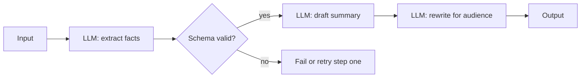
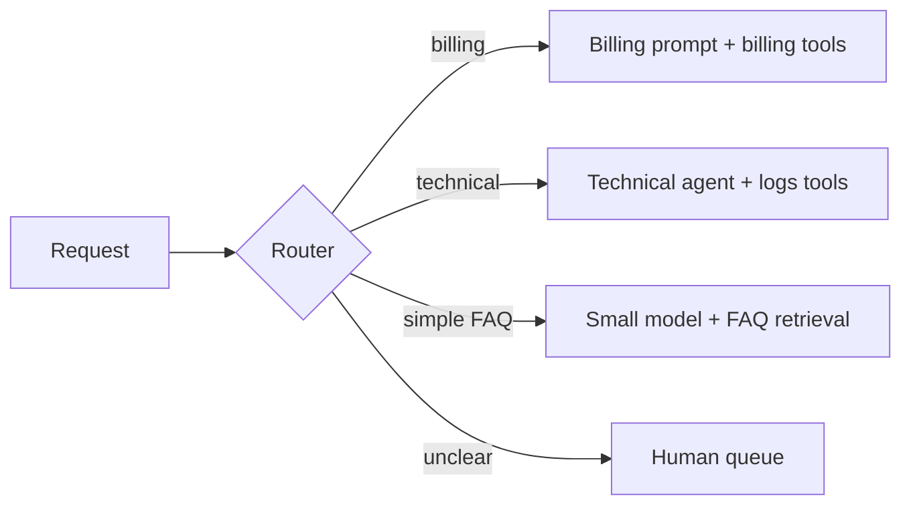
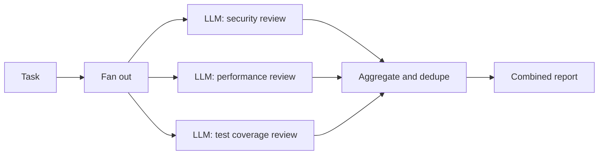
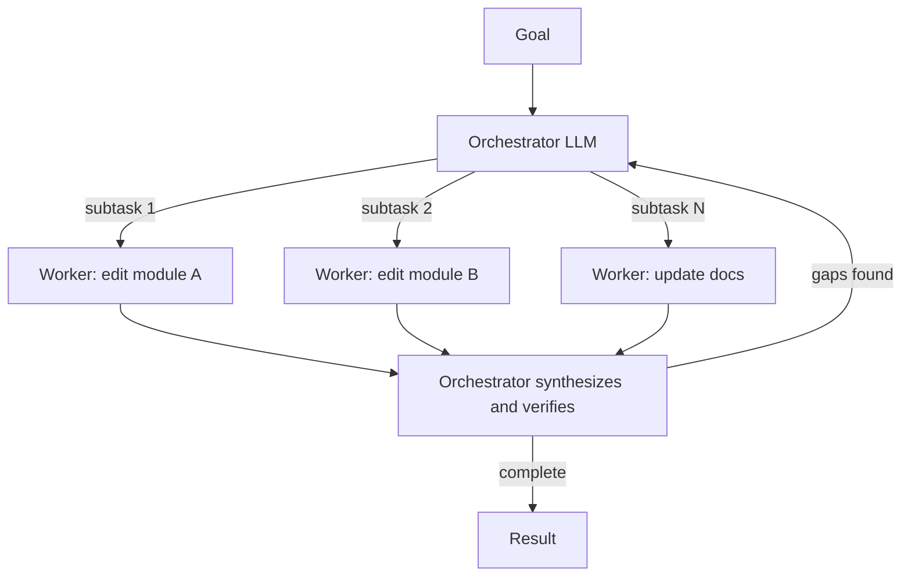
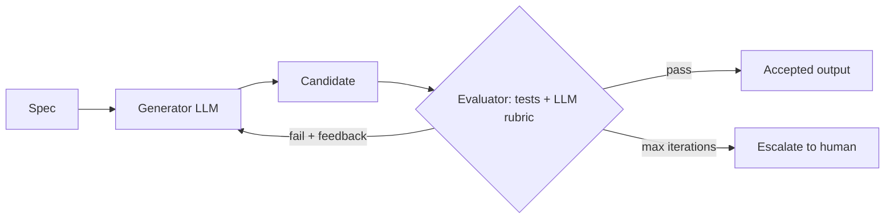

# Orchestration Workflow Patterns

> **Reviewed:** 2026-09 · **Level:** Senior / Tech Lead · **Type:** Foundational (patterns) / Emerging (multi-agent)

The first five patterns below follow the vocabulary popularized by Anthropic's "Building effective agents" post. They are composable building blocks; most production systems are a deterministic composition of a few of them with one bounded agent loop inside. Multi-agent designs are the least settled area.

## Q1. Prompt chaining splits a task into fixed sequential steps with gates

**Short answer:** Prompt chaining decomposes a task into a fixed sequence of LLM calls, where each step consumes the previous output. Between steps you can insert deterministic gates — schema validation, length checks, tests — that stop or redirect the chain. It trades latency for accuracy: each call does a simpler job, and errors are caught early instead of compounding.

**How it works:**



**Example:** Incident postmortem drafting: extract a timeline from chat logs (validated as JSON with timestamps), then draft impact and root-cause sections, then rewrite for an executive audience.

**Trade-offs and pitfalls:**

- More calls means more latency and cost; merge steps that do not benefit from separation.
- Without gates, chaining just moves errors downstream.

**Remember:** Chaining = fixed steps + checks between them. It is a workflow, not an agent.

## Q2. Routing classifies input and sends it to a specialized path

**Short answer:** A router (an LLM classifier, a small model, or rules) inspects the input and dispatches it to one of several specialized prompts, tools, or models. It keeps each path focused and lets you send easy requests to cheap, fast models and hard ones to capable models. Routing quality becomes a single point of failure, so it needs its own evaluation.

**How it works:**



**Example:** An internal ops assistant routes "what is the on-call rotation" to a retrieval answer, "why is service X slow" to an investigation agent, and anything touching production changes to a gated remediation workflow.

**Trade-offs and pitfalls:**

- Always include a fallback or "unclear" route.
- Measure the confusion matrix of the router; misroutes look like downstream failures.

**Remember:** Routing buys specialization and cost control; evaluate the router separately.

## Q3. Parallelization: sectioning and voting

**Short answer:** Parallelization runs multiple LLM calls at the same time and aggregates results. **Sectioning** splits independent subtasks (review security, performance, and style of a PR in parallel). **Voting** runs the same task several times and aggregates for higher confidence (for example, flag content only if two of three evaluators agree). It reduces wall-clock latency for independent work and can improve reliability, at higher token cost.

**How it works:**



**Example:**

```python
# Sectioning with a timeout per branch; partial results are allowed.
async def review_pr(diff: str) -> list[Finding]:
    aspects = ["security", "performance", "tests"]
    tasks = [asyncio.wait_for(review_aspect(diff, a), timeout=60) for a in aspects]
    results = await asyncio.gather(*tasks, return_exceptions=True)
    findings = [f for r in results if not isinstance(r, Exception) for f in r]
    return dedupe(findings)
```

**Trade-offs and pitfalls:**

- Aggregation is the hard part: conflicting outputs need a rule or a judge.
- Voting on correlated errors (same model, same prompt) gives less independence than it seems.
- Watch provider rate limits when fanning out.

**Remember:** Parallelize independent subtasks for speed; vote for confidence; design the merge step.

## Q4. Orchestrator-workers: dynamic decomposition

**Short answer:** An orchestrator LLM looks at the task, decides at runtime which subtasks are needed, delegates them to worker calls (often with narrower tools and context), and synthesizes the results. Unlike sectioning, the subtasks are not known in advance. It fits tasks like "change this API across the codebase" where the set of files is discovered during the run.

**How it works:**



**Example:** A research-style incident analysis where the orchestrator spawns workers to inspect logs, traces, and recent deploys for each suspect service, then merges findings into a ranked hypothesis list.

**Trade-offs and pitfalls:**

- Orchestrator must pass sufficient context to workers; under-specified subtasks cause duplicated or conflicting work.
- Cost and step count are harder to bound; set budgets at both levels.
- Synthesis can paper over worker failures; require workers to report status explicitly.

**Remember:** Orchestrator-workers = dynamic fan-out. Budget both levels and require explicit worker status.

## Q5. Evaluator-optimizer: generate, critique, revise

**Short answer:** One call generates a candidate, another evaluates it against explicit criteria and returns feedback, and the generator revises until the evaluator passes it or an iteration cap is hit. It works when evaluation criteria are clear and when feedback actually improves output. The strongest version replaces or supplements the LLM evaluator with deterministic checks such as compilers, tests, linters, or schema validators.

**How it works:**



**Example:** Load-test script generation: the model writes a k6 script, the harness runs it against a local mock for ten seconds, and syntax errors or failed checks are returned as feedback until the script runs cleanly.

**Trade-offs and pitfalls:**

- An LLM judging its own family's output shares its blind spots; ground with real checks.
- Without an iteration cap, it can oscillate between two flawed versions.

**Remember:** Generate, check, revise, with a cap. Deterministic checks beat LLM judges wherever available.

## Q6. Planner-executor separates deciding from doing

**Short answer:** A planner produces an explicit, structured plan (steps, tools, success criteria); an executor carries out each step, often with a cheaper model or even deterministic code; the planner re-plans when a step fails or observations change assumptions. The plan becomes a reviewable artifact for humans and a progress tracker for the harness.

**How it works:**

- Plan as data: list of steps with IDs, dependencies, expected outputs, and risk tier.
- Executor runs steps; high-risk steps pause for approval.
- Re-plan triggers: step failure, unexpected observation, budget threshold.

**Example:**

```json
{
  "goal": "Reduce p99 latency of /search",
  "steps": [
    {"id": 1, "action": "query_traces", "risk": "read", "expect": "top slow spans"},
    {"id": 2, "action": "read_code", "risk": "read", "depends_on": [1]},
    {"id": 3, "action": "open_pr_with_index_change", "risk": "gated_write", "depends_on": [2]}
  ]
}
```

**Trade-offs and pitfalls:**

- Plans made without exploration are fiction; allow a read-only discovery phase first.
- Executors that silently skip failing steps create partial completion.

**Remember:** Plans are data: reviewable, risk-tagged, and revisable.

## Q7. Multi-agent systems: useful sometimes, costly often

**Short answer:** Multi-agent designs split work across several LLM-driven agents with distinct roles, tools, or contexts that communicate through messages or shared state. They can help with context isolation (each agent keeps a small, focused context), parallel exploration, and separation of privileges. But they multiply cost, latency, and failure modes: miscommunication, duplicated work, circular delegation, and hard-to-debug emergent behavior. Start with a single agent plus good tools; add agents only when a measured limit (context size, privilege separation, parallelism) requires it.

**How it works:**

- **Supervisor/hierarchical:** one agent delegates and integrates (orchestrator-workers with agentic workers).
- **Peer/handoff:** agents transfer control to each other based on topic.
- **Shared state vs messages:** a shared blackboard is easier to inspect; free-form chat between agents is hardest to control.

**Example:** A justified split: a "reader" agent processes untrusted web content with no write tools and outputs a structured summary; a separate "actor" agent with write tools only sees the structured summary. That is privilege separation, not role-play.

**Trade-offs and pitfalls:**

- Role-play personas ("the architect agent", "the QA agent") rarely add value over a single agent with a checklist.
- Each handoff loses context; summaries between agents are lossy.
- Evaluation is harder: you need per-agent and end-to-end traces.
- This area is emerging; published results often do not transfer to your tasks.

<details>
<summary>Follow-up questions</summary>

- **When would you choose multi-agent over single agent?** When a single context cannot hold the needed information, when subtasks are truly parallel and independent, or when you need hard privilege boundaries between components.
- **How do you prevent infinite delegation?** Depth limits, global step and cost budgets shared across agents, and a directed delegation graph without cycles.

</details>

**Remember:** Multi-agent is a tool for context isolation, parallelism, and privilege separation — not a default architecture.

## References

Reviewed 2026-09.

- [Anthropic — Building effective agents](https://www.anthropic.com/engineering/building-effective-agents)
- [LangGraph documentation](https://langchain-ai.github.io/langgraph/)
- [ReAct: Synergizing Reasoning and Acting in Language Models (arXiv)](https://arxiv.org/abs/2210.03629)
