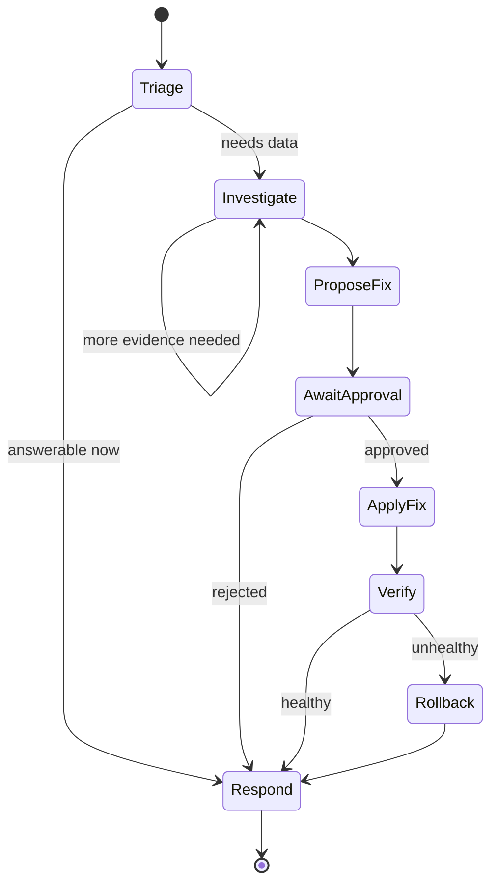

# Graphs, Retries, Timeouts, and Budgets

> **Reviewed:** 2026-09 · **Level:** Senior / Tech Lead · **Type:** Foundational

Retries, timeouts, and budgets are classic distributed-systems concerns. Graph-based orchestration frameworks (LangGraph is a well-known example) package them for LLM workflows; the concepts below are vendor-neutral.

## Q1. Graph or state-machine orchestration makes agent control flow explicit

**Short answer:** Model the workflow as a graph: nodes are steps (an LLM call, a tool call, a human approval), edges are transitions, and a typed state object flows through the graph. Conditional edges let the model's output choose the next node, but only among transitions you defined. This gives you the flexibility of an agent with the inspectability of a state machine: you can checkpoint state at each node, resume after failures, add human interrupts, and visualize runs.

**How it works:**



- **State:** a typed record (messages, plan, evidence, approvals, counters).
- **Nodes:** pure-ish functions that read state and return updates.
- **Edges:** static or conditional; cycles allowed but bounded.
- **Checkpointer:** persists state after each node for resume, replay, and time-travel debugging.
- **Interrupts:** pause before specified nodes for human input.

**Example:**

```python
# Vendor-neutral sketch of a graph runner with checkpoints and bounded cycles.
from dataclasses import dataclass, field

@dataclass
class RunState:
    evidence: list = field(default_factory=list)
    proposal: dict | None = None
    approved: bool | None = None
    investigate_loops: int = 0

def route_after_investigate(s: RunState) -> str:
    if s.investigate_loops >= 5:
        return "respond"               # bounded cycle
    return "investigate" if needs_more_evidence(s) else "propose_fix"

GRAPH = {
    "triage": triage_node,
    "investigate": investigate_node,
    "propose_fix": propose_fix_node,
    "await_approval": approval_interrupt,  # pauses and persists
    "apply_fix": apply_fix_node,
    "respond": respond_node,
}
```

**Trade-offs and pitfalls:**

- Graphs add upfront design; for a pure open-ended task, a single loop node inside the graph is fine.
- Over-granular graphs become hard to change; group related steps.

**Remember:** Graphs make agent control flow explicit, checkpointable, and interruptible.

## Q2. Retries belong at the right layer

**Short answer:** Distinguish three kinds of failure. Transport failures (timeouts, rate limits, 5xx) are retried by the harness with exponential backoff and jitter, invisible to the model. Tool-level semantic errors (invalid argument, not found) go back to the model as observations so it can correct itself. Step-level failures (the output failed validation) re-run the step with feedback, up to a cap. Retrying at the wrong layer either wastes tokens or hides real problems.

**How it works:**

| Failure | Layer | Strategy |
|---|---|---|
| 429, timeout, 503 from model or tool | Harness | Backoff with jitter, cap attempts, circuit breaker |
| Invalid args, not found, permission denied | Model | Return structured error as observation |
| Output fails schema or tests | Step | Retry with feedback, max N, then escalate |
| Whole run fails | Orchestrator | Resume from checkpoint, not restart |

**Example:** A model returns malformed JSON for a tool call. The harness re-asks once with the validation error; on a second failure, the step fails with status `invalid_output` and the run escalates.

**Trade-offs and pitfalls:**

- Retrying non-idempotent tools without idempotency keys causes duplicates.
- Retrying the same prompt at the same temperature may just reproduce the failure; add the error as feedback.
- Retry storms across many concurrent runs can overload shared providers; use global rate limiting.

**Remember:** Transport errors retry in code; semantic errors go to the model; validation failures retry with feedback and a cap.

## Q3. Timeouts at every level

**Short answer:** Set timeouts per model call, per tool call, per step, and per run, with the outer deadline propagated to inner calls. Long-running tools should be asynchronous: start a job, return a handle, and let the agent poll or be resumed on completion. A run that exceeds its deadline should stop cleanly, persist state, and report partial progress.

**How it works:**

- **Deadline propagation:** each call receives the remaining time budget, not a fixed constant.
- **Async tools:** `start_load_test` returns `job_id`; `get_job_status(job_id)` checks it.
- **Streaming:** use streaming responses for user-facing latency, but still apply a hard deadline.

**Example:** A run has 10 minutes. After 8 minutes, the harness switches the model to "wrap up" mode by instructing it to summarize findings with the evidence gathered so far.

**Trade-offs and pitfalls:**

- Aggressive timeouts on model calls with long outputs cause wasteful retries; size them by expected output length.
- Blocking tools inside the loop hold resources and context; prefer async handles.

**Remember:** Propagate deadlines, make long tools async, and end with a report rather than silence.

## Q4. Budgets: steps, tokens, dollars, and blast radius

**Short answer:** Every run should carry explicit budgets: maximum steps, maximum tokens or cost, maximum wall-clock time, and maximum side effects (for example, at most five files changed or one PR opened). Budgets are enforced by the harness, reported in traces, and tuned from real distributions of successful runs. They are the main defense against runaway loops and surprise bills.

**How it works:**

- Track cumulative input and output tokens per run and convert to cost using your provider's pricing.
- Set soft thresholds (warn, switch to wrap-up) and hard thresholds (stop).
- Budget side effects separately from compute; a cheap run can still do a lot of damage.
- Aggregate budgets per user, team, and tenant to prevent one workload starving others.

**Example:**

```typescript
// Budget object passed through every layer of the run.
interface RunBudget {
  maxSteps: number;          // e.g. 30
  maxCostUsd: number;        // derived from your pricing table
  deadlineMs: number;        // absolute epoch ms
  maxWrites: number;         // side-effect cap, e.g. 1 PR
}

function charge(budget: RunBudget, usage: { steps: number; costUsd: number; writes: number }) {
  if (usage.steps > budget.maxSteps) throw new BudgetExceeded("steps");
  if (usage.costUsd > budget.maxCostUsd) throw new BudgetExceeded("cost");
  if (usage.writes > budget.maxWrites) throw new BudgetExceeded("writes");
  if (Date.now() > budget.deadlineMs) throw new BudgetExceeded("deadline");
}
```

**Trade-offs and pitfalls:**

- Budgets set from averages cut off the long tail of legitimate hard tasks; set from percentiles and monitor hit rates.
- Budget exhaustion must produce a clear status, not a half-applied change.

**Remember:** Budget compute and side effects separately, enforce in code, and tune from traces.

## References

Reviewed 2026-09.

- [LangGraph documentation](https://langchain-ai.github.io/langgraph/)
- [Anthropic — Building effective agents](https://www.anthropic.com/engineering/building-effective-agents)
- [OpenAI — Function calling guide](https://platform.openai.com/docs/guides/function-calling)
