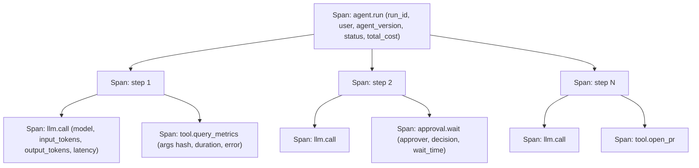

# Observability, Cost, and Latency for Agent Runs

> **Reviewed:** 2026-09 · **Level:** Senior / Tech Lead · **Type:** Foundational (tracing, rate limits) / Emerging (GenAI telemetry conventions)

Distributed tracing, metrics, and rate limiting are established. Standard semantic conventions for LLM and agent telemetry are still maturing (for example, OpenTelemetry has been developing generative AI conventions), so expect schema changes. Broader operational practice is in the [DevOps section](../../devops/index.md).



## Q1. Trace agent runs as a tree of spans

**Short answer:** Model each agent run as a trace: a root span for the run, child spans per step, and nested spans for each model call, tool call, retrieval, and approval wait. Attach attributes that matter for debugging and cost: model ID, prompt and tool schema versions, token counts, latency, tool arguments (redacted), errors, and final status. Propagate trace context into tool backends so an agent's database query appears in the same trace as the model call that caused it.

**How it works:**

- **Root attributes:** run ID, initiator, tenant, agent version, budget, final status, total tokens and cost.
- **Step spans:** step index, phase, decision summary.
- **LLM spans:** model, parameters, input and output tokens, cached tokens, time to first token, total latency.
- **Tool spans:** tool name, risk tier, argument hash or redacted args, result size, error code, retries.
- **Context propagation:** standard trace headers passed to tool services.

**Example:**

```python
# Wrapping tool execution in a span with cost-relevant attributes.
with tracer.start_as_current_span(f"tool.{call.name}") as span:
    span.set_attribute("agent.run_id", state.run_id)
    span.set_attribute("tool.risk_tier", policy[call.name].tier)
    span.set_attribute("tool.args_hash", stable_hash(call.args))
    try:
        result = execute(call)
        span.set_attribute("tool.result_bytes", len(result))
    except ToolError as e:
        span.record_exception(e)
        span.set_attribute("tool.error_code", e.code)
        raise
```

**Trade-offs and pitfalls:**

- Prompts and outputs can contain secrets and PII; log payloads selectively with redaction and access controls.
- High-cardinality attributes (full prompts as attributes) can overwhelm metrics backends; store payloads in a separate trace store.

**Remember:** One trace per run, one span per step, nested model and tool spans, with versions and costs attached.

## Q2. Metrics and dashboards for agent health

**Short answer:** Beyond traces, track aggregate metrics: success, partial, and failure rates by status code; steps per run; latency percentiles per run and per step; tokens and cost per run and per successful task; tool error rates; approval rates, wait times, and rejection rates; escalation rate; and budget-limit hit rates. Cost per successful task is often more useful than cost per run, because failed runs still cost money.

**How it works:**

| Metric | Why it matters |
|---|---|
| Success / partial / failed rate | Core quality signal in production |
| Cost per successful task | True unit economics including failures |
| Steps per run (p50, p95) | Detects loops and regressions |
| Tool error rate by tool | Finds broken integrations or bad tool design |
| Approval rejection rate | Signals poor proposals or miscalibrated autonomy |
| Budget-limit hit rate | Signals limits too tight or runaway behavior |

**Example:** After a model upgrade, success rate is flat but p95 steps per run doubles and cost per successful task rises. Traces show the new model calls a search tool repeatedly; a tool description tweak fixes it.

**Trade-offs and pitfalls:**

- Success rate from self-reported model status is inflated; derive it from verifiers and user outcomes.
- Averages hide long tails; use percentiles.

**Remember:** Track cost per successful task, step distributions, and approval signals, not just averages.

## Q3. Controlling latency and cost

**Short answer:** Cost and latency come from the number of model calls, tokens per call, model choice, and tool latency. Control them by using workflows instead of agents where possible, routing easy steps to smaller models, trimming and caching context, running independent calls in parallel, making slow tools asynchronous, and enforcing per-run budgets. Measure before optimizing: traces tell you whether time is spent in the model, in tools, or waiting for humans.

**How it works:**

- **Fewer calls:** combine trivial steps; stop early when the goal is met.
- **Smaller models:** routing, classification, and extraction steps often do not need the most capable model.
- **Prompt caching:** keep stable prefixes identical to benefit from provider caching.
- **Context trimming:** summarize tool outputs, paginate, compact history.
- **Parallelism:** parallel tool calls and sectioned subtasks.
- **Streaming:** improves perceived latency for users; does not reduce total cost.
- **Batch APIs:** for offline workloads, providers often offer cheaper asynchronous batch processing.

**Example:** A PR-review workflow moves file triage to a small model, runs per-file reviews in parallel, and reserves the large model for the final synthesis, cutting wall-clock time and cost while evaluation shows no quality drop.

**Trade-offs and pitfalls:**

- Downgrading models without evaluation trades cost for silent quality loss.
- Parallelism increases peak rate usage and can trigger rate limits.

**Remember:** Measure where time and tokens go, then cut calls, tokens, and model size — with evaluation guarding quality.

## Q4. Rate limits and fairness for agent workloads

**Short answer:** Agents amplify load: one user request can trigger dozens of model and tool calls. Protect both providers and your own backends with rate limits and quotas at several levels — per run, per user, per tenant, and global — plus concurrency limits on expensive tools. Handle provider 429s with backoff and queueing, and use circuit breakers so a failing dependency does not cause retry storms across thousands of runs.

**How it works:**

- **Token-bucket limits** on model tokens per minute and requests per minute, aligned with provider quotas.
- **Tool concurrency caps**, for example at most N concurrent heavy trace queries per tenant.
- **Priority queues:** interactive runs ahead of batch jobs.
- **Circuit breakers:** open after sustained failures and return a clear error to the agent.

**Example:** A company's alert-triage agents fire on a large outage, and hundreds of runs start at once. A per-incident deduplication step groups alerts into one run, and a global concurrency cap protects the observability backend that engineers also need during the incident.

**Trade-offs and pitfalls:**

- Agents hammering internal APIs during incidents can worsen the outage; cap and deduplicate.
- Per-user limits without per-tenant limits let one large customer starve others.

**Remember:** Agents multiply load. Limit per run, user, tenant, and globally; deduplicate during incidents.

## References

Reviewed 2026-09.

- [Anthropic — Building effective agents](https://www.anthropic.com/engineering/building-effective-agents)
- [OpenAI — Function calling guide](https://platform.openai.com/docs/guides/function-calling)
- [LangGraph documentation](https://langchain-ai.github.io/langgraph/)
