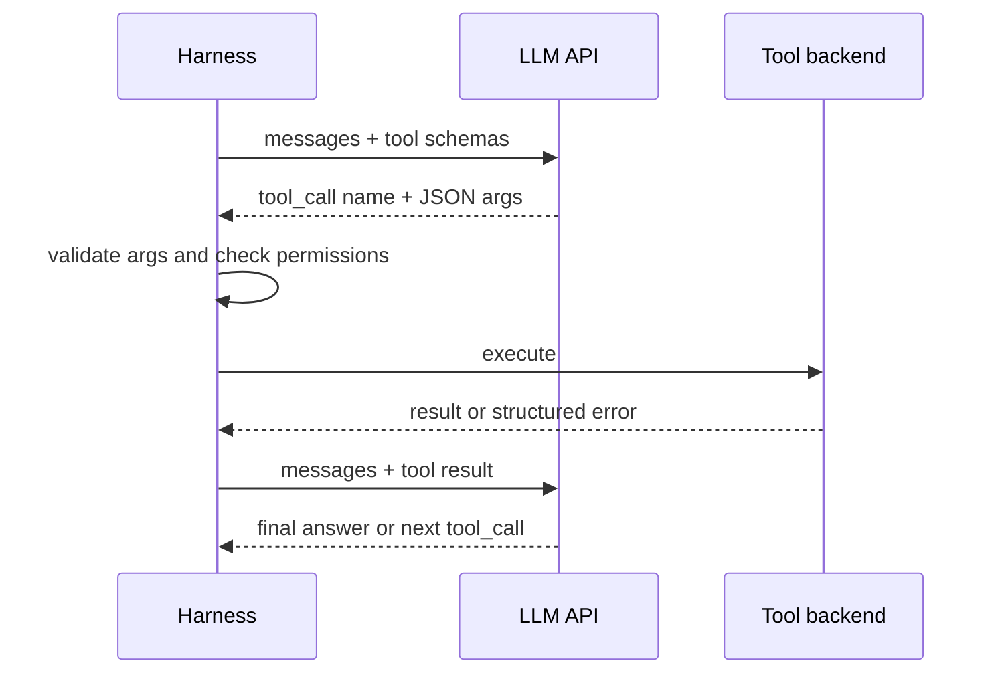

# Tool Calling and Tool Design

> **Reviewed:** 2026-09 · **Level:** Senior / Tech Lead · **Type:** Foundational

Tool calling is supported by all major model APIs. The mechanics are stable; the craft of designing tools that models use well (sometimes called the agent-computer interface, or ACI) is still emerging and model-dependent.



## Q1. Function calling means the model emits structured intent; your code executes it

**Short answer:** You send the model a list of tools, each with a name, description, and JSON Schema for parameters. The model may respond with one or more tool calls containing a tool name and JSON arguments. It never executes anything itself: your harness validates the arguments, runs the function, and returns the result in a follow-up message. The model then continues, possibly calling more tools.

**How it works:**

- **Schema:** JSON Schema describes parameters, types, enums, required fields.
- **Tool choice:** APIs usually let you allow any tool, force a specific tool, or disable tools.
- **Parallel calls:** some APIs let the model request several independent calls in one turn.
- **Structured outputs / strict mode:** some providers can constrain arguments to match the schema exactly; still validate on your side.

**Example:**

```typescript
// Tool definition sent to the model (provider-neutral shape).
const getDeploys = {
  name: "list_deploys",
  description:
    "List deployments for one service in a time window. Use to correlate incidents with changes. Returns at most 50 items, newest first.",
  parameters: {
    type: "object",
    properties: {
      service: { type: "string", description: "Service name as in the service catalog, e.g. 'checkout'" },
      since: { type: "string", format: "date-time" },
      until: { type: "string", format: "date-time" },
    },
    required: ["service", "since"],
    additionalProperties: false,
  },
};

// Harness side: never trust the arguments blindly.
function handleListDeploys(raw: unknown) {
  const args = ListDeploysSchema.parse(raw); // e.g. zod validation
  assertServiceVisibleToCaller(args.service); // authorization in code
  return deployApi.list(args);
}
```

**Trade-offs and pitfalls:**

- Models can emit syntactically valid but semantically wrong arguments (wrong service, wrong time zone).
- Too many tools in one request dilute selection accuracy and consume context.
- Tool results are untrusted input to the next model call (see prompt injection in production pages).

**Remember:** The model proposes; the harness validates, authorizes, and executes.

## Q2. Good tools are designed for the model as the user

**Short answer:** Design tools the way you would design an API for a capable but literal new engineer who cannot ask questions. Use clear verb-noun names, descriptions that say when to use and when not to use the tool, narrow parameters with enums and examples, and outputs that are concise and relevant. Anthropic's agent guidance calls this investing in the agent-computer interface as much as you would in a human-computer interface.

**How it works:**

- **Names:** `search_logs`, not `tool2` or `doStuff`. Avoid near-duplicate names.
- **Descriptions:** purpose, when to prefer this over similar tools, limits (max rows), units, formats.
- **Parameters:** enums instead of free text where possible; absolute paths or IDs instead of ambiguous references.
- **Output:** return the fields the model needs, with stable keys; paginate large results; include identifiers for follow-up calls.
- **Granularity:** match how the task is actually done. One `get_customer_context` tool may beat five low-level lookups the model must stitch together.

**Example:** Replace `run_sql(query: string)` with `get_order_status(order_id)` and `list_recent_orders(customer_id, limit<=20)`. The narrow tools are easier to choose, validate, authorize, and audit.

**Trade-offs and pitfalls:**

- Narrow tools reduce flexibility; a general tool may be justified in a sandbox with read-only credentials.
- Descriptions are prompts; changing them changes behavior. Version and evaluate them.
- Verbose outputs (full HTML, entire log files) waste context and bury the signal.

**Remember:** Tool names, descriptions, and output shape are prompt engineering. Test them like code.

## Q3. Make side-effecting tools idempotent and safe to retry

**Short answer:** Agents retry — because of timeouts, model confusion, or harness restarts. A side-effecting tool must therefore be idempotent or accept an idempotency key, so a repeated call does not create duplicate tickets, double charges, or double deploys. This is an established distributed-systems principle that becomes more important with a non-deterministic caller.

**How it works:**

- Harness generates an idempotency key per logical action (for example run ID plus step ID) and passes it to the backend.
- Backend stores key-to-result mapping and returns the original result on replay.
- Prefer "set state to X" semantics (`set_replicas(5)`) over relative ones (`add_replicas(1)`).

**Example:**

```python
# Idempotent ticket creation keyed by run and step.
def create_ticket(title: str, body: str, *, run_id: str, step_id: str) -> dict:
    key = f"{run_id}:{step_id}"
    existing = ticket_store.get_by_idempotency_key(key)
    if existing:
        return {"ticket_id": existing.id, "status": "already_created"}
    ticket = ticket_store.create(title=title, body=body, idempotency_key=key)
    return {"ticket_id": ticket.id, "status": "created"}
```

**Trade-offs and pitfalls:**

- If the model generates the idempotency key, it may reuse or vary it incorrectly; generate it in the harness.
- Idempotency does not prevent a *wrong* action; it only prevents *duplicate* ones.

**Remember:** Assume every tool call can happen twice. Absolute state changes plus idempotency keys make that safe.

## Q4. Errors should teach the model how to recover

**Short answer:** When a tool fails, return a structured, concise error that says what went wrong and what to do next — not a raw stack trace or a silent empty result. Models recover well from clear errors ("service 'chekout' not found; did you mean 'checkout'?") and poorly from ambiguous ones. Distinguish retryable errors from permanent ones so the harness and model can respond correctly.

**How it works:**

- Include an error code, a human-readable message, whether it is retryable, and a hint.
- Handle transient failures (timeouts, 429s) in the harness with backoff before involving the model.
- Never return an empty list when the real cause was a permission denial; that becomes a silent failure.

**Example:**

```json
{
  "error": "INVALID_ARGUMENT",
  "message": "Time window exceeds 24h limit for query_traces.",
  "retryable": false,
  "hint": "Split the window into ranges of 24h or less."
}
```

**Trade-offs and pitfalls:**

- Leaking internal details (hostnames, SQL) in errors can be a security issue; sanitize.
- Overly chatty errors consume context on every retry.

**Remember:** An error message is an instruction to the model. Make it actionable and honest.

## Q5. Least privilege applies to every tool and credential

**Short answer:** Give the agent only the tools and scopes needed for the current task, with credentials bound to the end user or a narrowly scoped service identity. Separate read and write tools, scope by environment and resource, and enforce authorization in the tool backend — never rely on the prompt to prevent misuse. This is established security practice and is the single most effective mitigation for prompt injection and model error.

**How it works:**

- **Per-task tool sets:** a triage agent gets read-only observability tools; a remediation step gets one write tool behind approval.
- **Delegated identity:** act on behalf of the user with their permissions (OAuth-style delegation) rather than a god-mode service account.
- **Resource scoping:** limit to specific repos, namespaces, tables, or buckets.
- **Short-lived credentials:** tokens that expire with the run.
- **Risk tiers:** classify each tool as read, reversible write, or irreversible/external, and apply policy per tier.

**Example:** A PR-writing agent gets a token that can push only to branches matching `agent/*` in one repository and cannot approve or merge. Branch protection enforces human review regardless of what the agent attempts.

**Trade-offs and pitfalls:**

- Broad scopes are tempting during prototyping and tend to leak into production.
- Confused-deputy risk: an agent with more privilege than its user can be tricked into acting for that user beyond their rights.

<details>
<summary>Follow-up questions</summary>

- **How do you handle an agent that needs both reading untrusted content and writing?** Split into phases or separate agents; the component that reads untrusted input should not hold write privileges without a human or deterministic check in between.
- **Where do you enforce policy?** In the tool backend or a policy layer in the harness, with deny-by-default and an audit log of every decision.

</details>

**Remember:** Scope tools per task, credentials per user, and enforce in code. The prompt is not a security boundary.

## References

Reviewed 2026-09.

- [OpenAI — Function calling guide](https://platform.openai.com/docs/guides/function-calling)
- [Anthropic — Building effective agents](https://www.anthropic.com/engineering/building-effective-agents)
- [OWASP Top 10 for LLM Applications](https://owasp.org/www-project-top-10-for-large-language-model-applications/)
