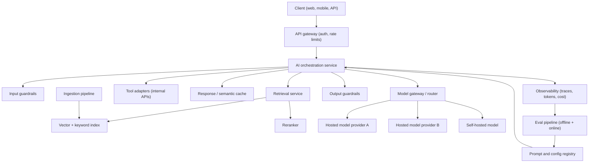
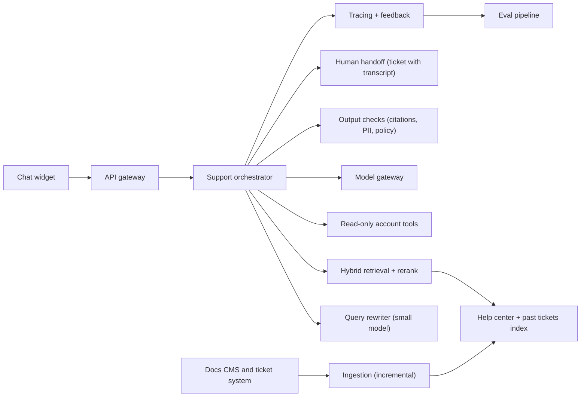

# AI Application Architecture

> **Reviewed:** 2026-09 · **Level:** Senior / Tech Lead · **Type:** Foundational (specific tools are Emerging)

An AI feature is a distributed system with an unusually non-deterministic, expensive and slow dependency in the middle. The architecture's job is to isolate that dependency, observe it, control its cost, and degrade gracefully when it fails.

## Reference architecture

| Component | Responsibility |
| --- | --- |
| API gateway | Authentication, tenant identification, rate limiting, request size limits |
| Orchestration service | Owns the flow: guardrails, rewrite, retrieve, tools, prompt assembly, post-processing |
| Model gateway / router | Single client for all providers; routing, retries, fallbacks, timeouts, quotas, cost tagging, prompt caching usage |
| Cache | Exact response cache, optional semantic cache; provider-side prompt caching of stable prefixes |
| Vector store + retrieval | Hybrid search with ACL filters, reranking |
| Tool adapters | Wrap internal APIs with user-scoped authorization and validation |
| Observability | Traces per request: prompt version, model, tokens, latency, retrieved IDs, tool calls, cost |
| Eval pipeline | Golden sets, CI gates, online metrics, human review queues |
| Prompt/config registry | Versioned prompts, model settings, feature flags for rollout |

## Q1. Put a model gateway between your services and model providers

**Short answer:** A model gateway is a single internal service or library through which every model call goes. It centralizes credentials, routing, retries with backoff, timeouts, fallbacks, rate limits, quotas, cost attribution, logging and redaction. It turns "switch provider" or "add a cheaper model for this task" into configuration instead of a rewrite.

**How it works:** Callers specify a logical capability ("fast-classifier", "reasoning-large") and the gateway maps it to a concrete model and provider, with fallback chains and per-team budgets.

**Example:** When a provider had an outage, the gateway failed over "support-answer" traffic to a second provider's comparable model; responses were flagged in traces so quality could be reviewed afterwards.

**Trade-offs and pitfalls:**

- Fallback models behave differently — include them in your eval runs.
- The gateway is a critical path; make it highly available and low overhead.

**Remember:** One door to all models: routing, fallbacks, budgets, telemetry.

## Q2. The orchestration service owns the flow and keeps it testable

**Short answer:** Keep AI logic — prompt assembly, retrieval, tool calls, guardrails, post-processing — in a dedicated service or module with clear interfaces, not scattered across controllers. That makes it testable with evals, observable with traces, and replaceable as patterns evolve.

**How it works:** Each step is a function with typed inputs and outputs; the orchestrator composes them and records a trace span for each. Prompts are loaded from a versioned registry.

**Example:** A team moved prompts out of string literals in five services into one orchestration service with a prompt registry, which allowed a single CI eval job and consistent tracing.

**Trade-offs and pitfalls:** Frameworks can speed up prototypes but may hide prompts and retries; ensure you can see and control exactly what is sent.

**Remember:** Centralize the AI flow; make every step visible and testable.

## Q3. Caching works at several layers

**Short answer:** Use exact-match response caching for repeated identical requests, provider prompt caching for long stable prefixes (system prompt, tool definitions, shared documents), embedding caching for repeated texts, and cautiously, semantic caching (reuse answers for similar queries). Caches must respect tenant and permission boundaries.

**How it works:** Prompt caching generally rewards putting stable content first and variable content last so the prefix matches across calls; check provider docs for specifics. Response cache keys must include everything that changes the answer: prompt version, model, user permissions, retrieved document versions.

**Example:** An FAQ assistant cached answers keyed by normalized question + tenant + docs version; cache invalidated automatically when docs were re-indexed.

**Trade-offs and pitfalls:**

- Semantic caching can return a wrong answer for a subtly different question — use high similarity thresholds and avoid it for personalized or high-risk answers.
- Caching across tenants is a data-leak risk.

**Remember:** Cache at every layer, key on everything that changes the answer, never across permission boundaries.

## Q4. Design fallbacks for when the model is slow, wrong or unavailable

**Short answer:** Models time out, rate-limit, refuse, return invalid output, and have outages. Define a degradation ladder: retry with backoff, fall back to another model, return a cached or simpler result, or fall back to the non-AI experience (search results, human handoff). The product must work, perhaps less well, without the model.

**How it works:** Set strict timeouts per step, circuit breakers per provider, validation with a bounded repair attempt for structured output, and clear user messaging.

**Example:** If answer generation fails, the support widget shows the top three retrieved help articles and a "talk to an agent" button instead of an error.

**Trade-offs and pitfalls:** Retries multiply cost and latency; cap them and make them idempotent for tool calls with side effects.

**Remember:** Every AI feature needs a non-AI fallback path.

## Q5. Observability for AI needs traces, not just logs

**Short answer:** Trace each request end to end with spans for guardrails, retrieval, rerank, each model call and each tool call. Record prompt version, model, parameters, token counts, latency, cost, retrieved document IDs, tool arguments/results (redacted), and user feedback. This is what lets you debug a single bad answer and compute cost per feature.

**How it works:** Use your standard tracing stack (for example OpenTelemetry-compatible tooling) or an LLM observability tool; link traces to eval results and feedback.

**Example:** "Why did the bot promise a refund?" is answered in minutes by opening the trace: retrieved chunk was an outdated policy page, prompt v14, model X.

**Trade-offs and pitfalls:** Traces contain user data — redact, restrict access and set retention.

**Remember:** If you can't replay why an answer happened, you can't fix it.

## Q6. Streaming, async and batch change the architecture

**Short answer:** Interactive features stream tokens to cut perceived latency; long tasks (document processing, report generation) run as async jobs with status updates; bulk workloads (classifying a backlog) use batch APIs or queues for lower cost and rate-limit safety. Choose per use case.

**How it works:** Streaming needs server-sent events or websockets and server-side buffering for any output you must validate. Async jobs need a queue, idempotent workers, and progress reporting.

**Example:** Ticket summarization for the agent sidebar streams; nightly tagging of all tickets runs in a queue with a concurrency limit matching the provider's rate limits.

**Trade-offs and pitfalls:** Streaming makes output guardrails harder — you may need to validate chunks or hold back until a sentence completes.

**Remember:** Stream for humans, queue for long jobs, batch for bulk.

## Q7. Multi-tenancy and data isolation are first-class concerns

**Short answer:** In a SaaS product, every layer — retrieval filters, caches, conversation memory, fine-tuning data, logs — must be tenant-scoped. Tenant identity comes from authentication at the gateway and is injected server-side; the model never decides which tenant's data it sees.

**How it works:** Tenant ID in every index record and cache key; per-tenant quotas and cost attribution; option for per-tenant indexes or dedicated deployments for strict customers.

**Example:** An enterprise customer requires their data not be used for any shared model improvement; the system routes them to a model configuration with contractual no-training terms and excludes their data from shared eval sets.

**Trade-offs and pitfalls:** Shared indexes with filters are cheaper; separate indexes are safer. Decide by data sensitivity and contract.

**Remember:** Tenant scope is enforced by code at every layer.

## Q8. System design: Design an AI support assistant for a SaaS product

**Short answer:** Clarify requirements, then propose: a chat widget backed by an orchestration service that authenticates the user, rewrites the query, performs hybrid retrieval over help docs and the customer's own tickets (tenant- and ACL-filtered), calls read-only tools for account data, generates a grounded answer with citations through a model gateway, validates output, and hands off to a human when confidence is low or the user asks. Wrap it with evals, tracing, cost controls, and a phased rollout.

**How it works:**

1. **Clarify** — Who are the users (end customers or support agents)? Channels? Languages? Which actions are allowed (read-only vs refunds)? Latency target? Data sensitivity and compliance? Success metric (resolution without escalation, customer satisfaction)?
2. **Architecture:**

3. **Key decisions:**
   - Hybrid retrieval with ACL/tenant filters; freshness via CMS webhooks.
   - Small model for rewriting and intent classification; stronger model for answer generation; routing based on intent.
   - Structured output: `answer`, `citations`, `confidence`, `needs_human`.
   - Tools read-only initially (order status, plan, invoices); any write action (refund, plan change) creates a draft for a human agent.
   - Fallback: show retrieved articles and offer a human when the model fails or confidence is low.
4. **Safety:** prompt injection via tickets and docs treated as untrusted; PII redaction in logs; no secrets in prompts; rate limits per user and tenant.
5. **Evaluation:** golden set from historical tickets with approved answers; CI gates on prompt changes; online metrics — escalation rate, resolution, thumbs feedback, repeat-contact rate; weekly human review of samples.
6. **Rollout:** internal agents first (AI drafts replies, humans send), then a small percentage of customers behind a flag, expand based on metrics.
7. **Cost/latency:** stream answers; prompt caching for the stable system prompt and tool definitions; cap retrieved chunks; per-tenant budgets.

**Trade-offs and pitfalls:**

- Deflection rate alone is a dangerous metric — the bot can "deflect" by frustrating users. Pair it with satisfaction and repeat-contact metrics.
- Start with agent-assist (human in the loop) to build a golden dataset and trust before customer-facing automation.

Follow-up questions

- *How do you handle a question in a language your docs are not written in?* Multilingual embeddings or translate query, answer in the user's language, and evaluate per language.
- *What if the assistant gives wrong billing info?* Billing answers must come from tools (source of truth), not docs; high-risk topics route to humans.
- *How do you scale to many tenants?* Shared infrastructure with tenant-scoped indexes/filters, per-tenant quotas and cost attribution.

**Remember:** Clarify, ground, restrict actions, evaluate, roll out gradually, always have a human path.

## References

Reviewed 2026-09.

- OpenAI platform documentation (production best practices, streaming, batch): https://platform.openai.com/docs
- Anthropic documentation (prompt caching, tool use): https://docs.anthropic.com/
- OWASP Top 10 for LLM Applications: https://owasp.org/www-project-top-10-for-large-language-model-applications/
- Related: [RAG and Retrieval](./rag-and-retrieval/01-rag-pipeline-and-chunking.md) · [Evaluation and Safety](./evaluation-and-safety/01-evaluation-and-monitoring.md) · [Case studies](../case-studies/index.md) · [Agentic Workflows](../agentic-workflows/index.md)
