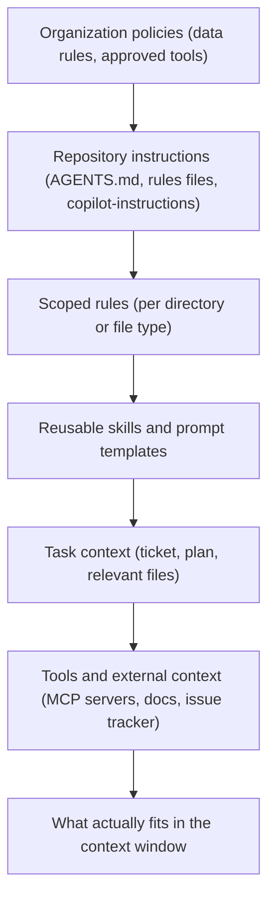

# Context Engineering

> **Reviewed:** 2026-09 · **Level:** Senior / Tech Lead · **Type:** Emerging (the principle that context drives quality is Foundational; file formats and conventions are still evolving)

"Context engineering" means deliberately deciding what information an AI tool sees: instructions, conventions, relevant files, documentation, tool access. For coding tools, context quality matters more than prompt wording. It is also something a Tech Lead can standardize for the whole team.

## Layers of context



## Q1. Repository-level instruction files give every AI session shared team context

**Short answer:** Most AI coding tools can read a repository instructions file automatically — for example an `AGENTS.md` file, tool-specific rules directories, a `CLAUDE.md` file, or `.github/copilot-instructions.md`. These files describe how the project is built and tested, conventions, architecture boundaries and things to avoid. They are version-controlled and reviewed like code, so every developer's AI sessions follow the same standards.

**How it works:** File names and loading behaviour differ by tool and change over time — check each tool's docs. Some teams keep one canonical file and reference or symlink it for tools that need a different name.

**Example:**

```markdown
# AGENTS.md

## Project
Payments API (TypeScript, Node 20, PostgreSQL). Monorepo managed with pnpm workspaces.

## Commands
- Install: `pnpm install`
- Test: `pnpm test --filter <package>`
- Typecheck: `pnpm typecheck`
- Lint: `pnpm lint`

## Conventions
- Use the `Result<T, E>` type from `packages/core/result.ts` for expected errors; do not throw for validation failures.
- All database access goes through repositories in `src/db/repositories/`; no raw SQL in handlers.
- Money is stored as integer minor units (cents). Never use floating point for amounts.

## Boundaries
- Do not modify files in `migrations/` that are already merged; create a new migration.
- Do not add dependencies without noting it in the PR description.
- Never read or print values from `.env*` files.

## Definition of done
Typecheck, lint and tests pass; new behaviour has tests; public API changes documented in `docs/api.md`.
```

**Trade-offs and pitfalls:**

- Long, vague instruction files waste tokens and get ignored; keep them specific and short.
- Stale instructions are worse than none — assign an owner and review them with architecture changes.
- Instruction files are guidance, not enforcement; linters and CI enforce.

**Remember:** One reviewed, specific, current instructions file per repo; enforce the important parts in CI.

## Q2. Scoped rules and reusable skills keep context relevant

**Short answer:** Instead of one giant instructions file, use scoped rules that apply only to certain directories or file types (for example "frontend components" or "database migrations"), and reusable skills or prompt templates for recurring tasks (for example "write a migration", "add an API endpoint", "prepare a release"). The tool loads them only when relevant, keeping context small.

**How it works:** Tools implement this differently — rules with file-glob scopes, nested instruction files per directory, or named skills/commands the user or agent can invoke. The principle is the same: right guidance at the right time.

**Example:**

```markdown
# rules/migrations.md  (applies to: migrations/**)
- Migrations must be backward compatible with the currently deployed code.
- Add columns as nullable first; backfill in a separate job; add constraints in a later migration.
- Every migration needs a tested down/rollback path or an explicit note why not.
```

**Trade-offs and pitfalls:** Too many overlapping rules conflict; periodically consolidate.

**Remember:** Scope rules to where they apply; package repeated workflows as skills.

## Q3. Managing the context window means keeping it small and relevant

**Short answer:** More context is not better. Irrelevant files dilute attention, increase cost and latency, and can push important instructions out of focus. Give the tool the specific files, interfaces and examples it needs; start fresh sessions for new tasks; summarize long sessions into a short plan or notes file; and point to canonical examples instead of pasting many similar files.

**How it works:** Practical techniques:

- **Start new sessions per task** so earlier, unrelated context does not leak in.
- **Reference, don't paste** — mention file paths and let the tool retrieve them.
- **Provide one good example** of the pattern to follow.
- **Write a plan file** for multi-step work, and have the tool update it; resume from the plan, not from a long chat history.
- **Include interfaces and types** rather than entire implementations when only the contract matters.

**Example:** An agent session for a large refactor became confused after many turns. The developer asked it to write the remaining steps to `PLAN.md`, started a fresh session with only the plan and the relevant module, and progress resumed.

**Trade-offs and pitfalls:** Too little context causes the model to invent APIs; the skill is choosing the *right* context, not the least.

**Remember:** Small, relevant, fresh. Reference files; keep a plan file for long tasks.

## Q4. Retrieval of relevant files is how tools scale to large codebases

**Short answer:** Tools cannot read an entire large repository into context, so they retrieve: semantic search over an index of the codebase, text search (grep-like), file-tree navigation, symbol and reference lookup through language tooling, and following imports. You improve results by naming things clearly, keeping a helpful README and architecture overview, and pointing the tool at the right entry points.

**How it works:** This is RAG applied to code (see [RAG and Retrieval](../rag-and-retrieval/01-rag-pipeline-and-chunking.md)), usually combined with exact search because identifiers need exact matches.

**Example:** In a monorepo, asking "where is rate limiting implemented?" returned the wrong service until the team added an architecture overview listing each service's responsibility; retrieval and answers improved.

**Trade-offs and pitfalls:**

- Indexing code may send it to a vendor's servers; check data terms and exclusions.
- Use ignore files to exclude secrets, generated code, vendored dependencies and large data files from indexing.

**Remember:** Help retrieval with clear structure, overviews and exclusions.

## Q5. Prompt caching makes stable context cheaper and faster

**Short answer:** Prompt caching lets a provider reuse the processed form of a repeated prompt prefix — system instructions, repository rules, tool definitions — across calls, reducing cost and time-to-first-token for that portion. It rewards keeping stable content at the start and variable content at the end. Many coding tools use it automatically; if you build your own tooling, structure prompts for it.

**How it works:** Cached prefixes typically must match exactly and expire after a period of inactivity; pricing and rules differ by provider (see provider docs).

**Example:** An internal code-review bot put its long review guidelines and tool definitions first and the PR diff last, so the guidelines were cached across all PRs.

**Trade-offs and pitfalls:** Frequently editing the instruction prefix (such as inserting a timestamp at the top) defeats caching.

**Remember:** Stable first, variable last.

## Q6. MCP is a standard way to give AI tools access to external tools and context

> **Type:** Emerging

**Short answer:** The Model Context Protocol (MCP) is an open protocol for connecting AI applications to external systems through "servers" that expose tools, resources and prompts — for example an issue tracker, documentation, database schema, observability data or a browser. Instead of each AI tool building custom integrations, an MCP server can be reused by any MCP-compatible client.

**How it works:** An MCP client (the AI tool) connects to MCP servers (local processes or remote services). The model can then call the server's tools or read its resources, subject to the client's permission model.

**Example:** A team connects their IDE agent to an MCP server for their issue tracker (read tickets) and one for their internal docs. The agent can pull the ticket's acceptance criteria and the relevant runbook into context without copy-pasting.

**Trade-offs and pitfalls:**

- Every MCP server is added attack surface: it can expose data and actions, and tool results can contain prompt injection. Vet servers, prefer read-only scopes, and use approved servers only.
- Too many tools enabled at once consumes context and confuses tool selection.
- For MCP architecture and agent patterns in depth, see [Agentic Workflows](../../agentic-workflows/index.md).

**Remember:** MCP standardizes tool and context access — treat each server as a privileged integration.

## Practical checklist

- [ ] Repository instructions file exists, is specific, owned and reviewed
- [ ] Scoped rules for areas with special conventions (migrations, security-sensitive code, UI components)
- [ ] Reusable skills/prompt templates for recurring team workflows
- [ ] Ignore/exclusion files keep secrets, generated code and large data out of indexing
- [ ] Architecture overview available for retrieval
- [ ] MCP servers limited to an approved, least-privilege set
- [ ] Engineers trained to start fresh sessions and use plan files for long tasks

## References

Reviewed 2026-09.

- Model Context Protocol: https://modelcontextprotocol.io/
- Cursor documentation (rules, context): https://docs.cursor.com/
- GitHub Copilot documentation (repository custom instructions): https://docs.github.com/en/copilot
- Anthropic documentation (Claude Code memory files, prompt caching): https://docs.anthropic.com/
- OpenAI platform documentation (prompt caching): https://platform.openai.com/docs
