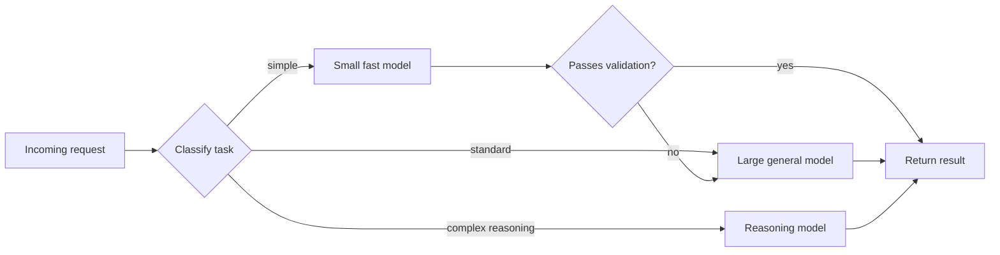

# Model Routing and Cost for Engineering Work

> **Reviewed:** 2026-09 · **Level:** Senior / Tech Lead · **Type:** Emerging (model tiers and prices change frequently; the trade-off reasoning is Foundational)

Not every task needs the most capable model. Matching model to task improves latency and cost, and often quality — a fast model keeps you in flow for small edits, while a reasoning model is worth waiting for on a hard bug. For the underlying mechanics, see [Models, Cost and Structured Outputs](../llm-fundamentals/03-models-cost-structured-outputs.md).

## Task-to-model guide

| Task | Suggested tier | Why |
| --- | --- | --- |
| Autocomplete, inline edits | Small, fast model | Latency is everything; tasks are local |
| Classification, labelling, commit message drafts | Small or mid-size | Simple, high volume |
| Explaining code, writing docs | Mid-size or large | Needs broad understanding, not deep reasoning |
| Implementing a well-specified change | Large general or coding-tuned model | Multi-file coherence |
| Architecture options, design critique | Reasoning model | Trade-off analysis across many constraints |
| Hard debugging, concurrency issues, root cause analysis | Reasoning model | Multi-step hypothesis testing |
| Large mechanical changes (rename across repo) | Fast model or deterministic tools (codemods) | Scale and consistency; a codemod may beat any model |

These are starting points. Validate on your own tasks.

## Q1. How would you choose which model to use for which engineering task?

**Short answer:** By the task's difficulty, latency sensitivity and volume. Fast, cheap models for autocomplete, classification and small edits where responsiveness matters; strong general models for multi-file implementation; reasoning models for design, complex debugging and analysis where correctness matters more than speed. I start with the cheapest model that plausibly works and move up when output quality is not good enough, rather than defaulting to the most expensive model for everything.

**How it works:** The cost of a wrong answer matters too: a cheap model that produces a subtly wrong design costs far more in engineer time than the price difference.

**Example:** A developer uses a fast model to generate test scaffolding, switches to a reasoning model to investigate a race condition that only appears under load, and back to a fast model to write the PR description.

**Trade-offs and pitfalls:**

- Engineer time usually dominates model cost — do not over-optimize tokens on interactive work.
- For automated, high-volume pipelines (CI bots, bulk classification), model cost does dominate and routing matters.

**Remember:** Match model to difficulty and latency needs; factor in the cost of being wrong.

## Q2. What is model routing and when is it worth building?

**Short answer:** Routing automatically sends each request to an appropriate model based on rules (task type, input size, user tier) or a lightweight classifier, often with fallbacks. It is worth building for automated or product workloads with volume — for example a PR review bot or internal assistant — where most requests are easy and a minority need a stronger model. For individual developers, the tool's model picker or automatic mode is usually enough.

**How it works:**

**Example:** An internal review bot sends small, low-risk diffs (docs, config) to a fast model and diffs touching auth or payments code to a stronger model, with results evaluated on a labelled set of past PRs.

**Trade-offs and pitfalls:**

- A misrouted hard request produces a confident weak answer; escalate when validation fails.
- Routing logic needs its own evaluation.

**Remember:** Route by difficulty for volume workloads; escalate on validation failure.

## Q3. How do you control token budgets for AI tools and pipelines?

**Short answer:** Set limits at several levels: max output tokens per call, max iterations or tool calls per agent task, per-user or per-team usage budgets, and per-pipeline daily budgets with alerts. Reduce waste by keeping context focused, caching stable prefixes, and avoiding re-sending large files unnecessarily.

**How it works:** Seat-based tools often include usage limits or tiers; usage-based APIs need your own caps and monitoring, ideally through a model gateway (see [AI App Architecture](../ai-app-architecture.md)).

**Example:** A CI job that asked an agent to "fix all failing tests" occasionally looped. Adding a maximum of N iterations, a per-run token cap, and an alert when a run exceeded its typical cost stopped surprise bills.

**Trade-offs and pitfalls:** Hard caps can cut off legitimate large tasks; allow explicit overrides with justification.

**Remember:** Cap per call, per task, per team; alert on anomalies.

## Q4. How do caching and latency trade-offs affect developer experience?

**Short answer:** Latency determines which workflows feel usable. Autocomplete must feel near-instant; interactive chat should start streaming quickly; long agent tasks can run in the background. Prompt caching reduces time-to-first-token for repeated context, and response caching helps automated pipelines that see repeated inputs. Choose synchronous or background execution based on expected duration.

**How it works:** Rough classes: inline completion (must be fast), interactive edits (seconds acceptable), agentic tasks (minutes; run in background with notifications), batch jobs (hours; run offline).

**Example:** A team moved long-running "update all services to the new logging library" tasks to background agents that open PRs, so developers were not blocked waiting in their editor.

**Trade-offs and pitfalls:** Background agents produce PRs that still need review — the review queue becomes the bottleneck.

**Remember:** Fit execution mode to latency; cache stable context.

## Practical checklist

- [ ] Team guidance on which model tier to use for which task
- [ ] Automated pipelines route by difficulty with escalation on validation failure
- [ ] Output, iteration and budget caps configured for agents and bots
- [ ] Usage and cost visible per team or pipeline, with alerts
- [ ] Prompts structured for caching in in-house tooling
- [ ] Long tasks run in background with review capacity planned

## References

Reviewed 2026-09.

- OpenAI platform documentation (models, prompt caching, batch): https://platform.openai.com/docs
- Anthropic documentation (model selection, prompt caching, extended thinking): https://docs.anthropic.com/
- Cursor documentation (models): https://docs.cursor.com/
- GitHub Copilot documentation (model choice): https://docs.github.com/en/copilot
