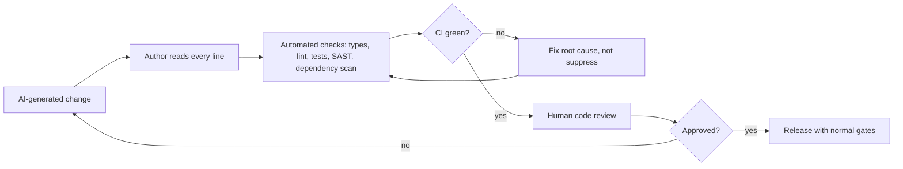

# Validation and Human Oversight

> **Reviewed:** 2026-09 · **Level:** Senior / Tech Lead · **Type:** Foundational

AI-generated code is code. It is validated by the same mechanisms — tests, types, linters, static analysis, review — and owned by the engineer who merges it. This page covers how to validate efficiently, where humans must approve, and how to avoid the quieter risks: over-reliance and skill atrophy.

## Validation layers

## Q1. How do you validate AI-generated code?

**Short answer:** The same way as any code, but with more skepticism in specific places. The author reads and understands every line; automated checks (type checking, linting, unit and integration tests, static security analysis, dependency and license scanning) run in CI; and a human reviewer approves. I pay extra attention to things AI commonly gets wrong: invented APIs, subtle edge cases, error handling, security checks, unnecessary changes, and tests that assert the wrong thing.

**How it works:** Deterministic tools catch whole classes of errors cheaply — invented functions fail type checks, broken logic fails tests. Human review focuses on intent, design and what tools cannot see.

**Example:** An AI-generated endpoint compiled and passed its generated tests but skipped the tenant authorization check present in neighbouring handlers. A reviewer using the checklist below caught it; the team then added a lint rule requiring the authorization middleware on all routes.

**Trade-offs and pitfalls:**

- "It passed CI" is necessary, not sufficient — CI only checks what you tested.
- Watch for suppressions: AI may "fix" a lint or type error by adding an ignore comment or `any`.

**Remember:** Read every line, let tools catch the mechanical errors, focus human review on intent and risk.

## Q2. Where should approval checkpoints sit in an AI-assisted workflow?

**Short answer:** At points where a mistake becomes expensive or irreversible: approving the plan before implementation, approving commands with side effects in agent sessions, code review before merge, approval before production deployment, and approval of any change to infrastructure, security configuration, data schemas or access controls.

**How it works:**

| Checkpoint | Who approves | Why |
| --- | --- | --- |
| Plan / design | Engineer; tech lead for significant designs | Wrong direction wastes the most time |
| Agent commands with side effects | Engineer running the session | Prevent destructive or network actions |
| Merge | Human reviewer(s) per normal policy | Quality and shared ownership |
| Production deployment | Release owner per normal policy | Reliability |
| Infra, security, data schema, access changes | Designated owners (platform, security, data) | High blast radius |

**Example:** Agents may propose Terraform changes and run `plan`, but `apply` runs only through the standard pipeline after platform-team approval.

**Trade-offs and pitfalls:** Too many checkpoints on low-risk work causes rubber-stamping; tier by risk.

**Remember:** Put humans where mistakes get expensive or irreversible.

## Q3. Which decisions must remain with engineers and leadership?

**Short answer:** Architecture and technology choices, security and threat-model decisions, data handling and privacy decisions, production changes and incident response decisions, and people decisions — hiring, performance evaluation, promotion. AI can research, draft and critique; accountable humans decide, because these decisions require organizational context, carry legal and ethical responsibility, and must be explainable.

**How it works:** Be explicit in team guidelines: "AI may draft; a named owner decides and records the decision." For people decisions, many organizations restrict or prohibit AI use because of bias, privacy and legal risk — follow HR and legal policy.

**Example:** A tech lead uses AI to summarize trade-offs of two message brokers, then runs an architecture review with the team, writes an ADR, and records the decision under their name.

**Trade-offs and pitfalls:** Using AI to write performance reviews or screen candidates without policy approval can create bias and legal exposure.

**Remember:** Decisions with accountability, ethics or legal weight stay with named humans.

## Q4. What are the risks of over-reliance on AI tools?

**Short answer:** Engineers accepting code they do not understand, reviews becoming superficial because "the AI wrote it", reduced design thinking, homogenized solutions that ignore local context, and teams losing the ability to work when tools are unavailable or wrong. The mitigation is cultural and procedural: explain-your-code in review, deliberate practice without AI, and treating AI output as a draft from an unknown contributor.

**How it works:** Automation bias — trusting automated output over one's own judgment — is a well-known human-factors risk. Fluent, confident output amplifies it.

**Example:** During an outage of an AI tool, a team realized several engineers could not explain a recently added caching layer. The tech lead introduced short "walkthrough" sessions for AI-assisted changes to significant components.

**Trade-offs and pitfalls:** Over-correcting with bans loses real benefits; aim for informed use.

**Remember:** If you can't explain it, you can't own it.

## Q5. How do you prevent skill atrophy, especially for junior engineers?

**Short answer:** Make understanding a requirement, not an option. Juniors explain AI-assisted changes in review; use AI in tutor mode (hints and explanations) for learning tasks; reserve some work — debugging exercises, design katas, on-call shadowing — for doing without AI; pair regularly; and include fundamentals in growth plans. Seniors model good habits by showing how they verify AI output.

**How it works:** Growth comes from struggle with feedback. AI can provide the feedback without removing the struggle if used intentionally.

**Example:** A team's growth framework for juniors includes "can debug an issue in an unfamiliar service without AI assistance" and "can critique an AI-generated design", assessed through pairing sessions.

**Trade-offs and pitfalls:** Measuring juniors on output speed alone rewards over-reliance.

**Remember:** Use AI as a tutor for learning tasks; keep deliberate practice.

## Review checklist for AI-generated code

Use this in addition to your normal review guidelines (see [manual and automated review guides](../../leadership/code-reviews/automated-review-process.md)).

**Correctness**

- [ ] The change does what the ticket asks — no more, no less
- [ ] All called APIs, functions and library methods actually exist in the versions we use
- [ ] Edge cases handled: empty, null, boundaries, large inputs, concurrency, retries
- [ ] Error handling is real (not swallowed, not generic catch-all)

**Tests**

- [ ] Tests assert meaningful behaviour, not current implementation details
- [ ] Tests fail when the behaviour is broken (checked by reasoning or mutation)
- [ ] No excessive mocking that hides integration issues

**Security and data**

- [ ] Authentication and authorization checks match neighbouring code
- [ ] Input validation and output encoding present
- [ ] No secrets, credentials, or sensitive data in code, logs or tests
- [ ] No new dependencies without review of maintenance, license and security

**Maintainability**

- [ ] Follows project conventions and existing patterns
- [ ] No unnecessary changes (reformatting, renames, unrelated edits)
- [ ] No duplicated logic that already exists elsewhere in the codebase
- [ ] No lint/type suppressions added to make checks pass

**Ownership**

- [ ] Author can explain every line and design choice
- [ ] PR description states what was verified and how

## References

Reviewed 2026-09.

- OWASP Top 10 for LLM Applications (overreliance and improper output handling themes): https://owasp.org/www-project-top-10-for-large-language-model-applications/
- DORA research (change failure rate and quality): https://dora.dev/
- GitHub Copilot documentation (responsible use): https://docs.github.com/en/copilot
- Related: [Automated review process](../../leadership/code-reviews/automated-review-process.md) · [Evaluation and Safety](../evaluation-and-safety/01-evaluation-and-monitoring.md)
