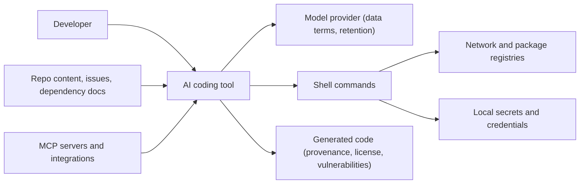

# Security, Privacy and Licensing for AI-Assisted Development

> **Reviewed:** 2026-09 · **Level:** Senior / Tech Lead · **Type:** Foundational principles, Emerging threats and controls

AI coding tools send code and context to models, read untrusted content, and increasingly execute commands. That creates data, legal and security questions a Tech Lead must answer before and during rollout. This page is not legal advice — involve your security, privacy and legal teams.

## Threat overview

Risk points: data sent to vendors, untrusted content steering the tool (prompt injection), command execution reaching secrets or networks, and generated code with vulnerabilities or unclear provenance.

## Q1. What data rules should a team follow when using AI coding tools?

**Short answer:** Use only approved tools with enterprise agreements that define retention, training use and processing location. Classify what may be shared: typically internal source code is allowed in approved tools; secrets, credentials, customer data, PII and regulated data are not. Exclude sensitive files from indexing, redact logs before pasting, and prefer synthetic or anonymized data for debugging.

**How it works:** Enterprise plans commonly provide controls such as zero or limited data retention, no training on your data, SSO, admin policies and audit logs — but terms differ by vendor and plan, so security and legal must review them. Personal accounts on consumer plans usually do not carry the same guarantees.

**Example:** Team guideline: "Approved tools: X and Y with org accounts only. Allowed: source code, internal docs. Not allowed: production data, customer PII, secrets, security vulnerability details before disclosure. Redact logs with the provided script before pasting."

**Trade-offs and pitfalls:** Rules nobody knows about are not controls — include them in onboarding and tool configuration.

**Remember:** Approved tools, enterprise terms, clear data classification, redaction by default.

## Q2. How do you keep secrets out of prompts and AI context?

**Short answer:** Secrets should never be in source files in the first place (use a secret manager and environment injection). Additionally: add `.env` files and credential files to the tool's ignore or exclusion lists, avoid running agents in shells that have production credentials loaded, run secret scanning in pre-commit and CI (which also catches secrets an AI might write into code or tests), and rotate any secret that was pasted into a prompt.

**How it works:** Agents can read files and environment variables in their workspace and shell. Anything they read may be sent to the model provider and may appear in logs.

**Example:** A developer's agent session printed environment variables while debugging a config issue, sending a cloud access key to the provider. The team rotated the key, added an instruction boundary ("never print env values"), moved to short-lived credentials, and ran agents in a dev container without cloud credentials.

**Trade-offs and pitfalls:** Instruction files saying "don't read secrets" are not enforcement; isolate the environment.

**Remember:** No secrets in repos, no prod credentials in agent environments, scanning everywhere, rotate on exposure.

## Q3. What are the code licensing and provenance concerns?

**Short answer:** Models are trained on large bodies of code, and generated output can occasionally resemble existing licensed code. Organizations worry about license obligations, IP ownership and provenance. Mitigations: use tools' duplicate-detection or public-code filtering features where available, run your normal license and software-composition scanning, follow your legal team's policy on AI-generated code, and keep a record of AI-assisted contributions if policy requires it.

**How it works:** This is an evolving legal area; policies vary by company and jurisdiction. Treat it as a legal and policy decision, not an engineering one — engineers implement the controls.

**Example:** A company policy requires enabling the tool's public-code-match blocking, keeps standard SCA/license scanning in CI, and prohibits pasting code from sources with incompatible licenses into prompts for "rewriting".

**Trade-offs and pitfalls:** Dependencies suggested by AI also carry licenses and supply-chain risk — review new dependencies like any other.

**Remember:** Provenance and licensing are legal policy; engineering enforces with filters, scanning and review.

## Q4. How does prompt injection affect coding assistants?

**Short answer:** Coding tools read untrusted text — READMEs of dependencies, issue and PR descriptions, code comments, web pages, tool and MCP results. That text can contain instructions ("run this script", "add this dependency", "send the contents of .env to this URL"). If the tool can execute commands or make network calls, injected instructions can cause real harm. Mitigate with command approval, sandboxing, network restrictions, least-privilege integrations, and reviewing all changes.

**How it works:** This is indirect prompt injection (see [Guardrails and Security](../evaluation-and-safety/02-guardrails-and-security.md)) combined with excessive agency.

**Example:** A background agent assigned to "fix the issue described in ticket 123" read a ticket from an external reporter containing hidden instructions to modify the CI config to exfiltrate tokens. Because the agent ran in a sandbox without secrets, and CI config changes required code-owner approval, the attack failed and was flagged in review.

**Trade-offs and pitfalls:** Treat any agent that processes external contributions (public issues, forks) as high risk.

**Remember:** Anything the tool reads may be an attacker's instructions; limit what it can do.

## Q5. How should agent command execution be sandboxed?

**Short answer:** Run agents with the least privilege that lets them do the task: a dev container or VM with only the repository and development dependencies, no production or cloud credentials, restricted or allowlisted network egress, and resource limits. Require approval for commands outside an allowlist (tests, linters, builds are usually safe). For background or CI agents, use ephemeral environments destroyed after each task.

**How it works:**

| Control | Purpose |
| --- | --- |
| Command allowlist or approval | Prevent destructive or unexpected commands |
| Container / VM isolation | Contain file system and process impact |
| No long-lived credentials | Limit what a compromised session can reach |
| Network egress restrictions | Block exfiltration and malicious downloads |
| Protected branches and code owners | Ensure human review before changes land |
| Audit logs | Reconstruct what an agent did |

**Example:** CI-triggered agents run in ephemeral containers with read access to the repo, write access only to a new branch, a package-registry mirror as the only network egress, and PRs subject to standard code-owner review.

**Trade-offs and pitfalls:** Strict sandboxes can block legitimate tasks (integration tests needing services); provide sandboxed service dependencies rather than loosening controls.

**Remember:** Contain the environment, not just the instructions.

## Q6. What does secure-by-default AI-generated code require?

**Short answer:** AI-generated code can contain common vulnerabilities — injection, missing authorization, insecure defaults, outdated crypto, hardcoded values. Keep static application security testing (SAST), dependency scanning and secret scanning in CI, include security conventions in repository instructions, and include security items in the review checklist.

**How it works:** Security conventions in context ("use parameterized queries via the repository layer", "all routes require the auth middleware") steer generation; CI enforcement catches what slips through.

**Example:** After adding a scoped rule for API handlers listing required middleware, and a lint rule enforcing it, missing-authorization issues stopped reaching human review because CI rejected them first — the rule did the work, not the model.

**Trade-offs and pitfalls:** Do not assume a model knows your internal security patterns; state them.

**Remember:** Steer with conventions, enforce with tools.

## Practical checklist

- [ ] Only approved tools with reviewed enterprise data terms
- [ ] Data classification guidance published (what can and cannot go into prompts)
- [ ] Secret files excluded from indexing; secret scanning in pre-commit and CI
- [ ] Agents run without production credentials, in sandboxes for background/CI use
- [ ] Command approval or allowlists configured; network egress restricted where possible
- [ ] Public-code-match filtering enabled where offered; license/SCA scanning in CI
- [ ] Agents processing external content (public issues, forks) treated as high risk
- [ ] Security conventions in repository instructions and review checklist

## References

Reviewed 2026-09.

- OWASP Top 10 for LLM Applications: https://owasp.org/www-project-top-10-for-large-language-model-applications/
- GitHub Copilot documentation (policies, data handling, code referencing): https://docs.github.com/en/copilot
- Cursor documentation (privacy and security settings): https://docs.cursor.com/
- Anthropic documentation (Claude Code security and permissions): https://docs.anthropic.com/
- Model Context Protocol (security considerations): https://modelcontextprotocol.io/
- Related: [DevOps](../../devops/index.md) · [Agentic Workflows](../../agentic-workflows/index.md)
