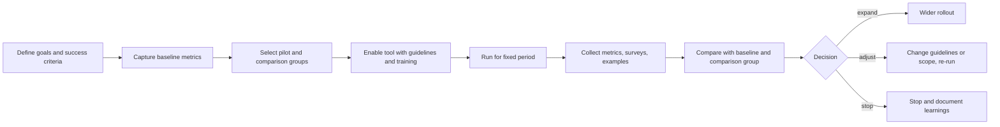

# Measuring Productivity with AI Tools

> **Reviewed:** 2026-09 · **Level:** Senior / Tech Lead · **Type:** Foundational (the frameworks) · Emerging (evidence about AI impact is still accumulating)

Leaders will ask "is this AI tool worth it?" The honest answer requires a baseline, outcome metrics, and qualitative evidence — not vendor claims or counts of generated code. This page deliberately contains no productivity percentages: published figures vary widely by study, task and context, and your team's result is the one that matters.

## Q1. What metrics would you use to measure the impact of AI coding tools?

**Short answer:** Outcome and flow metrics that the team already trusts, plus developer experience. DORA metrics (deployment frequency, lead time for changes, change failure rate, time to restore service), cycle time and its components (time to first review, review time, time to merge), quality signals (escaped defects, incidents, rework or reverts), and developer satisfaction and perceived productivity via surveys. The SPACE framework reminds you to cover multiple dimensions rather than a single number.

**How it works:**

| Dimension | Metrics | What it tells you |
| --- | --- | --- |
| Delivery speed | Lead time for changes, cycle time, deployment frequency | Is work flowing faster end to end? |
| Stability / quality | Change failure rate, escaped defects, reverts, time to restore | Is speed costing quality? |
| Review flow | Time to first review, review time, PR size, review iterations | Is review becoming the bottleneck? |
| Developer experience | Satisfaction, perceived productivity, cognitive load, flow (surveys) | Do engineers find it helpful and sustainable? |
| Adoption | Active usage, tasks where it is used | Are people actually using it, and for what? |

SPACE dimensions: **S**atisfaction and well-being, **P**erformance, **A**ctivity, **C**ommunication and collaboration, **E**fficiency and flow.

**Example:** A team tracks cycle time, change failure rate, PR size and review time monthly, plus a quarterly five-question developer survey, and reviews them in a retro alongside specific examples of where AI helped or hurt.

**Trade-offs and pitfalls:**

- Metrics become targets and get gamed (Goodhart's law) — use them for learning, not individual evaluation.
- Many factors affect delivery metrics (team changes, project phase); compare cautiously.

**Remember:** DORA + cycle time + quality + developer experience, across SPACE dimensions.

## Q2. Why are lines of code and "percentage of code written by AI" vanity metrics?

**Short answer:** They measure activity, not value. More code is not better — it can mean more to maintain, review and secure. "Percentage written by AI" depends on how acceptance is counted (accepted then deleted? heavily edited?) and says nothing about whether the right thing was built, whether it works, or whether delivery improved. Suggestion acceptance rate is useful for tuning a tool, not for measuring business impact.

**How it works:** Activity metrics are easy to collect and easy to inflate. Outcome metrics are harder but are what leadership actually cares about.

**Example:** A team reported a high share of AI-written code, but change failure rate and review time had both increased. The headline number hid that larger, AI-generated PRs were harder to review and shipped more defects. They introduced PR size limits and saw review time recover.

**Trade-offs and pitfalls:** Never use AI usage metrics in individual performance evaluation — it drives performative usage and undermines trust.

**Remember:** Measure outcomes; treat usage and volume as diagnostics only.

## Q3. How would you run a time-boxed pilot to evaluate an AI tool?

**Short answer:** Define the question and success criteria up front, capture a baseline, run a pilot group for long enough to get past the novelty effect, compare against the baseline (and ideally a comparison group), combine quantitative metrics with qualitative feedback, and make an explicit expand, adjust or stop decision.

**How it works:**



Pilot plan template:

```text
Question: Does tool X reduce cycle time for {{task types}} without increasing defects?
Success criteria (agreed in advance):
  - Cycle time for pilot group improves vs baseline and vs comparison group
  - Change failure rate and escaped defects do not increase
  - Developer survey: majority report it helpful; no major workload concerns
  - Security review of data terms passed
Baseline: previous {{N}} weeks of the same metrics for both groups
Pilot group: {{team/people}}, mixed seniority
Comparison group: {{team/people}} doing similar work without the tool
Duration: {{e.g. 6–8 weeks}} (long enough to pass the novelty phase)
Guidelines: usage guide, data rules, review checklist
Data collected: cycle time, PR size, review time, change failure rate, defects, survey at start/mid/end, example log of wins and failures
Decision meeting: {{date}}, attendees, decision options: expand / adjust / stop
```

**Example:** A pilot showed faster cycle time for test-writing and refactoring tasks but no change for complex feature work, and a rise in PR size. The decision: expand, with a PR size guideline and training focused on the task types that benefited.

**Trade-offs and pitfalls:**

- Small teams give noisy data — rely more on qualitative evidence and trends.
- Volunteers for a pilot are often enthusiasts; include skeptics for balance.
- Do not change other processes during the pilot, or you cannot attribute the effect.

**Remember:** Baseline, criteria in advance, comparison, long enough, explicit decision.

## Q4. How do you report AI productivity results to leadership honestly?

**Short answer:** Report outcomes with context and uncertainty: what was measured, against what baseline, over what period, what improved, what did not, and what risks appeared. Include qualitative examples and costs (licences, training time, review load). Avoid extrapolating a pilot result into headcount or company-wide percentage claims.

**How it works:** Leadership decisions need a recommendation, the evidence behind it, and what you will monitor after rollout.

**Example:** "Over eight weeks, the pilot team's cycle time for maintenance tickets improved compared with both their baseline and the comparison team; change failure rate was unchanged; survey results were positive with concerns about review load. Recommendation: expand to two more teams with PR size guidance; re-evaluate next quarter."

**Trade-offs and pitfalls:** Pressure to show ROI tempts teams to pick flattering metrics — agree the metrics before the pilot.

**Remember:** Evidence, context, uncertainty, and a clear recommendation.

## Practical checklist

- [ ] Goals and success criteria agreed before the pilot
- [ ] Baseline captured for the same metrics
- [ ] Comparison group or at least a clear before/after period
- [ ] Outcome metrics (DORA, cycle time, quality) plus developer experience survey
- [ ] Vanity metrics excluded from success criteria and from individual evaluation
- [ ] Qualitative log of wins, failures and risks
- [ ] Explicit expand / adjust / stop decision documented

## References

Reviewed 2026-09.

- DORA research and the four key metrics: https://dora.dev/
- Forsgren et al., "The SPACE of Developer Productivity", ACM Queue: https://queue.acm.org/detail.cfm?id=3454124
- GitHub Copilot documentation (usage metrics): https://docs.github.com/en/copilot
