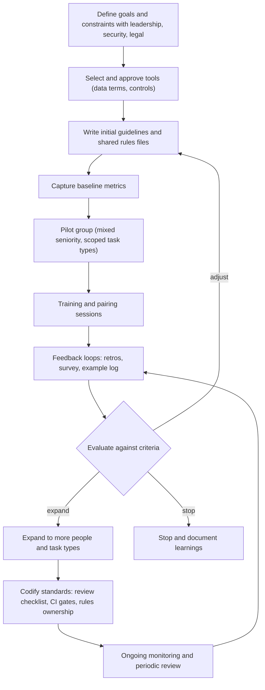

# Tech Lead Adoption Playbook

> **Reviewed:** 2026-09 · **Level:** Senior / Tech Lead · **Type:** Emerging (practices are still forming; change-management principles are Foundational)

Introducing AI tools is a change-management problem more than a tooling problem. The Tech Lead's job is to capture real benefits, protect quality and security, keep engineers accountable, and make the team better — not just faster.

## Rollout flow



## Phases

1. **Align.** Agree goals (what problems are we solving?), constraints (data, compliance, budget) and success criteria with leadership, security and legal.
2. **Choose tools.** Small approved set with enterprise data controls (see [Tools landscape](./02-tools-landscape.md)).
3. **Prepare.** Write usage guidelines, data rules, a review checklist, and an initial repository instructions file (see [Context engineering](./03-context-engineering.md)).
4. **Baseline.** Capture current delivery, quality and developer experience metrics (see [Measuring productivity](./07-measuring-productivity.md)).
5. **Pilot.** Small, mixed-seniority group, specific task types (tests, refactors, docs, well-scoped features), fixed duration.
6. **Train.** Hands-on sessions: prompt templates, plan-first workflow, verification habits, security rules. Share good and bad examples.
7. **Feedback loops.** Weekly short check-ins, a shared log of wins and failures, update rules files from lessons learned.
8. **Evaluate.** Compare against baseline and criteria; decide expand, adjust or stop.
9. **Expand scope.** More people, then more task types; add background agents or review bots only once basics are solid.
10. **Codify and sustain.** Review standards, CI gates, owners for rules files, periodic tool and policy review.

## Guidelines template

```markdown
# AI-Assisted Development Guidelines (team)

## Approved tools
- {{Tool A}} (org account only), {{Tool B}} for PR review summaries

## Data rules
- Allowed: source code in this org, internal docs
- Not allowed: secrets, customer data, PII, production logs (unless redacted with `scripts/redact`), unreleased security details

## Working rules
- You own every line you merge. Be able to explain it.
- Plan first for anything larger than a small fix.
- Keep PRs small; say in the PR description how AI was used and what you verified.
- AI-generated tests must be shown to fail when behaviour breaks.
- Agents: approve commands outside the allowlist; never run with production credentials.

## Decisions that stay with humans
Architecture, security, data handling, production changes, hiring and performance.

## Shared context
- Repository instructions: `AGENTS.md` (owner: {{name}})
- Prompt templates: `docs/ai-prompts/`

## Feedback
Post wins and failures in {{channel}}; we review them in retro every two weeks.
```

## Q1. How would you introduce AI coding tools to your team?

**Short answer:** Incrementally and with evidence. First align with leadership, security and legal on goals, approved tools and data rules. Then write lightweight guidelines and a shared repository instructions file, capture a baseline, and run a time-boxed pilot with a mixed-seniority group on specific task types. Train people on plan-first workflows and verification, run regular feedback loops, and evaluate against pre-agreed criteria before expanding. Throughout, the quality bar does not change: same tests, CI and human review, and engineers own what they merge.

**How it works:** This structure addresses the three real risks — security/data exposure, quality regression, and uneven adoption — while producing evidence for leadership.

**Example:** "In my last team I'd start with test generation and refactoring, where verification is easy, with four engineers for six weeks. We'd share a rules file in the repo, add an AI section to the PR template, and review cycle time, PR size and change failure rate against the prior quarter, plus a survey. Then expand to feature work with the lessons baked into the guidelines."

**Trade-offs and pitfalls:**

- Top-down mandates ("everyone must use AI") produce performative use and resentment.
- No guidelines at all produces inconsistent quality and security exposure.

<details>
<summary>Follow-up questions</summary>

- *What if senior engineers resist?* Understand the concern (often quality or security — legitimate), involve them in writing guidelines and the review checklist, and let evidence from the pilot speak. Adoption is optional where it doesn't help.
- *What if juniors over-rely on it?* Explain-every-line in review, tutor-mode usage, pairing, and deliberate practice (see [validation and human oversight](./05-validation-and-human-oversight.md)).
- *How do you handle a security incident caused by an AI tool?* Standard incident process, rotate exposed secrets, blameless postmortem, update guardrails (sandboxing, exclusions) rather than blaming the individual.

</details>

**Remember:** Align, guide, baseline, pilot, train, feedback, evaluate, expand.

## Q2. How do you establish team standards for AI-assisted work?

**Short answer:** Write down a small set of standards and enforce the important ones with tooling: ownership and explainability, small PRs, plan-first for significant work, data rules, a review checklist for AI-generated code, and disclosure in PR descriptions of how AI was used and what was verified. Keep shared context — repository instructions, scoped rules, prompt templates — in version control with owners.

**How it works:** Standards that live only in a wiki drift; standards in PR templates, CI checks, linters and rules files are applied every day.

**Example:** The PR template gets a section: "AI assistance: none / drafted / substantial. Verification performed: ...". A CI check limits PR size with an override label. The repository instructions file is reviewed each quarter.

**Trade-offs and pitfalls:** Too many standards slow people down and get ignored — start with the few that address real risks.

**Remember:** Few standards, embedded in templates, CI and rules files.

## Q3. How do you evaluate whether the rollout is working?

**Short answer:** Against the success criteria agreed at the start: delivery outcomes (cycle time, lead time), quality (change failure rate, escaped defects, reverts), review health (PR size, review time), and developer experience (surveys). Combine with qualitative evidence from retros and the example log. Look for unintended effects — growing review queues, larger PRs, skill concerns — and adjust.

**How it works:** See [Measuring productivity](./07-measuring-productivity.md) for metrics and pilot design.

**Example:** After expansion, review time rose because reviewers faced larger PRs. The team introduced PR size guidance and AI-generated PR summaries for reviewers; review time recovered in the next measurement period.

**Trade-offs and pitfalls:** Don't declare victory on adoption rates; adoption without outcomes is cost.

**Remember:** Outcomes + quality + experience, and watch for side effects.

## Q4. How do you avoid over-reliance while still encouraging adoption?

**Short answer:** Encourage use where verification is strong and learning is not compromised, and keep human judgment central: explain-your-code in review, design discussions without AI first for major decisions, junior growth plans that include fundamentals, and periodic "how did we verify this?" reviews of significant AI-assisted changes. Make it normal to say "the AI was wrong here" in retros.

**How it works:** Culture is set by what leaders model and reward. If the Tech Lead visibly verifies, questions and sometimes rejects AI output, the team will too.

**Example:** In a monthly engineering session, one engineer walks through an AI-assisted change: prompts used, what was wrong in the first draft, how it was verified. This spreads good habits better than a policy document.

**Trade-offs and pitfalls:** Rewarding raw speed or output volume encourages over-reliance.

**Remember:** Model verification; reward understanding, not volume.

## Q5. How do you handle AI adoption across teams with different risk profiles?

**Short answer:** Tier the rules by risk. Teams working on internal tools may use agents broadly; teams on payments, security or regulated data get stricter data rules, mandatory sandboxing, and additional review for sensitive code paths. Shared baseline guidelines apply everywhere; teams add stricter local rules through scoped rules files and code owners.

**How it works:** Use code owners and scoped rules for sensitive directories (auth, billing, cryptography) so extra review applies automatically regardless of how code was produced.

**Example:** The platform team runs background agents for dependency updates; the payments team allows IDE assistance only, with security review required for changes under `billing/`.

**Trade-offs and pitfalls:** Inconsistent rules without explanation cause confusion — document the reason for each tier.

**Remember:** One baseline, stricter tiers for sensitive areas, enforced by code owners and CI.

## Adoption checklist

**Before the pilot**

- [ ] Goals, constraints and success criteria agreed with leadership
- [ ] Tools approved by security/legal; enterprise data controls enabled
- [ ] Team guidelines written (data rules, ownership, human-only decisions)
- [ ] Repository instructions file and initial scoped rules committed
- [ ] Review checklist for AI-generated code added to review guidelines
- [ ] Baseline metrics captured
- [ ] Pilot group selected (mixed seniority, includes skeptics), task types scoped

**During the pilot**

- [ ] Training session and prompt templates shared
- [ ] Weekly check-ins and a shared wins/failures log
- [ ] Rules files updated from lessons learned
- [ ] Security incidents or near-misses handled and fed back into guardrails

**After the pilot**

- [ ] Results compared with baseline and criteria
- [ ] Explicit expand / adjust / stop decision documented
- [ ] Standards codified in PR templates, CI and rules files, with owners
- [ ] Periodic review scheduled (tools, policies, metrics, skills)

## References

Reviewed 2026-09.

- DORA research (capabilities and metrics): https://dora.dev/
- The SPACE of Developer Productivity (ACM Queue): https://queue.acm.org/detail.cfm?id=3454124
- GitHub Copilot documentation (organization policies and rollout): https://docs.github.com/en/copilot
- Cursor documentation (team rules and settings): https://docs.cursor.com/
- Anthropic documentation: https://docs.anthropic.com/
- Related: [Automated review process](../../leadership/code-reviews/automated-review-process.md) · [Agentic Workflows](../../agentic-workflows/index.md) · [Case studies](../../case-studies/index.md)
