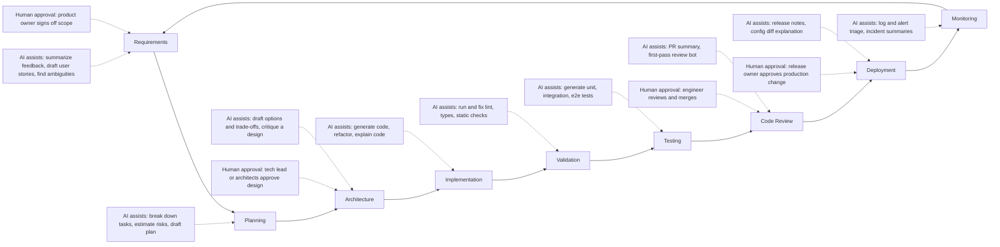

# AI-Assisted Development

> **Reviewed:** 2026-09 · **Level:** Senior / Tech Lead · **Type:** Emerging (principles are Foundational; tools and practices change quickly)

AI coding tools can speed up reading code, drafting implementations, writing tests and preparing reviews. They can also produce plausible-but-wrong code faster than a team can review it. The goal of this section is a practical, defensible position for interviews and for real teams:

**Use AI to accelerate the work, keep engineers accountable for the result, and let existing engineering controls — tests, types, review, CI, security checks — decide what ships.**

## Core principles

1. **Human ownership.** The engineer who merges code owns it, regardless of who or what typed it.
2. **Same bar, not a lower one.** AI-generated changes pass the same tests, review and security checks as any other change.
3. **Context is the product.** Output quality depends mostly on the context you give: requirements, conventions, relevant files, constraints.
4. **Small, verifiable steps.** Ask for plans, then small diffs, then tests — not a thousand-line change in one shot.
5. **Protect data and systems.** No secrets or restricted data in prompts; sandbox agent command execution; follow enterprise data controls.
6. **Measure outcomes, not activity.** Cycle time, change failure rate and developer experience — not lines of code or "percentage written by AI".

## The AI-assisted SDLC

| Stage | Where AI helps | Human decision required |
| --- | --- | --- |
| Requirements | Summarize feedback, draft stories, list open questions | Scope and priority (product owner) |
| Planning | Task breakdown, dependency and risk listing | Commitment and sequencing (team, tech lead) |
| Architecture | Generate options and trade-offs, critique designs | Architecture decision (tech lead / architecture review) |
| Implementation | Draft code, refactor, explain unfamiliar code | Engineer accepts, edits or rejects each change |
| Validation | Fix lint/type errors, run static analysis | Engineer confirms fixes are correct, not suppressions |
| Testing | Generate test cases and fixtures | Engineer judges test meaningfulness and coverage |
| Code review | PR summaries, first-pass review comments | Human reviewer approves and merges |
| Deployment | Release notes, change summaries | Release owner approves production change |
| Monitoring | Alert and log triage, incident timeline drafts | Incident commander decides actions; humans own postmortem |

## Pages in this section

1. [SDLC workflows and prompt templates](./01-sdlc-workflows.md) — reusable prompts for understanding code, planning, implementing, testing, debugging, reviewing and onboarding.
2. [Tools landscape](./02-tools-landscape.md) — vendor-neutral categories: IDE agents, terminal agents, inline assistants, PR review bots, chat assistants.
3. [Context engineering](./03-context-engineering.md) — repository instructions, rules and skills, context management, MCP.
4. [Model routing and cost](./04-model-routing-and-cost.md) — which model for which task, budgets and latency.
5. [Validation and human oversight](./05-validation-and-human-oversight.md) — checks, approval checkpoints, decisions that stay with humans, review checklist.
6. [Security, privacy and licensing](./06-security-privacy-licensing.md) — data controls, secrets, provenance, prompt injection, sandboxing.
7. [Measuring productivity](./07-measuring-productivity.md) — DORA, SPACE, pilots with baselines, avoiding vanity metrics.
8. [Tech Lead adoption playbook](./08-tech-lead-adoption-playbook.md) — rolling AI tools out to a team, with checklist and interview answers.

Agents (tools that plan and execute multi-step tasks) appear throughout this section at a practical level. For agent architectures, orchestration patterns and autonomy design, see [Agentic Workflows](../../agentic-workflows/index.md).

## Q1. How can a team improve productivity with AI without sacrificing quality?

**Short answer:** Treat AI as an accelerator inside an unchanged quality system. Keep the same tests, type checks, CI gates, security scans and human review; add AI where it removes toil — understanding code, drafting boilerplate and tests, summarizing PRs, triaging logs. Invest in shared context (repository rules, conventions) so outputs match team standards, and measure delivery outcomes and defect rates to confirm the gain is real.

**How it works:** Productivity gains come from shortening loops (explain, draft, verify), not skipping verification. Quality is protected by making verification cheap and mandatory: small diffs, strong tests, clear review checklists.

**Example:** A team pilots an IDE agent for test generation and refactors only, with a rule that every AI-assisted PR includes a plain-language summary of what was verified. They compare cycle time and escaped defects against a baseline before expanding.

**Trade-offs and pitfalls:**

- Faster generation shifts the bottleneck to review; if review capacity does not scale, quality drops or queues grow.
- Juniors may accept code they cannot explain — require them to explain it in review.

**Remember:** Speed up the loop, never skip the checks, and measure outcomes.

## Q2. Where should AI never have the final say?

**Short answer:** Architecture decisions, security and data-handling choices, production changes, incident decisions, and anything about people (hiring, performance, promotion). AI can inform these with analysis and drafts, but an accountable human decides and signs off.

**How it works:** Accountability cannot be delegated to a tool; these decisions involve context, trade-offs across stakeholders, legal exposure and ethics. See [validation and human oversight](./05-validation-and-human-oversight.md).

**Example:** An AI tool drafts three database migration strategies with risks; the tech lead chooses one in an architecture review and records the decision.

**Trade-offs and pitfalls:** "AI suggested it" is never an acceptable justification in a postmortem.

**Remember:** AI advises; accountable humans decide.

## Practical checklist

- [ ] Team has written guidelines for acceptable AI use, including data rules
- [ ] Repository has shared instruction/rules files kept in version control
- [ ] All AI-assisted changes go through normal CI and human review
- [ ] Approved tools use enterprise data controls
- [ ] Baseline metrics captured before rollout; outcomes reviewed regularly

## References

Reviewed 2026-09.

- DORA research and metrics: https://dora.dev/
- The SPACE of Developer Productivity (ACM Queue): https://queue.acm.org/detail.cfm?id=3454124
- GitHub Copilot documentation: https://docs.github.com/en/copilot
- Cursor documentation: https://docs.cursor.com/
- Anthropic documentation: https://docs.anthropic.com/
- OWASP Top 10 for LLM Applications: https://owasp.org/www-project-top-10-for-large-language-model-applications/
