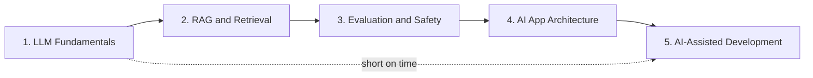

# Applied AI

> **Reviewed:** 2026-09 · **Level:** Senior / Tech Lead · **Type:** Foundational with Emerging topics marked

This section prepares you to do two things confidently:

1. **Explain AI concepts in interviews** — how LLMs work at a practical level, how to build reliable AI features, and how to reason about cost, quality and risk.
2. **Use AI well as an engineer and Tech Lead** — adopting AI coding tools in a way that improves delivery without sacrificing quality, security or human ownership.

It is written for engineers who build products, not researchers who train models. The focus is on intuition, system design and trade-offs.

## Scope

| Subsection | What you will learn | Questions |
| --- | --- | --- |
| [LLM Fundamentals](./llm-fundamentals/01-tokens-context-sampling.md) | Tokens, context windows, sampling, embeddings, prompting vs RAG vs fine-tuning, hallucinations, cost and latency, model selection, structured outputs, tool calling | 18 |
| [RAG and Retrieval](./rag-and-retrieval/01-rag-pipeline-and-chunking.md) | RAG pipeline, chunking, vector databases and HNSW, hybrid search, reranking, filtering, retrieval evaluation, citations, freshness, when not to use RAG | 15 |
| [Evaluation and Safety](./evaluation-and-safety/01-evaluation-and-monitoring.md) | Golden datasets, LLM-as-judge, CI gates, online metrics, guardrails, prompt injection, PII, jailbreaks, OWASP LLM Top 10, human review | 15 |
| [AI App Architecture](./ai-app-architecture.md) | Reference architecture: gateway, orchestration, model router, caching, vector store, observability, evals, fallbacks; system design of an AI support assistant | 8 |
| [AI-Assisted Development](./ai-assisted-development/index.md) | AI across the SDLC, prompt templates, tools landscape, context engineering, model routing, validation and oversight, security, measuring productivity, Tech Lead adoption playbook | 40 |
| [Cheatsheet](./cheatsheet.md) | One-page revision | — |

### Page index

- LLM Fundamentals: [Tokens, context and sampling](./llm-fundamentals/01-tokens-context-sampling.md) · [Embeddings, adaptation and hallucinations](./llm-fundamentals/02-embeddings-adaptation-hallucinations.md) · [Models, cost and structured outputs](./llm-fundamentals/03-models-cost-structured-outputs.md)
- RAG and Retrieval: [Pipeline and chunking](./rag-and-retrieval/01-rag-pipeline-and-chunking.md) · [Vector search, hybrid and reranking](./rag-and-retrieval/02-vector-search-hybrid-reranking.md) · [Evaluation, grounding and freshness](./rag-and-retrieval/03-evaluation-grounding-freshness.md)
- Evaluation and Safety: [Evaluation and monitoring](./evaluation-and-safety/01-evaluation-and-monitoring.md) · [Guardrails and security](./evaluation-and-safety/02-guardrails-and-security.md)
- [AI App Architecture](./ai-app-architecture.md)
- AI-Assisted Development: [Overview](./ai-assisted-development/index.md) · [SDLC workflows](./ai-assisted-development/01-sdlc-workflows.md) · [Tools landscape](./ai-assisted-development/02-tools-landscape.md) · [Context engineering](./ai-assisted-development/03-context-engineering.md) · [Model routing and cost](./ai-assisted-development/04-model-routing-and-cost.md) · [Validation and human oversight](./ai-assisted-development/05-validation-and-human-oversight.md) · [Security, privacy and licensing](./ai-assisted-development/06-security-privacy-licensing.md) · [Measuring productivity](./ai-assisted-development/07-measuring-productivity.md) · [Tech Lead adoption playbook](./ai-assisted-development/08-tech-lead-adoption-playbook.md)

## Suggested learning order

- **Building AI features / system design interviews:** go in order 1 → 4.
- **Tech Lead or engineering-practice interviews:** read LLM Fundamentals, then jump to AI-Assisted Development — especially [validation](./ai-assisted-development/05-validation-and-human-oversight.md), [measuring productivity](./ai-assisted-development/07-measuring-productivity.md) and the [adoption playbook](./ai-assisted-development/08-tech-lead-adoption-playbook.md).
- **Night before:** the [Cheatsheet](./cheatsheet.md).

## How this differs from Agentic Workflows

| This section (AI Engineering) | [Agentic Workflows](../agentic-workflows/index.md) |
| --- | --- |
| How LLMs work and how to build reliable single-call and RAG features | Systems where models plan and act over many steps |
| Tool calling basics, excessive-agency risks | Agent loops, planning, memory, multi-agent orchestration, autonomy levels |
| Using AI coding tools and agents safely in a team's SDLC | Designing and operating agents in depth |
| MCP as a way to supply tools and context | MCP and agent integration patterns in depth |

Agents appear here only as a short overview where needed; go to the Agentic Workflows section for depth.

## Established vs Emerging

Interviewers reward candidates who can tell durable principles from current trends. Use this table to calibrate how confidently to state something.

| Topic | Status | How to talk about it |
| --- | --- | --- |
| Tokens, context windows, sampling | Established | State confidently |
| Embeddings and semantic search | Established | State confidently |
| RAG with hybrid search and reranking | Established | Default pattern for private knowledge |
| ANN indexes such as HNSW | Established | Well-understood search engineering |
| Structured outputs and tool calling | Established (APIs evolve) | Core production technique; details vary by provider |
| Golden datasets, eval gates in CI | Established practice | Non-negotiable for production features |
| LLM-as-judge | Established but imperfect | Useful when calibrated against humans |
| Prompt injection | Established risk, no complete fix | Mitigate by limiting impact |
| OWASP Top 10 for LLM Applications | Established reference, periodically revised | Use as threat-model checklist; cite current version |
| DORA and SPACE for measuring productivity | Established | Apply to AI tool evaluation |
| Human ownership of merged code | Established principle | State firmly |
| Reasoning models | Emerging | Useful for hard problems; capabilities and cost change fast |
| Repository instruction files (AGENTS.md, rules, CLAUDE.md, copilot-instructions) | Emerging conventions | Principle is sound; formats vary by tool |
| MCP | Emerging standard | Growing adoption; treat servers as privileged integrations |
| Background / cloud coding agents | Emerging | Promising for scoped tasks; review and sandboxing essential |
| Semantic caching | Emerging / situational | Use cautiously; risk of wrong reuse |
| Claims of specific productivity percentages | Speculative | Don't quote numbers; measure your own team |

## References

Reviewed 2026-09.

- OpenAI platform documentation: https://platform.openai.com/docs
- Anthropic documentation: https://docs.anthropic.com/
- Model Context Protocol: https://modelcontextprotocol.io/
- OWASP Top 10 for LLM Applications: https://owasp.org/www-project-top-10-for-large-language-model-applications/
- DORA: https://dora.dev/
- The SPACE of Developer Productivity (ACM Queue): https://queue.acm.org/detail.cfm?id=3454124
- Related sections: [Agentic Workflows](../agentic-workflows/index.md) · [DevOps](../devops/index.md) · [Case studies](../case-studies/index.md)
