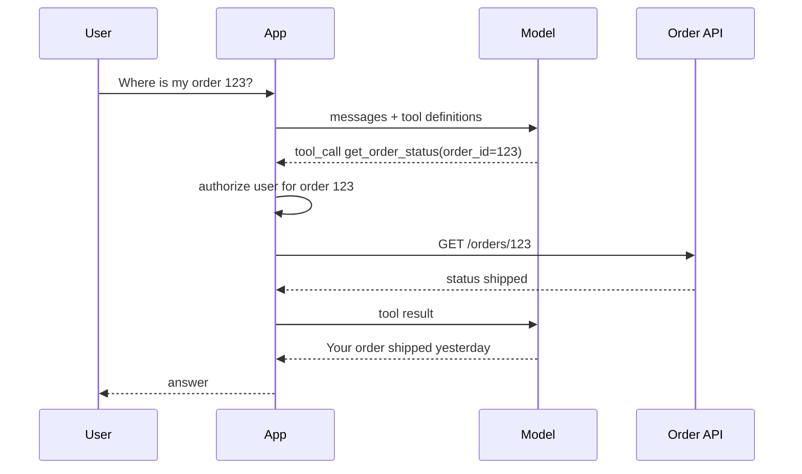

# Model Selection, Cost, Structured Outputs and Tool Calling

> **Reviewed:** 2026-09 · **Level:** Senior / Tech Lead · **Type:** Foundational (with Emerging items marked)

These questions check whether you can put an LLM into production responsibly: pick the right model, control spend, and get machine-readable output that the rest of your system can trust.

## Q1. Cost and latency are driven mostly by model size and token volume

**Short answer:** Cost is roughly input tokens × input price + output tokens × output price, with output tokens usually priced higher. Latency depends on model size, output length, reasoning tokens, network and provider load. The biggest levers are: pick the smallest model that meets quality, keep prompts lean, cap output, cache, and avoid unnecessary calls.

**How it works:** Drivers to name in an interview:

- **Model tier** — larger and reasoning models cost more and are slower per token.
- **Input size** — long system prompts, retrieved chunks, tool schemas and chat history, sent on every call.
- **Output size** — generated sequentially, so it dominates latency.
- **Call count** — agents and chains multiply calls; retries multiply again.
- **Caching** — prompt caching (provider-side reuse of a stable prefix) and response caching (your side) reduce both.

**Example:** A feature's monthly bill grew because every request resent a long system prompt and ten retrieved chunks. The team moved stable content to the start of the prompt to benefit from prompt caching, cut retrieval to the top five reranked chunks, and capped output length — then verified quality did not drop on the eval set.

**Trade-offs and pitfalls:**

- Optimizing cost without an eval set is guessing; you may silently degrade quality.
- Per-token price is not total cost — a cheaper model that needs three retries can cost more.

**Remember:** Tokens × price × calls. Measure per feature, per request, with quality alongside.

## Q2. Model selection is a quality/latency/cost/control trade-off

**Short answer:** Choose per task, not per company. Small fast models suit autocomplete, classification, extraction and routing. Large general models suit open-ended writing and complex instructions. Reasoning models suit multi-step debugging, planning and hard analysis. Open-weight models give control over hosting, data residency and customization at the cost of operational burden; hosted APIs give the strongest models with the least ops but less control.

**How it works:**

| Option | Strengths | Costs and risks |
| --- | --- | --- |
| Small hosted model | Fast, cheap | Weaker on complex tasks |
| Frontier hosted model | Best general quality | Cost, vendor dependency, data leaves your network (subject to contract) |
| Reasoning model | Hard multi-step problems | Latency, unpredictable token usage |
| Open-weight, self-hosted | Data control, customization, no per-token vendor fee | GPU capacity, scaling, patching, safety tuning are yours |

**Example:** A decision rubric: "Does it need private data to stay in our VPC? Does it need sub-second latency? What is the quality bar on our eval set? What volume do we expect?" Run the top two or three candidates through the same golden dataset and pick on evidence.

**Trade-offs and pitfalls:**

- Public benchmarks rarely match your task — build your own eval set.
- Model versions are deprecated; design a model gateway so switching is a config change (see [AI app architecture](../ai-app-architecture.md)).

**Remember:** Smallest model that passes your eval, behind an abstraction so you can switch.

## Q3. Structured outputs make LLM responses safe for code to consume

**Short answer:** When software (not a human) consumes the output, ask for JSON that conforms to a schema. Many providers offer a JSON mode or schema-constrained "structured outputs" that guarantee syntactically valid JSON matching a schema. You still validate semantics — valid JSON can contain wrong values.

**How it works:** Levels of strictness:

1. Prompt-only ("respond in JSON") — may break.
2. JSON mode — guarantees parseable JSON, not your schema.
3. Schema-constrained decoding — output is forced to match the provided JSON Schema.

**Example:**

```python
from pydantic import BaseModel
from typing import Literal

class Triage(BaseModel):
    category: Literal["billing", "bug", "feature_request", "account", "other"]
    urgency: Literal["low", "medium", "high"]
    summary: str

result = llm.generate(prompt, response_schema=Triage)   # provider-specific call
triage = Triage.model_validate_json(result.text)        # validate anyway
if triage.category == "billing" and not customer_exists(ticket.customer_id):
    raise ValidationError("unknown customer")          # semantic check
```

**Trade-offs and pitfalls:**

- Very strict schemas can reduce answer quality if they force the model to commit before reasoning; a "reasoning" or "notes" field before the decision can help.
- Enums prevent invented categories — use them.
- Handle refusals and truncation (finish reason "length") explicitly.

**Remember:** Schema for shape, code for truth.

## Q4. Tool (function) calling lets the model request actions your code executes

**Short answer:** You describe available functions (name, description, JSON Schema for arguments). The model can respond with a request to call one with specific arguments. Your application executes it, returns the result, and the model continues. The model never executes anything itself — your code is the security boundary.

**How it works:**



**Example:** Tool definition:

```json
{
  "name": "get_order_status",
  "description": "Look up the shipping status of an order owned by the current user.",
  "parameters": {
    "type": "object",
    "properties": { "order_id": { "type": "string" } },
    "required": ["order_id"]
  }
}
```

**Trade-offs and pitfalls:**

- Authorize every call using the *user's* identity, not the model's claim; validate arguments like any untrusted input.
- Separate read tools from write tools; require confirmation for destructive or financial actions.
- Too many tools confuse the model and cost tokens — expose only what the task needs.
- Loops of tool calls become agents; for depth see [Agentic Workflows](../../agentic-workflows/index.md).

**Remember:** The model proposes; your code authorizes and executes.

## Q5. Open-weight vs hosted is also a governance decision

> **Type:** Emerging — licensing terms and capability gaps shift frequently.

**Short answer:** Beyond cost and quality, the choice affects data residency, auditability, license terms (some "open" models have usage restrictions), who patches safety issues, and vendor lock-in. Hosted enterprise offerings often provide contractual data controls; self-hosting gives physical control but moves responsibility to you.

**How it works:** Checklist for a Tech Lead:

- Where does data go, and what does the contract say about retention and training use?
- What is the model license, and does it allow our use case?
- Who is on call when the model server is down?
- Can we switch providers within a sprint?

**Example:** A healthcare team kept PHI-heavy summarization on a self-hosted open-weight model inside their network while using a hosted frontier model for non-sensitive internal documentation tasks.

**Trade-offs and pitfalls:** Self-hosting cost is dominated by GPU utilization; low-traffic workloads are often cheaper on hosted APIs.

**Remember:** Model choice includes legal, security and ops ownership, not just quality.

## Q6. Prompts are code: version, test and review them

**Short answer:** Prompts, tool schemas and model settings determine product behaviour as much as source code does. Store them in version control, review changes, run them against an eval set in CI, and record which prompt version produced each response in production traces.

**How it works:** Treat a prompt change like a config change with behavioural impact: small diffs, reviewers, regression tests, staged rollout, and quick rollback.

**Example:** A one-word prompt tweak ("brief" to "concise") changed average answer length and broke a downstream UI that truncated text. An eval gate checking length and format would have caught it (see [Evaluation and Safety](../evaluation-and-safety/01-evaluation-and-monitoring.md)).

**Trade-offs and pitfalls:** Prompt management tools help, but a folder of versioned templates plus tests is enough to start.

**Remember:** If it changes behaviour, it needs review and tests.

## References

Reviewed 2026-09.

- OpenAI platform documentation (structured outputs, function calling, pricing concepts): https://platform.openai.com/docs
- Anthropic documentation (tool use, prompt caching): https://docs.anthropic.com/
- Previous: [Embeddings, Adaptation and Hallucinations](./02-embeddings-adaptation-hallucinations.md) · Next section: [RAG and Retrieval](../rag-and-retrieval/01-rag-pipeline-and-chunking.md)
