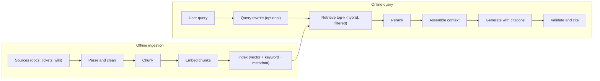

# RAG Pipeline and Chunking

> **Reviewed:** 2026-09 · **Level:** Senior / Tech Lead · **Type:** Foundational

Retrieval-Augmented Generation (RAG) is the default pattern for "answer questions using our data". Most RAG quality problems are retrieval problems, not model problems — interviewers want to hear that you debug the pipeline stage by stage.

## The pipeline at a glance



## Q1. RAG retrieves relevant context at request time and asks the model to answer from it

**Short answer:** RAG splits into an offline ingestion pipeline (parse, chunk, embed, index) and an online query pipeline (retrieve, rerank, assemble context, generate, cite). It gives the model private and fresh knowledge without retraining, supports citations, and can enforce per-user access control at retrieval time.

**How it works:**

1. **Ingest** — pull documents from sources, extract clean text, keep metadata (source, owner, ACL, updated_at).
2. **Chunk** — split into retrievable pieces.
3. **Embed** — convert each chunk to a vector.
4. **Index** — store vectors plus keyword index and metadata.
5. **Retrieve** — embed the query, find nearest chunks (often hybrid with keyword search), apply filters.
6. **Rerank** — reorder candidates with a more precise model.
7. **Generate** — prompt the LLM with the top chunks and instructions to answer only from them and cite.

**Example:** An internal engineering assistant answers "How do we rotate the payments DB credentials?" by retrieving the runbook section, citing it with a link, and saying "not found in the runbooks" when nothing relevant is retrieved.

**Trade-offs and pitfalls:**

- Garbage in, garbage out: bad PDF parsing and duplicate or outdated docs ruin answers.
- RAG adds latency (retrieval + rerank) and moving parts that need monitoring.

**Remember:** RAG = search engine + LLM. Debug search first.

## Q2. Chunking determines what can be retrieved

**Short answer:** Chunks must be small enough to be specific and fit in context, but large enough to carry meaning. Common strategies: fixed-size with overlap, structure-aware (split by headings, sections, functions), and semantic chunking (split where topic changes). Structure-aware chunking with metadata is usually the best starting point for docs and code.

**How it works:**

| Strategy | How | Good for | Pitfall |
| --- | --- | --- | --- |
| Fixed-size + overlap | N tokens with some overlap | Unstructured text, quick start | Splits mid-thought |
| Structure-aware | Headings, paragraphs, code functions | Docs, wikis, code | Uneven sizes |
| Semantic | Split on embedding similarity shifts | Long narrative text | More compute, harder to debug |
| Parent-child | Retrieve small chunks, return larger parent section | Precision + context | More storage and logic |

**Example:** A runbook split every 500 tokens separated "Step 4: run the migration" from its warning "only after draining traffic". Switching to section-based chunks and prepending the page title and heading path to each chunk ("Payments Runbook > Credential Rotation > Step 4") fixed retrieval and answer safety.

**Trade-offs and pitfalls:**

- There is no universally correct chunk size — test a few on your eval set.
- Tables and code need special handling; flattening a table to text often destroys meaning.
- Always keep a pointer back to the source for citation.

**Remember:** Chunk along the document's natural structure and carry context (title, headings) into each chunk.

## Q3. Ingestion quality and metadata matter more than the vector database brand

**Short answer:** The ingestion pipeline decides what the model can ever know. Clean parsing, deduplication, removal of stale versions, and rich metadata (source, ACL, product, version, language, last updated) enable filtering, access control, freshness and citations. Most real-world RAG wins come from here.

**How it works:** Treat ingestion as a data pipeline: idempotent jobs, change detection (hash content), incremental updates, deletion propagation, and data quality checks.

**Example:** Support answers kept quoting a pricing page from two years ago. Root cause: the crawler indexed an archived copy. Adding `status: archived` metadata and filtering on it fixed the issue faster than any prompt change.

**Trade-offs and pitfalls:**

- Deletions are often forgotten — a document removed from the source must be removed from the index, especially for compliance.
- Access control must be enforced at retrieval, not by asking the model to "not reveal" restricted content.

**Remember:** Invest in ingestion and metadata; they enable filtering, ACLs, freshness and citations.

## Q4. Query rewriting improves retrieval for conversational and vague questions

**Short answer:** Users ask follow-ups like "what about for enterprise plans?" that are meaningless in isolation. A query rewriting step uses the conversation to produce a standalone search query, and sometimes multiple sub-queries, before retrieval.

**How it works:** A cheap, fast model turns history + latest message into one or more explicit search queries. Variants include expanding acronyms, generating a hypothetical answer to embed (sometimes called HyDE), or decomposing multi-part questions.

**Example:**

```text
Conversation:
User: How do refunds work?
Assistant: ...
User: what about for enterprise plans?

Rewrite the last user message as a standalone search query.
Output: "refund policy for enterprise plan customers"
```

**Trade-offs and pitfalls:** Adds a model call (latency, cost) and can drift from user intent; log rewritten queries so you can debug.

**Remember:** Retrieve with a standalone query, not the raw follow-up.

## Q5. Context assembly is where retrieval meets prompt design

**Short answer:** After reranking, pick the top few chunks that fit the token budget, order them sensibly, label each with a source ID, and instruct the model to answer only from them, cite IDs, and say when information is missing. More chunks is not better: irrelevant context dilutes attention and increases cost.

**How it works:**

```text
You answer questions using only the sources below.
If the sources do not contain the answer, say "I could not find this in the documentation."
Cite sources as [S1], [S2] after each claim.

[S1] (Billing FAQ > Refunds, updated 2026-08-02)
...
[S2] (Enterprise Terms > Section 7)
...

Question: {{standalone_query}}
```

**Trade-offs and pitfalls:**

- Treat retrieved text as untrusted — it may contain injected instructions (see [prompt injection](../evaluation-and-safety/02-guardrails-and-security.md)).
- Deduplicate near-identical chunks before assembling.

**Remember:** Few, relevant, labelled chunks with explicit "answer only from sources" instructions.

## References

Reviewed 2026-09.

- OpenAI platform documentation (embeddings, retrieval): https://platform.openai.com/docs
- Anthropic documentation (retrieval and long-context prompting): https://docs.anthropic.com/
- Next: [Vector Search, Hybrid and Reranking](./02-vector-search-hybrid-reranking.md)
