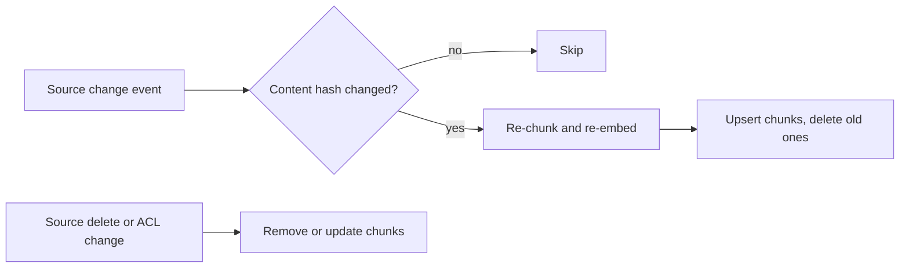

# Retrieval Evaluation, Grounding and Freshness

> **Reviewed:** 2026-09 · **Level:** Senior / Tech Lead · **Type:** Foundational

You cannot improve RAG without measuring its parts separately. This page covers retrieval metrics, grounded answers with citations, keeping data fresh, and — just as important — when RAG is the wrong tool.

## Q1. Evaluate retrieval separately from generation

**Short answer:** Build a labelled set of queries with the documents or chunks that should be retrieved. Measure retrieval with recall@k (did the right chunks appear in the top k?) and precision@k (what fraction of the top k is relevant?), plus rank-aware metrics like MRR. Then evaluate generation separately for faithfulness and answer quality. If recall is low, no prompt will fix the answer.

**How it works:**

- **recall@k** = relevant chunks found in top k ÷ total relevant chunks.
- **precision@k** = relevant chunks in top k ÷ k.
- **MRR (mean reciprocal rank)** = average of 1 ÷ rank of the first relevant result.
- **Faithfulness / groundedness** = are the answer's claims supported by the retrieved context?
- **Answer relevance / correctness** = does it answer the question correctly?

**Example:** A team's answers were poor. Metrics showed recall@5 was low for queries containing product codes, while faithfulness was high. The problem was retrieval, not the model — adding BM25 hybrid search fixed it.

```python
def recall_at_k(retrieved_ids, relevant_ids, k):
    top = set(retrieved_ids[:k])
    return len(top & set(relevant_ids)) / len(relevant_ids)
```

**Trade-offs and pitfalls:**

- Labelling takes effort; start with 50–100 real queries from logs and grow it.
- Synthetic queries generated by an LLM are useful for coverage but skew toward easy, well-phrased questions.

**Remember:** Measure retrieval (recall/precision@k) and generation (faithfulness) separately.

## Q2. Citations and grounding make answers verifiable

**Short answer:** Grounding means the answer is based only on provided sources; citations let users and automated checks verify it. Require the model to cite source IDs per claim, render them as links, and validate that cited IDs were actually retrieved — and ideally that the cited passage supports the claim.

**How it works:** Ask for structured output like `{"answer": "...", "citations": ["S1", "S3"]}`. Server-side: drop or flag answers citing unknown IDs; optionally run a faithfulness check with a judge model on a sample.

**Example:** A compliance assistant refused to display any answer with zero citations and showed "I could not find this in approved policy documents" instead. Users trusted it more, and reviewers could check sources in one click.

**Trade-offs and pitfalls:**

- Models can cite a real source that does not support the claim ("citation hallucination") — sample and check.
- Strict grounding increases "not found" responses; track that rate and fix coverage gaps in the corpus.

**Remember:** Cite per claim, validate citations server-side, allow "not found".

## Q3. Freshness requires incremental indexing and deletion handling

**Short answer:** An index is a copy of your data, so it goes stale. Use change detection (webhooks, change-data-capture, content hashes) to re-embed only changed documents, propagate deletions and permission changes quickly, and stamp chunks with `updated_at` so you can prefer or filter recent content. Re-embed the entire corpus when you change embedding models.

**How it works:**



**Example:** When switching embedding models, a team built a new index in parallel (blue/green), ran the eval set against both, then flipped the alias — avoiding a mixed index of incompatible vectors.

**Trade-offs and pitfalls:**

- Full nightly rebuilds are simple but slow and expensive at scale; incremental is complex but fresher.
- Track index lag as an SLO ("95% of changes searchable within N minutes" — choose N for your use case).

**Remember:** Incremental updates, fast deletes, blue/green for model changes.

## Q4. Know when not to use RAG

**Short answer:** RAG is for answering from a body of text. Don't use it when the data is structured and queryable (use SQL or an API via tool calling), when the whole relevant context fits comfortably and cheaply in the prompt, when the task needs a new skill or style (consider fine-tuning or better prompts), or when exact, deterministic answers are required (use a traditional system).

**How it works:**

| Need | Better approach |
| --- | --- |
| "What is my current balance?" | Tool call to the accounts API |
| "Sum revenue by region last quarter" | Text-to-SQL with guardrails, or a predefined report |
| Summarize one 20-page document | Put it in context directly |
| Answer in our brand voice | Prompting with examples or fine-tuning |
| Legal-grade exact clause lookup | Keyword search with human review |

**Example:** A team built RAG over exported CSVs of order data and got wrong totals. Replacing it with a tool that queried the orders database returned correct numbers every time.

**Trade-offs and pitfalls:** RAG over structured data is a common anti-pattern; embeddings do not do arithmetic.

**Remember:** RAG for unstructured knowledge; tools and databases for facts and numbers.

## Q5. Debugging a bad RAG answer, stage by stage

**Short answer:** Trace the request: was the query rewritten sensibly? Were the right chunks retrieved (recall)? Did reranking keep them? Did they fit in the context? Did the model use them faithfully? Were citations valid? Observability with per-stage logging turns "the bot is wrong" into a specific fix.

**How it works:** Log for each request: original query, rewritten query, retrieved IDs with scores, reranked IDs, final context token count, prompt version, model, output, citations, and user feedback.

**Example:** A wrong answer traced to a correct chunk ranked 12th after reranking because it was a table flattened into unreadable text. The fix was in ingestion (table-aware parsing), not the prompt.

**Trade-offs and pitfalls:** Logging full context may store sensitive data — apply retention limits and redaction.

**Remember:** Every RAG bug lives in one stage. Trace it.

## References

Reviewed 2026-09.

- OpenAI platform documentation (evals, retrieval): https://platform.openai.com/docs
- Anthropic documentation (citations and grounding guidance): https://docs.anthropic.com/
- Previous: [Vector Search, Hybrid and Reranking](./02-vector-search-hybrid-reranking.md) · Next section: [Evaluation and Safety](../evaluation-and-safety/01-evaluation-and-monitoring.md)
