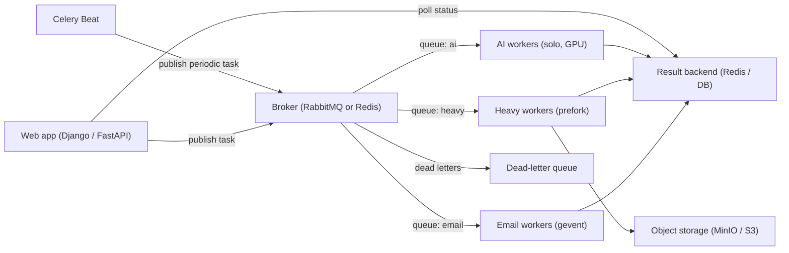

# Celery Workers Overview (Q1-Q41)

> **Reviewed:** 2026-09 · **Level:** Senior · **Type:** Foundational

Celery is the most widely used distributed task queue in the Python ecosystem. It moves slow or unreliable work (emails, media processing, reports, third-party calls, AI inference) out of the request path into workers that consume messages from a broker such as RabbitMQ or Redis.

This section goes deep on Celery itself. For the broker comparison (Kafka vs RabbitMQ vs SQS vs Redis Streams) start with the [messaging systems overview](../architecture/05-messaging-systems.md); for broker internals see the [RabbitMQ section](../rabbitmq/index.md).

## When to use Celery

- Python services (Django, FastAPI, Flask) that need background jobs, periodic jobs or fan-out/fan-in processing.
- Work that can be retried and made idempotent.
- Teams that want mature tooling (routing, retries, time limits, scheduling, monitoring) rather than building a job runner.

Consider something else for event streaming with replay, long-running business workflows, or non-Python consumers (see [Production patterns Q41](./10-production-patterns.md)).

## Architecture

## Learning order

| # | Topic | Questions |
|---|---|---|
| 1 | [Fundamentals](./01-fundamentals.md) | Q1-Q4 |
| 2 | [Brokers and result backends](./02-brokers-and-backends.md) | Q5-Q8 |
| 3 | [Workers and concurrency](./03-workers-and-concurrency.md) | Q9-Q12 |
| 4 | [Reliability](./04-reliability.md) | Q13-Q17 |
| 5 | [Routing, queues and priorities](./05-routing-queues-priorities.md) | Q18-Q21 |
| 6 | [Beat and scheduling](./06-beat-and-scheduling.md) | Q22-Q24 |
| 7 | [Retries, timeouts and failures](./07-retries-timeouts-failures.md) | Q25-Q29 |
| 8 | [Workflows (canvas)](./08-workflows-canvas.md) | Q30-Q33 |
| 9 | [Monitoring and operations](./09-monitoring-and-ops.md) | Q34-Q37 |
| 10 | [Production patterns](./10-production-patterns.md) | Q38-Q41 |

Quick access: [Question index](./question-index.md) · [Cheatsheet](./cheatsheet.md)

> **Interview tip:** Most senior Celery questions are really about delivery guarantees. If you can explain early vs late ack, prefetch, the Redis visibility timeout and idempotency, you can answer almost any "why did this task run twice / never run?" question.

## Related sections

- [RabbitMQ](../rabbitmq/index.md) and [MinIO object storage](../minio/index.md)
- [Python backend](../python/index.md)
- [Orchestration](../../devops/orchestration/index.md) for running workers on Kubernetes
- [System design case studies](../../case-studies/index.md)
