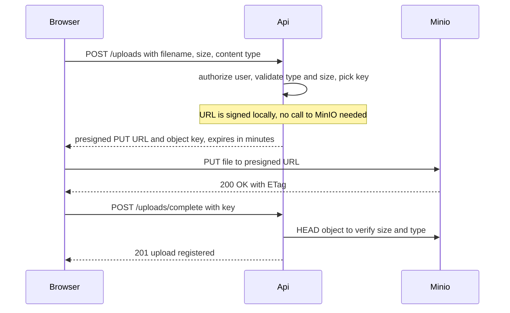

# Access and Security (Q5-Q9)

> **Reviewed:** 2026-09 · **Level:** Senior · **Type:** Foundational

## Q5. Applications authenticate with access keys, never with the root user

MinIO uses S3-style credentials: an access key and a secret key, used to sign requests with AWS Signature V4. The root user (from `MINIO_ROOT_USER`/`MINIO_ROOT_PASSWORD`) is for administration only. Create a user or service account per application, attach a least-privilege policy, and store secrets in your secret manager. MinIO can also integrate with external identity providers (OpenID Connect, LDAP/AD) to issue temporary credentials.

**Example:**

```bash
mc admin user add local media-api 'long-random-secret'
mc admin policy create local media-api-rw ./media-api-policy.json
mc admin policy attach local media-api-rw --user media-api
```

**Trade-offs and pitfalls:**

- `mc admin` subcommands have changed across releases (for example, older `policy add`/`policy set` vs newer `policy create`/`policy attach`); match commands to your version's docs.
- Long-lived static keys in environment variables leak via logs and crash dumps; prefer short-lived credentials where your platform supports them.

**Remember:** One identity per app, least privilege, no root keys in apps.

## Q6. IAM-style policies grant identities actions on resources; bucket policies attach rules to a bucket

MinIO policies use the same JSON grammar as AWS IAM: `Effect`, `Action` (`s3:GetObject`, `s3:PutObject`, `s3:ListBucket`...), `Resource` (ARNs like `arn:aws:s3:::uploads/*`), and optional `Condition`. Identity policies are attached to users/groups; bucket policies are attached to a bucket and are mostly used to allow anonymous access to specific prefixes (e.g., public assets).

**Example:**

```json
{
  "Version": "2012-10-17",
  "Statement": [
    {
      "Effect": "Allow",
      "Action": ["s3:PutObject", "s3:GetObject", "s3:DeleteObject"],
      "Resource": ["arn:aws:s3:::uploads/*"]
    },
    {
      "Effect": "Allow",
      "Action": ["s3:ListBucket"],
      "Resource": ["arn:aws:s3:::uploads"],
      "Condition": { "StringLike": { "s3:prefix": ["tenant-17/*"] } }
    }
  ]
}
```

**Trade-offs and pitfalls:**

- `ListBucket` applies to the bucket ARN, object actions to `bucket/*`; mixing them up is the most common policy bug.
- Anonymous read on a whole bucket is how data leaks happen. If something must be public, use a dedicated public bucket or prefix, ideally behind a CDN.

**Remember:** Bucket ARN for list, `bucket/*` for objects, deny by default.

## Q7. Presigned URLs let clients upload or download directly, without your credentials

A presigned URL is a normal S3 URL with a SigV4 signature in the query string, generated server-side with your app's credentials, valid for a limited time and for one operation on one key. The browser uses it to `PUT` or `GET` directly against MinIO, so large files never pass through your API servers, and buckets stay private.

**How it works:**



**Example:**

```javascript
import { S3Client, PutObjectCommand, GetObjectCommand } from '@aws-sdk/client-s3';
import { getSignedUrl } from '@aws-sdk/s3-request-presigner';

// Sign with the PUBLIC endpoint the browser will call
const s3 = new S3Client({
  endpoint: 'https://files.example.com',
  region: 'us-east-1',
  forcePathStyle: true,
  credentials: { accessKeyId: process.env.S3_KEY, secretAccessKey: process.env.S3_SECRET },
});

const key = `uploads/tenant-17/users/${userId}/${crypto.randomUUID()}.jpg`;
const uploadUrl = await getSignedUrl(
  s3,
  new PutObjectCommand({ Bucket: 'media', Key: key, ContentType: 'image/jpeg' }),
  { expiresIn: 300 },
);
const downloadUrl = await getSignedUrl(
  s3,
  new GetObjectCommand({ Bucket: 'media', Key: key, ResponseContentDisposition: 'attachment' }),
  { expiresIn: 600 },
);
```

**Trade-offs and pitfalls:**

- The host is part of the signature. If you sign with an internal hostname (`http://minio:9000`) the browser can't reach it, and rewriting the host in a proxy invalidates the signature. Sign with the public endpoint.
- Anyone holding the URL can use it until it expires; keep expiry short and don't log full URLs.
- SigV4 presigned URLs have a maximum validity of seven days.
- A presigned PUT doesn't enforce a max size by itself; verify after upload (HEAD) or use a presigned POST policy with a `content-length-range` condition.
- Browser uploads need CORS configured on the storage side for your origin; how MinIO configures CORS depends on the version, so check its docs.

**Remember:** API authorizes and signs; the client talks to storage directly; always verify after upload.

## Q8. Server-side encryption protects data at rest; choose who holds the keys

MinIO supports the S3 server-side encryption modes: SSE-S3 (the server manages keys, backed by a KMS), SSE-KMS (a named key in a KMS), and SSE-C (the client supplies the key with every request). MinIO integrates with external KMS systems through its KES component. You can set default encryption per bucket so every new object is encrypted.

**Example:**

```bash
mc encrypt set sse-s3 local/media           # default encryption for new objects in a bucket
```

**Trade-offs and pitfalls:**

- Losing the KMS or its keys means losing the data; KMS availability and backup are part of the storage SLA.
- SSE-C shifts key management onto the application; lose the key and the object is unrecoverable, and presigned URLs become awkward.
- Encryption at rest does not replace TLS in transit; enable TLS on MinIO endpoints.

**Remember:** Encrypt by default per bucket, and treat the KMS as critical infrastructure.

## Q9. Default to private buckets and serve content through your app, presigned URLs or a CDN

A private bucket with no anonymous policy is the safe baseline. Users get access to specific objects via presigned URLs issued after authorization, or via a CDN configured to fetch from storage with its own credentials or signed-URL scheme. Only truly public assets (marketing images, open downloads) belong in a public-read bucket.

**Example:** A document-sharing app keeps everything private. When a user opens a document, the API checks the ACL in its database, then returns a 5-minute presigned GET URL. Avatars, which are public, live in a separate `public-assets` bucket behind a CDN with immutable keys.

**Trade-offs and pitfalls:**

- Presigned URLs defeat CDN caching if every URL is unique; for cacheable private content, use CDN signed URLs/cookies instead.
- Audit bucket policies regularly; one `"Principal": "*"` statement makes a bucket public.
- Enable audit logging and alert on policy changes.

**Remember:** Private by default; access is granted per request, not per bucket.

## References

- [MinIO documentation: identity, access management, encryption](https://min.io/docs/minio/linux/index.html)
- [Amazon S3 User Guide: presigned URLs, policies, encryption](https://docs.aws.amazon.com/AmazonS3/latest/userguide/Welcome.html)
