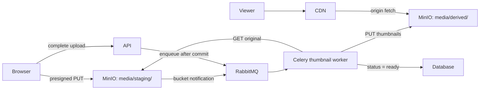

# App Integration (Q26-Q30)

> **Reviewed:** 2026-09 · **Level:** Senior · **Type:** Foundational

## Q26. Node apps use `@aws-sdk/client-s3` with a custom endpoint and path-style addressing

The AWS SDK v3 works with MinIO by setting `endpoint`, a `region` (MinIO's default is `us-east-1`), credentials, and `forcePathStyle: true`. Path-style (`https://host/bucket/key`) avoids needing wildcard DNS and certificates for virtual-hosted style (`https://bucket.host/key`).

**Example:**

```javascript
// storage.js
import { S3Client, PutObjectCommand, HeadObjectCommand } from '@aws-sdk/client-s3';

export const s3 = new S3Client({
  endpoint: process.env.S3_ENDPOINT,            // http://minio:9000 in dev, https://files.example.com in prod
  region: process.env.S3_REGION ?? 'us-east-1',
  forcePathStyle: true,
  credentials: {
    accessKeyId: process.env.S3_ACCESS_KEY,
    secretAccessKey: process.env.S3_SECRET_KEY,
  },
});

export async function putJson(bucket, key, value) {
  await s3.send(new PutObjectCommand({
    Bucket: bucket,
    Key: key,
    Body: JSON.stringify(value),
    ContentType: 'application/json',
  }));
}

export async function exists(bucket, key) {
  try {
    await s3.send(new HeadObjectCommand({ Bucket: bucket, Key: key }));
    return true;
  } catch (err) {
    if (err.$metadata?.httpStatusCode === 404) return false;
    throw err;
  }
}
```

**Trade-offs and pitfalls:**

- Use two clients if needed: an internal endpoint for server-side reads/writes and the public endpoint for signing browser URLs.
- Recent AWS SDK versions add default integrity checksums to uploads; if an S3-compatible server or an older MinIO rejects them, check the SDK's checksum configuration options.
- More Node background: [Node/Express question index](../node-express/question-index.md).

**Remember:** Same SDK as S3: endpoint + region + `forcePathStyle: true`.

## Q27. Python apps use boto3 (or the MinIO SDK) pointed at the MinIO endpoint

boto3 works by passing `endpoint_url` and a config with SigV4 and path-style addressing. The `minio` Python package is a lighter, MinIO-maintained client with a simple API. Either is fine; boto3 keeps code portable to AWS S3.

**Example:**

```python
import boto3
from botocore.config import Config

s3 = boto3.client(
    "s3",
    endpoint_url="http://minio:9000",
    aws_access_key_id=settings.S3_ACCESS_KEY,
    aws_secret_access_key=settings.S3_SECRET_KEY,
    region_name="us-east-1",
    config=Config(signature_version="s3v4", s3={"addressing_style": "path"}),
)
s3.upload_file("/tmp/report.csv", "exports", "tenant-17/report-9912.csv",
               ExtraArgs={"ContentType": "text/csv"})
url = s3.generate_presigned_url("get_object",
                                Params={"Bucket": "exports", "Key": "tenant-17/report-9912.csv"},
                                ExpiresIn=600)
```

```python
from datetime import timedelta
from minio import Minio

client = Minio("minio:9000", access_key=settings.S3_ACCESS_KEY,
               secret_key=settings.S3_SECRET_KEY, secure=False)
if not client.bucket_exists("exports"):
    client.make_bucket("exports")
client.fput_object("exports", "tenant-17/report-9912.csv", "/tmp/report.csv",
                   content_type="text/csv")
url = client.presigned_get_object("exports", "tenant-17/report-9912.csv",
                                  expires=timedelta(minutes=10))
```

**Trade-offs and pitfalls:**

- boto3 clients are thread-safe but not fork-safe to share across processes; in Celery prefork workers create them per process ([Celery production patterns](../celery/10-production-patterns.md)).
- Creating buckets at app startup is fine for dev; in production, provision buckets, policies and lifecycle via infrastructure code.
- `secure=False` is for local development only.

**Remember:** boto3 for portability, MinIO SDK for simplicity; both need the endpoint and path-style.

## Q28. A media pipeline uploads originals, emits an event, and lets Celery workers make derivatives

The standard design: the client uploads the original directly to a staging prefix with a presigned URL. Completion is signaled either by the client calling the API or by a MinIO bucket notification (MinIO can publish object events to targets such as AMQP/RabbitMQ, Kafka, Redis, NATS, PostgreSQL or webhooks). A Celery task downloads the original, validates it, generates thumbnails, writes derivatives under deterministic keys, and updates the DB.

**How it works:**



**Example:**

```python
import io
from PIL import Image
from celery import shared_task
from celery.signals import worker_process_init

s3 = None

@worker_process_init.connect
def init_s3(**_):
    global s3
    s3 = make_boto3_client()          # per process, after fork

SIZES = (256, 1024)

@shared_task(bind=True, acks_late=True, autoretry_for=(ConnectionError,),
             retry_backoff=True, retry_kwargs={"max_retries": 5},
             soft_time_limit=120, time_limit=150)
def make_thumbnails(self, media_id: int) -> None:
    media = Media.objects.get(pk=media_id)
    if media.status == "ready":
        return                                             # idempotent
    obj = s3.get_object(Bucket="media", Key=media.staging_key)
    img = Image.open(io.BytesIO(obj["Body"].read()))       # images are small enough; stream for video
    for size in SIZES:
        thumb = img.copy()
        thumb.thumbnail((size, size))
        buf = io.BytesIO()
        thumb.convert("RGB").save(buf, "WEBP", quality=80)
        buf.seek(0)
        s3.put_object(Bucket="media", Key=f"derived/{media.id}/{size}.webp",
                      Body=buf, ContentType="image/webp",
                      CacheControl="public, max-age=31536000, immutable")
    media.status = "ready"
    media.save(update_fields=["status"])
```

**Trade-offs and pitfalls:**

- Deterministic derivative keys make the task idempotent: re-running overwrites identical outputs.
- Bucket notifications can deliver duplicates or arrive before your DB row exists; reconcile by key, and prefer the API completion path when you need DB state.
- Image and video decoders are an attack surface; set pixel limits (Pillow has decompression-bomb protection), time limits, memory limits and run these workers in an isolated queue ([Celery routing](../celery/05-routing-queues-priorities.md)).

**Remember:** Upload direct, event on completion, idempotent Celery worker writes deterministic derivatives.

## Q29. Put a CDN in front of MinIO for public or cacheable content

MinIO is the origin; a CDN (or a caching reverse proxy) serves reads close to users, absorbs traffic spikes and reduces load and egress from your storage. Use immutable, versioned keys (`derived/42/256.webp?v=3` or a content hash in the key) with long `Cache-Control`, so you never need to purge.

**Example:**

- Public assets bucket (or prefix) readable by the CDN only (origin credentials or an allow-listed network), not by the internet directly.
- Private content: CDN signed URLs or signed cookies issued by your API after authorization, instead of per-request storage presigned URLs.
- Cache keys ignore irrelevant query strings; strip storage signatures from logs.

**Trade-offs and pitfalls:**

- Mutable keys (overwriting `avatar.png`) require CDN invalidations and still leave stale caches; prefer new keys.
- A CDN in front of presigned storage URLs caches poorly because every URL is unique.
- Set `Content-Type` and `Content-Disposition` correctly at upload; the CDN will faithfully cache wrong headers.

**Remember:** Immutable keys + long cache headers + CDN = cheap, fast reads.

## Q30. Configuration and environments should make MinIO and S3 interchangeable

Treat storage as configuration: endpoint, region, bucket names, credentials and public base URL come from environment variables or a secret store. Local development and CI run MinIO in Docker Compose; staging and production point at MinIO clusters or S3. Code only talks the S3 API.

**Example:**

```yaml
# docker-compose.yml (dev)
services:
  minio:
    image: quay.io/minio/minio        # check current image availability for the community edition
    command: server /data --console-address ":9001"
    environment:
      MINIO_ROOT_USER: minioadmin
      MINIO_ROOT_PASSWORD: dev-only-password
    ports: ["9000:9000", "9001:9001"]
    volumes: ["minio-data:/data"]
  api:
    build: .
    environment:
      S3_ENDPOINT: http://minio:9000
      S3_PUBLIC_ENDPOINT: http://localhost:9000   # used for presigned URLs the browser opens
      S3_BUCKET_MEDIA: media
      S3_ACCESS_KEY: dev-access-key
      S3_SECRET_KEY: dev-secret-key
volumes:
  minio-data: {}
```

**Trade-offs and pitfalls:**

- The internal vs public endpoint split (Q26, and the presigned URL host pitfall in [Access and security](./02-access-and-security.md)) is the most common MinIO-in-Docker bug.
- Integration tests should create buckets and clean up per test run to stay isolated.
- Keep an escape hatch: if you later move between MinIO and S3, only config and data migration change.

**Remember:** The S3 API is the contract; endpoints and credentials are configuration.

## References

- [MinIO documentation: SDKs, bucket notifications](https://min.io/docs/minio/linux/index.html)
- [Amazon S3 User Guide](https://docs.aws.amazon.com/AmazonS3/latest/userguide/Welcome.html)
- [Celery section (this site)](../celery/index.md)
- [RabbitMQ section (this site)](../rabbitmq/index.md)
