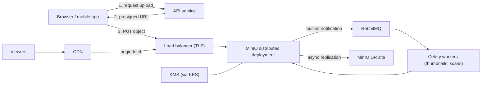

# MinIO Object Storage Overview (Q1-Q30)

> **Reviewed:** 2026-09 · **Level:** Senior · **Type:** Foundational

MinIO is a self-hosted object store that implements the Amazon S3 API. Applications use standard S3 SDKs against a MinIO endpoint to store user uploads, media, exports, backups and datasets on infrastructure you control. This section covers object storage concepts, security, upload and download patterns, data protection, operations, the MinIO vs S3 decision (including AGPLv3 licensing), and application integration.

For AWS S3 specifics see [AWS cloud architecture](../../devops/cloud/01-aws-cloud-architecture.md).

## When to use MinIO

- Data residency, on-prem, air-gapped or edge requirements.
- Large, predictable data volumes where self-hosting is cheaper once operations are counted.
- Local development and CI parity for code that uses S3.
- Kubernetes-native storage for platform teams that can operate it.

Prefer managed S3 (or another managed object store) when your team doesn't want to own storage operations ([MinIO vs S3](./06-minio-vs-s3.md)).

## Architecture

## Learning order

| # | Topic | Questions |
|---|---|---|
| 1 | [Object storage fundamentals](./01-object-storage-fundamentals.md) | Q1-Q4 |
| 2 | [Access and security](./02-access-and-security.md) | Q5-Q9 |
| 3 | [Uploads and downloads](./03-uploads-downloads.md) | Q10-Q14 |
| 4 | [Versioning, lifecycle and replication](./04-versioning-lifecycle-replication.md) | Q15-Q18 |
| 5 | [Architecture and operations](./05-architecture-and-ops.md) | Q19-Q22 |
| 6 | [MinIO vs S3](./06-minio-vs-s3.md) | Q23-Q25 |
| 7 | [App integration](./07-app-integration.md) | Q26-Q30 |

Quick access: [Question index](./question-index.md) · [Cheatsheet](./cheatsheet.md)

> **Interview tip:** The most common system design use of object storage is "presigned direct upload, async processing, CDN for reads". Be able to draw it and explain each security check.

## Related sections

- [Celery](../celery/index.md) for processing pipelines and [RabbitMQ](../rabbitmq/index.md) for events
- [Orchestration](../../devops/orchestration/index.md) for running MinIO on Kubernetes
- [System design case studies](../../case-studies/index.md), especially file storage and video streaming
