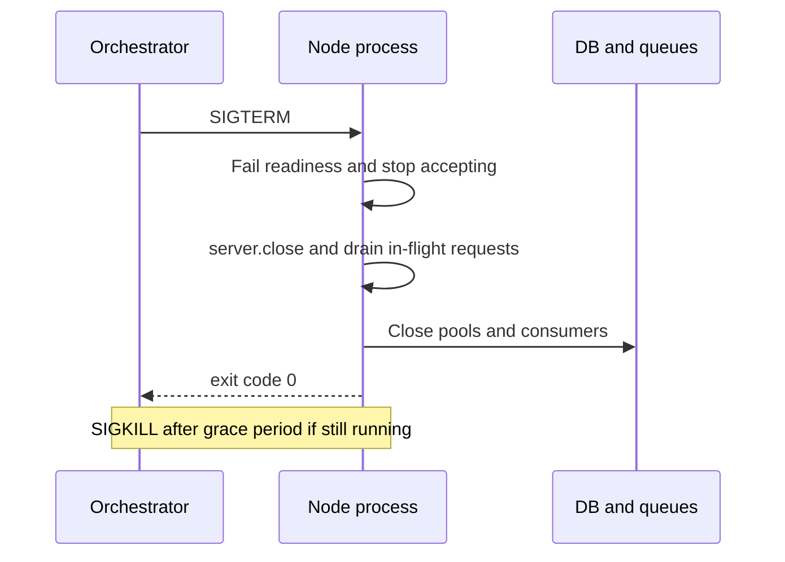

# 🚀 1. Node.js Fundamentals & Modules (Q1–18)

> **Reviewed:** 2026-09 · Modernized; legacy topics are labeled.

---

## Q1. ❓ Node.js and what problem it solves

Node.js is a JavaScript runtime built on Chrome's V8 engine that enables server-side JavaScript execution - it solves the problem of using JavaScript for both frontend and backend development, enabling JavaScript everywhere with the same language. Perfect for real-time applications, APIs, and microservices.

- **Trade-offs**: Enables JavaScript everywhere - same language for frontend and backend - non-blocking I/O model makes it efficient for I/O-heavy applications. Large ecosystem with npm package manager - single-threaded event loop handles thousands of concurrent connections, but watch out - CPU-intensive tasks can block the event loop.

Example:

```javascript
const http = require('http'); // Node.js built-in HTTP module
// Create server with request handler callback
const server = http.createServer((req, res) => {
  res.writeHead(200, {'Content-Type': 'text/plain'}); // Set response headers
  res.end('Hello World!'); // Send response and end connection
});
// Start server listening on port 3000
server.listen(3000, () => console.log('Server running on port 3000'));

```

## Q2. ⚡ Event Loop: its role and how it processes asynchronous tasks

The Event Loop is Node.js's core mechanism that continuously monitors the call stack and callback queue, executing callbacks when the stack is empty - it has six phases (timers, pending callbacks, idle/prepare, poll, check, close callbacks) that process different types of operations. Enables non-blocking behavior in single-threaded environment.

**Simple Mental Model**: Think of the event loop as a restaurant waiter - it takes orders (callbacks), serves them one by one, and keeps checking if new orders are ready. The six phases are like different stations in the kitchen, each handling specific types of orders.

### **The Six Phases (In Order):**

**1. Timers Phase** ⏰

- Executes `setTimeout()` and `setInterval()` callbacks

- Only runs callbacks whose time has come

- *Remember*: "Timers first - scheduled tasks"

**2. Pending Callbacks Phase** ⏳

- Executes I/O callbacks that were deferred from the previous loop

- Handles leftover callbacks that couldn't run before

- *Remember*: "Pending - catching up on missed work"

**3. Idle/Prepare Phase** 🔧

- Internal Node.js operations (you don't use this directly)

- Node.js does its own housekeeping

- *Remember*: "Idle - Node.js internal stuff"

**4. Poll Phase** 📡 (Most Important!)

- Fetches new I/O events (file reads, network requests)

- Executes I/O callbacks - **this is where most of your code runs**

- If queue is empty, waits for new events or moves to next timer

- *Remember*: "Poll - where the action happens"

**5. Check Phase** ✅

- Executes `setImmediate()` callbacks

- Runs right after poll phase completes

- *Remember*: "Check - immediate tasks after I/O"

**6. Close Callbacks Phase** 🔒

- Executes cleanup callbacks (e.g., `socket.on('close')`)

- Handles closing connections and cleanup

- *Remember*: "Close - cleanup time"

### **Microtasks (Between Every Phase):**

After **each phase**, Node.js processes microtasks before moving to the next phase:

- `process.nextTick()` - **Highest priority** (runs first)

- Promise callbacks - Second priority

- *Remember*: "Microtasks run between every phase, nextTick beats Promises"

**Execution Order Priority:**

1. `process.nextTick()` (highest)

2. Promise callbacks

3. Timers (`setTimeout`)

4. I/O callbacks

5. `setImmediate()`

- **Trade-offs**: Microtasks (process.nextTick, Promises) have higher priority than macrotasks - poll phase handles I/O events and timers. Event loop continues until no more callbacks to execute, but watch out - too many microtasks can starve the event loop and block I/O operations.

Example:

```javascript
console.log('1'); // Synchronous: executes immediately
setTimeout(() => console.log('2'), 0); // Timer: scheduled for next tick
setImmediate(() => console.log('3')); // Check phase: runs after poll
process.nextTick(() => console.log('4')); // Microtask: highest priority
console.log('5'); // Synchronous: executes immediately
// Output: 1, 5, 4, 2, 3
// Order: sync code → nextTick (microtask) → setTimeout (timer) → setImmediate (check)

```

## Q3. ❓ V8 engine and how it works with Node.js

V8 is Google's open-source JavaScript engine written in C++ that compiles and executes JavaScript code - it's the same engine that powers Chrome browser. Node.js uses V8 to run JavaScript on the server-side, giving you the same JavaScript runtime in both browser and server environments.

**Simple Mental Model**: Think of V8 as a translator - it takes your JavaScript code (human language) and translates it into machine code (computer language) that your CPU can understand and execute.

### **How V8 Works:**

**1. Parsing & Compilation** 📝

- **Parser**: Converts JavaScript source code into Abstract Syntax Tree (AST)

- **Ignition Interpreter**: Generates bytecode from AST (fast startup)

- **TurboFan Compiler**: Optimizes hot code (frequently executed) into machine code (fast execution)

- *Remember*: "Parse → Bytecode → Optimize hot code"

**2. Execution Model** ⚡

- **Just-In-Time (JIT) Compilation**: Code is compiled during execution, not before

- **Hot Code Optimization**: Frequently used code gets optimized to machine code

- **Deoptimization**: If assumptions change, optimized code falls back to bytecode

- *Remember*: "JIT - compile as you go, optimize what's hot"

**3. Memory Management** 🧠

- **Heap**: Stores objects, functions, and variables (managed by garbage collector)

- **Call Stack**: Tracks function calls (LIFO - Last In, First Out)

- **Garbage Collection**: Automatically frees unused memory (Mark-and-Sweep algorithm)

- *Remember*: "Heap stores data, Stack tracks calls, GC cleans up"

### **V8 Components:**

**Call Stack** 📚

- Tracks function execution (LIFO structure)

- Each function call creates a stack frame

- When function returns, frame is popped

- *Example*: `main() → funcA() → funcB()` (funcB executes first, then funcA, then main)

**Heap** 💾

- Stores objects, arrays, closures, and variables

- Managed by garbage collector

- Two generations: Young (new objects) and Old (long-lived objects)

**Event Loop Integration** 🔄

- V8 executes JavaScript code synchronously

- When async operations occur, V8 hands them to Node.js (libuv)

- Node.js event loop manages I/O and calls back to V8 when ready

- *Remember*: "V8 runs JS, Node.js handles I/O, Event Loop connects them"

### **How V8 Works with Node.js:**

```text
JavaScript Code → V8 Engine → Machine Code
                      ↓
              Node.js (libuv)
                      ↓
            Event Loop + I/O Operations
                      ↓
              Callback → V8 (executes)

```

**The Flow:**

1. **V8 compiles** your JavaScript to machine code

2. **V8 executes** synchronous code on the call stack

3. **Node.js (libuv)** handles async I/O operations

4. **Event Loop** schedules callbacks back to V8

5. **V8 executes** the callbacks when called

**Key Features:**

- **Fast Startup**: Ignition interpreter starts quickly

- **Fast Execution**: TurboFan optimizes hot code

- **Memory Efficient**: Generational garbage collection

- **Cross-Platform**: Works on Windows, macOS, Linux

- **Trade-offs**: V8 provides fast JavaScript execution with JIT compilation - hot code gets optimized to near-native speed. Garbage collection is automatic but can cause pauses - V8 uses generational GC to minimize impact. V8 is single-threaded for JavaScript execution, but Node.js uses worker threads for CPU-intensive tasks. The catch is V8's optimization assumptions can break, causing deoptimization and performance drops.

Example:

```javascript
// V8 compiles this to machine code
function calculateSum(a, b) {
  return a + b; // Hot code - gets optimized by TurboFan
}

// Call stack: calculateSum() → main()
console.log(calculateSum(5, 3)); // V8 executes this

// Async operation - V8 hands to Node.js
setTimeout(() => {
  // V8 executes this callback when event loop calls it
  console.log('Async callback');
}, 1000);

```

## Q4. ❓ Non-blocking I/O and how it works in Node.js

**Non-blocking I/O** is a programming model where I/O operations (file reads, network requests, database queries) don't block the execution thread - instead, the program initiates the operation and continues executing other code immediately, then handles the result via callbacks when the operation completes. This is the core mechanism that makes Node.js highly scalable and performant.

**Simple Mental Model**: Think of non-blocking I/O like ordering food at a restaurant - you place your order (initiate I/O), the kitchen works on it (system handles I/O), and you can do other things (execute other code) while waiting. When your food is ready (I/O completes), the waiter brings it to you (callback executes).

### **Complete Definition:**

**Non-blocking I/O** means:

- **Initiate and Continue**: Start an I/O operation and immediately move to the next line of code

- **No Waiting**: Don't pause execution while waiting for I/O to complete

- **Asynchronous**: Handle results later through callbacks, promises, or async/await

- **Kernel Delegation**: I/O operations are handled by the operating system kernel

- **Event-Driven**: Results are delivered via events when ready

### **How It Works in Node.js:**

**1. The Flow** 🔄

```text

1. JavaScript code initiates I/O (e.g., fs.readFile)

2. Node.js delegates to libuv (C++ library)

3. libuv uses OS kernel for actual I/O operation

4. JavaScript thread continues executing other code

5. When I/O completes, kernel notifies libuv

6. libuv queues callback in event loop

7. Event loop executes callback when ready

```

**2. Key Components** 🧩

**libuv (C++ Library)**

- Handles all I/O operations (file system, network, timers)

- Uses OS-specific APIs (epoll on Linux, kqueue on macOS, IOCP on Windows)

- Manages thread pool for blocking operations

- *Remember*: "libuv is Node.js's I/O engine"

**Event Loop**

- Monitors I/O completion

- Executes callbacks when I/O is ready

- Keeps single thread free for JavaScript execution

- *Remember*: "Event loop connects I/O completion to callbacks"

**Thread Pool** (for blocking operations)

- Used for CPU-intensive or blocking operations (crypto, file compression)

- Default: 4 threads (configurable)

- Prevents blocking the main thread

- *Remember*: "Thread pool handles blocking work"

### **Blocking vs Non-Blocking:**

**Blocking I/O** ❌

```javascript
// Blocking - thread waits until file is read
const data = fs.readFileSync('file.txt', 'utf8');
console.log(data); // Waits here until file is read
console.log('This runs after file is read');

```

**Non-Blocking I/O** ✅

```javascript
// Non-blocking - thread continues immediately
fs.readFile('file.txt', 'utf8', (err, data) => {
  console.log(data); // Runs when file is ready
});
console.log('This runs immediately, not waiting');

```

### **Why Non-Blocking I/O Matters:**

**Scalability** 📈

- Single thread can handle thousands of concurrent connections

- No thread creation overhead per request

- Memory efficient (no per-connection thread stack)

**Performance** ⚡

- No thread blocking = better CPU utilization

- Perfect for I/O-heavy applications (APIs, web servers)

- Can handle many requests with minimal resources

**Real-World Example:**

```text
Traditional (Blocking): 1 thread per request

- 1000 requests = 1000 threads = High memory usage

Node.js (Non-Blocking): 1 thread for all requests

- 1000 requests = 1 thread = Low memory usage

```

### **Types of I/O Operations:**

**1. File System I/O** 📁

```javascript
fs.readFile('file.txt', callback); // Non-blocking
fs.writeFile('file.txt', data, callback); // Non-blocking

```

**2. Network I/O** 🌐

```javascript
http.get('url', callback); // Non-blocking
fetch('url').then(...); // Non-blocking

```

**3. Database I/O** 💾

```javascript
db.query('SELECT * FROM users', callback); // Non-blocking

```

**4. DNS Lookups** 🔍

```javascript
dns.lookup('example.com', callback); // Non-blocking

```

- **Trade-offs**: Prevents thread blocking during I/O operations - dramatically improves performance for I/O-heavy applications. Enables handling thousands of concurrent connections with single thread, but watch out - CPU-intensive operations still block the event loop. Non-blocking I/O is perfect for web servers, APIs, and real-time applications, but not ideal for CPU-bound tasks like image processing or heavy calculations (use worker threads for those).

Example:

```javascript
const fs = require('fs');
const http = require('http');

// Non-blocking file read
fs.readFile('data.txt', 'utf8', (err, data) => {
  if (err) throw err;
  console.log('File content:', data); // Executes when file is ready
});

// This runs immediately, not waiting for file read
console.log('This runs immediately, not waiting for file read');

// Non-blocking HTTP request
http.get('http://api.example.com/data', (res) => {
  console.log('Response received'); // Executes when response arrives
});

console.log('This also runs immediately');
// Output order:
// "This runs immediately, not waiting for file read"
// "This also runs immediately"
// "File content: ..." (when file is ready)
// "Response received" (when response arrives)

```

## Q5. 📦 Process object in Node.js

The `process` object is a global Node.js object that provides information about the current Node.js process and allows interaction with the operating system - it gives you access to process ID, environment variables, command line arguments, memory usage, current working directory, and process control methods. Essential for process management, configuration, and system interaction.

**Simple Mental Model**: Think of the `process` object as Node.js's "control panel" - it gives you information about the current running process and allows you to control it, just like a dashboard shows you system info and allows you to manage it.

### **Complete Definition:**

**process** is:

- **Global Object**: Available in all Node.js modules without requiring

- **Process Information**: Provides details about the current Node.js process

- **System Interaction**: Allows interaction with the operating system

- **Environment Access**: Provides access to environment variables

- **Process Control**: Methods to control process lifecycle

### **Key Properties:**

**1. Process Identification** 🆔

- `process.pid` - Process ID (unique identifier)

- `process.ppid` - Parent process ID

- `process.versions` - Node.js and dependency versions

- *Remember*: "PID identifies the process"

**2. Environment & Configuration** ⚙️

- `process.env` - Environment variables object

- `process.argv` - Command line arguments array

- `process.cwd()` - Current working directory

- `process.platform` - Operating system platform

- *Remember*: "env for environment, argv for arguments"

**3. Memory & Performance** 💾

- `process.memoryUsage()` - Memory consumption information

- `process.uptime()` - Process uptime in seconds

- `process.cpuUsage()` - CPU usage information

- *Remember*: "Memory and CPU usage tracking"

**4. Process Control** 🎛️

- `process.exit()` - Terminate the process

- `process.kill()` - Send signal to process

- `process.nextTick()` - Schedule callback

- *Remember*: "Control process lifecycle"

### **Common Use Cases:**

**1. Environment Configuration**

```javascript
const port = process.env.PORT || 3000;
const nodeEnv = process.env.NODE_ENV || 'development';

```

**2. Command Line Arguments**

```javascript
// node app.js --port=3000 --env=production
const args = process.argv.slice(2);
const port = args.find(arg => arg.startsWith('--port'))?.split('=')[1];

```

**3. Process Information**

```javascript
console.log('Process ID:', process.pid);
console.log('Node version:', process.version);
console.log('Platform:', process.platform);
console.log('Working directory:', process.cwd());

```

**4. Memory Monitoring**

```javascript
const usage = process.memoryUsage();
console.log({
  heapUsed: `${Math.round(usage.heapUsed / 1024 / 1024)} MB`,
  heapTotal: `${Math.round(usage.heapTotal / 1024 / 1024)} MB`,
  external: `${Math.round(usage.external / 1024 / 1024)} MB`
});

```

**5. Process Events**

```javascript
// Handle process termination
process.on('SIGTERM', () => {
  console.log('Received SIGTERM, shutting down gracefully');
  process.exit(0);
});

// Handle uncaught exceptions
process.on('uncaughtException', (error) => {
  console.error('Uncaught Exception:', error);
  process.exit(1);
});

// Handle unhandled promise rejections
process.on('unhandledRejection', (reason, promise) => {
  console.error('Unhandled Rejection:', reason);
});

```

- **Trade-offs**: process object provides essential process information and control - enables environment-based configuration and process management. Essential for production applications - allows graceful shutdowns and error handling. The catch is process is a global object, so be careful with modifications that could affect the entire application.

Example:

```javascript
// Process information
console.log('Process ID:', process.pid);
console.log('Node version:', process.version);
console.log('Platform:', process.platform);
console.log('Working directory:', process.cwd());

// Environment variables
console.log('Environment:', process.env.NODE_ENV);
const port = process.env.PORT || 3000;

// Command line arguments
// node app.js arg1 arg2
console.log('Arguments:', process.argv);
// ['node', 'app.js', 'arg1', 'arg2']

// Memory usage
const usage = process.memoryUsage();
console.log('Memory usage:', {
  heapUsed: `${Math.round(usage.heapUsed / 1024 / 1024)} MB`,
  heapTotal: `${Math.round(usage.heapTotal / 1024 / 1024)} MB`
});

// Process events
process.on('exit', (code) => {
  console.log(`Process exiting with code: ${code}`);
});

```

---

## Q6. 🤔 `process.exit()` vs `process.kill()`

`process.exit()` terminates the current Node.js process with an exit code (0 for success, non-zero for failure), while `process.kill()` sends a signal to another process by PID. `process.exit()` is for graceful shutdown of current process, `process.kill()` is for inter-process communication and controlling other processes.

- **Trade-offs**: `process.exit()` terminates current process immediately - `process.kill()` sends signal to another process. `process.exit(code)` allows exit code specification - `process.kill(pid, signal)` allows signal specification (SIGTERM, SIGKILL, etc.). Use `process.exit()` for graceful shutdown - use `process.kill()` for process management, but watch out - `process.exit()` can prevent cleanup code from running, so use graceful shutdown patterns.

Example:

```javascript
// process.exit() - terminates current process
if (error) {
  console.error('Fatal error');
  process.exit(1); // Exit with error code
}

// Graceful shutdown before exit
function gracefulShutdown() {
  server.close(() => {
    console.log('Server closed');
    process.exit(0); // Exit with success code
  });
}

// process.kill() - sends signal to another process
const child = spawn('node', ['worker.js']);

// Send SIGTERM to child process
process.kill(child.pid, 'SIGTERM');

// Send SIGKILL to force termination
process.kill(child.pid, 'SIGKILL');

// Kill current process with signal
process.kill(process.pid, 'SIGTERM');

```

---

## Q7. 🎬 `process.nextTick()`, `setImmediate()`, and `setTimeout()`: differences

process.nextTick() executes in the current phase (highest priority), setImmediate() executes in the check phase (after I/O events), and setTimeout() executes in the timers phase (minimum 1ms delay) - they have different priorities and timing, with process.nextTick having highest priority.

- **Trade-offs**: process.nextTick executes before any other phase - setImmediate executes in check phase, after I/O events. setTimeout executes in timers phase with minimum 1ms delay - setImmediate more efficient for I/O-heavy applications, but watch out - process.nextTick can starve the event loop if used excessively.

Example:

```javascript
setTimeout(() => console.log('setTimeout'), 0);
setImmediate(() => console.log('setImmediate'));
process.nextTick(() => console.log('process.nextTick'));
// Output: process.nextTick, setTimeout, setImmediate

```

---

## Q8. 🧩 CommonJS vs ES Modules

CommonJS uses `require()` and `module.exports` for synchronous loading (runtime resolution, dynamic imports), while ES Modules use `import`/`export` for asynchronous loading with static analysis capabilities (compile-time resolution, static imports). ES Modules support tree-shaking and better optimization.

- **Trade-offs**: CommonJS is synchronous with runtime resolution - ES Modules are asynchronous with compile-time resolution. ES Modules support tree-shaking and better optimization. A plain `.js` file is still treated as CommonJS unless the nearest package.json has `"type": "module"` (or you use `.mjs`), but modern Node (22.7+) also detects ESM syntax in ambiguous files automatically. Can mix both but with limitations and performance considerations.

**2026 view:** ESM is the default choice for new Node 22/24 projects - most major libraries ship ESM, top-level `await` works, and `import.meta.dirname` / `import.meta.filename` (Node 20.11+) replace `__dirname` / `__filename`. The old "you can't `require()` an ES module" rule is outdated: `require(esm)` works without a flag in Node 22.12+ and 20.19+, as long as the ES module has no top-level `await`.

> **Legacy note (2026):** CommonJS is still everywhere in existing codebases and interviews still ask about it, so know both. Prefer ESM for new code.

Example:

```javascript
// CommonJS
const fs = require('node:fs');
module.exports = { readFile: fs.readFile };

// ES Modules
import { readFile } from 'node:fs/promises';
export { readFile };

// ESM equivalent of __dirname
const here = import.meta.dirname;

```

---

## Q9. ⚠️ Handling errors in Node.js applications

Error handling in Node.js should use try/catch blocks for synchronous code and async/await, error-first callbacks only for legacy callback APIs, proper error propagation, and global error handlers. Handle both synchronous and asynchronous errors, use error boundaries, log errors with context, and prevent unhandled promise rejections from crashing the application.

- **Trade-offs**: Use try/catch for synchronous code - use error-first callbacks for async operations. Handle both sync and async errors - use global error handlers for uncaught exceptions. Log errors with context for debugging - prevent unhandled promise rejections, but watch out - unhandled errors can crash your app, so always implement proper error handling.

Example:

```javascript
// Synchronous error handling
try {
  const data = JSON.parse(invalidJson);
} catch (error) {
  console.error('Parse error:', error.message);
}

// Async error handling with callbacks (legacy style; prefer node:fs/promises)
fs.readFile('file.txt', (err, data) => {
  if (err) {
    console.error('File read error:', err);
    return;
  }
  console.log(data);
});

// Async error handling with async/await
async function handleAsyncOperation() {
  try {
    const data = await fetchData();
    return data;
  } catch (error) {
    console.error('Operation failed:', error);
    throw error;
  }
}

// Global error handlers
process.on('uncaughtException', (error) => {
  console.error('Uncaught Exception:', error);
  process.exit(1);
});

process.on('unhandledRejection', (reason, promise) => {
  console.error('Unhandled Rejection:', reason);
});

```

Note that since Node 15, an unhandled promise rejection crashes the process by default (`--unhandled-rejections=throw`), so these handlers are for logging and a clean exit, not for keeping a broken process alive.

---

## Q10. 🔧 How `require()` works in Node.js

Node.js follows a specific algorithm to resolve module paths: checks core modules first (fs, http, path), then looks for local files with extensions (.js, .json, .node), then searches node_modules directories up the directory tree. Checks package.json main field for entry point and handles index.js as default when directory is required.

- **Trade-offs**: Checks core modules first - looks for local files with extensions. Searches node_modules directories up the directory tree - checks package.json main field for entry point. Handles index.js as default when directory is required, but watch out - deep node_modules searches can be slow, and resolution order matters for performance.

In modern packages, the package.json `"exports"` field takes precedence over `"main"` and restricts which subpaths can be imported. Use the `node:` prefix (`require('node:fs')`) to make it explicit that you want the built-in module. Note that ES Modules (`import`) do not do extension or `index.js` guessing - relative imports need the full file name, e.g. `import './utils.js'`.

Example:

```javascript
// Resolution order:
// 1. Core modules
require('fs'); // Built-in module

// 2. Local files
require('./utils'); // Looks for ./utils.js, ./utils.json, ./utils.node
require('../config'); // Relative path

// 3. node_modules (searches up directory tree)
require('express'); // Searches ./node_modules, ../node_modules, etc.

// 4. Directory with index.js
require('./routes'); // Loads ./routes/index.js

// 5. package.json main field
require('lodash'); // Loads from package.json "main" field

```

---

## Q11. 🤔 `import` vs `require()`

require() is CommonJS synchronous loading (runtime resolution, dynamic), while import is ES Modules asynchronous loading with static analysis and better tree-shaking capabilities (compile-time resolution, static). ES Modules support tree-shaking for smaller bundles and have better optimization.

- **Trade-offs**: require() is synchronous with runtime resolution - import is asynchronous with compile-time resolution. ES Modules support tree-shaking for smaller bundles - require() can be used conditionally, import cannot. ES Modules have better optimization and dead code elimination, but watch out - mixing both can cause issues and requires careful configuration.

Example:

```javascript
// CommonJS (require)
const express = require('express');
const { readFile } = require('fs');

// Can be used conditionally
if (condition) {
  const module = require('./module');
}

// ES Modules (import)
import express from 'express';
import { readFile } from 'fs';

// Static import cannot be used conditionally (must be top-level)
// if (condition) {
//   import module from './module'; // Syntax error
// }

// ...but dynamic import() works anywhere and returns a Promise
if (condition) {
  const { default: mod } = await import('./module.js');
}

```

---

## Q12. 🤔 `exports` vs `module.exports`

> **Legacy note (2026):** This is a CommonJS-only concept. In ES Modules you use named `export` and `export default` instead, but the question still comes up because so much existing code is CommonJS.

exports is a reference to module.exports, but reassigning exports breaks the reference - module.exports is the actual object returned by require(). You can mix both but exports must come first, and the common mistake is that `exports = {}` doesn't work.

- **Trade-offs**: exports is shorthand for module.exports - reassigning exports breaks the reference. module.exports is the actual returned object - can mix both but exports must come first. Common mistake: `exports = {}` doesn't work - always use module.exports for direct assignment.

Example:

```javascript
// Using exports (shorthand)
exports.name = 'John';
exports.age = 30;

// Using module.exports (direct assignment)
module.exports = {
  name: 'John',
  age: 30
};

// Mixing (exports must come first)
exports.name = 'John';
module.exports.age = 30; // Works

// Common mistake - doesn't work
exports = { name: 'John' }; // Breaks reference!

// Correct way
module.exports = { name: 'John' };

```

---

## Q13. 💡 Handling circular dependencies in Node.js

Circular dependencies occur when two or more modules require each other directly or indirectly, which can cause undefined exports during module loading - Node.js handles them but exports may be incomplete. Solution: restructure code to avoid mutual dependencies, use dependency injection or event emitters, or extract shared functionality to separate modules.

- **Trade-offs**: Can cause undefined exports during module loading - Node.js handles them but exports may be incomplete. Solution: restructure code to avoid mutual dependencies - use dependency injection or event emitters. Extract shared functionality to separate modules - proper architecture prevents circular dependencies from the start.

Example:

```javascript
// Problem: Circular dependency
// fileA.js
const fileB = require('./fileB');
module.exports = { name: 'A', b: fileB };

// fileB.js
const fileA = require('./fileA');
module.exports = { name: 'B', a: fileA }; // fileA may be incomplete

// Solution 1: Restructure to avoid circular dependency
// fileA.js
module.exports = { name: 'A' };

// fileB.js
const fileA = require('./fileA');
module.exports = { name: 'B', a: fileA };

// Solution 2: Use dependency injection
// fileA.js
function createA(dependencyB) {
  return { name: 'A', b: dependencyB };
}
module.exports = { createA };

// Solution 3: Extract shared functionality
// shared.js
module.exports = { sharedData: 'value' };

```

---

## Q14. 🟢 ⭐ Structuring a Node.js project and best practices

Large Node.js projects should follow modular architecture with clear separation of concerns (controllers, models, services, middleware), organized folder structure, and proper dependency management. Use barrel files for clean imports, implement dependency injection, follow consistent naming conventions, use environment-based configuration, proper error handling, logging, and testing structure. Balance structure with practicality - avoid over-engineering while maintaining maintainability.

- **Trade-offs**: Separate concerns: controllers, models, services, middleware - use barrel files for clean imports. Implement dependency injection - follow consistent naming conventions. Use environment-based configuration - implement proper error handling and logging. Balance structure with practicality - avoid over-engineering, but watch out - too little structure can lead to maintenance issues, too much can slow development.

Example:

```javascript
// Recommended project structure
project/
  src/
    controllers/      # Request handlers
      userController.js
      orderController.js
    models/          # Data models
      User.js
      Order.js
    services/        # Business logic
      userService.js
      orderService.js
    middleware/      # Express middleware
      auth.js
      validation.js
    routes/          # Route definitions
      userRoutes.js
      orderRoutes.js
    utils/           # Helper functions
      helpers.js
      validators.js
    config/          # Configuration files
      database.js
      app.js
    types/           # TypeScript types (if using TS)
    app.js
    server.js
  tests/
    unit/
    integration/
  public/            # Static files
  .env.example       # Example environment variables
  .gitignore
  package.json
  README.md

// Barrel file example
// src/controllers/index.js
module.exports = {
  userController: require('./userController'),
  orderController: require('./orderController')
};

// Consistent naming conventions
// Controllers: userController.js, orderController.js
// Services: userService.js, orderService.js
// Models: User.js, Order.js
// Routes: userRoutes.js, orderRoutes.js

```

---

## Q15. 💡 Handling environment variables in Node.js

Environment-based configuration allows applications to use different settings for different environments (development, staging, production) using environment variables and .env files - .env files store environment variables locally, and process.env provides access to them. Never commit .env files to version control. Modern Node can load .env files itself with `node --env-file=.env app.js` (added in Node 20.6; `--env-file-if-exists` and `process.loadEnvFile()` came later), so the `dotenv` package is now optional.

- **Trade-offs**: .env files store environment variables locally - process.env provides access to environment variables. Different configs for different environments - never commit .env files to version control. Built-in `--env-file` covers the basic case; `dotenv` is still useful for variable expansion or older Node versions. Watch out - forgetting to set environment variables can cause runtime errors, so validate config at startup (for example with a zod schema) and fail fast.

> **Legacy note (2026):** `require('dotenv').config()` is still very common in existing apps and works fine; for new Node 22/24 projects prefer `--env-file`. Check the Node docs for your exact version for the flag's stability status. In production, env vars usually come from the platform (Kubernetes, ECS, a secrets manager), not from a .env file.

Example:

```javascript
// .env file
NODE_ENV=development
PORT=3000
DB_HOST=localhost
DB_PASSWORD=secret

// Load environment variables (modern, no dependency)
// node --env-file=.env server.js
// Legacy alternative: require('dotenv').config();

// Access environment variables
const config = {
  port: process.env.PORT || 3000,
  dbHost: process.env.DB_HOST,
  nodeEnv: process.env.NODE_ENV,
  dbPassword: process.env.DB_PASSWORD
};

// Validate required variables
const requiredVars = ['DB_HOST', 'DB_PASSWORD'];
requiredVars.forEach(varName => {
  if (!process.env[varName]) {
    throw new Error(`Missing required environment variable: ${varName}`);
  }
});

```

---

## Q16. 💡 Managing secrets and configuration in Node.js

Secrets should be stored in environment variables, never in code, with proper access controls, encryption for sensitive data, and secure key management practices. Use different secrets for different environments, consider using secret management services (AWS Secrets Manager), encrypt sensitive data at rest and in transit, and rotate secrets regularly.

- **Trade-offs**: Store secrets in environment variables, not code - use different secrets for different environments. Implement proper access controls and permissions - consider using secret management services (AWS Secrets Manager). Encrypt sensitive data at rest and in transit - rotate secrets regularly, but watch out - managing secrets across multiple environments can be complex.

Example:

```javascript
// Never do this:
const secretKey = 'hardcoded-secret'; // BAD!

// Do this:
const secretKey = process.env.SECRET_KEY;

// Use secret management services (AWS SDK v3)
import {
  SecretsManagerClient,
  GetSecretValueCommand,
} from '@aws-sdk/client-secrets-manager';
const secretsManager = new SecretsManagerClient({});

async function getSecret(secretName) {
  const data = await secretsManager.send(
    new GetSecretValueCommand({ SecretId: secretName })
  );
  return JSON.parse(data.SecretString);
}

// Encrypt sensitive data (AES-256-GCM needs a 12-byte IV and the auth tag)
import crypto from 'node:crypto';
const algorithm = 'aes-256-gcm';
const key = Buffer.from(process.env.ENCRYPTION_KEY, 'hex');

function encrypt(text) {
  const iv = crypto.randomBytes(12);
  const cipher = crypto.createCipheriv(algorithm, key, iv);
  let encrypted = cipher.update(text, 'utf8', 'hex');
  encrypted += cipher.final('hex');
  const authTag = cipher.getAuthTag().toString('hex');
  return { encrypted, iv: iv.toString('hex'), authTag };
}

```

---

## Q17. 📝 Implementing logging in Node.js applications

Logging in Node.js should use structured logging with appropriate log levels (error, warn, info, debug), include timestamps and context, use logging libraries (winston, pino, bunyan), and implement log rotation and storage. Log to files, console, or external services, and use different log levels for different environments.

- **Trade-offs**: Use structured logging with log levels - include timestamps and context. Use logging libraries for better features - implement log rotation and storage. Log to files, console, or external services - use different log levels for different environments, but watch out - excessive logging can impact performance, so use appropriate log levels.

Example:

```javascript
// Using winston
const winston = require('winston');

const logger = winston.createLogger({
  level: process.env.LOG_LEVEL || 'info',
  format: winston.format.combine(
    winston.format.timestamp(),
    winston.format.json()
  ),
  transports: [
    new winston.transports.File({ filename: 'error.log', level: 'error' }),
    new winston.transports.File({ filename: 'combined.log' }),
    new winston.transports.Console()
  ]
});

logger.error('Error occurred', { error: err, userId: 123 });
logger.info('User logged in', { userId: 123, ip: '192.168.1.1' });

// Using pino (faster)
const pino = require('pino');
const logger = pino({
  level: process.env.LOG_LEVEL || 'info'
});

logger.error({ err, userId: 123 }, 'Error occurred');
logger.info({ userId: 123, ip: '192.168.1.1' }, 'User logged in');

```

---

## Q18. 💡 Handling graceful shutdown in Node.js

Graceful shutdown ensures applications close properly by handling termination signals, cleaning up resources, and finishing ongoing requests - handle SIGTERM and SIGINT signals, close HTTP server and database connections, set timeout for forced shutdown, log shutdown process for debugging, and test graceful shutdown in production.

- **Trade-offs**: Handle SIGTERM and SIGINT signals - close HTTP server and database connections. Set timeout for forced shutdown - log shutdown process for debugging. Test graceful shutdown in production - essential for production, but watch out - graceful shutdown can take time, so set appropriate timeouts.

Example:

```javascript
const express = require('express');
const app = express();

let server;

function gracefulShutdown(signal) {
  console.log(`Received ${signal}. Starting graceful shutdown...`);

  server.close(() => {
    console.log('HTTP server closed');

    if (db) {
      db.close(() => {
        console.log('Database connection closed');
        process.exit(0);
      });
    } else {
      process.exit(0);
    }
  });

  // Force shutdown after timeout
  setTimeout(() => {
    console.error('Could not close connections in time, forcefully shutting down');
    process.exit(1);
  }, 30000);
}

process.on('SIGTERM', () => gracefulShutdown('SIGTERM'));
process.on('SIGINT', () => gracefulShutdown('SIGINT'));

server = app.listen(3000, () => {
  console.log('Server running on port 3000');
});

```

On Node 18.2+, `server.close()` stops accepting new connections, and `server.closeIdleConnections()` / `server.closeAllConnections()` help drop idle keep-alive sockets that would otherwise keep the process alive. In Kubernetes, start failing the readiness probe first so the load balancer stops sending traffic before you close the server.



---

