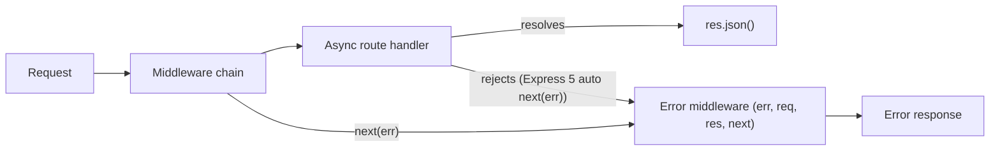

# 🚂 5. Express.js Fundamentals (Q50–59)

> **Reviewed:** 2026-09 · Modernized; legacy topics are labeled.

---

## Q50. ❓ Express.js and how it works

Express.js is a minimal, unopinionated web framework for Node.js that provides essential features for building web applications and APIs - it's built on top of Node.js HTTP module, provides routing, middleware, and templating, has a large ecosystem of middleware and plugins, and is easy to learn and quick to set up. Popular due to its simplicity and flexibility.

- **Trade-offs**: Minimal and unopinionated framework - built on top of Node.js HTTP module. Provides routing, middleware, and templating - large ecosystem of middleware and plugins. Easy to learn and quick to set up - great for rapid development, but watch out - being unopinionated means you need to make more architectural decisions yourself.

**2026 status:** Express 5 is released (5.0 in October 2024; 5.1 became the default `latest` tag on npm in 2025) and requires Node 18+. The headline change is that rejected promises from async handlers and middleware are forwarded to the error handler automatically. Express 4 is still widely deployed, so interviewers may ask about either. Common alternatives: **Fastify** (schema-based validation and serialization, a plugin system, generally higher throughput) and **NestJS** (opinionated, TypeScript-first, decorators and dependency injection; runs on Express or Fastify underneath).

Example:

```javascript
const express = require('express');
const app = express(); // Create Express application instance

// Define route handler for GET request to root path
app.get('/', (req, res) => {
  res.send('Hello World!'); // Send response
});

// Start server listening on port 3000
app.listen(3000, () => {
  console.log('Server running on port 3000');
});

```

## Q51. ❓ Middleware and how to use it

Middleware are functions that execute during the request-response cycle, with access to request, response, and next function - these run between request and response, execute in order these are defined, can modify request/response objects, and must call next() to continue or send response to end. Allows you to modify requests, responses, or end the cycle.

- **Trade-offs**: Functions that run between request and response - access to req, res, and next parameters. Execute in order these are defined - can modify request/response objects. Must call next() to continue or send response to end - powerful for cross-cutting concerns, but watch out - middleware order matters, so place these carefully.

Example:

```javascript
const express = require('express');
const app = express();

// Middleware: runs for all requests before route handlers
app.use((req, res, next) => {
  console.log('Request received:', req.method, req.url); // Log request info
  next(); // Pass control to next middleware/route handler
});

app.get('/', (req, res) => {
  res.send('Hello World!');
});

```

## Q52. 🔧 `next()` function in middleware

The next() function passes control to the next middleware in the stack, allowing middleware to be chained together and enabling conditional execution flow - it must be called to continue request processing, can pass errors to error handling middleware (optional parameter for error handling), and not calling next() ends the request-response cycle.

- **Trade-offs**: Passes control to next middleware in stack - must be called to continue request processing. Can pass errors to error handling middleware - optional parameter for error handling. Not calling next() ends the request-response cycle - essential for middleware flow control, but watch out - forgetting to call next() can cause requests to hang.

Example:

```javascript
// Middleware function: checks authentication
function authenticate(req, res, next) {
  const token = req.headers.authorization;
  if (token) {
    req.user = { id: 1, name: 'John' }; // Attach user to request object
    next(); // Continue to next middleware/route handler
  } else {
    res.status(401).json({ error: 'Unauthorized' }); // End request if no token
    // Note: next() not called, so request stops here
  }
}

app.use(authenticate); // Apply middleware to all routes
app.get('/protected', (req, res) => {
  res.json({ user: req.user }); // Access user attached by middleware
});

```

## Q53. 🤔 `app.use()` vs `app.METHOD()`

app.use() applies middleware to all routes or specific paths, while app.METHOD() (get, post, etc.) defines route handlers for specific HTTP methods and paths - middleware runs before route handlers, you can chain multiple middleware with app.use(), and route handlers are also middleware functions.

- **Trade-offs**: app.use(): middleware for all routes or specific paths - app.METHOD(): route handlers for specific HTTP methods. Middleware runs before route handlers - can chain multiple middleware with app.use(). Route handlers are also middleware functions - use app.use() for cross-cutting concerns, app.METHOD() for specific routes.

Example:

```javascript
const express = require('express');
const app = express();

app.use(express.json());
app.use('/api', (req, res, next) => {
  console.log('API request');
  next();
});

app.get('/users', (req, res) => {
  res.json({ users: [] });
});

app.post('/users', (req, res) => {
  res.json({ message: 'User created' });
});

```

## Q54. 🛣️ Implementing routing in Express.js

Organize routes into separate modules using Express Router, creating a clean, maintainable structure with route-specific middleware and handlers - use Express Router for modular route organization, separate routes into different files, apply middleware at router level, mount routers with app.use(), and keep route handlers focused and single-purpose.

- **Trade-offs**: Use Express Router for modular route organization - separate routes into different files. Apply middleware at router level - mount routers with app.use(). Keep route handlers focused and single-purpose - makes code more maintainable, but watch out - too many route files can make navigation harder, so balance modularity with simplicity.

Example:

```javascript
const express = require('express');
const router = express.Router();

router.get('/', (req, res) => {
  res.json({ users: [] });
});

router.post('/', (req, res) => {
  res.json({ message: 'User created' });
});

module.exports = router;

const userRoutes = require('./routes/users');
app.use('/api/users', userRoutes);

```

Express 5 upgraded its path matcher (`path-to-regexp` v8), so some Express 4 patterns no longer work: wildcards must be named (`/files/*splat` instead of `/files/*`), optional segments use braces (`/users{/:id}` instead of `/users/:id?`), and inline regex in paths is no longer supported.

## Q55. 💡 Serving static files with Express.js

Use express.static() middleware to serve static files like HTML, CSS, JavaScript, and images from a specified directory - it serves files from root path by default, can specify custom mount path, serves files in order of middleware definition, and automatically handles MIME types and caching headers.

- **Trade-offs**: express.static() serves files from specified directory - files are served from root path by default. Can specify custom mount path - serves files in order of middleware definition. Automatically handles MIME types and caching headers - simple and efficient, but watch out - serving static files from Express is fine for development, but use a reverse proxy like nginx for production.

Example:

```javascript
const express = require('express');
const path = require('path');
const app = express();

app.use(express.static('public'));
app.use('/static', express.static('public'));
app.use(express.static('public'));
app.use(express.static('uploads'));

```

## Q56. 📝 Parsing JSON and form data in Express.js

Express includes built-in JSON and form data parsing middleware (since Express 4.16), so you don't need to install body-parser separately - express.json() parses JSON request bodies, express.urlencoded() parses form data, and extended: true allows nested objects via the `qs` library.

- **Trade-offs**: express.json() parses JSON request bodies - express.urlencoded() parses form data. extended: true allows nested objects. No separate body-parser install on Express 4.16+ or 5 - simpler setup. Watch out: in Express 5, `extended` defaults to `false` and `req.body` is `undefined` (not `{}`) when no parser ran. Always set a `limit` (e.g. `express.json({ limit: '100kb' })`) and validate the parsed body - parsing is not validation.

> **Legacy note (2026):** `app.use(bodyParser.json())` is the pre-4.16 pattern. It still works but is unnecessary in new code.

Example:

```javascript
const express = require('express');
const app = express();

app.use(express.json());
app.use(express.urlencoded({ extended: true }));

app.post('/api/data', (req, res) => {
  console.log('JSON data:', req.body);
  res.json({ received: req.body });
});

```

## Q57. ⚠️ Handling errors in Express.js

Error handling middleware has four parameters (err, req, res, next) and should be defined after all other middleware and routes to catch errors - it can handle both sync and async errors, use next(error) to pass errors to error handler, and you can have multiple error handling middleware.

- **Trade-offs**: Must have four parameters: err, req, res, next - defined after all other middleware and routes. Can handle both sync and async errors - use next(error) to pass errors to error handler. Can have multiple error handling middleware - essential for production apps, but watch out - error middleware order matters, so place it last.

Example:

```javascript
const express = require('express');
const app = express();

// Express 4: async errors must be caught and passed to next() manually
app.get('/async-route', async (req, res, next) => {
  try {
    const data = await someAsyncOperation();
    res.json(data);
  } catch (error) {
    next(error);
  }
});

// Express 5: a rejected promise is forwarded to next(err) automatically
app.get('/async-route-v5', async (req, res) => {
  const data = await someAsyncOperation(); // throws -> error handler
  res.json(data);
});

// Error handler goes LAST, after all routes
app.use((err, req, res, next) => {
  console.error(err.stack);
  res.status(err.status ?? 500).json({
    error: 'Something went wrong!',
    message: process.env.NODE_ENV === 'development' ? err.message : 'Internal Server Error'
  });
});

```

> **Legacy note (2026):** On Express 4 people used the `express-async-errors` package or an `asyncHandler(fn)` wrapper to avoid repeating try/catch. On Express 5 that is built in, but errors thrown inside a plain callback (like `setTimeout` or an event handler) still need to be caught and passed to `next()` yourself.



## Q58. 🤔 Application-level vs router-level middleware

Application-level middleware applies to all routes, while router-level middleware applies only to routes defined on that specific router instance - router middleware runs after app middleware, you can have different middleware for different route groups, and it's useful for organizing related routes with shared middleware.

- **Trade-offs**: Application-level: applies to all routes on the app - router-level: applies only to routes on that router. Router middleware runs after app middleware - can have different middleware for different route groups. Useful for organizing related routes with shared middleware - use app-level for global concerns, router-level for route-specific logic.

Example:

```javascript
const express = require('express');
const app = express();
const router = express.Router();

app.use((req, res, next) => {
  console.log('App middleware');
  next();
});

router.use((req, res, next) => {
  console.log('Router middleware');
  next();
});

router.get('/users', (req, res) => {
  res.json({ users: [] });
});

app.use('/api', router);

```

## Q59. 🧩 Integrating Express.js with the HTTP module

Express.js is built on top of Node's HTTP module, providing a higher-level abstraction with routing, middleware, and request/response enhancements - Express wraps Node.js HTTP module, provides higher-level API for web development, adds routing, middleware, and templating, enhances request and response objects, and maintains compatibility with Node.js HTTP features.

- **Trade-offs**: Express wraps Node.js HTTP module - provides higher-level API for web development. Adds routing, middleware, and templating - enhances request and response objects. Maintains compatibility with Node.js HTTP features - makes web development easier, but watch out - understanding the underlying HTTP module helps debug issues.

Example:

```javascript
const http = require('http');
const server = http.createServer((req, res) => {
  if (req.url === '/' && req.method === 'GET') {
    res.writeHead(200, {'Content-Type': 'text/plain'});
    res.end('Hello World!');
  }
});

const express = require('express');
const app = express();
app.get('/', (req, res) => {
  res.send('Hello World!');
});

```

---

