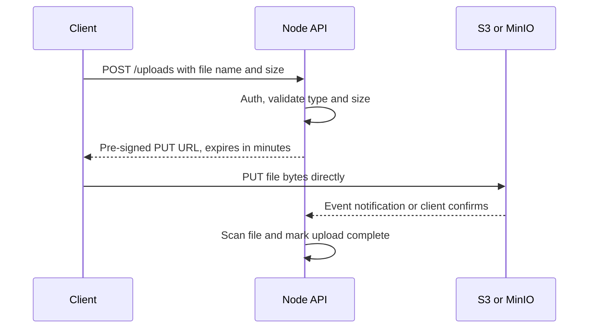

# 🌐 6. REST APIs & Server Scenarios (Q60–69)

> **Reviewed:** 2026-09 · Modernized; legacy topics are labeled.

---

## Q60. 🔌 RESTful APIs and how to design them

RESTful APIs follow REST principles using HTTP methods to perform CRUD operations on resources - use HTTP methods for different operations (GET, POST, PUT, DELETE), use resource-based URLs (/api/users, /api/users/:id), return appropriate HTTP status codes, use JSON for request/response data, and follow consistent naming conventions. Express provides simple routing and middleware for implementation.

- **Trade-offs**: Use HTTP methods for different operations (GET, POST, PUT, DELETE) - use resource-based URLs (/api/users, /api/users/:id). Return appropriate HTTP status codes - use JSON for request/response data. Follow consistent naming conventions - makes APIs intuitive and predictable, but watch out - REST is a style, not a strict standard, so be consistent within your API.

Example:

```javascript
const express = require('express');
const app = express();

// GET: Retrieve all users (read operation)
app.get('/api/users', (req, res) => {
  res.json({ users: [] });
});

// GET: Retrieve specific user by ID
app.get('/api/users/:id', (req, res) => {
  res.json({ user: { id: req.params.id } }); // :id is route parameter
});

// POST: Create new user (create operation)
app.post('/api/users', (req, res) => {
  res.json({ message: 'User created' });
});

// PUT: Update entire user resource (update operation)
app.put('/api/users/:id', (req, res) => {
  res.json({ message: 'User updated' });
});

// DELETE: Remove user (delete operation)
app.delete('/api/users/:id', (req, res) => {
  res.json({ message: 'User deleted' });
});

```

## Q61. ✅ ⌨️ Implementing input validation and sanitization

Input validation ensures data integrity and security by checking data format, type, and constraints before processing - validate input data before processing, sanitize data to prevent XSS attacks, use middleware for reusable validation, return clear error messages for invalid data, and consider using Joi for complex validation schemas. Use libraries like express-validator or Joi.

- **Trade-offs**: Validate input data before processing - sanitize data to prevent XSS attacks. Use middleware for reusable validation - return clear error messages for invalid data. Consider using Joi for complex validation schemas - essential for security, but watch out - validation can be verbose, so create reusable validation middleware.

Example:

```javascript
const { body, validationResult } = require('express-validator');

// Validation middleware: array of validators + error handler
const validateUser = [
  body('email').isEmail().normalizeEmail(), // Validate email format, normalize
  body('age').isInt({ min: 0, max: 120 }), // Validate integer range
  body('name').trim().isLength({ min: 2, max: 50 }), // Trim whitespace, validate length
  (req, res, next) => {
    const errors = validationResult(req); // Get validation errors
    if (!errors.isEmpty()) {
      return res.status(400).json({ errors: errors.array() }); // Return errors if validation fails
    }
    next(); // Continue to route handler if validation passes
  }
];

// Apply validation middleware before route handler
app.post('/api/users', validateUser, (req, res) => {
  res.json({ message: 'User created', user: req.body }); // req.body is validated
});

```

**2026 view:** Schema-first validation with **zod** (or valibot / TypeBox / JSON Schema with Ajv) is the common choice for TypeScript codebases, because one schema gives you runtime validation *and* static types. Parse, don't just check: replace `req.body` with the parsed output so unknown fields are stripped.

```javascript
import { z } from 'zod';

const CreateUser = z.object({
  email: z.string().email(),
  age: z.number().int().min(0).max(120),
  name: z.string().trim().min(2).max(50),
});

const validate = (schema) => (req, res, next) => {
  const result = schema.safeParse(req.body);
  if (!result.success) {
    return res.status(400).json({ errors: result.error.issues });
  }
  req.body = result.data; // typed, unknown keys stripped
  next();
};

app.post('/api/users', validate(CreateUser), (req, res) => {
  res.status(201).json({ user: req.body });
});
```

Validation is not output encoding: XSS is prevented mainly by escaping on output (templating engines, React) and a Content Security Policy, not by "sanitizing" every input string. Fastify has JSON Schema validation built in; NestJS uses pipes (`class-validator` or zod).

## Q62. 🔌 Implementing pagination in REST APIs

Pagination limits the number of results returned per request, while filtering allows clients to specify criteria - use query parameters for page and limit, calculate offset for database queries, include pagination metadata in response, implement filtering with search parameters, and consider cursor-based pagination for large datasets. Both improve performance and user experience.

- **Trade-offs**: Use query parameters for page and limit - calculate offset for database queries. Include pagination metadata in response - implement filtering with search parameters. Consider cursor-based pagination for large datasets - essential for large datasets, but watch out - offset-based pagination can be slow for large offsets, so consider cursor-based for better performance. Also clamp `limit` to a maximum (e.g. 100) so clients can't request a million rows, and note that `COUNT(*)` for `total` can itself be expensive on big tables.

Example:

```javascript
app.get('/api/users', (req, res) => {
  // Parse pagination parameters from query string
  const page = parseInt(req.query.page) || 1; // Default to page 1
  const limit = parseInt(req.query.limit) || 10; // Default to 10 items per page
  const offset = (page - 1) * limit; // Calculate offset for database query
  const search = req.query.search || ''; // Optional search filter

  const users = getUsers({ search, limit, offset }); // Fetch paginated results
  const total = getTotalUsers({ search }); // Get total count for pagination metadata

  res.json({
    data: users,
    pagination: {
      page,
      limit,
      total,
      pages: Math.ceil(total / limit)
    }
  });
});

```

## Q63. 🤔 PUT vs PATCH vs POST

PUT replaces the entire resource (idempotent), PATCH updates specific fields (not *guaranteed* idempotent by the HTTP spec - `{"name": "x"}` is idempotent, but `{"op": "increment"}` is not), and POST creates new resources (not idempotent) - use appropriate HTTP status codes (201 for POST), and consider idempotency for PUT operations. Each serves different purposes in RESTful APIs.

- **Trade-offs**: POST: creates new resources, not idempotent (use an `Idempotency-Key` header for safe retries of payments and orders) - PUT: replaces entire resource, idempotent. PATCH: updates specific fields, not guaranteed idempotent - use appropriate HTTP status codes (201 for POST). Consider idempotency for PUT operations - choose the right method based on your use case, but watch out - PUT requires sending the entire resource, PATCH is more efficient for partial updates.

Example:

```javascript
app.post('/api/users', (req, res) => {
  const newUser = createUser(req.body);
  res.status(201).json(newUser);
});

app.put('/api/users/:id', (req, res) => {
  const updatedUser = replaceUser(req.params.id, req.body);
  res.json(updatedUser);
});

app.patch('/api/users/:id', (req, res) => {
  const updatedUser = updateUserFields(req.params.id, req.body);
  res.json(updatedUser);
});

```

## Q64. 🔧 Implementing proper HTTP status codes

HTTP status codes communicate the result of API requests - use 2xx for successful operations, 4xx for client errors (400, 401, 403, 404), 5xx for server errors (500, 502, 503), include error details in response body, and use consistent error response format. Provides clear feedback to clients.

- **Trade-offs**: Use 2xx for successful operations - use 4xx for client errors (400, 401, 403, 404). Use 5xx for server errors (500, 502, 503) - include error details in response body. Use consistent error response format - helps clients handle errors properly, but watch out - don't expose sensitive information in error messages.

Example:

```javascript
app.get('/api/users/:id', (req, res) => {
  const user = getUserById(req.params.id);

  if (!user) {
    return res.status(404).json({
      error: 'User not found',
      code: 'USER_NOT_FOUND'
    });
  }

  res.json(user);
});

app.post('/api/users', (req, res) => {
  try {
    const user = createUser(req.body);
    res.status(201).json(user);
  } catch (error) {
    res.status(400).json({
      error: 'Invalid user data',
      details: error.message
    });
  }
});

```

## Q65. 💡 Handling file uploads with multer

File uploads require multipart/form-data parsing, handled by middleware like multer - use multer for handling multipart/form-data, set file size limits and file type filters, store files securely with unique names, validate file types and sizes, and consider cloud storage for production. Multer processes uploaded files and provides access to file information.

- **Trade-offs**: Use multer for handling multipart/form-data - set file size limits and file type filters. Store files securely with unique names - validate file types and sizes. Consider cloud storage for production - essential for file uploads, but watch out - file uploads can be a security risk, so validate and sanitize file names and content.

Example:

```javascript
const multer = require('multer');
const upload = multer({
  dest: 'uploads/',
  limits: { fileSize: 5 * 1024 * 1024 },
  fileFilter: (req, file, cb) => {
    if (file.mimetype.startsWith('image/')) {
      cb(null, true);
    } else {
      cb(new Error('Only images allowed'));
    }
  }
});

app.post('/api/upload', upload.single('image'), (req, res) => {
  res.json({
    message: 'File uploaded',
    filename: req.file.filename,
    originalName: req.file.originalname
  });
});

```

Watch out: `file.mimetype` comes from the client and can be spoofed - check the file's magic bytes (e.g. with `file-type`) after upload, and never use `originalname` as the storage path. Multer 2.x (2025) fixed several denial-of-service vulnerabilities in 1.x, so upgrade if you're still on 1.4.x.

For large files in production, a common modern pattern is to skip streaming the bytes through Node entirely: the API issues a short-lived **pre-signed URL** and the client uploads directly to S3 or an S3-compatible store such as [MinIO](../minio/index.md).



## Q66. 🌊 Implementing streamed downloads

Streaming file downloads allows clients to start receiving data before the entire file is ready - use streams for large file downloads, set appropriate Content-Disposition headers, handle file not found errors, consider resumable downloads for large files, and monitor download progress and errors. Improves performance and memory usage for large files.

- **Trade-offs**: Use streams for large file downloads - set appropriate Content-Disposition headers. Handle file not found errors - consider resumable downloads for large files. Monitor download progress and errors - essential for large files, but watch out - streaming requires proper error handling to avoid hanging connections.

Example:

```javascript
const fs = require('fs');
const path = require('path');

const UPLOAD_DIR = path.join(__dirname, 'uploads');

app.get('/api/download/:filename', (req, res) => {
  // path.basename blocks path traversal like "../../etc/passwd"
  const filename = path.basename(req.params.filename);
  const filePath = path.join(UPLOAD_DIR, filename);

  if (!fs.existsSync(filePath)) {
    return res.status(404).json({ error: 'File not found' });
  }

  res.setHeader('Content-Disposition', `attachment; filename="${filename}"`);
  res.setHeader('Content-Type', 'application/octet-stream');

  const fileStream = fs.createReadStream(filePath);
  fileStream.pipe(res);
});

// Modern alternative: pipeline() destroys both streams on error or client abort
import { pipeline } from 'node:stream/promises';

app.get('/api/v2/download/:filename', async (req, res) => {
  const filename = path.basename(req.params.filename);
  res.attachment(filename); // sets Content-Disposition
  await pipeline(fs.createReadStream(path.join(UPLOAD_DIR, filename)), res);
});

```

Security note: joining `req.params.filename` straight into a path without `path.basename()` is a classic path-traversal bug. Always normalize user-supplied names, or better, look files up by ID in a database. Express's `res.download()` also supports a `root` option that confines lookups to a directory.

## Q67. 🔧 Implementing rate limiting in Express.js

Rate limiting controls the number of requests a client can make within a time period - implement rate limiting to prevent abuse, use different limits for different endpoints, consider IP-based and user-based limiting, store rate limit data in Redis for distributed systems, and provide clear error messages for rate limit exceeded. Prevents abuse and ensures fair resource usage.

- **Trade-offs**: Implement rate limiting to prevent abuse - use different limits for different endpoints. Consider IP-based and user-based limiting - store rate limit data in Redis for distributed systems. Provide clear error messages for rate limit exceeded - essential for production APIs, but watch out - rate limiting can block legitimate users if set too strict.

Example:

```javascript
const rateLimit = require('express-rate-limit');

const limiter = rateLimit({
  windowMs: 15 * 60 * 1000,
  max: 100,
  message: 'Too many requests from this IP'
});

app.use('/api/', limiter);

const strictLimiter = rateLimit({
  windowMs: 60 * 1000,
  max: 5,
  message: 'Too many login attempts'
});

app.post('/api/login', strictLimiter, (req, res) => {
  // Login logic
});

```

Modern `express-rate-limit` (v7+) prefers `limit` over `max` and can send the standard `RateLimit` headers (`standardHeaders: 'draft-7'` or newer). The default in-memory store is per-process, so with multiple instances use a shared store such as `rate-limit-redis`. Behind a load balancer, set `app.set('trust proxy', 1)` (or the exact hop count) so `req.ip` is the real client IP - and don't blindly trust `X-Forwarded-For`. Many teams also enforce coarse limits at the edge (API gateway, CDN/WAF) and keep per-user or per-route limits in the app.

## Q68. 📝 Implementing logging with morgan or pino

HTTP request logging captures request details, response status, and timing information - use morgan for HTTP request logging, use pino for structured JSON logging, log important events and errors, consider log levels (info, warn, error), and use log aggregation tools for production. Essential for monitoring, debugging, and analytics.

- **Trade-offs**: Use morgan for HTTP request logging - use pino for structured JSON logging. Log important events and errors - consider log levels (info, warn, error). Use log aggregation tools for production - essential for debugging, but watch out - too much logging can impact performance, so use appropriate log levels.

Example:

```javascript
const morgan = require('morgan');
const pino = require('pino');

app.use(morgan('combined'));

const logger = pino();
app.use((req, res, next) => {
  req.logger = logger;
  next();
});

app.get('/api/users', (req, res) => {
  req.logger.info('Fetching users');
  res.json({ users: [] });
});

```

## Q69. 🔌 Implementing API versioning and documentation

API versioning allows backward compatibility, while documentation helps developers understand and use APIs effectively - use URL versioning (/api/v1, /api/v2), document APIs with OpenAPI/Swagger, maintain backward compatibility, use semantic versioning for API versions, and provide interactive API documentation.

- **Trade-offs**: Use URL versioning (/api/v1, /api/v2) - document APIs with OpenAPI/Swagger. Maintain backward compatibility - use semantic versioning for API versions. Provide interactive API documentation - essential for API adoption, but watch out - maintaining multiple API versions can be complex, so plan your versioning strategy carefully.

Example:

```javascript
const swaggerJsdoc = require('swagger-jsdoc');
const swaggerUi = require('swagger-ui-express');

const swaggerOptions = {
  definition: {
    openapi: '3.0.0',
    info: {
      title: 'User API',
      version: '1.0.0',
      description: 'A simple User API'
    },
    servers: [{ url: 'http://localhost:3000' }]
  },
  apis: ['./routes/*.js']
};

const specs = swaggerJsdoc(swaggerOptions);
app.use('/api-docs', swaggerUi.serve, swaggerUi.setup(specs));

app.use('/api/v1', v1Routes);
app.use('/api/v2', v2Routes);

```

---

