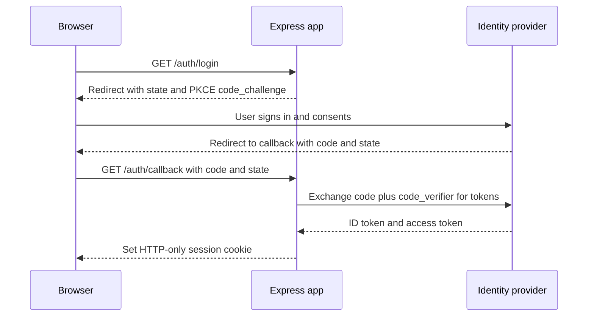

# 🔐 7. Security & Authentication (Q70–79)

> **Reviewed:** 2026-09 · Modernized; legacy topics are labeled.

---

## Q70. 🔐 Session-based vs token-based authentication

Session-based authentication stores user state on the server (more secure, harder to scale), while token-based authentication stores user information in a client-side token (stateless, easier to scale) - sessions are vulnerable to CSRF attacks, tokens are vulnerable to XSS attacks. Choose based on security requirements and scalability needs.

- **Trade-offs**: Sessions: server-side state, more secure, harder to scale - Tokens: client-side state, stateless, easier to scale. Sessions vulnerable to CSRF attacks - tokens vulnerable to XSS attacks. Choose based on security requirements and scalability needs - sessions are better for security, tokens are better for scalability.

Example:

```javascript
// Session-based authentication: server stores session data
const session = require('express-session');
app.use(session({
  secret: 'secret-key', // Secret for signing session ID
  resave: false, // Don't save session if unmodified
  saveUninitialized: false // Don't create session until something stored
}));

app.post('/login', (req, res) => {
  req.session.userId = user.id; // Store user ID in server-side session
  res.json({ message: 'Logged in' });
});

// Token-based authentication: client stores token
const jwt = require('jsonwebtoken');
app.post('/login', (req, res) => {
  const token = jwt.sign({ userId: user.id }, 'secret-key'); // Create signed token
  res.json({ token }); // Send token to client (stateless)
});

```

## Q71. 🔐 Implementing JWT authentication in Express.js

JWT (JSON Web Token) authentication uses signed tokens containing user information, verified on each request without server-side session storage - use environment variables for JWT secrets, set appropriate token expiration times, include minimal necessary information in tokens, implement token refresh for long-lived sessions, and consider token blacklisting for logout.

- **Trade-offs**: Use environment variables for JWT secrets - set appropriate token expiration times. Include minimal necessary information in tokens - implement token refresh for long-lived sessions. Consider token blacklisting for logout - stateless and scalable, but watch out - tokens can't be revoked easily, so use short expiration times and refresh tokens.

Example:

```javascript
const jwt = require('jsonwebtoken');
const express = require('express');
const app = express();

// Login endpoint: creates JWT token
app.post('/login', (req, res) => {
  const { username, password } = req.body;
  // Sign token with user data and secret
  const token = jwt.sign(
    { userId: user.id, username: user.username }, // Payload: data in token
    process.env.JWT_SECRET, // Secret key for signing
    { expiresIn: '1h' } // Token expires in 1 hour
  );
  res.json({ token }); // Send token to client
});

// Middleware: verifies JWT token on protected routes
function authenticateToken(req, res, next) {
  const authHeader = req.headers['authorization']; // Get Authorization header
  const token = authHeader && authHeader.split(' ')[1]; // Extract token (Bearer <token>)

  if (!token) return res.sendStatus(401); // No token: unauthorized

  // Verify token signature and expiration
  jwt.verify(token, process.env.JWT_SECRET, (err, user) => {
    if (err) return res.sendStatus(403); // Invalid token: forbidden
    req.user = user; // Attach user data to request
    next(); // Continue to route handler
  });
}

// Protected route: requires valid JWT token
app.get('/protected', authenticateToken, (req, res) => {
  res.json({ message: 'Protected data', user: req.user }); // Access user from middleware
});

```

Hardening points interviewers look for in 2026:

- **Pin the algorithm** when verifying: `jwt.verify(token, secret, { algorithms: ['HS256'] })` (or `RS256`/`EdDSA` with a public key), and check `iss` / `aud`. This blocks algorithm-confusion attacks.
- **Return 401** for a missing, expired or invalid token; reserve **403** for "authenticated but not allowed".
- Keep access tokens short-lived (minutes), and put refresh tokens in HTTP-only cookies with **rotation** and reuse detection, stored server-side so they can be revoked.
- For multi-service setups, prefer asymmetric keys published through a JWKS endpoint; `jose` is a popular, standards-focused library for this.
- Validate the login request body and rate-limit the login route (see Q67).

## Q72. 🔧 Implementing route guards and middleware

Route guards are middleware functions that check authentication and authorization before allowing access to protected routes - separate authentication and authorization concerns, use middleware for reusable route protection, implement role-based access control, return appropriate HTTP status codes, and consider permission-based authorization for fine-grained control.

- **Trade-offs**: Separate authentication and authorization concerns - use middleware for reusable route protection. Implement role-based access control - return appropriate HTTP status codes. Consider permission-based authorization for fine-grained control - makes route protection easy and reusable, but watch out - middleware order matters, so place guards before route handlers.

Example:

```javascript
function requireAuth(req, res, next) {
  if (!req.user) {
    return res.status(401).json({ error: 'Authentication required' });
  }
  next();
}

function requireRole(role) {
  return (req, res, next) => {
    if (req.user.role !== role) {
      return res.status(403).json({ error: 'Insufficient permissions' });
    }
    next();
  };
}

app.get('/admin', requireAuth, requireRole('admin'), (req, res) => {
  res.json({ message: 'Admin only content' });
});

app.get('/profile', requireAuth, (req, res) => {
  res.json({ user: req.user });
});

```

## Q73. 🔒 Implementing HTTP-only cookies for security

HTTP-only cookies cannot be accessed by JavaScript, preventing XSS attacks from stealing authentication tokens, while SameSite attributes prevent CSRF attacks - HTTP-only prevents XSS token theft, secure flag ensures HTTPS-only transmission, SameSite prevents CSRF attacks, maxAge controls cookie expiration, and consider token refresh with HTTP-only cookies.

- **Trade-offs**: HTTP-only prevents XSS token theft - secure flag ensures HTTPS-only transmission. SameSite prevents CSRF attacks - maxAge controls cookie expiration. Consider token refresh with HTTP-only cookies - more secure than localStorage, but watch out - cookies have size limits and can be affected by browser settings.

Example:

```javascript
const cookieParser = require('cookie-parser');
app.use(cookieParser());

app.post('/login', (req, res) => {
  const token = jwt.sign({ userId: user.id }, process.env.JWT_SECRET);
  res.cookie('token', token, {
    httpOnly: true,
    secure: process.env.NODE_ENV === 'production',
    sameSite: 'strict',
    maxAge: 24 * 60 * 60 * 1000
  });
  res.json({ message: 'Logged in' });
});

app.get('/protected', (req, res) => {
  const token = req.cookies.token;
  if (!token) return res.status(401).json({ error: 'No token' });
});

```

Accuracy note: `SameSite` *reduces* CSRF risk but doesn't fully replace CSRF protection - `Lax` (the browser default when the attribute is missing) still sends cookies on top-level GET navigations, and "same-site" includes sibling subdomains. For cookie-authenticated APIs, combine `SameSite=Lax` or `Strict` with an Origin header check or a CSRF token for state-changing requests. The `__Host-` cookie name prefix (requires `Secure`, `Path=/`, no `Domain`) prevents subdomains from overwriting the cookie.

## Q74. 🔐 Implementing OAuth 2.0 in Express.js

OAuth 2.0 allows users to authenticate with third-party providers (Google, Facebook) by redirecting to the provider and handling the callback with authorization codes - use Passport.js for OAuth implementation, store provider-specific user IDs, handle user creation and linking, implement proper error handling, and consider multiple OAuth providers.

- **Trade-offs**: Use Passport.js for OAuth implementation - store provider-specific user IDs. Handle user creation and linking - implement proper error handling. Consider multiple OAuth providers - makes login easier for users, but watch out - OAuth adds complexity and dependency on third-party providers.

Example:

```javascript
const passport = require('passport');
const GoogleStrategy = require('passport-google-oauth20').Strategy;

passport.use(new GoogleStrategy({
  clientID: process.env.GOOGLE_CLIENT_ID,
  clientSecret: process.env.GOOGLE_CLIENT_SECRET,
  callbackURL: '/auth/google/callback'
}, (accessToken, refreshToken, profile, done) => {
  User.findOrCreate({ googleId: profile.id }, (err, user) => {
    return done(err, user);
  });
}));

app.get('/auth/google', passport.authenticate('google', {
  scope: ['profile', 'email']
}));

app.get('/auth/google/callback',
  passport.authenticate('google', { failureRedirect: '/login' }),
  (req, res) => {
    res.redirect('/dashboard');
  }
);

```

Modern OAuth practice (the OAuth 2.1 draft and current security best-practice guidance): use the **Authorization Code flow with PKCE** for every client type, always validate `state` (and `nonce` for OpenID Connect), and avoid the Implicit and Password grants, which are deprecated. For "Log in with X", you are really using **OpenID Connect** (OIDC) on top of OAuth 2.0 - verify the ID token's signature, `iss`, `aud` and `exp`. Passport is still common in Express apps; `openid-client` or a hosted identity provider (Auth0, Cognito, Keycloak, and similar) are frequent alternatives.



## Q75. 🔧 Implementing CORS in Express.js

CORS (Cross-Origin Resource Sharing) allows web pages to make requests to different domains, configured with specific origins, methods, and headers - configure specific origins instead of wildcard, set appropriate methods and headers, enable credentials for authenticated requests, use dynamic CORS for complex scenarios, and consider preflight request handling.

- **Trade-offs**: Configure specific origins instead of wildcard - set appropriate methods and headers. Enable credentials for authenticated requests - use dynamic CORS for complex scenarios. Consider preflight request handling - essential for cross-origin requests, but watch out - allowing all origins with credentials is a security risk, so be specific.

Example:

```javascript
const cors = require('cors');

app.use(cors());

app.use(cors({
  origin: ['https://example.com', 'https://app.example.com'],
  methods: ['GET', 'POST', 'PUT', 'DELETE'],
  allowedHeaders: ['Content-Type', 'Authorization'],
  credentials: true
}));

app.use(cors((req, callback) => {
  const origin = req.header('Origin');
  const allowedOrigins = ['https://example.com'];

  if (allowedOrigins.includes(origin)) {
    callback(null, { origin: true, credentials: true });
  } else {
    callback(null, { origin: false }); // no CORS headers; browser blocks the response
  }
}));

```

(The three `app.use(cors(...))` calls above are alternatives - use one.) Remember that CORS is enforced by browsers only; it is not an authorization mechanism and does nothing against curl or server-to-server calls. Never reflect an arbitrary `Origin` together with `credentials: true`.

## Q76. 🔒 Implementing security headers with Helmet

Helmet sets various HTTP headers to improve security by preventing common attacks like XSS, clickjacking, and MIME type sniffing - it sets security-related HTTP headers, prevents XSS, clickjacking, and MIME sniffing, configures Content Security Policy, enables HTTPS Strict Transport Security, and is essential for production applications.

- **Trade-offs**: Sets security-related HTTP headers - *mitigates* XSS (mainly through CSP), clickjacking (`frame-ancestors` / `X-Frame-Options`) and MIME sniffing. Headers are defense in depth, not a substitute for output encoding. Configures Content Security Policy - enables HTTPS Strict Transport Security. Current Helmet versions set `X-XSS-Protection: 0` on purpose, because the old browser XSS auditor caused vulnerabilities and has been removed from modern browsers. Essential for production applications - easy to add security headers, but watch out - CSP can break your app if not configured correctly, so test thoroughly.

Example:

```javascript
const helmet = require('helmet');
app.use(helmet());

app.use(helmet({
  contentSecurityPolicy: {
    directives: {
      defaultSrc: ["'self'"],
      styleSrc: ["'self'", "'unsafe-inline'"],
      scriptSrc: ["'self'"]
    }
  },
  hsts: {
    maxAge: 31536000,
    includeSubDomains: true,
    preload: true
  }
}));

```

## Q77. 🔄 Preventing SQL injection, XSS, and CSRF attacks

Prevent common web attacks by using parameterized queries, input validation, output encoding, and CSRF tokens - use parameterized queries to prevent SQL injection, validate and sanitize all input data, encode output to prevent XSS, use CSRF tokens for state-changing operations, and implement Content Security Policy headers.

- **Trade-offs**: Use parameterized queries to prevent SQL injection - validate and sanitize all input data. Encode output to prevent XSS - use CSRF tokens for state-changing operations. Implement Content Security Policy headers - essential for security, but watch out - security requires multiple layers, so don't rely on just one method.

Example:

```javascript
const express = require('express');
const { body, validationResult } = require('express-validator');
const csrf = require('csurf'); // LEGACY: deprecated since 2022, see note below

const csrfProtection = csrf({ cookie: true });
app.use(csrfProtection);

const validateInput = [
  body('username').trim().escape(),
  body('email').isEmail().normalizeEmail(),
  (req, res, next) => {
    const errors = validationResult(req);
    if (!errors.isEmpty()) {
      return res.status(400).json({ errors: errors.array() });
    }
    next();
  }
];

app.post('/users', validateInput, (req, res) => {
  const { username, email } = req.body;
  res.json({ message: 'User created' });
});

// SQL injection: always parameterize (node-postgres example)
await pool.query('SELECT * FROM users WHERE email = $1', [email]);

```

> **Legacy note (2026):** The `csurf` package was deprecated by the Express team in 2022 and should not be used in new code. Modern options: `SameSite` cookies plus an `Origin`/`Sec-Fetch-Site` header check, or a maintained CSRF library such as `csrf-csrf` (double-submit cookie) or `csrf-sync` (synchronizer token). APIs that authenticate with a bearer token in the `Authorization` header (not cookies) are not exposed to classic CSRF. Escaping input with `.escape()` at write time is also a dated habit - store the raw value and encode on output for the right context (HTML, attribute, URL). For NoSQL, reject objects where you expect strings, to block operator injection like `{ "$gt": "" }`.

## Q78. 🔧 Implementing password hashing with bcrypt or argon2

Passwords should never be stored in plain text, using strong hashing algorithms like bcrypt or argon2 with salt to prevent rainbow table attacks - never store passwords in plain text, use strong hashing algorithms (bcrypt, argon2), use appropriate salt rounds (12+ for bcrypt), consider argon2 for new applications, and implement password strength requirements.

- **Trade-offs**: Never store passwords in plain text - use strong hashing algorithms (bcrypt, argon2). Use appropriate salt rounds (12+ for bcrypt) - consider argon2 for new applications. Implement password strength requirements - essential for security, but watch out - hashing is CPU-intensive, so balance security with performance.

Example:

```javascript
const bcrypt = require('bcrypt');
const argon2 = require('argon2');

async function hashPassword(password) {
  const saltRounds = 12;
  return await bcrypt.hash(password, saltRounds);
}

async function verifyPassword(password, hash) {
  return await bcrypt.compare(password, hash);
}

async function hashPasswordArgon2(password) {
  return await argon2.hash(password, {
    type: argon2.argon2id,
    memoryCost: 2 ** 16,
    timeCost: 3,
    parallelism: 1
  });
}

app.post('/register', async (req, res) => {
  const { username, password } = req.body;
  const hashedPassword = await hashPassword(password);
  res.json({ message: 'User registered' });
});

```

Current guidance (OWASP Password Storage Cheat Sheet): prefer **Argon2id**; bcrypt is still acceptable for existing systems. Two bcrypt gotchas: it only uses the first 72 bytes of the password, and "salt rounds" is really a cost factor (each +1 doubles the work). Node's built-in `crypto.scrypt` is a dependency-free option when native modules are a problem. Hashing is CPU-heavy, but the `argon2` and `bcrypt` packages run it on the libuv thread pool, so they don't block the event loop - `bcryptjs` (pure JS) is slower. Rate-limit login and check new passwords against breached-password lists rather than forcing complex composition rules.

## Q79. 🔌 Managing secrets and API keys securely

Secrets should be stored in environment variables, never in code, with proper access controls, encryption, and secure key management practices - store secrets in environment variables, use .env files for local development, never commit .env files to version control, use different secrets for different environments, and consider secret management services for production.

- **Trade-offs**: Store secrets in environment variables - use .env files for local development. Never commit .env files to version control - use different secrets for different environments. Consider secret management services for production - essential for security, but watch out - managing secrets across environments can be complex, so use tools like AWS Secrets Manager for production.

Example:

```javascript
// Legacy: const dotenv = require('dotenv'); dotenv.config();
// Modern local dev: node --env-file=.env server.js

const config = {
  jwtSecret: process.env.JWT_SECRET,
  dbPassword: process.env.DB_PASSWORD,
  apiKey: process.env.API_KEY,
  nodeEnv: process.env.NODE_ENV
};

const requiredEnvVars = ['JWT_SECRET', 'DB_PASSWORD'];
requiredEnvVars.forEach(envVar => {
  if (!process.env[envVar]) {
    throw new Error(`Missing required environment variable: ${envVar}`);
  }
});

app.post('/login', (req, res) => {
  const token = jwt.sign({ userId: user.id }, config.jwtSecret);
  res.json({ token });
});

```

Production practice in 2026:

- Keep secrets in a **secrets manager** (AWS Secrets Manager or SSM Parameter Store, GCP Secret Manager, Azure Key Vault, HashiCorp Vault) and inject them at runtime - via Kubernetes External Secrets / CSI driver, or by fetching at startup with a cached client.
- Prefer **short-lived, identity-based credentials** (IAM roles, workload identity, OIDC federation from CI) over long-lived static API keys.
- **Rotate** secrets and support two valid keys during rotation (e.g. accept both old and new JWT signing keys by `kid`).
- Run a **secret scanner** in CI and as a pre-commit hook (e.g. gitleaks, GitHub secret scanning); if a secret is committed, rotate it - deleting the commit isn't enough.
- Never log `process.env` or full config objects; use your logger's redaction options (pino has `redact`).

---

