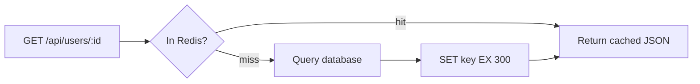

# ⚡ 8. Performance & Scaling (Q80–88)

> **Reviewed:** 2026-09 · Modernized; legacy topics are labeled.

---

## Q80. ⚡ Identifying performance bottlenecks in Node.js applications

Common bottlenecks include blocking I/O operations, memory leaks, inefficient algorithms, and event loop blocking - avoid synchronous operations in request handlers, use streaming for large data processing, implement proper error handling, monitor event loop lag, and profile CPU and memory usage regularly. Can be addressed through proper async patterns and optimization techniques.

- **Trade-offs**: Avoid synchronous operations in request handlers - use streaming for large data processing. Implement proper error handling - monitor event loop lag. Profile CPU and memory usage regularly - identify bottlenecks first, but watch out - premature optimization can add complexity, so measure before optimizing.

Example:

```javascript
// ❌ Blocking: synchronous operation blocks event loop
app.get('/data', (req, res) => {
  const data = fs.readFileSync('large-file.txt'); // Blocks until file read completes
  res.json({ data });
});

// ✅ Non-blocking: async operation doesn't block event loop
app.get('/data', (req, res) => {
  fs.readFile('large-file.txt', (err, data) => { // Async: doesn't block
    if (err) return res.status(500).json({ error: err.message });
    res.json({ data });
  });
});

// ✅ Best: streaming processes data in chunks (memory efficient)
app.get('/data', (req, res) => {
  const stream = fs.createReadStream('large-file.txt'); // Stream: processes in chunks
  stream.pipe(res); // Pipe directly to response (no memory buffering)
});

// Measure event loop delay with the built-in histogram
const { monitorEventLoopDelay } = require('node:perf_hooks');
const h = monitorEventLoopDelay({ resolution: 20 });
h.enable();
setInterval(() => {
  console.log('event loop p99 (ms):', h.percentile(99) / 1e6);
  h.reset();
}, 10_000);

```

Tools worth naming: `node --cpu-prof` / `--heap-prof`, Chrome DevTools via `--inspect`, flame graphs (e.g. 0x or Clinic.js), and OpenTelemetry traces to see whether time goes to your code or to downstream calls.

## Q81. ⚡ Optimizing middleware for performance

Optimize middleware by reducing heavy operations, implementing compression, caching, and ordering middleware efficiently - order middleware by frequency of use, use compression for text responses, implement caching for expensive operations, avoid heavy middleware on all routes, and monitor middleware execution time. Minimizes request processing time.

- **Trade-offs**: Order middleware by frequency of use - use compression for text responses. Implement caching for expensive operations - avoid heavy middleware on all routes. Monitor middleware execution time - middleware order matters for performance, but watch out - too much caching can cause stale data, so balance freshness with performance.

Example:

```javascript
const compression = require('compression');
const helmet = require('helmet');

// Order matters: apply security and compression early (runs on all requests)
app.use(helmet()); // Security headers
app.use(compression()); // Compress responses
app.use(express.json({ limit: '10mb' })); // Parse JSON body

// Conditional middleware: only run heavy auth on specific routes
app.use('/api', (req, res, next) => {
  if (req.path.startsWith('/admin')) {
    return heavyAuthMiddleware(req, res, next); // Only for admin routes
  }
  next(); // Skip for other routes
});

// Caching middleware: cache responses to avoid expensive operations
const cache = new Map();
app.use('/api/data', (req, res, next) => {
  const cacheKey = req.originalUrl; // Use URL as cache key
  if (cache.has(cacheKey)) {
    return res.json(cache.get(cacheKey)); // Return cached response
  }
  next(); // Continue if not cached
});

```

## Q82. 🗄️ Optimizing database queries in Node.js

Optimize database performance by using connection pooling, query optimization, indexing, and async database operations - use connection pooling for database connections, optimize queries with proper indexing, use prepared statements to prevent SQL injection, implement query caching for frequently accessed data, and monitor database performance and slow queries. Prevents blocking the event loop.

- **Trade-offs**: Use connection pooling for database connections - optimize queries with proper indexing. Use prepared statements to prevent SQL injection - implement query caching for frequently accessed data. Monitor database performance and slow queries - essential for performance, but watch out - connection pools need proper sizing, too many connections can overwhelm the database.

Example:

```javascript
const mysql = require('mysql2/promise');

// Connection pool: reuse database connections (more efficient than creating new ones)
const pool = mysql.createPool({
  host: 'localhost',
  user: 'root',
  password: 'password',
  database: 'mydb',
  connectionLimit: 10, // Maximum connections in pool
  queueLimit: 0, // Unlimited waiting requests (set a cap in production)
  connectTimeout: 10000 // Timeout for establishing a new connection
});

app.get('/api/users', async (req, res) => {
  try {
    // pool.execute() acquires and releases a connection for you
    const [rows] = await pool.execute(
      'SELECT id, name, email FROM users WHERE active = ? LIMIT 100',
      [1]
    );
    res.json(rows);
  } catch (error) {
    res.status(500).json({ error: 'Database error' });
  }
});

```

Notes: if you do call `pool.getConnection()` yourself, release it in a `finally` block, otherwise an error leaks the connection and the pool eventually runs dry. Don't return raw `error.message` to clients. Pool size is *per process* - 20 replicas × 10 connections = 200 database connections - so with many instances or serverless functions, put a pooler such as PgBouncer or RDS Proxy in front of the database. See the SQL section's [connection pooling question](../sql/05-transactions-and-concurrency.md) for more.

## Q83. 🔧 Implementing clustering with PM2

PM2 is a process manager for Node.js applications that provides clustering, monitoring, logging, and automatic restarts for production deployments - it provides process clustering and load balancing, automatic restarts on crashes, built-in monitoring and logging, zero-downtime deployments, and memory and CPU monitoring.

- **Trade-offs**: Provides process clustering and load balancing - automatic restarts on crashes. Built-in monitoring and logging - zero-downtime deployments. Memory and CPU monitoring - essential for production, but watch out - PM2 adds overhead, so consider alternatives like Docker for containerized deployments.

Example:

```javascript
module.exports = {
  apps: [{
    name: 'my-app',
    script: './app.js',
    instances: 'max',
    exec_mode: 'cluster',
    env: {
      NODE_ENV: 'production',
      PORT: 3000
    },
    env_production: {
      NODE_ENV: 'production',
      PORT: 3000
    },
    max_memory_restart: '1G',
    error_file: './logs/err.log',
    out_file: './logs/out.log',
    log_file: './logs/combined.log',
    time: true
  }]
};

```

> **Legacy note (2026):** PM2 is still common on plain VMs. In containerized platforms (Kubernetes, ECS, Cloud Run), the orchestrator already handles restarts, scaling and log collection, so the usual pattern is one Node process per container, logging JSON to stdout, with no PM2 inside the image. For local development, `node --watch` (stable since Node 22) replaces nodemon for most use cases.

## Q84. 🔧 Implementing horizontal scaling in Node.js

Horizontal scaling involves running multiple instances of the application across different processes, machines, or containers, with load balancing to distribute requests - use clustering for multi-core utilization, implement load balancing for multiple servers, use containers (Docker) for consistent deployments, consider microservices architecture, and implement health checks and monitoring.

- **Trade-offs**: Use clustering for multi-core utilization - implement load balancing for multiple servers. Use containers (Docker) for consistent deployments - consider microservices architecture. Implement health checks and monitoring - essential for scale, but watch out - horizontal scaling adds complexity, so start with clustering before moving to multiple servers. In container-based deployments you usually skip in-process clustering and scale replicas instead. Either way the app must be stateless: sessions, rate-limit counters, WebSocket fan-out and caches that must be consistent go in Redis or the database, not in process memory.

Example:

```javascript
const cluster = require('cluster');
const numCPUs = require('os').availableParallelism();

if (cluster.isPrimary) { // isMaster is the deprecated alias
  console.log(`Primary ${process.pid} is running`);
  for (let i = 0; i < numCPUs; i++) {
    cluster.fork();
  }
  cluster.on('exit', (worker, code, signal) => {
    console.log(`Worker ${worker.process.pid} died`);
    cluster.fork();
  });
} else {
  const express = require('express');
  const app = express();

  app.get('/', (req, res) => {
    res.json({
      message: 'Hello World!',
      pid: process.pid
    });
  });

  app.listen(3000, () => {
    console.log(`Worker ${process.pid} started`);
  });
}

```

## Q85. 💾 Implementing caching with Redis or LRU

Caching stores frequently accessed data in fast storage (memory or Redis) to reduce database load and improve response times - use Redis for distributed caching, implement cache invalidation strategies, consider cache warming for critical data, monitor cache hit rates, and use appropriate TTL values.

- **Trade-offs**: Use Redis for distributed caching - implement cache invalidation strategies. Consider cache warming for critical data - monitor cache hit rates. Use appropriate TTL values - essential for performance, but watch out - cache invalidation is tricky, so use TTLs and event-based invalidation carefully.

Example:

```javascript
const { createClient } = require('redis');
const client = createClient({ url: process.env.REDIS_URL });
await client.connect(); // node-redis v4+ requires an explicit connect

const { LRUCache } = require('lru-cache'); // v10+ named export
const cache = new LRUCache({ max: 100, ttl: 1000 * 60 * 5 });

app.get('/api/users/:id', async (req, res) => {
  const userId = req.params.id;

  const cached = await client.get(`user:${userId}`);
  if (cached) {
    return res.json(JSON.parse(cached));
  }

  const user = await getUserById(userId);
  await client.set(`user:${userId}`, JSON.stringify(user), { EX: 300 });

  res.json(user);
});

app.get('/api/stats', (req, res) => {
  const cacheKey = 'stats';
  let stats = cache.get(cacheKey);

  if (!stats) {
    stats = calculateStats();
    cache.set(cacheKey, stats);
  }

  res.json(stats);
});

```

This is the **cache-aside** pattern. Under heavy load, a popular key expiring can cause a *cache stampede* (many requests recompute it at once) - mitigate with request coalescing (one in-flight promise per key), TTL jitter, or stale-while-revalidate. `ioredis` is an equally common Redis client; Valkey is a Redis-compatible open-source fork you'll also see in managed services.



## Q86. 🔌 Optimizing API response times

Optimize API response times through caching, database optimization, compression, CDN usage, and efficient data processing - use database pagination instead of loading all data, select only necessary fields, implement proper indexing, use compression for text responses, and consider CDN for static assets.

- **Trade-offs**: Use database pagination instead of loading all data - select only necessary fields. Implement proper indexing - use compression for text responses. Consider CDN for static assets - multiple techniques work together, but watch out - over-optimization can add complexity, so measure and optimize based on actual bottlenecks.

Example:

```javascript
const compression = require('compression');
const rateLimit = require('express-rate-limit');

app.use(compression());

const limiter = rateLimit({
  windowMs: 15 * 60 * 1000,
  max: 100
});
app.use('/api/', limiter);

app.get('/api/users', async (req, res) => {
  const { page = 1, limit = 10 } = req.query;

  const users = await User.find()
    .select('id name email')
    .limit(limit * 1)
    .skip((page - 1) * limit)
    .lean();

  res.json({
    users,
    pagination: { page, limit, total: await User.countDocuments() }
  });
});

```

## Q87. 📊 Implementing monitoring and alerting

Monitoring tools provide real-time insights into application performance, errors, and user experience - monitor key performance metrics, set up alerts for critical issues, track user experience metrics, monitor database and external service performance, and use distributed tracing for microservices. Enables proactive issue detection and resolution.

- **Trade-offs**: Monitor key performance metrics - set up alerts for critical issues. Track user experience metrics - monitor database and external service performance. Use distributed tracing for microservices - essential for production, but watch out - monitoring adds overhead, so use sampling for high-traffic applications.

Example:

```javascript
const newrelic = require('newrelic');

app.get('/api/users', (req, res) => {
  newrelic.recordMetric('Custom/UsersEndpoint', 1);
});

// Sentry v8+: init in a separate instrument file loaded before anything else
// (node --import ./instrument.mjs app.js), then register the error handler
// after all routes. Sentry.requestHandler()/errorHandler() are the removed v7 API.
const Sentry = require('@sentry/node');
Sentry.setupExpressErrorHandler(app);

app.get('/api/data', async (req, res) => {
  try {
    const data = await fetchData();
    res.json(data);
  } catch (error) {
    Sentry.captureException(error);
    res.status(500).json({ error: 'Internal server error' });
  }
});

```

**2026 view:** OpenTelemetry (OTel) is the vendor-neutral standard for traces and metrics in Node - `@opentelemetry/auto-instrumentations-node` instruments http, Express, pg, Redis and more, and you export to whichever backend you use (New Relic, Datadog, Grafana, Honeycomb, Jaeger, etc.). Alert on symptoms users feel (error rate, p95/p99 latency, saturation such as event loop delay) against SLOs, rather than on every CPU spike.

## Q88. 🔧 Implementing connection pooling and batching

Performance optimization involves profiling to identify bottlenecks, implementing efficient patterns like batching and async iteration, and optimizing resource usage - profile before optimizing, use batching for bulk operations, implement async iteration for large datasets, use connection pooling for databases, and monitor and measure improvements.

- **Trade-offs**: Profile before optimizing - use batching for bulk operations. Implement async iteration for large datasets - use connection pooling for databases. Monitor and measure improvements - multiple strategies work together, but watch out - optimization should be data-driven, so measure before and after changes.

Example:

```javascript
const { performance, PerformanceObserver } = require('perf_hooks');

const obs = new PerformanceObserver((list) => {
  list.getEntries().forEach((entry) => {
    console.log(`${entry.name}: ${entry.duration}ms`);
  });
});
obs.observe({ entryTypes: ['measure'] });

async function batchProcess(items) {
  const batchSize = 100;
  const batches = [];

  for (let i = 0; i < items.length; i += batchSize) {
    batches.push(items.slice(i, i + batchSize));
  }

  for (const batch of batches) {
    await Promise.all(batch.map(processItem));
  }
}

async function processLargeDataset() {
  const stream = fs.createReadStream('large-file.txt');
  for await (const chunk of stream) {
    await processChunk(chunk);
  }
}

```

---

