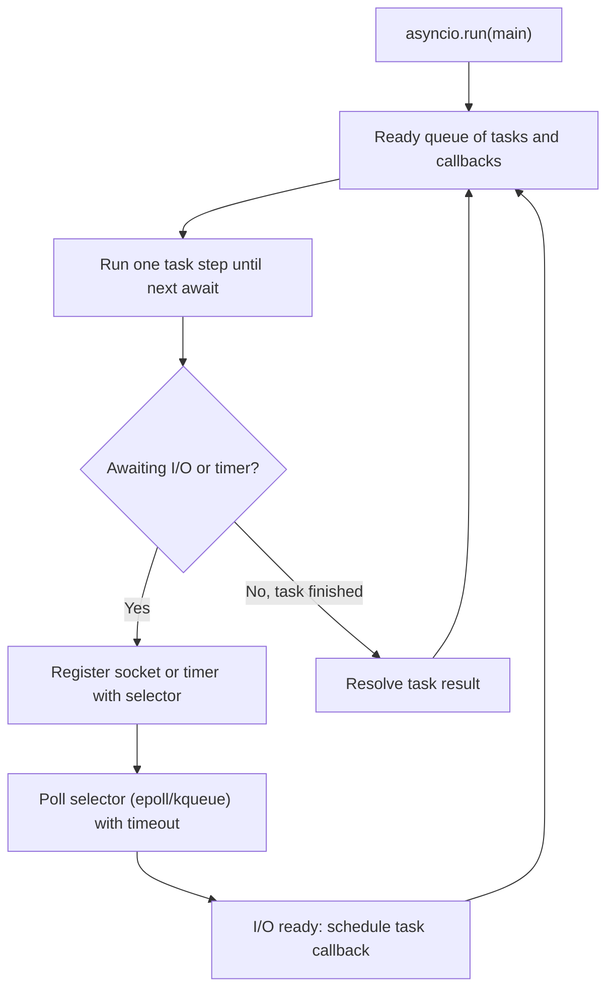

# Python Async and Concurrency (Q41-Q54)

> **Reviewed:** 2026-09 · **Level:** Senior · **Type:** Foundational

## Q41. Threading vs multiprocessing vs asyncio

Python has three concurrency models. `threading` runs OS threads sharing memory, good for blocking I/O but limited by the GIL for CPU work. `multiprocessing` runs separate processes with their own interpreter and GIL, giving real CPU parallelism at the cost of memory and serialisation (pickling) of data between processes. `asyncio` runs many coroutines on a single thread with cooperative scheduling, the most efficient way to handle thousands of concurrent network connections.

- **Trade-offs**:
  - Threads: easy with blocking libraries, but shared state needs locks and they do not scale CPU work.
  - Processes: true parallelism, but high startup/memory cost and only picklable data crosses boundaries.
  - asyncio: cheap concurrency, but every library in the path must be async and one blocking call stalls everything.

| Model | Best for | Parallel CPU | Shared memory | Cost per unit |
|-------|----------|--------------|---------------|---------------|
| `threading` | Blocking I/O, legacy libs | No (GIL) | Yes | Medium |
| `multiprocessing` | CPU-bound work | Yes | No (IPC) | High |
| `asyncio` | Many concurrent sockets | No | Yes (one thread) | Low |

**Example:**

```python
import asyncio
from concurrent.futures import ProcessPoolExecutor, ThreadPoolExecutor

def resize_image(path: str) -> str: ...     # CPU-bound
def legacy_fetch(url: str) -> bytes: ...    # blocking I/O

async def main(urls: list[str], images: list[str]) -> None:
    loop = asyncio.get_running_loop()
    with ProcessPoolExecutor() as procs, ThreadPoolExecutor(max_workers=20) as threads:
        cpu = [loop.run_in_executor(procs, resize_image, p) for p in images]
        io = [loop.run_in_executor(threads, legacy_fetch, u) for u in urls]
        await asyncio.gather(*cpu, *io)
```

**Remember:** asyncio for many sockets, threads for blocking libs, processes for CPU.

## Q42. CPU-bound vs I/O-bound work and when the GIL matters

The first question for any concurrency problem is whether the work is waiting (network, disk, DB) or computing (parsing, hashing, image processing). For I/O-bound work the GIL is released while waiting, so threads or asyncio scale well. For CPU-bound pure-Python work, only multiple processes (or C extensions that release the GIL, or a free-threaded build) use more than one core.

- **Trade-offs**:
  - Offloading CPU work to a process pool or a task queue (Celery) keeps request latency predictable, but adds serialisation and operational complexity.
  - Measure first: many "slow" endpoints are actually waiting on the DB, not CPU.

**Example:**

```python
import hashlib
from concurrent.futures import ProcessPoolExecutor

def hash_chunk(data: bytes) -> str:
    # hashlib releases the GIL for large buffers, but pure-Python loops would not
    return hashlib.sha256(data).hexdigest()

def cpu_heavy(n: int) -> int:
    return sum(i * i for i in range(n))     # holds the GIL

if __name__ == "__main__":                   # required for spawn start method
    with ProcessPoolExecutor() as pool:
        results = list(pool.map(cpu_heavy, [10_000_000] * 4))  # uses 4 cores
```

**Remember:** Waiting scales with threads/asyncio; computing needs processes.

## Q43. The asyncio event loop

The event loop is a single-threaded scheduler that runs ready callbacks and coroutine steps, and uses the OS selector (epoll/kqueue) to wait for I/O readiness. When a coroutine hits `await` on something not ready, it yields control back to the loop, which runs other ready tasks and resumes the coroutine when its future completes. `asyncio.run(main())` creates the loop, runs the top-level coroutine and closes the loop.

- **Trade-offs**:
  - Very low overhead per connection versus the requirement that nothing blocks the loop thread; CPU work or sync I/O freezes all tasks.



**Example:**

```python
import asyncio

async def worker(name: str, delay: float) -> str:
    await asyncio.sleep(delay)      # yields to the loop, does not block
    return name

async def main() -> None:
    results = await asyncio.gather(worker("a", 1), worker("b", 1))
    print(results)                  # ~1s total

asyncio.run(main())
```

**Remember:** One thread, cooperative switching at every `await`.

## Q44. Coroutines, `async` and `await`

`async def` defines a coroutine function; calling it returns a coroutine object and does not run anything until it is awaited or scheduled as a task. `await` suspends the current coroutine until the awaitable (coroutine, Task, or Future) completes. Forgetting `await` is a common bug that produces a "coroutine was never awaited" warning and silently skips the work.

- **Trade-offs**:
  - Explicit suspension points make concurrency easier to reason about than threads, but async "colours" functions: sync code cannot simply call async code.

**Example:**

```python
import asyncio, httpx

async def get_user(client: httpx.AsyncClient, uid: int) -> dict:
    r = await client.get(f"https://api.example.com/users/{uid}")
    r.raise_for_status()
    return r.json()

async def main() -> None:
    async with httpx.AsyncClient(timeout=5) as client:
        coro = get_user(client, 1)   # nothing happens yet
        user = await coro            # now it runs
        # get_user(client, 2)        # bug: never awaited

asyncio.run(main())
```

> **Interview tip:** Unlike JS Promises, Python coroutines are lazy: they do not start until awaited or wrapped in a Task.

**Remember:** Calling an async function creates a coroutine; awaiting runs it.

## Q45. Tasks and `asyncio.create_task`

`asyncio.create_task(coro)` schedules a coroutine to run concurrently on the loop and returns a `Task` you can await, cancel or inspect. This is how you start work "in the background" within the same process. The loop only keeps weak references to tasks, so keep a reference (or use a `TaskGroup`) or the task may be garbage collected mid-flight, and always handle or log its exceptions.

- **Trade-offs**:
  - Fire-and-forget tasks are cheap but lose work on process restart and can swallow errors; durable work belongs in a queue (Celery, RabbitMQ).

**Example:**

```python
import asyncio, logging

background: set[asyncio.Task] = set()

def _on_done(task: asyncio.Task) -> None:
    background.discard(task)
    if not task.cancelled() and task.exception():
        logging.error("background task failed", exc_info=task.exception())

def spawn(coro) -> asyncio.Task:
    task = asyncio.create_task(coro)
    background.add(task)                       # strong reference
    task.add_done_callback(_on_done)
    return task

async def send_welcome_email(user_id: int) -> None: ...

async def signup(user_id: int) -> None:
    spawn(send_welcome_email(user_id))         # does not block the response
```

**Remember:** Create tasks for concurrency; keep references and handle their errors.

## Q46. `asyncio.gather` vs `TaskGroup`

`asyncio.gather` runs awaitables concurrently and returns results in order; by default the first exception propagates to the caller but the other tasks keep running, and `return_exceptions=True` collects errors as values. `asyncio.TaskGroup` (3.11+) provides structured concurrency: if any child fails, the rest are cancelled and all errors are raised together as an `ExceptionGroup`, handled with `except*`. Prefer `TaskGroup` for new code where tasks are related.

- **Trade-offs**:
  - `gather` is convenient for "collect all results, tolerate failures"; `TaskGroup` gives safer cancellation and no orphaned tasks, at the cost of `ExceptionGroup` handling.

**Example:**

```python
import asyncio

async def fetch(name: str, fail: bool = False) -> str:
    await asyncio.sleep(0.1)
    if fail:
        raise ValueError(name)
    return name

async def main() -> None:
    # gather: errors as values
    results = await asyncio.gather(fetch("a"), fetch("b", fail=True), return_exceptions=True)
    print(results)                      # ['a', ValueError('b')]

    # TaskGroup: fail fast, siblings cancelled
    try:
        async with asyncio.TaskGroup() as tg:
            t1 = tg.create_task(fetch("profile"))
            t2 = tg.create_task(fetch("orders", fail=True))
    except* ValueError as eg:
        print("failed:", eg.exceptions)

asyncio.run(main())
```

**Remember:** `gather` collects; `TaskGroup` cancels siblings and never leaks tasks.

## Q47. Timeouts and cancellation in asyncio

Cancellation in asyncio is cooperative: `task.cancel()` raises `CancelledError` inside the coroutine at its next `await`. Use `asyncio.timeout()` (3.11+) or `asyncio.wait_for` to bound every outbound call so a slow dependency does not pile up requests. Code must let `CancelledError` propagate (clean up in `finally`), otherwise cancellation and graceful shutdown break.

- **Trade-offs**:
  - Tight timeouts protect latency but can cancel work mid-way; make downstream operations idempotent so retries are safe.

**Example:**

```python
import asyncio

async def call_inventory() -> dict:
    await asyncio.sleep(5)
    return {}

async def handler() -> dict:
    try:
        async with asyncio.timeout(1.5):       # bound the dependency
            return await call_inventory()
    except TimeoutError:
        return {"status": "degraded"}

async def worker() -> None:
    try:
        while True:
            await asyncio.sleep(1)
    except asyncio.CancelledError:
        # cleanup, then re-raise so the canceller knows we stopped
        raise
```

**Remember:** Put a timeout on every await that crosses the network; never swallow `CancelledError`.

## Q48. Blocking calls inside async code

Any synchronous blocking call inside a coroutine (such as `requests.get`, `time.sleep`, a sync DB driver, heavy JSON or CPU work) freezes the whole event loop and every other request on that worker. Use async-native libraries (`httpx.AsyncClient`, `asyncpg`, `redis.asyncio`), or offload with `asyncio.to_thread` for blocking I/O and a process pool for CPU work. In FastAPI, a plain `def` endpoint is automatically run in a threadpool, while `async def` endpoints run on the loop.

- **Trade-offs**:
  - `to_thread` is an easy escape hatch but uses a bounded thread pool; for CPU work it still contends on the GIL.
  - Enable asyncio debug mode in development to log slow callbacks.

**Example:**

```python
import asyncio, time
import requests, httpx

async def bad() -> None:
    time.sleep(2)                    # blocks every task on the loop
    requests.get("https://example.com")  # also blocking

async def good() -> None:
    await asyncio.sleep(2)
    async with httpx.AsyncClient() as c:
        await c.get("https://example.com")

def legacy_sdk_call() -> dict: ...

async def wrap_legacy() -> dict:
    return await asyncio.to_thread(legacy_sdk_call)   # runs in a worker thread

# Debugging: asyncio.run(main(), debug=True) warns about slow callbacks
```

**Remember:** Never block the loop; use async libs, `to_thread`, or a process pool.

## Q49. `concurrent.futures`: ThreadPoolExecutor and ProcessPoolExecutor

`concurrent.futures` offers a uniform high-level API for running callables in a pool of threads or processes, returning `Future` objects. `executor.map` preserves order, while `submit` plus `as_completed` handles results as they finish. It is the simplest way to parallelise batch jobs or scripts without adopting asyncio.

- **Trade-offs**:
  - Easy parallelism with bounded workers; process pools require picklable functions and arguments and pay IPC costs, so send coarse-grained chunks.

**Example:**

```python
from concurrent.futures import ThreadPoolExecutor, as_completed
import httpx

def check(url: str) -> tuple[str, int]:
    return url, httpx.get(url, timeout=5).status_code

urls = ["https://example.com", "https://example.org"]
with ThreadPoolExecutor(max_workers=10) as pool:
    futures = {pool.submit(check, u): u for u in urls}
    for fut in as_completed(futures):
        try:
            print(fut.result())
        except Exception as exc:
            print(futures[fut], "failed", exc)
```

**Remember:** Executors give pooled parallelism with Futures; threads for I/O, processes for CPU.

## Q50. Race conditions and thread locks

A race condition occurs when correctness depends on the interleaving of threads, for example a read-modify-write like `counter += 1`, which is several bytecodes and can be preempted even with the GIL. Protect shared mutable state with `threading.Lock` (or `RLock` for re-entrant use), keep critical sections small, and prefer thread-safe structures like `queue.Queue`. Across processes or servers, you need database constraints, row locks or distributed locks instead.

- **Trade-offs**:
  - Locks restore correctness but add contention and deadlock risk (always acquire in a consistent order, prefer `with lock:`).
  - In-process locks do nothing across multiple gunicorn workers.

**Example:**

```python
import threading

class Counter:
    def __init__(self) -> None:
        self._value = 0
        self._lock = threading.Lock()

    def incr(self) -> None:
        with self._lock:                 # atomic read-modify-write
            self._value += 1

c = Counter()
threads = [threading.Thread(target=lambda: [c.incr() for _ in range(100_000)]) for _ in range(4)]
[t.start() for t in threads]; [t.join() for t in threads]
print(c._value)   # 400000 reliably

# Across workers: UPDATE accounts SET balance = balance - %s WHERE id = %s AND balance >= %s
```

**Remember:** The GIL does not make your logic atomic; lock shared state or push it to the DB.

## Q51. asyncio synchronisation: Lock and Semaphore

asyncio code is single-threaded but can still race: state checked before an `await` may change by the time the coroutine resumes. `asyncio.Lock` protects such sections, and `asyncio.Semaphore` limits concurrency, which is the standard way to cap outbound requests to a rate-limited API or DB. These primitives are not thread-safe and must be used within one event loop.

- **Trade-offs**:
  - Semaphores prevent overwhelming dependencies but add queueing latency; tune the limit to the downstream capacity.

**Example:**

```python
import asyncio, httpx

sem = asyncio.Semaphore(10)              # max 10 in-flight requests

async def fetch(client: httpx.AsyncClient, url: str) -> int:
    async with sem:
        r = await client.get(url)
        return r.status_code

token_lock = asyncio.Lock()
_token: str | None = None

async def get_token(client: httpx.AsyncClient) -> str:
    global _token
    async with token_lock:               # only one coroutine refreshes the token
        if _token is None:
            _token = (await client.post("https://auth.example.com/token")).json()["access_token"]
    return _token
```

**Remember:** Races happen across `await`s; Semaphore caps concurrency.

## Q52. Producer-consumer with queues

`queue.Queue` (threads) and `asyncio.Queue` (coroutines) decouple producers from a fixed pool of consumers, giving natural backpressure via `maxsize`. This pattern is useful for in-process pipelines such as crawling, batching writes or fan-out processing. For work that must survive restarts or scale across machines, use an external broker (RabbitMQ, Redis) with Celery or similar.

- **Trade-offs**:
  - In-memory queues are fast and simple but lose data on crash and are bounded by one process.

**Example:**

```python
import asyncio

async def producer(q: asyncio.Queue[int]) -> None:
    for i in range(100):
        await q.put(i)                   # blocks when full: backpressure

async def consumer(q: asyncio.Queue[int]) -> None:
    while True:
        item = await q.get()
        try:
            await asyncio.sleep(0.01)    # process item
        finally:
            q.task_done()

async def main() -> None:
    q: asyncio.Queue[int] = asyncio.Queue(maxsize=20)
    async with asyncio.TaskGroup() as tg:
        workers = [tg.create_task(consumer(q)) for _ in range(5)]
        await producer(q)
        await q.join()                   # wait until all items processed
        for w in workers:
            w.cancel()

asyncio.run(main())
```

See [RabbitMQ](../rabbitmq/index.md) and [Celery](../celery/index.md) for durable queues.

**Remember:** Bounded queues give backpressure; durable work needs a broker.

## Q53. asyncio compared with the Node.js event loop

Both are single-threaded event loops over non-blocking I/O, and in both a CPU-heavy or blocking call stalls every request. Key differences: Node's loop is always running and every I/O API is async by default, while Python has both sync and async ecosystems and you opt into asyncio explicitly. JS Promises start eagerly, whereas Python coroutines are lazy until awaited or wrapped in a Task. Node offloads some work to libuv's thread pool automatically; in Python you do it explicitly with `to_thread` or executors.

- **Trade-offs**:
  - Python's dual ecosystem gives flexibility (sync Django, async FastAPI) but you must avoid mixing blocking libraries into async code.
  - Structured concurrency (`TaskGroup`, cancellation via `CancelledError`) is more built-in in Python than in Node (which relies on `AbortController`).

| Aspect | Node.js | Python asyncio |
|--------|---------|----------------|
| Default I/O style | Async everywhere | Sync by default, async opt-in |
| Unit of work | Promise (eager) | Coroutine (lazy) / Task |
| Cancellation | `AbortController` | `task.cancel()`, `CancelledError` |
| Structured concurrency | `Promise.all` / `allSettled` | `gather`, `TaskGroup` |
| Offload blocking work | libuv pool, worker_threads | `to_thread`, executors |
| Multi-core scaling | cluster / multiple processes | multiple worker processes |

**Example:**

```python
# JS:  const [a, b] = await Promise.all([getA(), getB()])
# Python equivalent:
import asyncio

async def get_a() -> int: return 1
async def get_b() -> int: return 2

async def main() -> None:
    a, b = await asyncio.gather(get_a(), get_b())

asyncio.run(main())
```

See the [Node.js question index](../node-express/question-index.md) for the Node side of this comparison.

**Remember:** Same event-loop model; Python makes async opt-in and coroutines lazy.

## Q54. Free-threaded Python (PEP 703) (Emerging)

PEP 703 makes the GIL optional: CPython 3.13 shipped an experimental free-threaded build (often installed as `python3.13t`), and 3.14 moved it to officially supported but still optional status. In that build, threads can execute Python bytecode in parallel on multiple cores, but C extensions must be updated to declare support, and single-threaded performance may be somewhat lower. For production backends today, the default is still the GIL build with multiple worker processes.

- **Trade-offs**:
  - Potential real multi-core threading for CPU work versus ecosystem compatibility, new thread-safety bugs that the GIL used to hide, and immature tooling.
  - Your own code still needs locks for shared state.

**Example:**

```python
import sys, sysconfig

# Detect a free-threaded build and whether the GIL is actually disabled at runtime
free_threaded_build = bool(sysconfig.get_config_var("Py_GIL_DISABLED"))
gil_enabled = sys._is_gil_enabled() if hasattr(sys, "_is_gil_enabled") else True
print(free_threaded_build, gil_enabled)

# Run with: python3.13t -X gil=0 app.py
```

> **Interview tip:** Mention it as awareness, not as a scaling plan: "I would benchmark on the free-threaded build and check that our C extensions support it before relying on it."

**Remember:** Free-threading is optional and emerging; processes remain the default scaling path.

## References

- [asyncio documentation](https://docs.python.org/3/library/asyncio.html)
- [asyncio tasks and TaskGroup](https://docs.python.org/3/library/asyncio-task.html)
- [asyncio synchronization primitives](https://docs.python.org/3/library/asyncio-sync.html)
- [threading module](https://docs.python.org/3/library/threading.html)
- [multiprocessing module](https://docs.python.org/3/library/multiprocessing.html)
- [concurrent.futures module](https://docs.python.org/3/library/concurrent.futures.html)
- [Python support for free threading](https://docs.python.org/3/howto/free-threading-python.html)
- [PEP 703 - Making the GIL optional](https://peps.python.org/pep-0703/)
