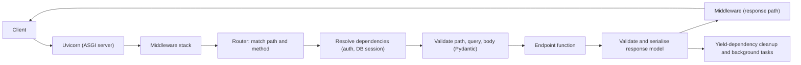

# Python Web Frameworks (Q55-Q66)

> **Reviewed:** 2026-09 · **Level:** Senior · **Type:** Foundational

## Q55. WSGI vs ASGI

WSGI (PEP 3333) is the synchronous interface between Python web servers and apps: one call per request, returning a response, which fits Django and Flask on servers like gunicorn. ASGI is its async successor: the app is an `async` callable receiving `scope`, `receive` and `send`, which supports long-lived connections such as WebSockets, SSE and HTTP/2 streaming. FastAPI/Starlette are ASGI-native; Django supports both.

- **Trade-offs**:
  - WSGI is mature and simple, but each in-flight request occupies a worker thread or process.
  - ASGI handles many concurrent connections per worker, but only pays off if your I/O libraries are async too.

**Example:**

```python
# Minimal WSGI app
def wsgi_app(environ, start_response):
    start_response("200 OK", [("Content-Type", "text/plain")])
    return [b"hello"]

# Minimal ASGI app
async def asgi_app(scope, receive, send):
    assert scope["type"] == "http"
    await send({"type": "http.response.start", "status": 200,
                "headers": [(b"content-type", b"text/plain")]})
    await send({"type": "http.response.body", "body": b"hello"})

# gunicorn module:wsgi_app       |  uvicorn module:asgi_app
```

> **Interview tip:** WSGI is to Python roughly what the Rack/Servlet interface is to Ruby/Java; ASGI resembles Node's always-async HTTP server model.

**Remember:** WSGI = sync request/response; ASGI = async, supports WebSockets and streaming.

## Q56. Django vs FastAPI vs Flask

Django is batteries-included: ORM, migrations, admin, auth, forms and a strong security baseline, ideal for data-heavy products and back-office tools. FastAPI is an ASGI framework built on Starlette and Pydantic that uses type hints for validation, dependency injection and automatic OpenAPI docs, ideal for API-first and async services. Flask is a minimal WSGI micro-framework where you pick your own ORM, validation and structure.

- **Trade-offs**:
  - Django: fastest to a full product, heavier and more opinionated; async support exists but much of the ecosystem is sync.
  - FastAPI: excellent API ergonomics and docs, but you assemble ORM, migrations, auth and admin yourself.
  - Flask: flexible and small, but large apps need discipline to avoid ad-hoc structure.

| Aspect | Django | FastAPI | Flask |
|--------|--------|---------|-------|
| Interface | WSGI and ASGI | ASGI | WSGI |
| ORM / migrations | Built-in | Bring your own (SQLAlchemy + Alembic, SQLModel) | Bring your own |
| Validation | Forms, DRF serializers | Pydantic via type hints | Extensions (marshmallow, Pydantic) |
| Admin UI | Built-in | None | Extensions |
| API docs | DRF / add-ons | Automatic OpenAPI + Swagger UI | Extensions |
| Async | Partial, improving | Native | Limited |
| Best fit | Full products, CMS, internal tools | Microservices, ML/API backends | Small services, custom stacks |

**Example:**

```python
# FastAPI
from fastapi import FastAPI
app = FastAPI()

@app.get("/health")
async def health() -> dict:
    return {"ok": True}

# Flask
from flask import Flask
flask_app = Flask(__name__)

@flask_app.get("/health")
def flask_health():
    return {"ok": True}

# Django (views.py + urls.py)
from django.http import JsonResponse
def django_health(request):
    return JsonResponse({"ok": True})
```

**Remember:** Django for products, FastAPI for typed async APIs, Flask for minimal custom stacks.

## Q57. How FastAPI uses type hints

FastAPI inspects each path operation's signature: path parameters, query parameters, headers, and Pydantic-typed bodies are parsed and validated automatically, returning a 422 with details on bad input. The same type information generates the OpenAPI schema and interactive docs at `/docs`. The `response_model` or return annotation filters and serialises output, which prevents leaking internal fields.

- **Trade-offs**:
  - Less boilerplate and always-accurate docs versus "magic" that newcomers must learn; complex custom validation still needs explicit validators.

**Example:**

```python
from typing import Annotated
from fastapi import FastAPI, Query, Path, Header
from pydantic import BaseModel

app = FastAPI()

class ItemOut(BaseModel):
    id: int
    name: str            # internal fields not listed here are never returned

@app.get("/items/{item_id}", response_model=ItemOut)
async def get_item(
    item_id: Annotated[int, Path(ge=1)],
    include_stock: Annotated[bool, Query()] = False,
    x_request_id: Annotated[str | None, Header()] = None,
):
    return {"id": item_id, "name": "Widget", "cost_price": 3}   # cost_price filtered out
```

**Remember:** Type hints drive parsing, validation, docs and response filtering.

## Q58. FastAPI dependency injection with `Depends`

`Depends` declares a function (or class) whose result FastAPI resolves per request and injects into your endpoint, with sub-dependencies resolved recursively and cached within the request. Dependencies that `yield` act like context managers, perfect for DB sessions that must close after the response. `app.dependency_overrides` swaps implementations in tests without monkeypatching.

- **Trade-offs**:
  - Clean composition of auth, DB sessions and settings versus hidden work per request; heavy dependencies on every route add latency.

**Example:**

```python
from typing import Annotated, AsyncIterator
from fastapi import Depends, FastAPI, HTTPException, Header
from sqlalchemy.ext.asyncio import AsyncSession, async_sessionmaker, create_async_engine

engine = create_async_engine("postgresql+asyncpg://app@db/app")
SessionLocal = async_sessionmaker(engine, expire_on_commit=False)
app = FastAPI()

async def get_session() -> AsyncIterator[AsyncSession]:
    async with SessionLocal() as session:
        yield session                   # closed after the response

async def current_user(authorization: Annotated[str, Header()]) -> dict:
    if not authorization.startswith("Bearer "):
        raise HTTPException(401, "missing token")
    return {"id": 1}

SessionDep = Annotated[AsyncSession, Depends(get_session)]
UserDep = Annotated[dict, Depends(current_user)]

@app.get("/me/orders")
async def my_orders(session: SessionDep, user: UserDep) -> list[dict]:
    ...

# Tests: app.dependency_overrides[current_user] = lambda: {"id": 42}
```

**Remember:** `Depends` composes per-request resources; `yield` dependencies handle cleanup.

## Q59. Pydantic validation (v2)

Pydantic models declare fields with type hints and validate and coerce input at runtime, raising a structured `ValidationError`. v2 has a Rust core (`pydantic-core`), uses `model_validate`/`model_dump`, `field_validator`/`model_validator`, and `ConfigDict` for settings like `extra="forbid"` or `strict=True`. Use it at trust boundaries: HTTP payloads, message consumers, config and third-party API responses.

- **Trade-offs**:
  - Strong guarantees and clear errors versus runtime cost on hot paths; lax mode coerces `"1"` to `1`, so use strict types where coercion is dangerous.

**Example:**

```python
from pydantic import BaseModel, ConfigDict, EmailStr, Field, field_validator, ValidationError

class SignupIn(BaseModel):
    model_config = ConfigDict(extra="forbid", str_strip_whitespace=True)

    email: EmailStr                         # requires the email-validator extra
    password: str = Field(min_length=12)
    age: int = Field(ge=13)

    @field_validator("password")
    @classmethod
    def not_common(cls, v: str) -> str:
        if v.lower() in {"password12345"}:
            raise ValueError("too common")
        return v

try:
    SignupIn.model_validate({"email": "a@x.io", "password": "short", "age": "12", "role": "admin"})
except ValidationError as e:
    print(e.errors())                       # password length, age, extra field
```

**Remember:** Pydantic validates at the edges; configure strictness and forbid extras.

## Q60. Configuration with pydantic-settings

`pydantic-settings` provides `BaseSettings`, which reads typed configuration from environment variables (and optionally `.env` files), validating it at startup so misconfiguration fails fast rather than on the first request. Wrap it in a cached factory and inject it via `Depends` so tests can override it. `SecretStr` keeps secrets out of reprs and logs.

- **Trade-offs**:
  - Typed, validated config versus an extra dependency; keep `.env` files for local development only, never commit real secrets.

**Example:**

```python
from functools import lru_cache
from pydantic import PostgresDsn, SecretStr
from pydantic_settings import BaseSettings, SettingsConfigDict

class Settings(BaseSettings):
    model_config = SettingsConfigDict(env_prefix="APP_", env_file=".env")

    database_url: PostgresDsn
    redis_url: str = "redis://localhost:6379/0"
    jwt_secret: SecretStr
    debug: bool = False

@lru_cache
def get_settings() -> Settings:
    return Settings()      # raises at startup if APP_DATABASE_URL is missing

print(get_settings().jwt_secret)   # **********
```

**Remember:** Validate config once at startup, from the environment.

## Q61. Middleware in Django and FastAPI

Middleware wraps every request and response, used for request IDs, logging, timing, CORS, auth context, and security headers. In Django, middleware is a callable chain configured in `MIDDLEWARE`, ordered top-down for requests and bottom-up for responses. In FastAPI/Starlette, you use `@app.middleware("http")`, built-ins like `CORSMiddleware`, or pure ASGI middleware for streaming-safe and faster behaviour.

- **Trade-offs**:
  - Central cross-cutting logic versus global cost on every request; auth for specific routes is usually better as a dependency or decorator.
  - `BaseHTTPMiddleware`-style middleware can interfere with streaming responses; pure ASGI middleware avoids that.

**Example:**

```python
import time, uuid
from fastapi import FastAPI, Request
from fastapi.middleware.cors import CORSMiddleware

app = FastAPI()
app.add_middleware(CORSMiddleware, allow_origins=["https://app.example.com"], allow_methods=["*"])

@app.middleware("http")
async def request_context(request: Request, call_next):
    rid = request.headers.get("x-request-id", str(uuid.uuid4()))
    start = time.perf_counter()
    response = await call_next(request)
    response.headers["x-request-id"] = rid
    response.headers["server-timing"] = f"app;dur={(time.perf_counter() - start) * 1000:.1f}"
    return response

# Django equivalent
class RequestIdMiddleware:
    def __init__(self, get_response):
        self.get_response = get_response
    def __call__(self, request):
        response = self.get_response(request)
        response["X-Request-Id"] = request.headers.get("X-Request-Id", str(uuid.uuid4()))
        return response
```

**Remember:** Middleware for global concerns; dependencies for route-specific ones.

## Q62. Request lifecycle in a FastAPI app

A request arrives at the ASGI server (uvicorn), which parses HTTP and calls the app with a scope. It passes through the middleware stack, the router matches the path, dependencies are resolved, the body is validated with Pydantic, and the endpoint runs (on the event loop for `async def`, in a threadpool for `def`). The return value is validated against the response model, serialised to JSON, sent back through middleware, and then `yield`-dependency cleanup and background tasks run.

- **Trade-offs**:
  - Clear extension points at each stage; understanding the order matters for things like when a DB session is closed relative to background tasks.



**Example:**

```python
from fastapi import FastAPI, HTTPException, Request
from fastapi.responses import JSONResponse

app = FastAPI()

class DomainError(Exception):
    def __init__(self, code: str): self.code = code

@app.exception_handler(DomainError)           # turns domain errors into HTTP responses
async def domain_error_handler(request: Request, exc: DomainError):
    return JSONResponse(status_code=409, content={"error": exc.code})

@app.post("/orders/{order_id}/cancel")
async def cancel(order_id: int) -> dict:
    if order_id == 0:
        raise HTTPException(404, "not found")
    raise DomainError("already_shipped")
```

**Remember:** Server, middleware, router, dependencies, validation, endpoint, response model, cleanup.

## Q63. Django ORM and admin strengths

Django's ORM gives models, migrations, querysets that are lazy and chainable, `select_related`/`prefetch_related` for eager loading, `F()` expressions for atomic updates and `transaction.atomic` for transactions. The admin generates a secure CRUD back-office from models in minutes, which is a major productivity advantage for internal tools. Combined with built-in auth, permissions, and Django REST Framework, it is a strong default for data-centric products.

- **Trade-offs**:
  - Huge productivity versus coupling to Django's conventions; complex analytical SQL may be clearer as raw SQL or a separate query layer.
  - Admin is for trusted staff, not a customer-facing UI.

**Example:**

```python
# models.py
from django.db import models, transaction
from django.db.models import F

class Product(models.Model):
    name = models.CharField(max_length=200)
    stock = models.PositiveIntegerField(default=0)

class Order(models.Model):
    product = models.ForeignKey(Product, on_delete=models.PROTECT, related_name="orders")
    qty = models.PositiveIntegerField()

def place_order(product_id: int, qty: int) -> Order:
    with transaction.atomic():
        updated = Product.objects.filter(id=product_id, stock__gte=qty).update(stock=F("stock") - qty)
        if not updated:
            raise ValueError("out of stock")
        return Order.objects.create(product_id=product_id, qty=qty)

# admin.py
from django.contrib import admin
@admin.register(Product)
class ProductAdmin(admin.ModelAdmin):
    list_display = ("name", "stock")
    search_fields = ("name",)
```

**Remember:** Django = ORM + migrations + admin + auth out of the box.

## Q64. Background tasks vs Celery

FastAPI's `BackgroundTasks` (and Starlette's) run a function after the response is sent, in the same process, which is fine for small best-effort work like sending a non-critical email or logging. If the process restarts, the work is lost, there are no retries, and CPU-heavy work still competes with request handling. For durable, retryable, schedulable or heavy jobs, use a task queue like Celery with a broker (RabbitMQ or Redis) and separate worker processes.

- **Trade-offs**:
  - In-process background tasks: zero infrastructure, no durability.
  - Celery: retries, scheduling, routing and horizontal scaling, but extra infrastructure, monitoring and idempotency requirements (tasks can run more than once).

**Example:**

```python
from fastapi import BackgroundTasks, FastAPI
from celery import Celery

app = FastAPI()
celery_app = Celery("worker", broker="amqp://guest@rabbitmq//")

def audit_log(user_id: int) -> None: ...

@celery_app.task(bind=True, autoretry_for=(ConnectionError,), retry_backoff=True, max_retries=5)
def generate_invoice_pdf(self, order_id: int) -> None:
    ...   # heavy, must not be lost, must be idempotent

@app.post("/orders/{order_id}/complete")
async def complete(order_id: int, background: BackgroundTasks) -> dict:
    background.add_task(audit_log, user_id=1)      # best-effort, after response
    generate_invoice_pdf.delay(order_id)           # durable, separate worker
    return {"status": "accepted"}
```

See [Celery](../celery/index.md) and [RabbitMQ](../rabbitmq/index.md) for task queue details.

**Remember:** BackgroundTasks for best-effort; Celery for durable, retryable work.

## Q65. Serving with gunicorn and uvicorn workers

In production you run multiple worker processes to use all cores, since each process has its own GIL. For WSGI apps (Django, Flask) gunicorn manages sync or threaded workers; for ASGI apps you run uvicorn with `--workers`, or gunicorn as a process manager with `uvicorn.workers.UvicornWorker` (newer uvicorn also ships its own worker class package). In containers orchestrated by Kubernetes, a common alternative is one process per container and scaling by replicas.

- **Trade-offs**:
  - More workers increase throughput but multiply memory and DB connections (pool size times workers times replicas).
  - Sync workers need enough concurrency for slow requests; async workers need non-blocking code.
  - Set timeouts, graceful shutdown and `max_requests` recycling to contain leaks.

**Example:**

```python
# gunicorn.conf.py
import multiprocessing

bind = "0.0.0.0:8000"
workers = multiprocessing.cpu_count() * 2 + 1   # common starting point for sync; tune by load testing
worker_class = "uvicorn.workers.UvicornWorker"  # ASGI; omit for sync WSGI
timeout = 30
graceful_timeout = 30
max_requests = 1000             # recycle workers to limit memory growth
max_requests_jitter = 100
accesslog = "-"

# Run:   gunicorn app.main:app -c gunicorn.conf.py
# Or:    uvicorn app.main:app --host 0.0.0.0 --port 8000 --workers 4
```

**Remember:** Scale with processes; budget memory and DB connections per worker.

## Q66. Lifespan events and app-scoped resources

Long-lived resources such as DB engines, HTTP clients and Redis pools should be created once per worker process at startup and closed at shutdown, not per request. FastAPI uses a `lifespan` async context manager for this; Django relies on settings-configured connection handling and `AppConfig.ready()` for startup hooks. Creating clients per request wastes connections and TLS handshakes; creating them at import time breaks under forking servers.

- **Trade-offs**:
  - Reusing pooled clients is faster and gentler on dependencies, but you must handle graceful shutdown and avoid sharing non-fork-safe clients across processes.

**Example:**

```python
from contextlib import asynccontextmanager
import httpx
from fastapi import FastAPI, Request
from redis.asyncio import Redis

@asynccontextmanager
async def lifespan(app: FastAPI):
    app.state.http = httpx.AsyncClient(timeout=5)
    app.state.redis = Redis.from_url("redis://redis:6379/0")
    yield                                   # app serves requests here
    await app.state.http.aclose()
    await app.state.redis.aclose()

app = FastAPI(lifespan=lifespan)

@app.get("/rates")
async def rates(request: Request) -> dict:
    r = await request.app.state.http.get("https://rates.example.com/latest")
    return r.json()
```

**Remember:** Create clients once per process in lifespan; close them on shutdown.

## References

- [PEP 3333 - WSGI](https://peps.python.org/pep-3333/)
- [FastAPI documentation](https://fastapi.tiangolo.com/)
- [FastAPI dependencies](https://fastapi.tiangolo.com/tutorial/dependencies/)
- [FastAPI background tasks](https://fastapi.tiangolo.com/tutorial/background-tasks/)
- [FastAPI lifespan events](https://fastapi.tiangolo.com/advanced/events/)
- [Pydantic documentation](https://docs.pydantic.dev/)
- [Django documentation](https://docs.djangoproject.com/)
- [Django middleware](https://docs.djangoproject.com/en/stable/topics/http/middleware/)
