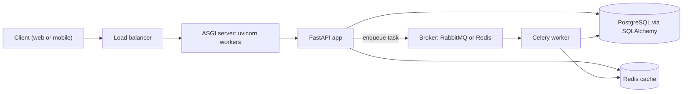

# Python Backend: Top 100 Interview Questions

> **Reviewed:** 2026-09 · **Level:** Senior · **Type:** Foundational

This track is for senior full-stack engineers, especially those strong in JavaScript and Node.js, who are preparing for backend interviews in Python. It covers 100 questions numbered Q1-Q100 across nine files, from how CPython runs code to running FastAPI and Django services in production. Every answer is short enough to say out loud in 30-60 seconds and comes with trade-offs and a practical code example.

## What is covered

| File | Topic | Questions |
|------|-------|-----------|
| [01 Fundamentals and Runtime](./01-fundamentals-and-runtime.md) | CPython, GIL, identity and mutability, memory, packaging, typing, dunders, versions | Q1-Q14 |
| [02 Data Structures and Stdlib](./02-data-structures-and-stdlib.md) | Complexity, dict ordering, comprehensions, generators, itertools, collections, dataclasses, copying, sorting | Q15-Q26 |
| [03 Functions, OOP and Design](./03-functions-oop-and-design.md) | Closures, decorators, context managers, classes, MRO, ABCs vs Protocols, slots, descriptors, metaclasses, SOLID | Q27-Q40 |
| [04 Async and Concurrency](./04-async-and-concurrency.md) | Threads vs processes vs asyncio, event loop, tasks, TaskGroup, blocking calls, locks, Node comparison, free-threading | Q41-Q54 |
| [05 Web Frameworks](./05-web-frameworks.md) | WSGI vs ASGI, Django vs FastAPI vs Flask, DI, Pydantic, middleware, lifecycle, Celery, workers | Q55-Q66 |
| [06 Databases and ORM](./06-databases-and-orm.md) | SQLAlchemy, sessions, N+1, pooling, transactions, locking, migrations, async drivers, Redis | Q67-Q76 |
| [07 APIs, Auth and Security](./07-apis-auth-and-security.md) | REST, pagination, idempotency, JWT vs sessions, OAuth2, hashing, vulnerabilities, secrets | Q77-Q84 |
| [08 Testing and Tooling](./08-testing-and-tooling.md) | pytest, mocking, async tests, endpoint tests, coverage, ruff, mypy, pre-commit | Q85-Q92 |
| [09 Performance and Production](./09-performance-and-production.md) | Profiling, leaks, caching, scaling, logging, Docker, observability, Python vs Node | Q93-Q100 |

For quick navigation, see the [Question Index](./question-index.md). For last-minute revision, see the [Cheatsheet](./cheatsheet.md).

## Recommended learning order

1. **Runtime first** (Q1-Q14): the GIL, the object model and mutability explain most Python surprises and most follow-up questions.
2. **Idiomatic Python** (Q15-Q40): data structures, generators, decorators and context managers are what interviewers use to judge whether you write "Pythonic" code or JavaScript in Python syntax.
3. **Concurrency** (Q41-Q54): this is the biggest mental shift from Node. Focus on blocking calls in async code and on choosing between threads, processes and asyncio.
4. **Frameworks and data** (Q55-Q76): FastAPI or Django plus SQLAlchemy or the Django ORM is where most system-level questions land.
5. **Production concerns** (Q77-Q100): security, testing, profiling and deployment separate senior answers from mid-level ones.

> **Interview tip:** When a question has a Node equivalent, briefly map it ("this is like `Promise.all`, but coroutines are lazy"). It shows transferable depth without dodging the Python specifics.

## How Python compares to the Node track

The [Node.js and Express track](../node-express/question-index.md) covers the same backend ground from the JavaScript side. The main differences to internalise:

| Topic | Node.js | Python |
|-------|---------|--------|
| Concurrency default | Async everywhere, one event loop | Sync by default; asyncio is opt-in |
| Async primitive | Promise (starts eagerly) | Coroutine (lazy until awaited or wrapped in a Task) |
| Multi-core | cluster, worker_threads, replicas | Worker processes (gunicorn/uvicorn), replicas; free-threading emerging |
| Server interface | Built-in `http` module | WSGI (sync) or ASGI (async) servers |
| Popular frameworks | Express, Fastify, NestJS | Django, FastAPI, Flask |
| Validation | zod, class-validator | Pydantic (driven by type hints) |
| ORM | Prisma, TypeORM, Drizzle | SQLAlchemy, Django ORM |
| Background jobs | BullMQ | [Celery](../celery/index.md) with [RabbitMQ](../rabbitmq/index.md) or Redis |
| Types | TypeScript, erased at build | Type hints, ignored by the runtime but used by frameworks |
| Packaging | `package.json` plus a lock file | `pyproject.toml` plus uv/Poetry lock, venv |

For SQL fundamentals shared by both tracks, see the [SQL question index](../sql/question-index.md).

## A typical Python backend

A common production shape: an ASGI server (uvicorn, often managed by gunicorn) runs several worker processes of a FastAPI app. The app reads and writes Postgres through SQLAlchemy, caches in Redis, and hands slow or retryable work to Celery workers through a message broker.

Questions that map directly onto this diagram:

- The ASGI server and its workers: [Q55](./05-web-frameworks.md#q55-wsgi-vs-asgi) and [Q65](./05-web-frameworks.md#q65-serving-with-gunicorn-and-uvicorn-workers).
- The request flow inside the FastAPI app: [Q62](./05-web-frameworks.md#q62-request-lifecycle-in-a-fastapi-app).
- The database layer: [Q67-Q75](./06-databases-and-orm.md). Redis: [Q76](./06-databases-and-orm.md#q76-using-redis-from-python).
- Celery workers and the broker: [Q64](./05-web-frameworks.md#q64-background-tasks-vs-celery).

## References

- [Python documentation](https://docs.python.org/3/)
- [FastAPI documentation](https://fastapi.tiangolo.com/)
- [Django documentation](https://docs.djangoproject.com/)
- [SQLAlchemy documentation](https://docs.sqlalchemy.org/)
- [pytest documentation](https://docs.pytest.org/)
- [Pydantic documentation](https://docs.pydantic.dev/)
