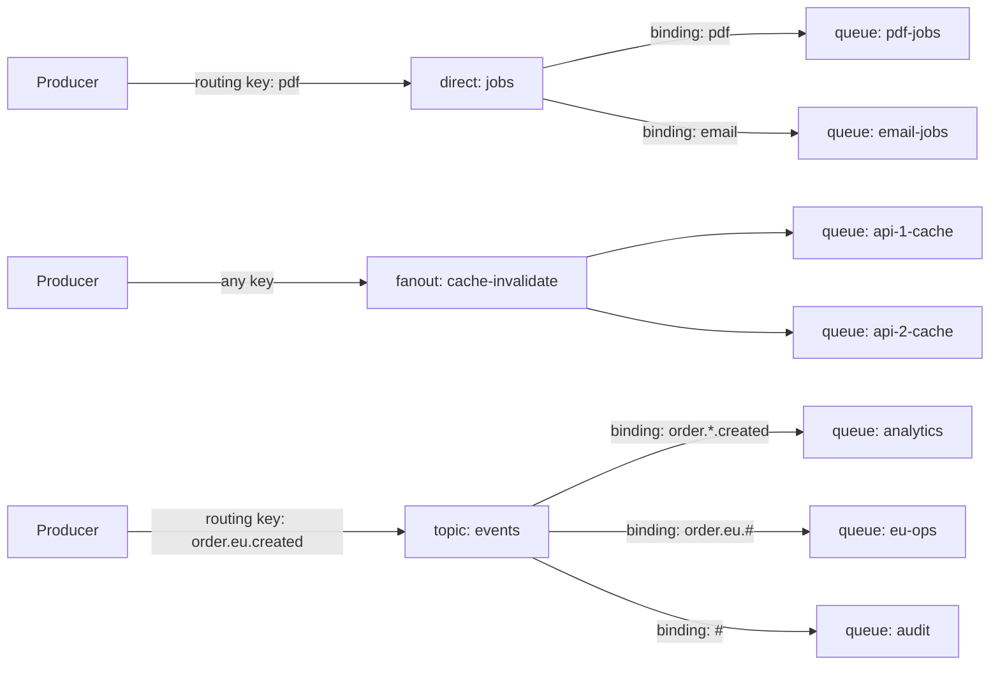

# Exchanges, Queues and Bindings (Q5-Q8)

> **Reviewed:** 2026-09 · **Level:** Senior · **Type:** Foundational

The architecture overview introduces exchange types briefly ([messaging systems](../architecture/05-messaging-systems.md)); here we go through routing behavior precisely.

## Q5. Direct and fanout exchanges cover exact routing and broadcast

A **direct** exchange delivers a message to every queue whose binding key equals the routing key exactly. A **fanout** exchange ignores the routing key and delivers to every bound queue. Direct is for "send this kind of job to this queue"; fanout is for "everyone interested gets a copy".

**How it works:**



**Trade-offs and pitfalls:**

- Several queues can share the same binding key on a direct exchange; each gets a copy.
- Fanout to per-instance queues (exclusive, auto-delete) is a common pattern for cache invalidation or websocket broadcast; those queues vanish when the instance disconnects, so messages sent while it is down are not kept.

**Remember:** Direct = exact key match; fanout = everyone bound.

## Q6. Topic exchanges route on dot-separated keys with `*` and `#` wildcards

Routing keys are words separated by dots (`order.eu.created`). In bindings, `*` matches exactly one word and `#` matches zero or more words. Topic exchanges are the workhorse for event routing because consumers choose what they want by pattern.

**Example:**

| Routing key | `order.*.created` | `order.eu.#` | `*.*.cancelled` | `#` |
|---|---|---|---|---|
| `order.eu.created` | Yes | Yes | No | Yes |
| `order.us.created` | Yes | No | No | Yes |
| `order.eu.item.added` | No | Yes | No | Yes |
| `order.eu.cancelled` | No | Yes | Yes | Yes |

**Trade-offs and pitfalls:**

- Design the key hierarchy up front (`domain.region.event` or `entity.event.version`); reordering later breaks bindings.
- A `#` binding receives everything; useful for audit, expensive if the consumer is slow.
- If a queue matches through multiple bindings, it still gets only one copy of a message.

**Remember:** `*` is one word, `#` is zero or more.

## Q7. Headers exchanges route on message header values instead of the routing key

A **headers** exchange matches bindings against message headers. The binding argument `x-match` set to `all` requires every listed header to match; `any` requires at least one (RabbitMQ also supports `all-with-x` and `any-with-x`, which include `x-` prefixed headers in matching). Useful when routing criteria are multi-dimensional and don't fit a key hierarchy.

**Example:**

```python
ch.exchange_declare("reports", exchange_type="headers", durable=True)
ch.queue_bind(
    queue="eu-pdf-reports",
    exchange="reports",
    arguments={"x-match": "all", "format": "pdf", "region": "eu"},
)
ch.basic_publish(
    exchange="reports",
    routing_key="",
    body=b"...",
    properties=pika.BasicProperties(headers={"format": "pdf", "region": "eu"}),
)
```

**Trade-offs and pitfalls:**

- Less common, so less familiar to teammates; topic exchanges usually suffice.
- Matching is exact value equality; no wildcards.

**Remember:** Headers exchange = routing on header equality with `x-match` all or any.

## Q8. Queue properties and exchange features shape lifecycle and safety

Queues are declared with properties that cannot be changed later without deleting and recreating (or using policies for supported settings). Know them:

| Property / argument | Meaning |
|---|---|
| `durable` | Queue definition survives broker restart (messages also need to be persistent) |
| `exclusive` | Used by one connection only; deleted when it closes |
| `auto_delete` | Deleted when the last consumer unsubscribes |
| `x-queue-type` | `classic`, `quorum` or `stream` |
| `x-message-ttl`, `x-expires` | Message TTL and queue idle expiry |
| `x-max-length`, `x-overflow` | Length cap and behavior (`drop-head`, `reject-publish`, `reject-publish-dlx`) |
| `x-dead-letter-exchange` | Where rejected/expired messages go |

**Example:**

```python
ch.exchange_declare("events", exchange_type="topic", durable=True,
                    arguments={"alternate-exchange": "events.unrouted"})
ch.exchange_declare("events.unrouted", exchange_type="fanout", durable=True)
ch.queue_declare("events.unrouted", durable=True)
ch.queue_bind("events.unrouted", "events.unrouted")
```

**Trade-offs and pitfalls:**

- Redeclaring a queue with different arguments fails with `PRECONDITION_FAILED` and closes the channel. Prefer **policies** (`rabbitmqctl set_policy`) for TTL, length limits and DLX, so you can change them without redeploying code.
- An alternate exchange catches unroutable messages so publisher bugs don't lose data silently.

**Remember:** Declare durable topology in code or definitions; tune TTL/DLX/limits via policies.

## References

- [RabbitMQ documentation: exchanges, queues, policies](https://www.rabbitmq.com/docs)
- [Messaging systems overview](../architecture/05-messaging-systems.md)
