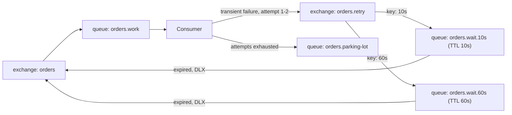

# Dead-Lettering and Retries (Q13-Q16)

> **Reviewed:** 2026-09 · **Level:** Senior · **Type:** Foundational

## Q13. A dead-letter exchange receives messages a queue could not deliver successfully

Configure a queue with a dead-letter exchange (DLX) and, optionally, a dead-letter routing key. RabbitMQ republishes a message to the DLX when it is rejected/nacked with `requeue=false`, expires via TTL, is dropped by a length limit, or (quorum queues) exceeds the delivery limit. The broker adds an `x-death` header recording the reason, source queue and count.

**Example:**

```bash
# Prefer a policy over hard-coded queue arguments
rabbitmqctl set_policy orders-dlx '^orders\.' \
  '{"dead-letter-exchange":"dlx","dead-letter-routing-key":"orders.dead"}' \
  --apply-to queues
```

```python
ch.exchange_declare("dlx", exchange_type="direct", durable=True)
ch.queue_declare("orders.dead", durable=True, arguments={"x-queue-type": "quorum"})
ch.queue_bind("orders.dead", "dlx", routing_key="orders.dead")
```

**Trade-offs and pitfalls:**

- Dead-lettering is not guaranteed-safe for classic queues by default (the broker does not use confirms internally); quorum queues support at-least-once dead-lettering via `dead-letter-strategy: at-least-once` (requires `overflow: reject-publish`).
- A DLQ with no alerting and no replay tool is data loss with extra steps.
- Keep the original routing key unless you set a dead-letter routing key explicitly; plan how replay will route messages back.

**Remember:** DLX = where rejected, expired, overflowed or over-delivered messages go.

## Q14. TTL can be set per queue or per message, with different expiry semantics

`x-message-ttl` (queue argument or policy) expires every message after a duration; the `expiration` property sets TTL per message. `x-expires` deletes an unused *queue* after idle time. Expired messages are dead-lettered if a DLX exists.

**Trade-offs and pitfalls:**

- For classic queues, per-message TTL is only enforced when the message reaches the head of the queue. A long-TTL message at the head blocks shorter-TTL messages behind it from expiring on time. That is why "per-message TTL with one wait queue" is a broken delayed-retry design; use one wait queue per delay tier with a queue-level TTL.
- TTL is not a scheduler with precise timing; expect expiry to be approximate.

**Remember:** Queue-level TTL is predictable; per-message TTL expires at the head.

## Q15. Delayed retries use TTL wait queues that dead-letter back to the work queue

RabbitMQ has no built-in "retry in 30 seconds". The classic pattern: on a transient failure, the consumer publishes the message to a retry exchange routed to a wait queue with a TTL and a DLX pointing back at the main exchange. After the TTL, the message expires and returns to the work queue. Use tiers (10s, 1m, 10m) for backoff and a final parking lot.

**How it works:**



**Example:**

```python
def handle(ch, method, props, body):
    attempt = int((props.headers or {}).get("x-attempt", 0))
    try:
        process(body)
    except TransientError:
        if attempt >= 3:
            publish(ch, "orders.parking", "orders", body, props, attempt)
        else:
            tier = ["10s", "60s", "600s"][attempt]
            publish(ch, "orders.retry", tier, body, props, attempt + 1)
    ch.basic_ack(method.delivery_tag)   # original is done; the copy carries the retry
```

**Trade-offs and pitfalls:**

- Publish the retry copy with confirms before acking the original, or you can lose the message between the two steps.
- The community delayed-message exchange plugin offers per-message delays, but check its documented limitations (durability and scale) before using it for important traffic.
- Consumers should track attempts in a header you control; `x-death` counts work too but are awkward across multiple hops.

**Remember:** Delay tiers = TTL queues dead-lettering back into the main exchange.

## Q16. Poison messages must be bounded by a delivery limit and parked

A poison message fails every time (bad schema, a bug for one edge case, a payload that crashes the consumer). With naive `nack(requeue=true)` it loops at full speed, burning CPU and blocking other messages. If it crashes the consumer process, redelivery on connection loss causes a crash loop.

**How it works:**

- Quorum queues track delivery count and support a delivery limit (`x-delivery-limit` or policy `delivery-limit`); once exceeded, the message is dead-lettered or dropped. RabbitMQ 4.0 made a default delivery limit apply to quorum queues; check the value for your version.
- Classic queues have no delivery count; implement attempts in headers or an external store, and check `redelivered` as a hint.
- Parking-lot queue + alert + replay tool, after fixing code or data.

**Example:**

```bash
rabbitmqctl set_policy orders-qq '^orders\.work$' \
  '{"delivery-limit":5,"dead-letter-exchange":"dlx","dead-letter-routing-key":"orders.dead"}' \
  --apply-to quorum_queues
```

**Trade-offs and pitfalls:**

- Too low a limit dead-letters messages during a transient outage; combine with delayed retries for transient errors and reserve the delivery limit for crashes.
- Schema validation at the consumer boundary turns many poison messages into immediate, explicit dead-letters.

**Remember:** Cap deliveries, park the message, alert, fix, replay.

## References

- [RabbitMQ documentation: dead letter exchanges, TTL, quorum queues](https://www.rabbitmq.com/docs)
- [Celery retries and DLQ patterns (this site)](../celery/07-retries-timeouts-failures.md)
