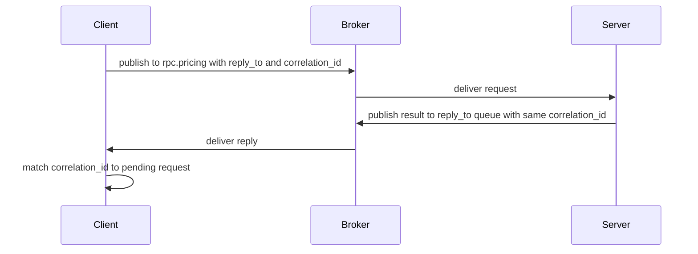

# Messaging Patterns (Q17-Q20)

> **Reviewed:** 2026-09 · **Level:** Senior · **Type:** Foundational

## Q17. Work queues spread tasks across competing consumers

One queue, many consumers: each message goes to exactly one consumer. Add consumers to increase throughput. With manual acks and a small prefetch, slow consumers get fewer messages and a crashed consumer's unacked messages are redelivered to others. This is the pattern behind Celery and most job systems.

**Example:** A `thumbnails` queue with 10 consumer processes. A burst of 5,000 uploads drains in parallel; scaling consumers to 20 roughly doubles throughput until the bottleneck moves to storage or CPU.

**Trade-offs and pitfalls:**

- Competing consumers break strict ordering (see [Ordering and idempotency](./08-ordering-idempotency.md)).
- Default round-robin dispatch with a large prefetch gives uneven load when tasks vary in cost; tune prefetch ([Prefetch and flow control](./06-prefetch-flow-control.md)).

**Remember:** Same queue = share the work.

## Q18. Publish/subscribe gives every subscriber its own queue

For events that several services care about (`order.created` for email, analytics, search), publish once to a fanout or topic exchange. Each service declares its own durable queue and binds it. Each queue gets a copy, and inside each queue the service's instances compete.

**Example:**

```python
ch.exchange_declare("orders", exchange_type="topic", durable=True)

# email service
ch.queue_declare("email.orders", durable=True)
ch.queue_bind("email.orders", "orders", routing_key="order.*.created")

# analytics service
ch.queue_declare("analytics.orders", durable=True)
ch.queue_bind("analytics.orders", "orders", routing_key="order.#")
```

**Trade-offs and pitfalls:**

- A subscriber that is down accumulates backlog in its durable queue; set length limits or TTLs so one dead service cannot fill the broker's disk.
- New subscribers only receive messages published after they bind. If you need replay of history, that is a stream or Kafka use case.

**Remember:** Different queue = each service gets its own copy.

## Q19. Routing lets consumers subscribe to subsets using direct or topic exchanges

Routing is pub/sub with filtering. Producers encode what the message is about in the routing key (`log.error.payments`), and consumers bind only for what they want (`log.error.*`, `*.*.payments`). This keeps producers ignorant of consumers while avoiding every consumer filtering everything.

**Example:** An alerting service binds `log.error.#`; the payments team's debugging queue binds `log.*.payments`; an archive binds `#`.

**Trade-offs and pitfalls:**

- Routing keys become a contract; version them and document them like APIs.
- Very high binding counts on topic exchanges add routing cost; keep bindings intentional.

**Remember:** Put meaning in the routing key; let consumers filter by binding.

## Q20. RPC over RabbitMQ uses `reply_to` and `correlation_id`

The client publishes a request with `reply_to` set to a reply queue and a unique `correlation_id`. The server processes it and publishes the response to the `reply_to` queue with the same `correlation_id`. The client matches responses to pending requests by id. RabbitMQ also offers **direct reply-to** (`amq.rabbitmq.reply-to`), which avoids declaring a reply queue per client.

**How it works:**



**Example:**

```python
corr_id = str(uuid4())
ch.basic_publish(
    exchange="",
    routing_key="rpc.pricing",
    properties=pika.BasicProperties(reply_to="amq.rabbitmq.reply-to", correlation_id=corr_id,
                                    expiration="5000"),
    body=json.dumps({"sku": "A1"}),
)
```

**Trade-offs and pitfalls:**

- You need client-side timeouts; a lost server means no reply ever arrives. Set a message TTL (`expiration`) so stale requests are not processed after the caller gave up.
- RPC over a broker adds latency and hides coupling; for synchronous request/response, HTTP or gRPC are usually clearer. Use broker RPC when you want queue-based load leveling or the caller cannot reach the server directly.

**Remember:** `reply_to` says where, `correlation_id` says which request.

## References

- [RabbitMQ documentation: tutorials, direct reply-to](https://www.rabbitmq.com/docs)
- [Messaging systems overview](../architecture/05-messaging-systems.md)
