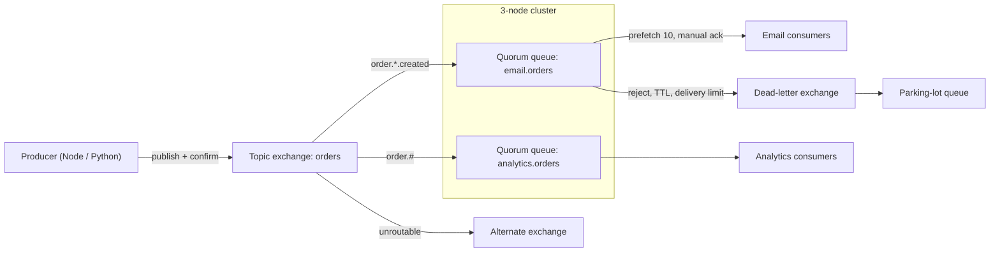

# RabbitMQ Overview (Q1-Q41)

> **Reviewed:** 2026-09 · **Level:** Senior · **Type:** Foundational

RabbitMQ is an open-source message broker built around exchanges, queues and bindings (AMQP 0-9-1), with support for AMQP 1.0, MQTT, STOMP and its own stream protocol. It excels at task queues, command messaging, flexible routing and request/reply, with per-message acknowledgements, dead-lettering and replicated quorum queues.

For how RabbitMQ compares with Kafka, SQS and Redis Streams at a high level, start with the [messaging systems overview](../architecture/05-messaging-systems.md). This section owns the depth.

## When to use RabbitMQ

- Background jobs and commands processed once by one of many workers (often via [Celery](../celery/index.md)).
- Routing messages by type, region or severity to different consumers.
- Decoupling services where messages should be removed once handled.
- Replayable logs inside an existing RabbitMQ estate (Streams), when Kafka would be overkill.

Prefer Kafka for high-volume event streams with long retention and many independent readers, and SQS when you want a fully managed queue on AWS ([decision guide](./10-rabbitmq-vs-kafka-sqs-redis.md)).

## Architecture

## Learning order

| # | Topic | Questions |
|---|---|---|
| 1 | [Fundamentals](./01-fundamentals.md) | Q1-Q4 |
| 2 | [Exchanges, queues and bindings](./02-exchanges-queues-bindings.md) | Q5-Q8 |
| 3 | [Reliability](./03-reliability.md) | Q9-Q12 |
| 4 | [Dead-lettering and retries](./04-dead-lettering-and-retries.md) | Q13-Q16 |
| 5 | [Messaging patterns](./05-patterns.md) | Q17-Q20 |
| 6 | [Prefetch and flow control](./06-prefetch-flow-control.md) | Q21-Q23 |
| 7 | [Clustering and HA](./07-clustering-and-ha.md) | Q24-Q27 |
| 8 | [Ordering and idempotency](./08-ordering-idempotency.md) | Q28-Q30 |
| 9 | [Security and operations](./09-security-and-ops.md) | Q31-Q34 |
| 10 | [RabbitMQ vs Kafka, SQS and Redis](./10-rabbitmq-vs-kafka-sqs-redis.md) | Q35-Q37 |
| 11 | [Integration: Node, Python, Celery](./11-integration.md) | Q38-Q41 |

Quick access: [Question index](./question-index.md) · [Cheatsheet](./cheatsheet.md)

> **Interview tip:** Be current. RabbitMQ 4.x removed classic mirrored queues; quorum queues are the recommended replicated queue type, and Streams cover replayable log use cases.

## Related sections

- [Celery](../celery/index.md) and [MinIO object storage](../minio/index.md)
- [Node/Express question index](../node-express/question-index.md) and [Python backend](../python/index.md)
- [Orchestration](../../devops/orchestration/index.md)
- [System design case studies](../../case-studies/index.md)
