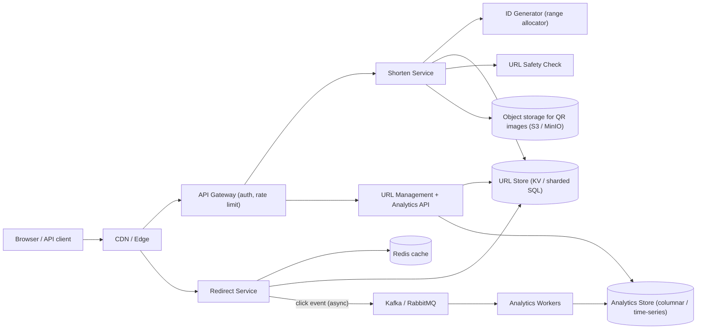
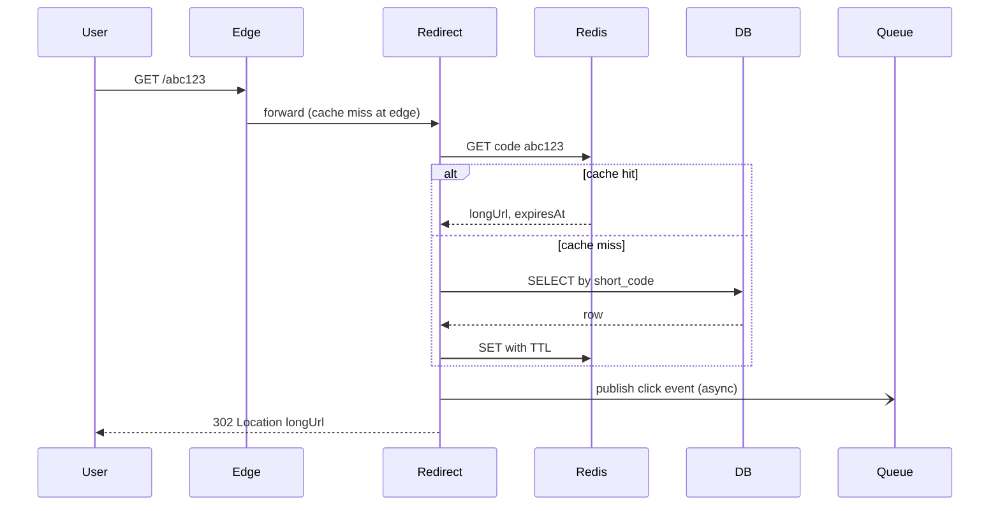

# URL Shortener System

> **Reviewed:** 2026-09 · **Scope:** Full-stack (frontend + backend + scalability) · **Level:** Senior / Tech Lead

---

## Overview

Design a URL shortening service like bit.ly or TinyURL that converts long URLs into short, shareable links. Users can shorten URLs, customize aliases, and track analytics.

---

## 1) Requirements

### Functional Requirements

**Core Features:**
- Generate unique short URLs for long URLs (e.g., `https://example.com/very/long/path` → `https://short.ly/abc123`)
- Redirect users to original URL when short URL is accessed
- Custom alias support (users can create memorable links like `short.ly/my-brand`)
- URL expiration (URLs can expire after a set time)
- Analytics tracking (click counts, geographic data, referrer, device types)
- User accounts with URL management dashboard
- QR code generation for short URLs

**User Features:**
- Responsive web interface
- Copy to clipboard functionality
- Real-time analytics updates
- URL list with search and filtering
- Bulk URL management

### Non-Functional Requirements

**Performance:**
- URL shortening: < 100ms
- URL redirection: < 100ms
- Handle 100M+ requests per day
- 10:1 read/write ratio (10,000 reads/sec, 1,000 writes/sec)

**Scalability:**
- Support billions of URLs
- Horizontal scaling capability
- High availability (99.9% uptime)

**Security:**
- Rate limiting to prevent abuse
- URL validation and sanitization
- Phishing detection
- HTTPS enforcement

---

## 2) Component Hierarchy

The frontend is a React application with a clean component structure. Here's how I'd organize it:

```
App
├── Layout
│   ├── Header
│   │   ├── Logo
│   │   ├── Navigation (Home, Dashboard, Analytics)
│   │   └── UserMenu (Login/Logout, Profile)
│   └── MainContent
├── Pages
│   ├── HomePage
│   │   ├── URLShortenerForm
│   │   │   ├── URLInput (validates URL in real-time)
│   │   │   ├── AliasInput (optional custom alias)
│   │   │   ├── ExpirationDatePicker (optional)
│   │   │   └── SubmitButton
│   │   └── ShortUrlDisplay
│   │       ├── ShortUrlCard (displays generated short URL)
│   │       ├── CopyButton (copies to clipboard)
│   │       ├── QRCodeButton (generates QR code)
│   │       └── ShareButtons (social media sharing)
│   ├── DashboardPage
│   │   ├── URLList
│   │   │   ├── URLItem (individual shortened URL)
│   │   │   │   ├── OriginalUrl
│   │   │   │   ├── ShortUrl
│   │   │   │   ├── ClickCount
│   │   │   │   ├── ExpirationBadge
│   │   │   │   └── ActionButtons (Edit, Delete, View Analytics)
│   │   │   └── SearchBar (filter URLs)
│   │   └── Pagination
│   └── AnalyticsPage
│       ├── AnalyticsDashboard
│       │   ├── SummaryCards (Total Clicks, Unique Clicks, Top Countries)
│       │   ├── ClickCountChart (line chart over time)
│       │   ├── CountryChart (bar chart by country)
│       │   ├── ReferrerChart (pie chart of referrers)
│       │   ├── DeviceChart (mobile vs desktop)
│       │   └── DateRangeFilter
│       └── URLSelector (select which URL to analyze)
└── SharedComponents
    ├── Button
    ├── Input
    ├── Card
    ├── Toast (notifications)
    ├── LoadingSpinner
    └── Modal (for QR code, delete confirmation)
```

### Key Components Explained

**1. URLShortenerForm Component**
- Main form for shortening URLs
- Real-time URL validation (checks if URL is valid format)
- Custom alias availability check (debounced API call)
- Handles form submission with React Query mutation
- Shows loading state during API call

**2. ShortUrlDisplay Component**
- Displays generated short URL
- Copy to clipboard functionality using Clipboard API
- QR code generation and display in modal
- Share buttons for social media

**3. URLList Component**
- Displays user's shortened URLs
- Virtual scrolling for performance with many URLs
- Search and filter functionality
- Pagination for large lists

**4. AnalyticsDashboard Component**
- Fetches analytics data with React Query
- Renders various charts (line, bar, pie)
- Date range filtering
- Real-time updates via polling

**5. URLItem Component**
- Individual URL card in the list
- Shows original URL, short URL, click count
- Expiration status badge
- Actions: edit, delete, view analytics

---

## 3) Data Models

Here are the key data structures:

```typescript
// Shortened URL
interface ShortUrl {
  id: string;
  shortCode: string;  // "abc123" part of short.ly/abc123
  originalUrl: string;
  shortUrl: string;  // Full short URL: "https://short.ly/abc123"
  userId?: string;  // Optional, for authenticated users
  createdAt: string;
  expiresAt?: string;  // Optional expiration date
  clickCount: number;
  isActive: boolean;
}

// Analytics data
interface Analytics {
  shortCode: string;
  clickCount: number;
  uniqueClicks: number;
  topCountries: Array<{
    country: string;
    clicks: number;
  }>;
  clicksByDate: Array<{
    date: string;  // "2024-01-15"
    clicks: number;
  }>;
  referrers: Array<{
    referrer: string;  // "google.com", "direct", etc.
    clicks: number;
  }>;
  devices: Array<{
    device: string;  // "mobile", "desktop", "tablet"
    clicks: number;
  }>;
}

// User (for authenticated users)
interface User {
  id: string;
  email: string;
  name: string;
  createdAt: string;
}

// Request/Response types
interface CreateShortUrlRequest {
  url: string;
  customAlias?: string;  // Optional custom short code
  expiresAt?: string;  // Optional expiration date
}

interface CreateShortUrlResponse {
  success: boolean;
  data: ShortUrl;
  error?: {
    code: string;  // "ALIAS_EXISTS", "INVALID_URL", etc.
    message: string;
  };
}

// Click tracking (for analytics)
interface ClickEvent {
  id: string;
  shortCode: string;
  timestamp: string;
  ipAddress: string;
  userAgent: string;
  referrer?: string;
  country?: string;
  device?: string;
}
```

### Data Flow Explanation

**When a user shortens a URL:**
1. User enters long URL in form
2. Optional: User enters custom alias
3. Frontend validates URL format
4. If custom alias, check availability via API
5. Submit to API: `POST /api/v1/shorten`
6. Server generates short code (or uses custom alias)
7. Response includes full short URL
8. Display short URL to user

**When a user clicks a short URL:**
1. User visits `short.ly/abc123`
2. Frontend makes request to redirect endpoint
3. Server looks up original URL by short code
4. Server records click event (for analytics)
5. Server returns 301 redirect to original URL
6. Browser follows redirect

**Analytics tracking:**
- Each click is recorded with metadata (IP, user agent, referrer)
- Analytics are aggregated and stored
- Frontend fetches analytics when viewing dashboard
- Real-time updates via polling or WebSocket

---

## 4) API Design

### REST Endpoints

**POST /api/v1/shorten**
- Create a new short URL
- Request body: `{ url: string, customAlias?: string, expiresAt?: string }`
- Returns: ShortUrl object with generated short code
- Status codes: 201 (Created), 400 (Invalid URL), 409 (Alias Exists)

**GET /api/v1/:shortCode**
- Redirect to original URL
- Returns: 301 redirect to original URL
- Status codes: 301 (Redirect), 404 (Not Found), 410 (Gone - Expired)

**GET /api/v1/urls**
- Get user's shortened URLs (requires authentication)
- Query params: `page`, `limit`, `search`
- Returns: Paginated list of ShortUrl objects

**GET /api/v1/urls/:shortCode/analytics**
- Get analytics for a specific short URL
- Query params: `startDate`, `endDate`
- Returns: Analytics object with charts data

**DELETE /api/v1/urls/:shortCode**
- Delete a short URL (requires authentication)
- Returns: Success confirmation

**GET /api/v1/alias/check**
- Check if custom alias is available
- Query params: `alias`
- Returns: `{ available: boolean }`

### API Request/Response Examples

**Shorten URL:**
  ```json
// POST /api/v1/shorten
  {
    "url": "https://www.example.com/very/long/url/path",
    "customAlias": "my-link",
    "expiresAt": "2024-12-31T23:59:59Z"
  }

// Response
  {
    "success": true,
    "data": {
      "shortCode": "my-link",
      "originalUrl": "https://www.example.com/very/long/url/path",
      "shortUrl": "https://short.ly/my-link",
      "createdAt": "2024-01-15T10:00:00Z",
      "expiresAt": "2024-12-31T23:59:59Z",
      "clickCount": 0
    }
  }
  ```

**Get Analytics:**
  ```json
// GET /api/v1/urls/abc123/analytics?startDate=2024-01-01&endDate=2024-01-31
// Response
  {
    "success": true,
    "data": {
      "shortCode": "abc123",
      "clickCount": 1250,
      "uniqueClicks": 980,
      "topCountries": [
        { "country": "US", "clicks": 450 },
        { "country": "IN", "clicks": 320 }
      ],
      "clicksByDate": [
        { "date": "2024-01-15", "clicks": 45 },
        { "date": "2024-01-16", "clicks": 52 }
      ],
      "referrers": [
        { "referrer": "google.com", "clicks": 320 },
        { "referrer": "direct", "clicks": 280 }
      ],
      "devices": [
        { "device": "mobile", "clicks": 650 },
        { "device": "desktop", "clicks": 600 }
      ]
    }
  }
  ```

**Check Alias Availability:**
```json
// GET /api/v1/alias/check?alias=my-link
// Response
{
  "available": false,
  "message": "Alias already exists"
}
```

### Error Handling

**Error Response Format:**
```json
{
  "success": false,
  "error": {
    "code": "ALIAS_EXISTS",
    "message": "Custom alias already exists",
    "details": "The alias 'my-link' is already taken"
  }
}
```

**Common Error Codes:**
- `INVALID_URL` - URL format is invalid
- `ALIAS_EXISTS` - Custom alias is already taken
- `ALIAS_INVALID` - Alias format is invalid (must be alphanumeric, hyphens, underscores)
- `URL_EXPIRED` - Short URL has expired
- `NOT_FOUND` - Short code doesn't exist

---

## 5) Key Design Decisions

**1. Short Code Generation**
- Base62 encoding (a-z, A-Z, 0-9) for 6-8 character codes
- Can generate billions of unique codes
- Custom aliases allow user-friendly URLs
- See [Backend High-Level Design](#6-backend-high-level-design) for counter vs hash vs Snowflake-style trade-offs

**2. Caching Strategy**
- Cache short code → original URL mapping in Redis
- Most reads are redirects, so caching is critical
- Cache expiration matches URL expiration

**3. Analytics Storage**
- Store click events in time-series database
- Aggregate data for dashboard display
- Real-time analytics via streaming

**4. URL Validation**
- Client-side validation for immediate feedback
- Server-side validation for security
- Check for malicious URLs (phishing detection)

**5. Rate Limiting**
- Limit URL creation per user/IP
- Prevent abuse and spam
- Different limits for authenticated vs anonymous users

**6. Frontend Rendering (Next.js App Router)**
- Dashboard and analytics pages can be React Server Components that fetch on the server, with small client components for charts, copy button, and the form
- The redirect path should NOT go through React at all: it is a plain HTTP handler (edge function or redirect service) so it stays fast and cacheable
- Server Actions are a reasonable fit for "create short URL" in a Next.js app, but keep the public REST API for third-party and bulk clients

---

## 6) Backend High-Level Design

The backend splits into two very different workloads: a **write path** (create short URL, low volume, needs uniqueness) and a **redirect path** (very high volume, read-only, latency sensitive). Keeping them as separate services lets you scale and deploy them independently.



**Components**

| Component | Responsibility | Notes |
|-----------|----------------|-------|
| API Gateway | AuthN (JWT / API keys), per-user and per-IP rate limiting, request validation | Anonymous users get stricter quotas |
| Shorten Service | Validates URL, checks custom alias, obtains an ID, writes mapping | Stateless, horizontally scaled |
| ID Generator | Hands out unique numeric IDs or ID ranges | See strategies below |
| Redirect Service | `GET /:code` lookup, returns 301/302, emits click event | Must never block on analytics |
| Redis | `code -> longUrl, expiresAt` hot cache | Read-through, TTL aligned with expiry |
| URL Store | Durable mapping, keyed by short code | DynamoDB/Cassandra-style KV or sharded Postgres |
| Queue + Workers | Buffer click events, enrich (geo-IP, UA parsing), aggregate | Node workers or Celery workers; see [RabbitMQ](../backend/rabbitmq/index.md) and [Celery](../backend/celery/index.md) |
| Analytics Store | Per-minute / per-day rollups per code | Columnar or time-series DB |
| Object storage | Pre-rendered QR codes, bulk export files | S3 or [MinIO](../backend/minio/index.md), served via CDN |

### ID generation strategies

| Strategy | How it works | Pros | Cons |
|----------|--------------|------|------|
| **Base62 of a counter** | Central counter (DB sequence, Redis `INCR`, or ZooKeeper) produces an integer, encode to base62 | Short, no collisions, simple | Counter is a coordination point; sequential codes are guessable/enumerable |
| **Counter with range allocation** | Each Shorten Service instance leases a block (e.g., 10,000 IDs) and hands them out locally | Removes per-request coordination; still collision-free | Gaps when an instance dies (acceptable); still enumerable unless you shuffle |
| **Hash of long URL** | `base62(hash(longUrl + salt))[0..7]` | Same URL can dedupe to same code; no coordinator | Collisions must be detected and retried; truncated hash wastes keyspace |
| **Snowflake-style** | 64-bit ID = timestamp + worker ID + sequence | Fully decentralized, roughly time-ordered | IDs are longer (about 11 base62 chars), clock skew handling needed |

> **Interview tip:** A strong default is "range-allocated counter, encoded in base62, then passed through a reversible bijective shuffle (e.g., a small Feistel cipher or XOR with a secret) so codes are not sequential." It is collision-free and non-enumerable without a per-request coordinator.

Custom aliases bypass the generator and rely on a **unique constraint** on `short_code`; the insert either succeeds or returns `409 ALIAS_EXISTS`.

### Redirect: 301 vs 302

| | 301 Moved Permanently | 302 Found / 307 Temporary |
|--|--|--|
| Browser caching | Browser may cache and skip your server next time | Browser asks your server each time |
| Analytics accuracy | Undercounts repeat clicks | Every click is observed |
| Server load | Lower | Higher |
| Can change destination later | Risky (cached clients keep old target) | Yes |

Most commercial shorteners that sell analytics prefer **302** (or 301 with `Cache-Control: private, max-age=...` short TTLs). The existing API above returns 301; in an interview, call out that this is a product decision: 301 if the product is "cheap permanent links", 302 if analytics and editable destinations matter.

---

## 7) Data Model and Consistency

**Schema sketch**

```sql
-- URL mapping (source of truth)
CREATE TABLE short_urls (
  short_code   VARCHAR(16) PRIMARY KEY,   -- partition / shard key
  long_url     TEXT        NOT NULL,
  long_url_hash CHAR(64)   NOT NULL,      -- SHA-256 hex, for dedupe lookups
  owner_id     BIGINT      NULL,
  created_at   TIMESTAMPTZ NOT NULL,
  expires_at   TIMESTAMPTZ NULL,
  is_active    BOOLEAN     NOT NULL DEFAULT TRUE,
  is_custom    BOOLEAN     NOT NULL DEFAULT FALSE
);
-- Dashboard listing: "my URLs, newest first"
CREATE INDEX idx_short_urls_owner ON short_urls (owner_id, created_at DESC);

-- Optional dedupe: same user + same long URL returns existing code
CREATE UNIQUE INDEX idx_short_urls_owner_hash ON short_urls (owner_id, long_url_hash);

-- Pre-aggregated analytics (written by workers)
CREATE TABLE click_rollups (
  short_code  VARCHAR(16),
  bucket      TIMESTAMPTZ,      -- minute or day bucket
  country     CHAR(2),
  device      VARCHAR(16),
  referrer    VARCHAR(255),
  clicks      BIGINT,
  PRIMARY KEY (short_code, bucket, country, device, referrer)
);
```

Raw click events go to the queue and an append-only store (object storage or the analytics DB) and are rolled up by workers; the dashboard reads rollups, never raw events.

**Partitioning**
- Shard `short_urls` by `hash(short_code)`. Redirects always know the code, so every lookup is a single-shard point read.
- The dashboard query (`owner_id`) is a cross-shard query; solve it with a secondary index table keyed by `owner_id` (or a global secondary index in a KV store) that is updated asynchronously.
- Shard `click_rollups` by `short_code` too, so one URL's analytics live together.

**Consistency trade-offs**
- **Create is strongly consistent** for the code itself: the unique constraint on `short_code` is the only thing preventing two users from getting the same alias.
- **Redirects can read from replicas/cache**. The small window where a brand-new code is not yet on a replica is handled by read-through: cache miss, then replica miss, then fall back to primary before returning 404.
- **Analytics are eventually consistent**. Click counts lagging by seconds to minutes is acceptable and should be stated explicitly to the product owner.
- **Deletes and expiry** must invalidate the cache (delete key or publish an invalidation event); otherwise a deleted phishing link keeps redirecting until TTL.

**Idempotency**
- `POST /shorten` accepts an optional `Idempotency-Key` header; retries with the same key return the same short URL instead of minting a new one.
- Click event consumers dedupe on `eventId` so a redelivered message does not double count.

---

## 8) Scalability and Reliability

### Back-of-envelope estimate

> All numbers below are **ILLUSTRATIVE ASSUMPTIONS** for practice, not real-world measurements.

| Assumption | Value |
|------------|-------|
| New short URLs per day | 10M |
| Redirects per day | 100M (10:1 read/write) |
| Peak-to-average ratio | 5x |
| Stored record size | about 500 bytes |
| Retention | 5 years |
| Click event size | about 200 bytes |

Arithmetic:
- Writes: 10M / 86,400 s ≈ **116 writes/s** average, ≈ **580 writes/s** peak.
- Redirects: 100M / 86,400 s ≈ **1,160 reads/s** average, ≈ **5,800 reads/s** peak.
- URL storage: 10M/day × 365 × 5 ≈ 18.25B records × 500 B ≈ **9.1 TB** (before replication).
- Keyspace: 62^7 ≈ 3.5 trillion codes, so 7 characters comfortably covers 18.25B records; 62^6 ≈ 56.8B is tighter once you add custom aliases and gaps.
- Click events: 100M × 200 B ≈ **20 GB/day** raw, which is why raw events go to cheap storage and dashboards read rollups.
- Cache: if about 10M distinct codes are "hot" on a given day, 10M × 500 B ≈ **5 GB**, which fits in a single Redis node (replicate for availability).

### Bottlenecks and how to remove them

| Bottleneck | Fix |
|------------|-----|
| Redirect DB reads | Redis read-through cache, CDN/edge caching of redirects for popular codes, read replicas |
| Hot keys (one viral link) | Local in-process LRU in Redirect Service in front of Redis, replicate hot keys across Redis shards, edge caching with short TTL |
| ID coordinator | Range allocation so each instance contacts the coordinator once per block |
| Analytics writes on the hot path | Fire-and-forget to a queue; batch inserts in workers |
| Abuse (spam link creation) | Gateway rate limiting (token bucket per user/IP), CAPTCHA for anonymous bursts, URL reputation check |
| Dashboard cross-shard queries | Owner index table and precomputed rollups |

### Failure modes

| Failure | Impact | Mitigation |
|---------|--------|------------|
| Redis cluster down | Redirect latency jumps, DB load spikes | Local LRU cache, DB read replicas, circuit breaker with load shedding for non-critical endpoints |
| ID range allocator down | New URLs cannot be created | Instances keep serving from already-leased blocks; allocator runs with replication/leader election |
| Queue unavailable | Clicks lost or redirect slowed | Redirect never blocks: buffer locally with bounded memory, drop and count if full (analytics is best-effort) |
| Primary DB failover | Brief write outage | Retries with idempotency keys; redirects keep working from cache and replicas |
| Malicious URL discovered | Users hit phishing site | Admin disable flag plus cache invalidation event; interstitial warning page |
| Bad deploy of Redirect Service | Global outage of all links | Canary rollout, automatic rollback on 5xx/latency SLO breach |

### Most important flow: redirect



---

## 9) Deep Dive Options (RADIO)

Practice each aloud in about 5 minutes using **R**equirements, **A**rchitecture, **D**ata model, **I**nterface, **O**ptimizations.

<details>
<summary>Deep dive 1: Unique, non-guessable ID generation at scale</summary>

- **Requirements:** No collisions, 7 characters, not enumerable, works across regions.
- **Architecture:** Range allocator (replicated), Shorten Service instances lease blocks, encode with base62 after a reversible shuffle.
- **Data model:** `id_ranges(range_start, range_end, owner_instance, leased_at)`; `short_urls.short_code` unique.
- **Interface:** Internal `LeaseRange(size) -> {start, end}`; public `POST /shorten`.
- **Optimizations:** Larger blocks reduce coordinator load but waste more IDs on crash; per-region prefixes avoid cross-region coordination.

</details>

<details>
<summary>Deep dive 2: Hot key on a viral link</summary>

- **Requirements:** One code receives a large share of traffic with p99 redirect latency still low.
- **Architecture:** Edge cache with short TTL, in-process LRU, Redis, then DB.
- **Data model:** Same mapping; add `is_hot` hint from analytics workers to pre-warm caches.
- **Interface:** Cache headers on the 302 response (`Cache-Control: public, max-age=60` if analytics sampling at the edge is acceptable).
- **Optimizations:** Request coalescing (single-flight) on cache miss so thousands of concurrent misses produce one DB read.

</details>

<details>
<summary>Deep dive 3: Analytics pipeline without slowing redirects</summary>

- **Requirements:** Near-real-time dashboards, redirect path unaffected by analytics outages.
- **Architecture:** Redirect emits event to Kafka/RabbitMQ; workers enrich and aggregate into minute buckets; dashboard polls rollups.
- **Data model:** Raw events partitioned by date in object storage; `click_rollups` keyed by code + bucket.
- **Interface:** `GET /urls/:code/analytics?from&to&granularity`.
- **Optimizations:** HyperLogLog for unique visitors, batch writes, late-event handling window.

</details>

---

## 10) Scaling with AI and Agentic Workflows

AI tools are useful for accelerating the engineering work around this system; they do not replace capacity math or production judgment. See [Agentic Workflows](../agentic-workflows/index.md) and [AI-Assisted Development](../ai/ai-assisted-development/index.md) for the general practices.

**Where AI and agents help in engineering**
- **Brainstorm bottlenecks, then validate:** ask an assistant to list likely hot spots (hot keys, ID coordinator, analytics writes), then confirm each with the capacity math above and real metrics.
- **Generate load tests for review:** draft a k6 or Locust script that replays a skewed (Zipf-like) redirect distribution; a human reviews target rates and ramp profile before running it against staging.
- **Summarize production signals for RCA:** feed latency histograms, cache hit-rate graphs, and traces into an assistant to get a first-pass timeline of an incident.
- **Draft migration plans:** e.g., moving from a single Postgres to sharded storage, or adding an edge redirect cache; the plan is a starting point for design review.
- **Draft runbooks and infrastructure:** "Redis failover" runbook, Terraform for Redis/queue resources, Kubernetes manifests with HPA for the Redirect Service, all reviewed like any other code (see [DevOps](../devops/index.md)).

**AI in the product**
- **Malicious URL detection:** a classifier on URL features and landing-page content can flag phishing. Run it asynchronously after creation (or synchronously only for anonymous users) because model latency on the create path hurts UX; combine with reputation lists. False positives block legitimate customers, so keep an appeal path.
- **Analytics insights:** natural-language summaries of click trends are cheap to generate from rollups but should be clearly labeled as generated.

**Human approval required for**
- Changing redirect semantics (301 vs 302), TTLs, or cache headers in production
- Any data migration, resharding, or deletion of URL records
- Disabling links flagged by an automated classifier at scale
- Applying generated Terraform/Kubernetes changes

**Do not trust AI for**
- Actual capacity numbers or SLO targets without measurement
- Security decisions about link safety as the sole signal
- Claims that a generated load test reflects real traffic shape
- Root cause conclusions without checking the underlying traces and logs

---

## 11) Interview Talking Points

**When explaining this system, I'd focus on:**

1. **Requirements First**: Start with core functionality - shorten URLs, redirect, analytics, custom aliases

2. **Component Structure**: Explain the React component hierarchy - form, display, dashboard, analytics

3. **Data Models**: Walk through ShortUrl, Analytics, and how click tracking works

4. **API Design**: Show the REST endpoints - shorten, redirect, analytics, alias check

5. **Key Challenges**: 
   - Generating unique short codes at scale
   - Fast redirects (caching strategy)
   - Analytics aggregation and real-time updates
   - Handling high read/write ratio

**Example explanation flow:**
> "So for a URL shortener, the core requirement is converting long URLs to short ones. The frontend is a React app with a form component where users enter URLs, optionally with custom aliases. When submitted, it calls the shorten API which generates a unique short code. The data model is simple - a ShortUrl object with the original URL, short code, and metadata. For redirects, when someone visits the short URL, we look up the original URL and return a 301 redirect. Analytics are tracked on each click and aggregated for the dashboard. The main challenge is handling the high read/write ratio - most traffic is redirects, so we heavily cache the short code mappings."

### Follow-up Questions

1. **How do you guarantee uniqueness without a single bottleneck?** Range-allocated counters: each instance leases a block of IDs, so the coordinator is contacted once per block, not per request. Custom aliases rely on a unique constraint.
2. **301 or 302?** 302 (or 301 with short cache TTL) if analytics and editable destinations matter; 301 if you want minimal server load and links are immutable.
3. **How do you handle a single link going viral?** Edge caching, in-process LRU, request coalescing on cache miss, and replicating the hot key across cache shards.
4. **What if the same long URL is shortened twice?** Product decision: per-user dedupe via `(owner_id, long_url_hash)` unique index, or always mint a new code so each campaign gets separate analytics.
5. **How do you expire links?** Store `expires_at`, set cache TTL to `min(default TTL, expires_at - now)`, return 410 on expired; a background job archives expired rows.
6. **How do you stop abuse?** Rate limits per user/IP at the gateway, async malicious-URL scanning, admin kill switch that also invalidates caches.
7. **How accurate are click counts?** Eventually consistent and at-least-once delivered; dedupe by event ID in workers, and document the expected lag.

### Common Mistakes

- Putting analytics writes synchronously on the redirect path
- Using a truncated hash without handling collisions
- Sequential, guessable codes when links may be private
- Returning 301 and then promising accurate per-click analytics
- Forgetting cache invalidation on delete/disable, so malicious links keep working
- Skipping the capacity math and over-engineering for traffic that fits in one Redis node

---

## References

- [Designing Data-Intensive Applications (Martin Kleppmann)](https://dataintensive.net/)
- [MDN: Redirections in HTTP](https://developer.mozilla.org/en-US/docs/Web/HTTP/Redirections)
- [RFC 9110: HTTP Semantics (status codes 301, 302, 307, 308)](https://www.rfc-editor.org/rfc/rfc9110)
- [Twitter Snowflake (archived ID generator)](https://github.com/twitter-archive/snowflake)
- [Patterns of Distributed Systems (Martin Fowler site)](https://martinfowler.com/articles/patterns-of-distributed-systems/)
- [Related case study: Search System](./02-search-system.md)

