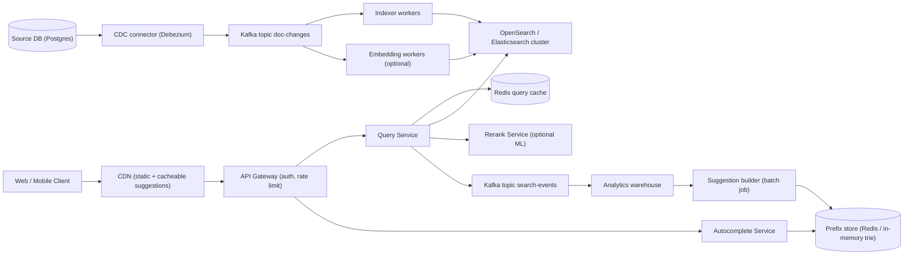
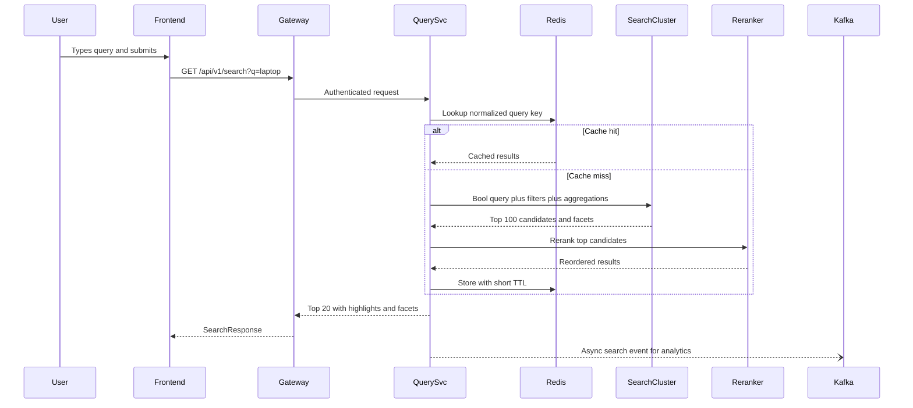

# Search System

> **Reviewed:** 2026-09 · **Scope:** Full-stack (frontend + backend + scalability) · **Level:** Senior / Tech Lead

---

## Overview

Design a full-text search system that enables fast and relevant search across billions of documents. Users can search, filter, and get real-time autocomplete suggestions.

---

## 1) Requirements

### Functional Requirements

**Core Features:**
- Full-text search across documents
- Real-time autocomplete and search suggestions
- Faceted search with filters (category, price, rating, date)
- Search result ranking by relevance
- Search result highlighting (highlight matching terms)
- Search history tracking
- Search analytics dashboard

**User Features:**
- Responsive search interface
- Keyboard navigation (arrow keys, Enter)
- Search suggestions dropdown
- Filter sidebar with multiple filter types
- Pagination or infinite scroll
- Sort options (relevance, date, price, rating)

### Non-Functional Requirements

**Performance:**
- Search latency: < 100ms
- Autocomplete suggestions: < 10ms
- Support 1B+ documents
- Handle 10M+ queries per day

**Scalability:**
- Horizontal scaling for search load
- Efficient indexing and query processing
- High availability (99.9% uptime)

**User Experience:**
- Responsive design (mobile and desktop)
- Accessible interface (keyboard navigation, screen readers)
- Fast, responsive UI with debouncing

---

## 2) Component Hierarchy

The frontend is a React application optimized for search operations. Here's the structure:

```
App
├── Layout
│   ├── Header
│   │   ├── Logo
│   │   ├── SearchBar (global search)
│   │   └── UserMenu
│   └── MainContent
├── Pages
│   ├── SearchPage
│   │   ├── SearchBar
│   │   │   ├── SearchInput (with debouncing)
│   │   │   ├── AutocompleteDropdown
│   │   │   │   ├── SuggestionItem (query suggestions)
│   │   │   │   └── CategoryItem (category suggestions)
│   │   │   └── SearchButton
│   │   ├── FilterSidebar
│   │   │   ├── CategoryFilter (multi-select)
│   │   │   ├── PriceFilter (range slider)
│   │   │   ├── RatingFilter (star rating)
│   │   │   ├── DateFilter (date range picker)
│   │   │   └── ClearFiltersButton
│   │   └── SearchResultsList
│   │       ├── ResultsHeader (total count, sort options)
│   │       ├── SearchResultItem
│   │       │   ├── ResultTitle (with highlights)
│   │       │   ├── ResultSnippet (with highlights)
│   │       │   ├── ResultMetadata (category, date, rating)
│   │       │   └── ResultActions (view, save)
│   │       └── Pagination (or InfiniteScroll)
│   ├── SearchHistoryPage
│   │   └── SearchHistoryList
│   │       └── HistoryItem (clickable to re-search)
│   └── AnalyticsPage
│       ├── SearchAnalyticsDashboard
│       │   ├── SummaryCards (total searches, popular queries)
│       │   ├── SearchTrendsChart (line chart over time)
│       │   └── PopularQueriesChart (bar chart)
│       └── DateRangeFilter
└── SharedComponents
    ├── Button
    ├── Input
    ├── Card
    ├── Toast
    └── LoadingSpinner
```

### Key Components Explained

**1. SearchBar Component**
- Main search input with debouncing (300ms delay)
- Real-time autocomplete as user types
- Keyboard navigation (arrow keys to navigate, Enter to select)
- Shows search suggestions dropdown
- Uses useDeferredValue (React 19) for performance

**2. AutocompleteDropdown Component**
- Displays search suggestions
- Shows query suggestions and category suggestions
- Highlights matching text in suggestions
- Handles keyboard navigation
- Closes on outside click or Escape key

**3. SearchResultsList Component**
- Displays search results with virtual scrolling
- Highlights search terms in results
- Handles pagination or infinite scroll
- Shows loading skeleton while fetching
- Updates when filters change

**4. FilterSidebar Component**
- Multiple filter types (category, price, rating, date)
- Multi-select for categories
- Range sliders for price and date
- Updates URL query parameters
- Triggers search refetch when filters change

**5. SearchResultItem Component**
- Individual search result card
- Highlights matching terms in title and snippet
- Shows metadata (category, date, rating, price)
- Clickable to view full result

---

## 3) Data Models

Here are the key data structures:

```typescript
// Search query
interface SearchQuery {
  query: string;
  filters: Filter[];
  sortBy: "relevance" | "date" | "price" | "rating";
  page: number;
  limit: number;
}

// Filter
interface Filter {
  type: "category" | "price" | "rating" | "date";
  value: string | number | [number, number];  // Single value or range
  label: string;
}

// Search result
interface SearchResult {
  id: string;
  title: string;
  snippet: string;  // Excerpt with highlighted terms
  url: string;
  category: string;
  rating?: number;
  price?: number;
  date?: string;
  highlights?: string[];  // Terms that matched
}

// Search response
interface SearchResponse {
  success: boolean;
  data: {
    results: SearchResult[];
    total: number;
    page: number;
    limit: number;
    facets: Facet[];  // Available filter options with counts
  };
}

// Facet (for filters)
interface Facet {
  name: string;  // "category", "price", etc.
  values: Array<{
    value: string;
    count: number;  // How many results have this value
  }>;
}

// Search suggestion (for autocomplete)
interface SearchSuggestion {
  text: string;
  type: "query" | "product" | "category";
  count?: number;  // How many results for this query
}

// Search history
interface SearchHistoryItem {
  query: string;
  timestamp: string;
  resultCount: number;
}

// Search analytics
interface SearchAnalytics {
  totalSearches: number;
  popularQueries: Array<{
    query: string;
    count: number;
  }>;
  searchTrends: Array<{
    date: string;
    count: number;
  }>;
  averageResultsPerQuery: number;
}
```

### Data Flow Explanation

**When a user searches:**
1. User types in search input
2. Input is debounced (300ms delay)
3. If query length >= 2, fetch autocomplete suggestions
4. User submits search or selects suggestion
5. Fetch search results with query and filters
6. Display results with highlighted terms
7. Update URL with search params (for shareability)

**When filters are applied:**
1. User selects filter (category, price, etc.)
2. Filter is added to filter state
3. URL query params are updated
4. Search is refetched with new filters
5. Results update with filtered data
6. Facets update to show available filter options

**Autocomplete flow:**
1. User types in search input
2. After 300ms debounce, fetch suggestions
3. Display suggestions dropdown
4. User can navigate with arrow keys
5. User selects suggestion or continues typing
6. If selected, trigger search with that query

---

## 4) API Design

### REST Endpoints

**GET /api/v1/search**
- Perform search query
- Query params: `q` (query), `category`, `minPrice`, `maxPrice`, `rating`, `page`, `limit`, `sortBy`
- Returns: SearchResponse with results, total count, and facets
- Status codes: 200 (Success), 400 (Invalid Query)

**GET /api/v1/autocomplete**
- Get search suggestions
- Query params: `q` (query, min 2 chars), `limit`
- Returns: Array of SearchSuggestion objects
- Status codes: 200 (Success), 400 (Invalid Query)

**GET /api/v1/search/analytics**
- Get search analytics
- Query params: `startDate`, `endDate`
- Returns: SearchAnalytics object
- Status codes: 200 (Success)

### API Request/Response Examples

**Search:**
  ```json
// GET /api/v1/search?q=laptop&category=electronics&page=1&limit=20&sortBy=relevance
// Response
  {
    "success": true,
    "data": {
      "results": [
        {
          "id": "result_123",
        "title": "Gaming Laptop",
        "snippet": "High-performance gaming laptop with RTX graphics...",
          "url": "https://example.com/product/123",
          "category": "electronics",
          "rating": 4.5,
        "price": 1299.99,
        "highlights": ["laptop", "gaming"]
        }
      ],
      "total": 1250,
      "page": 1,
      "limit": 20,
      "facets": [
        {
          "name": "category",
          "values": [
            { "value": "electronics", "count": 450 },
          { "value": "computers", "count": 320 }
        ]
      },
      {
        "name": "price",
        "values": [
          { "value": "0-500", "count": 200 },
          { "value": "500-1000", "count": 350 }
          ]
        }
      ]
    }
  }
  ```

**Autocomplete:**
  ```json
// GET /api/v1/autocomplete?q=lapt&limit=10
// Response
  {
    "success": true,
    "data": {
      "suggestions": [
        { "text": "laptop", "type": "query", "count": 1250 },
        { "text": "laptop bag", "type": "query", "count": 320 },
        { "text": "Laptop Computers", "type": "category", "count": 450 }
      ]
    }
  }
  ```

**Analytics:**
  ```json
// GET /api/v1/search/analytics?startDate=2024-01-01&endDate=2024-01-31
// Response
  {
    "success": true,
    "data": {
      "totalSearches": 125000,
      "popularQueries": [
        { "query": "laptop", "count": 12500 },
        { "query": "phone", "count": 9800 }
      ],
      "searchTrends": [
        { "date": "2024-01-15", "count": 4500 },
        { "date": "2024-01-16", "count": 5200 }
      ],
      "averageResultsPerQuery": 125.5
    }
  }
  ```

### Error Handling

**Error Response Format:**
```json
{
  "success": false,
  "error": {
    "code": "INVALID_QUERY",
    "message": "Search query must be at least 2 characters",
    "details": "Query 'a' is too short"
  }
}
```

---

## Key Design Decisions

**1. Debouncing for Performance**
- Debounce search input (300ms) to reduce API calls
- Use useDeferredValue (React 19) for better performance
- Only fetch autocomplete after user stops typing

**2. URL State Management**
- Store search query and filters in URL params
- Enables shareable search URLs
- Browser back/forward works correctly
- Deep linking to specific searches

**3. Virtual Scrolling**
- Use virtual scrolling for large result sets
- Only render visible results
- Improves performance with thousands of results

**4. Faceted Search**
- Return facets (available filter options) with search results
- Shows counts for each filter value
- Helps users refine their search

**5. Result Highlighting**
- Highlight matching terms in results
- Makes it easy to see why result matched
- Improves user experience

**6. Caching Strategy**
- Cache search results with TanStack Query (React Query)
- Cache autocomplete suggestions
- Reduces API calls for repeated queries

**7. Cancel Stale Requests**
- Abort in-flight requests with `AbortController` when the query changes
- Prevents out-of-order responses from overwriting newer results

---

## Backend High-Level Design

The backend splits into a **read path** (query + autocomplete, latency-critical) and a **write path** (indexing pipeline, throughput-critical). The search index is a **derived, rebuildable view** of a source-of-truth database, never the primary store.



| Component | Responsibility | Technology options |
|-----------|----------------|--------------------|
| API Gateway | AuthN (JWT/OIDC), per-user and per-IP rate limiting, request validation | Envoy, Kong, AWS API Gateway |
| Query Service | Parse query, build DSL (bool query + filters + aggregations), call cluster, merge, rerank, highlight | Node.js / Go / Java stateless service |
| Autocomplete Service | Prefix lookups in memory, return top-K suggestions | Redis sorted sets, in-process trie/FST, or `completion` / `search_as_you_type` fields |
| Search cluster | Inverted index, BM25 scoring, facets via aggregations, optional vector (kNN) fields | Elasticsearch or OpenSearch |
| CDC + Kafka | Capture row changes from the source DB and deliver them in order per document | Debezium, Kafka (or RabbitMQ for smaller scale, see [messaging systems](../backend/architecture/05-messaging-systems.md)) |
| Indexer workers | Transform rows into search documents, bulk index, handle retries and dead letters | Node workers or [Celery](../backend/celery/index.md) workers |
| Analytics + suggestion builder | Aggregate query logs and clicks, build popular-query suggestions, feed ranking signals | Warehouse + scheduled batch job |

**How the inverted index works (the one-minute version):**
- At index time, text is run through an **analyzer**: tokenize, lowercase, remove stop words (optional), stem or lemmatize, and optionally add synonyms.
- Each term maps to a **postings list**: document IDs, term frequencies, and positions (positions enable phrase queries and highlighting).
- At query time the same analyzer runs on the query; the engine intersects/unions postings lists and scores candidates (BM25 by default in modern Lucene-based engines).
- Facet counts come from **aggregations** over doc values (columnar per-field storage), not from the inverted index itself.

**Typeahead options:**

| Approach | How it works | Pros | Cons |
|----------|--------------|------|------|
| Prefix trie / FST in memory | Precomputed top-K completions stored at each prefix node | Sub-millisecond lookups, predictable | Rebuild needed to update; memory bound |
| Redis sorted sets per prefix | `ZREVRANGE prefix:lap 0 9` | Simple, shared across instances | Key explosion for long prefixes; cap prefix length |
| Edge n-gram analyzer | Index `l`, `la`, `lap`, `lapt`... as terms | Matches inside the real index, supports filters | Larger index; slower than a dedicated structure |
| `completion` suggester | Engine-native FST-backed suggester | Fast, built in | Less flexible filtering and scoring |

> **Interview tip:** Say explicitly that autocomplete suggests *queries* (from query logs), while search returns *documents*. They have different data sources, freshness needs, and latency budgets.

---

## Data Model and Consistency

**Source of truth (relational):**

```sql
CREATE TABLE documents (
  doc_id       BIGINT PRIMARY KEY,
  tenant_id    BIGINT NOT NULL,
  title        TEXT NOT NULL,
  body         TEXT,
  category     TEXT,
  price        NUMERIC(12,2),
  rating       REAL,
  updated_at   TIMESTAMPTZ NOT NULL,
  version      BIGINT NOT NULL,      -- incremented on every write
  deleted_at   TIMESTAMPTZ
);
CREATE INDEX idx_documents_updated ON documents (updated_at);
```

**Search index mapping (sketch):**

```json
{
  "settings": { "number_of_shards": 80, "number_of_replicas": 1, "refresh_interval": "1s" },
  "mappings": {
    "properties": {
      "title":    { "type": "text", "analyzer": "english",
                    "fields": { "prefix": { "type": "search_as_you_type" }, "raw": { "type": "keyword" } } },
      "body":     { "type": "text", "analyzer": "english" },
      "category": { "type": "keyword" },
      "price":    { "type": "scaled_float", "scaling_factor": 100 },
      "rating":   { "type": "float" },
      "tenantId": { "type": "keyword" },
      "updatedAt":{ "type": "date" },
      "embedding":{ "type": "dense_vector", "dims": 768 }
    }
  }
}
```

The `embedding` field is only needed for hybrid search; mapping syntax for vectors differs between Elasticsearch (`dense_vector`) and OpenSearch (`knn_vector`).

**Sharding and replicas:**
- **Primary shards** split the index for write and storage scale; **replicas** add read throughput and fault tolerance.
- Default routing is `hash(doc_id) % primaryShards`, so every query is **scatter-gather** across all shards.
- For multi-tenant data, **custom routing by `tenantId`** lets a tenant's query hit one shard instead of all of them, at the risk of hot shards for large tenants (mitigate with routing partitions or a dedicated index for large tenants).
- Primary shard count is fixed at index creation. Use **index aliases** so you can build a new index with a different shard count and switch atomically (reindex + alias swap).
- Use time-based or rollover indices for log-like, append-heavy data; a single index with aliases fits catalog-like data.

**Consistency trade-offs:**
- The index is **eventually consistent** with the source DB: CDC lag plus the refresh interval (visibility after refresh, commonly around one second).
- That is acceptable for search. Anything that must be exact (price at checkout, stock, permissions) is **re-validated against the source of truth** after the search returns.
- Permission-sensitive search: filter by ACL fields in the query *and* post-filter on the server; never rely on the client to hide results.

**Idempotency and ordering:**
- Indexer writes use the **document ID as the index `_id`**, so replays overwrite rather than duplicate.
- Use **external versioning** (`version_type=external` with the DB `version`) so an older event arriving late cannot overwrite a newer document.
- Kafka partitions keyed by `doc_id` preserve per-document order; consumers commit offsets only after a successful bulk request.
- Deletes are tombstone events; a periodic reconciliation job compares DB counts/checksums with the index to catch drift.

---

## Scalability and Reliability

### Back-of-envelope estimate

> **ILLUSTRATIVE assumptions** (not real-world figures): 1B documents, average 2 KB of indexed text per document, index overhead 1.5x raw size, 10M queries/day, peak-to-average ratio 10x, 5 autocomplete calls per search after debouncing, target shard size about 40 GB.

**Storage:**
- Raw text: 1B x 2 KB = **2 TB**
- Primary index: 2 TB x 1.5 = **3 TB**
- With 1 replica: 3 TB x 2 = **6 TB** total on disk (plus headroom for merges, so plan roughly 8-9 TB)
- Primary shards: 3 TB / 40 GB = 75, round to **80 primary shards**

**Traffic:**
- Search average: 10,000,000 / 86,400 s = **~116 QPS**; peak x10 = **~1,160 QPS**
- Autocomplete average: 116 x 5 = **~580 QPS**; peak = **~5,800 QPS**
- Every search fans out to 80 shards, so shard-level requests at peak = 1,160 x 80 = **~92,800 shard queries/s** across the cluster. This fan-out, not the top-level QPS, drives node count; custom routing or a result cache reduces it sharply.

**Indexing:**
- Assume 1% of documents change per day: 10M updates / 86,400 s = **~116 updates/s** average. Bulk batches of 500 docs means well under 1 bulk request per second; indexing is not the bottleneck unless you reindex everything.
- Full reindex at an illustrative 20,000 docs/s: 1B / 20,000 = 50,000 s = **~14 hours**. This is why you reindex into a new index behind an alias rather than in place.

### Bottlenecks and fixes

| Bottleneck | Symptom | Fix |
|-----------|---------|-----|
| Shard fan-out | p99 latency grows with shard count, one slow shard slows every query | Fewer larger shards, custom routing, adaptive replica selection, timeouts with partial results |
| Deep pagination | `from=10000` is slow and memory heavy | Cap page depth, use `search_after` cursors for infinite scroll |
| Expensive aggregations | Facets on high-cardinality fields dominate latency | Limit facet size, precompute popular facets, cache aggregations for common filters |
| Hot queries | Same popular query hammering the cluster | Redis result cache keyed on normalized query + filters, short TTL (e.g., 30-60 s) |
| Autocomplete latency | Suggestions exceed the 10 ms budget | Serve from in-memory prefix store, CDN-cache short prefixes, never hit the main cluster for top-level suggestions |
| Reindex impact | Bulk indexing slows queries | Separate ingest/data node roles, throttle bulk, increase refresh interval during backfill |

### Failure modes

| Failure | Impact | Mitigation |
|---------|--------|-----------|
| Data node crash | Shards on that node unavailable, cluster yellow | Replicas promote automatically; spread replicas across availability zones (shard allocation awareness) |
| Master/cluster-manager node loss | Cluster cannot change state | 3 dedicated master-eligible nodes for quorum |
| CDC connector stalls | Index becomes stale (prices, new docs missing) | Alert on consumer lag and source-to-index freshness, auto-restart, replay from Kafka offsets |
| Poison document (mapping conflict) | Indexer retries forever, blocks partition | Dead-letter topic after N retries, alert, fix and replay |
| Bad synonym or ranking change | Relevance regression, conversions drop | Ship ranking changes behind flags, A/B test, offline relevance suite before rollout |
| Query of death (huge wildcard/regex) | CPU spike, cluster-wide latency | Disallow leading wildcards, query timeouts, circuit breakers, per-tenant rate limits |
| Redis cache outage | Traffic hits cluster directly | Cache is optional on the read path; request coalescing and load shedding protect the cluster |

### Key flow: search query



---

## Deep Dive Options (RADIO)

<details>
<summary>Deep dive 1: Typeahead under 10 ms</summary>

- **Requirements:** p99 under 10 ms server time, top 10 suggestions per prefix, personalized boost optional, suggestions refreshed at least daily, block offensive terms.
- **Architecture:** Batch job aggregates query logs into `(query, score)` pairs; builds a prefix trie or FST with top-K cached at each node; ships the artifact to autocomplete service instances, which load it into memory. Very short prefixes (1-2 chars) are cacheable at the CDN.
- **Data model:** `prefix -> [ { text, score, type } ]` with K = 10. Score = decayed frequency (recent queries weigh more) times click-through. A small blocklist is applied at build time and at serve time.
- **Interface:** `GET /api/v1/autocomplete?q=lap&limit=10` returns suggestions; client debounces and cancels stale requests.
- **Optimizations:** Cap prefix length (e.g., 20 chars), blue/green swap of trie artifacts, fall back to edge n-gram query on the main cluster for long-tail prefixes, add a real-time "trending" overlay from a streaming counter.

</details>

<details>
<summary>Deep dive 2: Indexing freshness pipeline</summary>

- **Requirements:** New or updated docs searchable within seconds to a minute, no lost updates, no stale overwrites, ability to rebuild the full index.
- **Architecture:** Source DB -> CDC (Debezium) -> Kafka `doc-changes` keyed by `doc_id` -> indexer workers -> bulk API. Dual-write from the application is avoided because it can diverge on partial failure; CDC or a transactional outbox gives a single ordered stream.
- **Data model:** Event `{ docId, version, op: upsert | delete, payload }`. Index doc uses `_id = docId` and external version.
- **Interface:** Internal admin endpoints: `POST /admin/reindex` (build new index + alias swap), `GET /admin/index-lag`.
- **Optimizations:** Batch by size and time (e.g., 5 MB or 1 s), increase refresh interval during backfills, parallelize by partition, dead-letter topic with replay tooling.

</details>

<details>
<summary>Deep dive 3: Ranking and hybrid lexical + vector search</summary>

- **Requirements:** Relevance beyond exact keywords (synonyms, intent), explainable ranking, latency budget of roughly 100 ms total, measurable quality.
- **Architecture:** Two-stage retrieval. Stage 1 retrieves candidates with BM25 plus filters and, optionally, approximate kNN over embeddings. Stage 2 fuses and reranks (e.g., Reciprocal Rank Fusion, then a learning-to-rank model or cross-encoder on the top 50-100). **Hybrid lexical + vector search is emerging-mainstream**: supported natively in recent Elasticsearch and OpenSearch versions, but it adds embedding cost and tuning work.
- **Data model:** Per-document embedding vector (e.g., 768 dims) plus business signals (popularity, rating, recency) as numeric fields for function scoring.
- **Interface:** Same `/search` endpoint; a `rankingProfile` flag (server-controlled) enables A/B testing without client changes.
- **Optimizations:** Rerank only the top N, cache embeddings of popular queries, quantize vectors to cut memory, evaluate with offline judgments (NDCG, MRR) and online metrics (CTR, zero-result rate) before rollout.

</details>

---

## Scaling with AI and Agentic Workflows

AI helps in two ways here: as an **engineering accelerator** for designing and operating the system, and as **product features** inside search itself. See [agentic workflows](../agentic-workflows/index.md) and [AI-assisted development](../ai/ai-assisted-development/index.md) for the general practices.

**Engineering workflows:**
- **Brainstorm bottlenecks, then validate with math.** Ask an agent to list likely bottlenecks for "80 shards, 1,160 peak QPS, heavy facets," then check each claim against the back-of-envelope numbers and real cluster metrics. The agent proposes; the arithmetic and benchmarks decide.
- **Generate load tests for review.** Have an agent draft k6 or Locust scripts that replay an anonymized query-log distribution (head vs long-tail queries, facet mix, autocomplete bursts). A human reviews the query mix and target rates before running against a shared environment.
- **Summarize metrics and traces for RCA.** Feed slow-log entries, shard-level latency, and trace spans to an assistant to cluster slow queries by pattern (leading wildcard, huge aggregation, deep page). Treat the summary as a hypothesis to confirm in the raw data.
- **Draft migrations and runbooks.** Agents can draft the reindex-and-alias-swap plan, a shard-count change runbook, or IaC for a new cluster tier (see [DevOps](../devops/index.md)); humans review and execute.

**Product AI features:**

| Feature | Value | Latency / cost / data trade-off |
|---------|-------|--------------------------------|
| Semantic / hybrid retrieval | Matches intent and synonyms that BM25 misses | Embedding every document costs compute at index time; query embedding adds latency per search (cache popular queries); vector memory grows with dims x docs |
| Cross-encoder or LLM reranking | Better ordering of the top results | Tens to hundreds of ms per request; restrict to top N and to queries where it measurably helps |
| Query understanding (spell fix, entity extraction into filters) | Fewer zero-result searches | Must be fast; small models or rules for the hot path |
| Generated answer summaries over results | Direct answers for informational queries | Highest cost and hallucination risk; cite source documents and make it optional |

**Human approval required for:**
- Changes to ranking models, synonym lists, or boost rules that ship to production
- Reindex, alias swap, and shard-count changes on production clusters
- Running generated load tests against shared or production environments
- Any use of user query logs for training (privacy, retention, consent)

**Do not trust AI for:**
- Capacity numbers it did not derive from your stated assumptions or measured metrics
- Claims that a ranking change "improves relevance" without offline evaluation and an A/B test
- Permission filtering or ACL enforcement logic
- Root-cause conclusions that are not confirmed in raw logs and traces

---

## Interview Talking Points

**When explaining this system, I'd focus on:**

1. **Requirements First**: Start with core functionality - full-text search, autocomplete, filters, ranking

2. **Component Structure**: Explain the React component hierarchy - search bar, autocomplete dropdown, results list, filter sidebar

3. **Data Models**: Walk through SearchQuery, SearchResult, Filter, Facet - and how they work together

4. **API Design**: Show the REST endpoints - search, autocomplete, analytics - and query parameters

5. **Key Challenges**: 
   - Debouncing for performance (reduce API calls)
   - Real-time autocomplete with low latency
   - Faceted search with dynamic filter counts
   - Result highlighting and relevance ranking
   - Handling large result sets efficiently

**Example explanation flow:**
> "So for a search system, the core requirement is fast, relevant search across billions of documents. The frontend is a React app with a search bar component that debounces input to reduce API calls. As users type, we fetch autocomplete suggestions in real-time. The search results are displayed in a list with highlighted matching terms. We have a filter sidebar for faceted search - users can filter by category, price, rating, etc. The data model includes SearchQuery with the query string and filters, SearchResult with the result data, and Facets which show available filter options with counts. The main API endpoint is GET /search with query parameters for the search query and filters. Key challenges include debouncing for performance, real-time autocomplete, and efficiently handling large result sets with virtual scrolling."

**Full-stack extension:**
> "On the backend, the search index is a derived view of a source-of-truth database, fed by CDC into Kafka and bulk-indexed by idempotent workers using external versioning. The cluster is sharded for storage and replicated for reads and availability; queries scatter-gather across shards, so I watch fan-out and p99. Autocomplete is served from an in-memory prefix structure built from query logs, not from the main index. Ranking is two-stage: BM25 retrieval, optionally fused with vector kNN, then reranking the top candidates, all gated by offline evaluation and A/B tests."

### Follow-up Questions

1. **How do you pick the number of shards?** Estimate primary index size, divide by a target shard size (tens of GB), and add room for growth. Shard count is fixed per index, so plan for reindex + alias swap to change it.
2. **Why not query the primary database with `LIKE '%term%'`?** It cannot use B-tree indexes for infix matches, has no relevance scoring, and scans too much data at scale. An inverted index is built for this access pattern.
3. **How fresh is the index, and how do you measure it?** CDC lag plus refresh interval. Emit a timestamp on each change event and alert on source-to-searchable latency percentiles.
4. **How do you prevent a late event from overwriting newer data?** Key Kafka partitions by document ID for ordering and use external versioning so the engine rejects lower versions.
5. **How do you handle deep pagination?** Cap `from + size`, and use `search_after` cursors (with a point-in-time where supported) for infinite scroll.
6. **How would you add semantic search without breaking latency?** Hybrid retrieval with a bounded kNN candidate set, fuse with BM25, rerank only the top N, and cache query embeddings for popular queries.
7. **How do you evaluate relevance changes?** Offline judged query sets (NDCG, MRR), then online A/B testing on CTR, zero-result rate, and conversion.
8. **How do you enforce document-level permissions?** Index ACL fields (tenant, groups) and add them as mandatory filters on the server; re-check sensitive results against the source of truth.

### Common Mistakes

- Treating the search index as the source of truth instead of a rebuildable projection
- Dual-writing to DB and index from application code without an outbox or CDC, causing silent drift
- Forgetting that every query fans out to every shard by default
- Serving autocomplete from the full search cluster and blowing the latency budget
- Choosing a shard count with no size estimate, then discovering it cannot be changed in place
- Adding vector search without measuring whether it improves relevance for your queries
- Ignoring zero-result queries, which are the most actionable relevance signal

---

## References

- Elastic, *Elasticsearch Guide*: https://www.elastic.co/guide/index.html
- OpenSearch Documentation: https://opensearch.org/docs/latest/
- Apache Lucene: https://lucene.apache.org/
- Debezium Documentation (CDC): https://debezium.io/documentation/
- Apache Kafka Documentation: https://kafka.apache.org/documentation/
- Manning, Raghavan, Schütze, *Introduction to Information Retrieval*: https://nlp.stanford.edu/IR-book/
- Related case studies: [E-commerce App](./08-e-commerce-app.md), [Video Streaming Platform](./06-video-streaming-platform.md)

