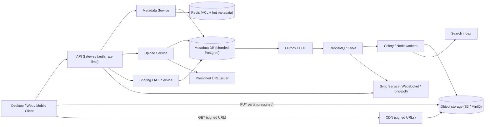
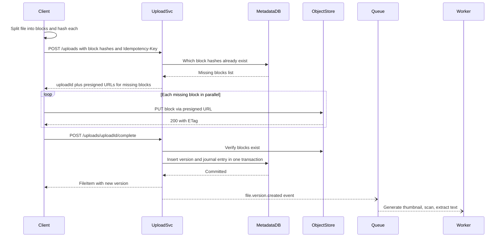

# File Storage System

> **Reviewed:** 2026-09 · **Scope:** Full-stack (frontend + backend + scalability) · **Level:** Senior / Tech Lead

---

## Overview

Design a cloud file storage system like Dropbox or Google Drive where users can upload, organize, share, and sync files across devices. The system handles large files, versioning, and real-time synchronization.

---

## 1) Requirements

### Functional Requirements

**Core Features:**
- File upload and download with progress tracking
- Folder organization (create, navigate, delete folders)
- File sharing with permissions (read, write, admin)
- File versioning and history (restore previous versions)
- File search by name, content, tags, metadata
- File preview (images, documents, videos)
- Real-time file synchronization across devices
- Drag-and-drop file upload

**Advanced Features:**
- Public links with password protection and expiration
- File collaboration (comments, real-time editing)
- Offline file access with sync
- Advanced search with filters and tags
- File thumbnails and previews

### Non-Functional Requirements

**Performance:**
- File upload: < 10 seconds for 100MB files
- Support files up to 10GB with chunked upload
- Fast file download
- Efficient file search

**Scalability:**
- Support 1B+ users
- Handle 100PB+ storage
- Billions of files
- Millions of concurrent operations

**Reliability:**
- 99.9% uptime
- Data durability and backup
- Fault tolerance

**User Experience:**
- Responsive design (mobile and desktop)
- Accessible interface (keyboard navigation, screen readers)
- Real-time sync indicators

---

## 2) Component Hierarchy

The frontend is a React application for file management. Here's the structure:

```
App
├── Layout
│   ├── Header
│   │   ├── Logo
│   │   ├── SearchBar (global file search)
│   │   ├── UploadButton
│   │   └── UserMenu
│   ├── Sidebar
│   │   ├── FolderTree (hierarchical folder navigation)
│   │   ├── QuickAccess (Recent, Starred, Shared)
│   │   └── StorageUsage (shows used/total storage)
│   └── MainContent
├── Pages
│   ├── FileBrowserPage
│   │   ├── BreadcrumbNavigation (folder path)
│   │   ├── Toolbar
│   │   │   ├── ViewToggle (Grid/List view)
│   │   │   ├── SortOptions (Name, Date, Size)
│   │   │   └── ActionButtons (New Folder, Upload, Share)
│   │   ├── FileGrid (or FileList)
│   │   │   ├── FileCard
│   │   │   │   ├── FileIcon (based on file type)
│   │   │   │   ├── FileName (editable)
│   │   │   │   ├── FileMetadata (size, modified date)
│   │   │   │   ├── FileActions (Share, Download, Delete)
│   │   │   │   └── SelectionCheckbox
│   │   │   └── FolderCard
│   │   │       ├── FolderIcon
│   │   │       ├── FolderName
│   │   │       └── ItemCount
│   │   └── UploadProgress (shows active uploads)
│   ├── FilePreviewPage
│   │   ├── FileViewer (image viewer, PDF viewer, video player)
│   │   ├── FileInfo (metadata, version history)
│   │   ├── CommentsPanel (file comments)
│   │   └── SharePanel (sharing options)
│   └── SharePage
│       ├── ShareDialog
│       │   ├── PermissionSelector (Read, Write, Admin)
│       │   ├── UserSearch (add users)
│       │   ├── PublicLinkToggle
│       │   └── LinkSettings (password, expiration)
│       └── SharedWithList (users who have access)
└── SharedComponents
    ├── FileUploader (drag-and-drop zone)
    ├── UploadProgress (progress bar per file)
    ├── FileIcon (icon based on file type)
    ├── Toast
    └── LoadingSpinner
```

### Key Components Explained

**1. FileBrowser Component**
- Main file browsing interface
- Grid or list view toggle
- Handles file selection (single or multiple)
- Virtual scrolling for large file lists
- Drag-and-drop file upload support

**2. FileUploader Component**
- Handles file selection (file picker or drag-and-drop)
- Chunks large files for upload
- Shows upload progress for each file
- Retry logic for failed uploads
- Uses useOptimistic (React 19) for instant UI feedback

**3. FileCard Component**
- Displays individual file or folder
- Shows file icon, name, metadata
- Handles file actions (share, download, delete)
- Supports inline renaming
- Selection checkbox for bulk operations

**4. FilePreview Component**
- Displays file content (images, PDFs, videos)
- Handles different file types
- Shows file metadata and version history
- Comments and sharing panels

**5. FolderTree Component**
- Hierarchical folder navigation
- Expandable/collapsible folders
- Breadcrumb navigation
- Quick access to recent/favorite folders

---

## 3) Data Models

Here are the key data structures:

```typescript
// File or folder
interface FileItem {
  id: string;
  name: string;
  type: "file" | "folder";
  mimeType?: string;  // For files: "image/jpeg", "application/pdf", etc.
  size?: number;  // File size in bytes
  parentId: string | null;  // Parent folder ID, null for root
  path: string;  // Full path: "/Documents/Projects/file.pdf"
  createdAt: string;
  updatedAt: string;
  modifiedBy: string;
  ownerId: string;
  version: number;  // For versioning
  isShared: boolean;
  permissions: FilePermissions;
  thumbnailUrl?: string;  // For images/videos
}

// File permissions
interface FilePermissions {
  canRead: string[];  // User IDs
  canWrite: string[];  // User IDs
  canAdmin: string[];  // User IDs
  publicLink?: {
    link: string;
    password?: string;
    expiresAt?: string;
  };
}

// File version
interface FileVersion {
  id: string;
  fileId: string;
  version: number;
  size: number;
  createdAt: string;
  createdBy: string;
  downloadUrl: string;
}

// Upload progress
interface UploadProgress {
  fileId: string;
  fileName: string;
  progress: number;  // 0-100
  status: "uploading" | "completed" | "failed";
  error?: string;
}

// Share link
interface ShareLink {
  id: string;
  fileId: string;
  link: string;
  password?: string;
  expiresAt?: string;
  accessCount: number;
  createdAt: string;
}

// File search result
interface FileSearchResult {
  id: string;
  name: string;
  type: "file" | "folder";
  path: string;
  snippet?: string;  // Matching text snippet
  highlights?: string[];  // Highlighted terms
}
```

### Data Flow Explanation

**When a user uploads a file:**
1. User selects files (drag-and-drop or file picker)
2. Files are validated (size, type)
3. Large files are chunked (e.g., 5MB chunks)
4. Each chunk is uploaded sequentially
5. Progress is tracked for each file
6. On completion, file metadata is saved
7. File appears in file browser immediately (optimistic update)

**When a user navigates folders:**
1. User clicks folder in FolderTree or FileCard
2. Fetch files in that folder: `GET /api/v1/files?folderId=xxx`
3. Display files in grid or list view
4. Update breadcrumb navigation
5. Update URL with folder path (for shareability)

**File sharing flow:**
1. User clicks share on a file
2. ShareDialog opens with permission options
3. User selects users or creates public link
4. Permissions are saved
5. Shared users receive notification
6. File appears in their "Shared with me" section

**File versioning:**
1. When file is updated, new version is created
2. Previous versions are preserved
3. Users can view version history
4. Users can restore previous versions
5. Version metadata (who, when) is tracked

---

## 4) API Design

### REST Endpoints

**GET /api/v1/files**
- Get files in a folder
- Query params: `folderId` (null for root), `page`, `limit`, `sortBy`
- Returns: Array of FileItem objects

**POST /api/v1/files/upload**
- Upload a file
- Request: Multipart form data with file and folderId
- Returns: FileItem object
- Supports chunked upload for large files

**GET /api/v1/files/:id**
- Get file metadata
- Returns: FileItem object with full details

**GET /api/v1/files/:id/download**
- Get download URL (signed URL)
- Returns: Download URL with expiration

**PATCH /api/v1/files/:id**
- Update file (rename, move, etc.)
- Request body: `{ name?: string, parentId?: string }`
- Returns: Updated FileItem

**DELETE /api/v1/files/:id**
- Delete a file or folder
- Returns: Success confirmation

**POST /api/v1/files/:id/share**
- Share a file
- Request body: `{ userIds: string[], permissions: FilePermissions }`
- Returns: Updated FileItem with permissions

**GET /api/v1/files/:id/versions**
- Get file version history
- Returns: Array of FileVersion objects

**POST /api/v1/files/:id/restore**
- Restore a previous version
- Request body: `{ version: number }`
- Returns: Updated FileItem

**GET /api/v1/files/search**
- Search files
- Query params: `q` (query), `type`, `folderId`
- Returns: Array of FileSearchResult objects

### API Request/Response Examples

**Upload File:**
```json
// POST /api/v1/files/upload
// FormData: file, folderId
// Response
{
  "success": true,
  "data": {
    "id": "file_123",
    "name": "document.pdf",
    "type": "file",
    "mimeType": "application/pdf",
    "size": 1024000,
    "parentId": "folder_456",
    "path": "/Documents/document.pdf",
    "createdAt": "2024-01-15T10:00:00Z",
    "version": 1
  }
}
```

**Get Files in Folder:**
```json
// GET /api/v1/files?folderId=folder_456&page=1&limit=20
// Response
{
  "success": true,
  "data": {
    "files": [
      {
        "id": "file_123",
        "name": "document.pdf",
        "type": "file",
        "size": 1024000,
        "updatedAt": "2024-01-15T10:00:00Z"
      },
      {
        "id": "folder_789",
        "name": "Projects",
        "type": "folder",
        "updatedAt": "2024-01-14T15:00:00Z"
      }
    ],
    "total": 45,
    "page": 1,
    "limit": 20
  }
}
```

**Share File:**
```json
// POST /api/v1/files/file_123/share
{
  "userIds": ["user_1", "user_2"],
  "permissions": {
    "canRead": ["user_1", "user_2"],
    "canWrite": ["user_1"],
    "canAdmin": []
  }
}

// Response
{
  "success": true,
  "data": {
    "id": "file_123",
    "isShared": true,
    "permissions": {
      "canRead": ["user_1", "user_2"],
      "canWrite": ["user_1"]
    }
  }
}
```

**Search Files:**
```json
// GET /api/v1/files/search?q=project&type=file
// Response
{
  "success": true,
  "data": {
    "results": [
      {
        "id": "file_123",
        "name": "project-plan.pdf",
        "type": "file",
        "path": "/Documents/project-plan.pdf",
        "snippet": "This is the project plan document...",
        "highlights": ["project"]
      }
    ],
    "total": 15
  }
}
```

---

## Key Design Decisions

**1. Chunked Upload for Large Files**
- Split large files into chunks (e.g., 5MB each)
- Upload chunks sequentially or in parallel
- Resume upload from last successful chunk if failed
- Better progress tracking and error handling

**2. Virtual Scrolling for File Lists**
- Only render visible files in viewport
- Improves performance with thousands of files
- Smooth scrolling experience

**3. Optimistic Updates**
- Show files immediately after upload starts
- Use useOptimistic (React 19) for instant UI feedback
- Rollback if upload fails

**4. Real-time Synchronization**
- WebSocket connection for real-time file updates
- Notify users when files are shared/updated
- Sync file changes across devices

**5. File Versioning**
- Store all file versions
- Allow users to restore previous versions
- Track version metadata (who, when, what changed)

**6. Hierarchical Folder Structure**
- Tree structure for folders
- Efficient navigation with breadcrumbs
- Support nested folders (unlimited depth)

**7. Direct-to-Storage Uploads**
- Client uploads bytes straight to object storage using presigned URLs
- API servers only handle small metadata requests, never file bytes
- Keeps application servers stateless and cheap to scale

---

## Backend High-Level Design

The core idea: **separate metadata from bytes.** A metadata service (strongly consistent database) owns the namespace, versions, and permissions. File contents live as immutable, content-addressed blocks in object storage (S3 or [MinIO](../backend/minio/index.md) for self-hosted). Clients move bytes directly to and from object storage with short-lived presigned URLs.



| Component | Responsibility |
|-----------|----------------|
| Upload Service | Creates upload sessions, checks which blocks already exist (dedup), issues presigned part URLs, finalizes the version |
| Metadata Service | Folder tree, file records, versions, soft delete/trash, quotas |
| Sharing / ACL Service | Share grants, public links (token, password hash, expiry), permission checks with caching |
| Sync Service | Pushes change notifications; clients pull deltas from a per-namespace change journal using a cursor |
| Object storage | Immutable blocks keyed by content hash; lifecycle rules move cold data to cheaper tiers |
| Workers | Thumbnails, previews, virus scanning, text extraction for search, garbage collection of unreferenced blocks. Use [Celery](../backend/celery/index.md) with [RabbitMQ](../backend/rabbitmq/index.md) or Node workers; see [messaging systems](../backend/architecture/05-messaging-systems.md) for broker trade-offs |
| CDN | Serves downloads and previews close to users via signed, expiring URLs |

> **Interview tip:** Say "the API never proxies file bytes." It is the single decision that makes this design scale, and interviewers listen for it.

---

## Data Model and Consistency

```sql
-- Namespace = a user's root or a shared/team space. Shard key for most tables.
CREATE TABLE files (
  namespace_id       BIGINT NOT NULL,
  file_id            BIGINT NOT NULL,
  parent_id          BIGINT,                -- folder; NULL for root
  name               TEXT NOT NULL,
  is_folder          BOOLEAN NOT NULL,
  current_version_id BIGINT,
  size_bytes         BIGINT,
  updated_at         TIMESTAMPTZ NOT NULL,
  deleted_at         TIMESTAMPTZ,           -- soft delete (trash)
  row_version        BIGINT NOT NULL,       -- optimistic concurrency
  PRIMARY KEY (namespace_id, file_id)
);
CREATE UNIQUE INDEX uq_files_name ON files (namespace_id, parent_id, name) WHERE deleted_at IS NULL;

CREATE TABLE file_versions (
  namespace_id  BIGINT NOT NULL,
  version_id    BIGINT NOT NULL,
  file_id       BIGINT NOT NULL,
  content_hash  CHAR(64) NOT NULL,         -- SHA-256 of whole file
  size_bytes    BIGINT NOT NULL,
  created_by    BIGINT NOT NULL,
  created_at    TIMESTAMPTZ NOT NULL,
  PRIMARY KEY (namespace_id, version_id)
);

CREATE TABLE version_blocks (             -- ordered block list per version
  version_id  BIGINT NOT NULL,
  seq         INT NOT NULL,
  block_hash  CHAR(64) NOT NULL,
  PRIMARY KEY (version_id, seq)
);

CREATE TABLE blocks (                     -- global, sharded by block_hash
  block_hash  CHAR(64) PRIMARY KEY,
  size_bytes  INT NOT NULL,
  storage_key TEXT NOT NULL,
  ref_count   BIGINT NOT NULL
);

CREATE TABLE acl_grants (
  resource_id   BIGINT NOT NULL,           -- file or folder
  principal_id  BIGINT NOT NULL,           -- user or group
  role          TEXT NOT NULL,             -- viewer | editor | owner
  PRIMARY KEY (resource_id, principal_id)
);

CREATE TABLE change_journal (             -- drives sync
  namespace_id BIGINT NOT NULL,
  seq          BIGINT NOT NULL,            -- monotonically increasing per namespace
  file_id      BIGINT NOT NULL,
  op           TEXT NOT NULL,              -- create | update | move | delete
  PRIMARY KEY (namespace_id, seq)
);
```

**Partitioning:**
- Shard `files`, `file_versions`, and `change_journal` by **`namespace_id`** so a folder listing, a move, and a journal append are single-shard transactions.
- Shard `blocks` by **`block_hash`** (uniformly distributed by construction).
- Very large team namespaces can become hot; split them into sub-namespaces per top-level folder if needed.

**Deduplication via content hashing:**
- Client splits the file into blocks (fixed size, e.g., 4-8 MB, or content-defined chunking for better dedup on edits) and computes SHA-256 per block.
- Client sends the hash list; the server replies with only the **missing** blocks. Unchanged blocks are never re-uploaded, which also makes small edits to large files cheap.
- Cross-user dedup saves storage but can leak information ("does this file exist?"). Common mitigation: dedup within a user or tenant only, or require proof of possession.

**Consistency trade-offs:**
- Metadata needs **strong consistency** (rename, move, permission changes). Keep it in a transactional database; use `row_version` for optimistic concurrency.
- Blocks are **immutable and content-addressed**, so they never have update conflicts. Amazon S3 provides strong read-after-write consistency for objects; verify the guarantee for any other store you choose.
- Commit order: upload all blocks first, then commit the version row. A version is visible only when every block it references exists.
- Garbage collection is asynchronous: decrement `ref_count` on version deletion, and delete blocks after a grace period to avoid racing with in-flight uploads.

**Idempotency:**
- `POST /uploads` accepts an `Idempotency-Key`; retries return the same session.
- Part uploads are idempotent by `(uploadId, partNumber)`; completing an already completed session returns the existing version.
- Block writes are naturally idempotent because the key is the hash of the content.

**Sync and conflict resolution:**
- Each client stores a **cursor** (last seen `seq` per namespace) and pulls `GET /changes?cursor=...`. Push notifications only say "something changed," which keeps the push channel lightweight.
- Edits carry the **base version** the client started from. If the server's current version differs, it is a conflict: keep both by saving the incoming file as a "conflicted copy" rather than silently overwriting. Real-time co-editing (documents) is a separate problem solved with OT/CRDTs; see [collaborative word processor](./16-collaborative-word-processor.md).

**Sharing permissions:**
- Permissions inherit down the folder tree. Resolve effective permission by walking ancestors (bounded depth) or by maintaining a denormalized closure table for fast checks.
- Cache effective permissions in Redis keyed by `(user, resource)`; invalidate on grant changes via events.
- Public links store a random token, optional password hash, and expiry; downloads through them still get short-lived signed URLs.

---

## Scalability and Reliability

### Back-of-envelope estimate

> **ILLUSTRATIVE assumptions** (not real-world figures): 100M daily active users, 2 uploads per DAU per day, average upload 2 MB, 30% of uploaded bytes deduplicated, 1 KB metadata per file version, peak-to-average ratio 3x, 2 downloads per upload.

**Uploads:**
- Upload count: 100M x 2 = **200M uploads/day**
- Upload rate: 200,000,000 / 86,400 s = **~2,315 uploads/s** average, **~6,900/s** at peak
- Ingress bytes: 200M x 2 MB = **400 TB/day**; after 30% dedup, **280 TB/day** stored
- Average ingress bandwidth: 400 TB / 86,400 s = **~4.6 GB/s** (~37 Gbps), handled by object storage directly, not by API servers

**Metadata:**
- New versions: 200M/day x 1 KB = **200 GB/day** of metadata, about **73 TB/year**. That exceeds a single database comfortably, so sharding by namespace is required.
- Metadata QPS: each upload is ~3 API calls (create session, complete, list refresh) = ~7,000 QPS average, ~21,000 at peak, spread across shards.

**Downloads:**
- 400M downloads/day = ~4,630/s average; CDN absorbs repeat reads of popular shared files.

### Bottlenecks and fixes

| Bottleneck | Fix |
|-----------|-----|
| API servers proxying bytes | Presigned URLs so clients talk to object storage directly |
| Hot metadata shard (huge team namespace) | Split namespace, cache folder listings, read replicas for listings |
| Folder listing with millions of children | Paginate by `(parent_id, name)` cursor, never `OFFSET` |
| Permission checks on every request | Cached effective permissions, event-driven invalidation |
| Sync thundering herd after an outage | Jittered reconnect, cursor-based delta pulls, rate-limited push fan-out |
| Thumbnail/scan backlog | Autoscale workers on queue depth; prioritize small/interactive files |

### Failure modes

| Failure | Impact | Mitigation |
|---------|--------|-----------|
| Upload interrupted mid-file | Partial upload | Resumable sessions; client asks which parts are complete and resumes |
| Client crashes after blocks uploaded but before commit | Orphaned blocks | Session TTL plus lifecycle rule to abort incomplete multipart uploads; GC unreferenced blocks |
| Metadata shard primary fails | Writes fail for that shard's namespaces | Synchronous replica with automatic failover; clients retry with idempotency keys |
| Object storage region outage | Downloads fail | Cross-region replication for durability; failover reads to replica region |
| Worker poison message (corrupt file) | Queue blocked, retries loop | Max retries then dead-letter queue; mark preview as unavailable |
| Concurrent edits on two devices | Lost update risk | Base-version check; save conflicted copy |
| Malware uploaded and shared | Spread to other users | Async scan before sharing or public link is enabled; quarantine flag |
| Accidental mass delete (or ransomware) | Data loss | Soft delete with trash retention, version history, bulk-restore tooling |

### Key flow: chunked upload with dedup and presigned URLs



---

## Deep Dive Options (RADIO)

<details>
<summary>Deep dive 1: Resumable chunked upload and dedup</summary>

- **Requirements:** Files up to 10 GB, resume after network loss, no wasted bandwidth on unchanged data, progress reporting.
- **Architecture:** Upload Service creates a session and maps blocks to S3 multipart upload parts (or individual block objects). Clients upload parts in parallel (e.g., 3-6 concurrent) directly to storage.
- **Data model:** `upload_sessions(upload_id, namespace_id, file_id, base_version_id, block_hashes[], status, expires_at)` and per-part completion state.
- **Interface:** `POST /uploads`, `GET /uploads/:id` (which parts are done), `POST /uploads/:id/complete`, `DELETE /uploads/:id` (abort).
- **Optimizations:** Content-defined chunking so an insert near the start of a file does not shift every block; compress before upload for compressible types; S3 multipart minimum part size (5 MB except the last part) constrains block size when mapping blocks to parts.

</details>

<details>
<summary>Deep dive 2: Sync across devices and conflict resolution</summary>

- **Requirements:** Changes appear on other devices within seconds, offline edits reconcile, no silent data loss.
- **Architecture:** Change journal per namespace + lightweight push ("namespace X changed") over WebSocket or long-poll; clients pull deltas with a cursor. Desktop clients keep a local database of file state and block hashes.
- **Data model:** `change_journal(namespace_id, seq, file_id, op)`; client-side `(path, file_id, version_id, local_hash)`.
- **Interface:** `GET /changes?namespaceId=...&cursor=...&limit=...` returns entries plus a new cursor and `hasMore`.
- **Optimizations:** Batch notifications, coalesce rapid edits, compact old journal entries into snapshots, and prefer "conflicted copy" over last-writer-wins for binary files.

</details>

<details>
<summary>Deep dive 3: Sharing permissions at scale</summary>

- **Requirements:** Share files and folders with users, groups, or public links; inheritance; revocation takes effect quickly; permission check under a few ms.
- **Architecture:** ACL service with grants on resources; effective permission = union of grants on the resource and its ancestors. Cached in Redis; invalidated by `acl.changed` events.
- **Data model:** `acl_grants(resource_id, principal_id, role)`, `group_members(group_id, user_id)`, `public_links(token_hash, resource_id, password_hash, expires_at)`.
- **Interface:** `POST /files/:id/share`, `DELETE /files/:id/share/:principalId`, `POST /files/:id/links`.
- **Optimizations:** Relationship-based access control (Zanzibar-style tuples) for complex org hierarchies; short signed-URL TTLs so revocation cannot be bypassed for long by cached links.

</details>

---

## Scaling with AI and Agentic Workflows

See [agentic workflows](../agentic-workflows/index.md) and [AI-assisted development](../ai/ai-assisted-development/index.md) for the underlying practices.

**Engineering workflows:**
- **Brainstorm bottlenecks, then validate with math.** An agent can list risks such as "hot team namespace" or "GC racing uploads"; confirm each with the estimates above and shard-level metrics before acting.
- **Generate load tests for review.** Ask an agent to draft a k6 script that simulates resumable uploads (create session, parallel part PUTs to a MinIO test bucket, complete), with a realistic file-size distribution. Review rates and target environment before running.
- **Summarize metrics and traces for RCA.** Let an assistant correlate upload failure spikes with storage error codes, presign expiry, or a specific client version. Confirm in raw logs.
- **Draft migrations and IaC.** Agents can draft bucket lifecycle policies, cross-region replication configs, or a resharding plan for the metadata DB (see [DevOps](../devops/index.md)). Humans review diffs and run them.

**Product AI features:**

| Feature | Value | Latency / cost / data trade-off |
|---------|-------|--------------------------------|
| Auto-tagging and image classification | Better organization and search | Run async in workers after upload; GPU cost scales with uploads, so skip for tiny or duplicate files (dedup hash lets you reuse results) |
| OCR and semantic search over documents | Find files by content and meaning | Text extraction + embeddings add storage and indexing cost; must respect per-file ACLs at query time |
| Sensitive data (PII) detection before public sharing | Prevent accidental leaks | False positives annoy users; warn rather than block unless policy requires |
| File summaries | Quick preview of long documents | Generate on demand and cache; never send files to external models without tenant consent and data-processing agreements |

**Human approval required for:**
- Lifecycle, retention, and deletion policy changes (irreversible data loss risk)
- Metadata resharding or migration execution
- Sending user file content to any third-party AI provider
- Changes to permission-check logic or public link defaults

**Do not trust AI for:**
- Deciding a block is unreferenced and safe to delete
- Permission or ACL evaluation on the request path
- Durability or cost claims not backed by provider documentation and your own numbers
- Classifying a file as safe (malware) without a dedicated scanner

---

## Interview Talking Points

**When explaining this system, I'd focus on:**

1. **Requirements First**: Start with core functionality - upload, organize, share, sync files

2. **Component Structure**: Explain the React component hierarchy - file browser, uploader, preview, sharing

3. **Data Models**: Walk through FileItem, FilePermissions, FileVersion - and how they support the features

4. **API Design**: Show the REST endpoints - upload, download, share, search, versioning

5. **Key Challenges**: 
   - Chunked upload for large files (10GB+)
   - Real-time synchronization across devices
   - File versioning and storage optimization
   - Efficient file search across billions of files
   - Handling concurrent file operations

**Example explanation flow:**
> "So for a file storage system, the core requirement is allowing users to upload, organize, and share files. The frontend is a React app with a file browser component that displays files in a grid or list view. Users can upload files via drag-and-drop, and for large files, we chunk them into smaller pieces for reliable upload with progress tracking. The data model centers around FileItem objects that represent files or folders, with a hierarchical structure using parentId. Files can be shared with permissions (read, write, admin), and we support file versioning so users can restore previous versions. For real-time sync, we use WebSockets to notify users when files are shared or updated. The main API endpoints handle upload (with chunking), download (with signed URLs), sharing, and search. Key challenges include handling large file uploads efficiently, real-time synchronization, and providing fast search across billions of files."

**Full-stack extension:**
> "On the backend I separate metadata from bytes. A sharded transactional database, keyed by namespace, owns the folder tree, versions, ACLs, and a per-namespace change journal. File contents are immutable, content-addressed blocks in S3 or MinIO. Clients hash blocks, the server tells them which ones are missing, and they upload those directly with presigned URLs. The version commits only after all blocks exist. Workers generate previews and scan files asynchronously, and devices sync by pulling journal deltas with a cursor, keeping a conflicted copy when edits collide."

### Follow-up Questions

1. **Why presigned URLs instead of uploading through the API?** API servers stay small and stateless; object storage is built for high-bandwidth transfer; you avoid paying for bytes twice.
2. **How do you resume a 10 GB upload after a disconnect?** The session tracks completed parts; the client queries status and uploads only the remaining parts, then completes.
3. **How does dedup work, and what is the privacy risk?** Hash blocks, upload only unknown hashes. Cross-user dedup can reveal whether a file exists elsewhere, so scope it per tenant or require proof of possession.
4. **Where do you store metadata vs files, and why?** Metadata in a transactional DB (strong consistency, queries, transactions); bytes in object storage (cheap, durable, scalable, immutable).
5. **What happens if two devices edit the same file offline?** Both carry a base version; the second commit detects a mismatch and is saved as a conflicted copy for the user to resolve.
6. **How do you revoke a share quickly?** Delete the grant, publish an ACL event to invalidate caches, and keep signed URL TTLs short.
7. **How do you delete data safely with dedup?** Reference counting per block, async GC after a grace period, and soft delete with trash retention first.

### Common Mistakes

- Streaming file bytes through application servers
- Storing files in the relational database or metadata in object storage tags
- Using last-writer-wins for binary files and silently losing edits
- Committing metadata before all blocks are durable
- Synchronously generating thumbnails or scanning inside the upload request
- Forgetting to abort incomplete multipart uploads, which quietly accrue storage cost
- Checking permissions only on the folder listing and not on download URL issuance

---

## References

- Amazon S3, *Uploading and copying objects using multipart upload*: https://docs.aws.amazon.com/AmazonS3/latest/userguide/mpuoverview.html
- Amazon S3, *Working with presigned URLs*: https://docs.aws.amazon.com/AmazonS3/latest/userguide/using-presigned-url.html
- Amazon S3 strong consistency: https://aws.amazon.com/s3/consistency/
- MinIO Documentation: https://min.io/docs/minio/linux/index.html
- Zanzibar: Google's Consistent, Global Authorization System (USENIX ATC 2019): https://www.usenix.org/conference/atc19/presentation/pang
- microservices.io, *Transactional Outbox*: https://microservices.io/patterns/data/transactional-outbox.html
- Related case studies: [Video Streaming Platform](./06-video-streaming-platform.md), [Search System](./02-search-system.md), [Collaborative Word Processor](./16-collaborative-word-processor.md)

