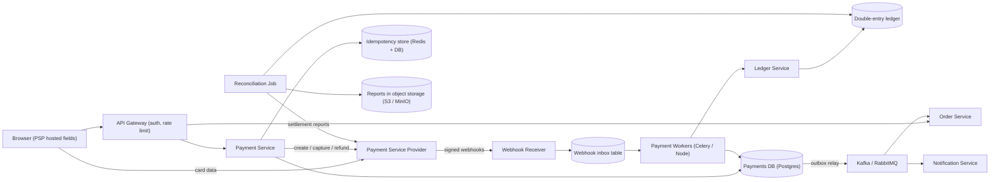
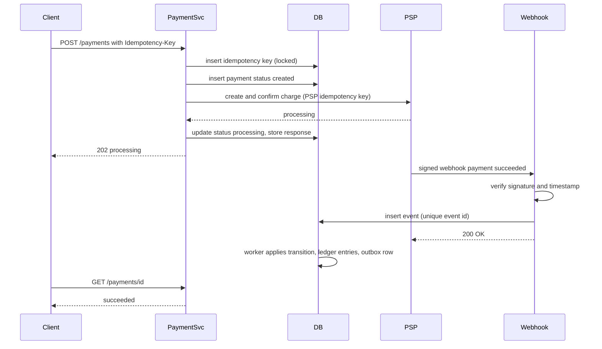

# Payment System

> **Reviewed:** 2026-09 · **Scope:** Full-stack (frontend + backend + scalability) · **Level:** Senior / Tech Lead

---

## Overview

Design a secure payment processing system that handles payments through payment gateways, supports multiple payment methods, and ensures secure, reliable transactions with fraud detection.

---

## 1) Requirements

### Functional Requirements

**Core Features:**
- Process payments (credit cards, debit cards, wallets, UPI)
- Payment gateway integration (Stripe, PayPal, Razorpay, etc.)
- Payment method management (save, update, delete payment methods)
- Payment history with filtering and search
- Refund processing
- Payment status tracking (real-time updates)
- Receipt generation and download
- Payment analytics dashboard

**Security Features:**
- PCI-DSS compliant payment form handling
- Payment method tokenization (don't store raw card data)
- Idempotency (prevent duplicate charges)
- Fraud detection and blocking

### Non-Functional Requirements

**Performance:**
- Payment processing: < 2 seconds
- Fast payment history retrieval
- Low-latency status updates

**Reliability:**
- 99.99% reliability
- Zero duplicate charges (idempotency)
- Handle payment gateway failures gracefully

**Security:**
- PCI-DSS compliance
- Secure payment data handling
- Fraud detection mechanisms
- Encrypted data transmission

**User Experience:**
- Responsive design (mobile and desktop)
- Accessible payment forms
- Clear error messages
- Payment confirmation

---

## 2) Component Hierarchy

The frontend is a React application with secure payment processing. Here's the structure:

```
App
├── Layout
│   ├── Header
│   │   ├── Logo
│   │   └── UserMenu
│   └── MainContent
├── Pages
│   ├── CheckoutPage
│   │   ├── OrderSummary (items, total, shipping)
│   │   ├── PaymentForm
│   │   │   ├── PaymentMethodSelector (Card, UPI, Wallet)
│   │   │   ├── CardInput (via payment gateway SDK)
│   │   │   │   ├── CardNumber (secure input)
│   │   │   │   ├── ExpiryDate
│   │   │   │   ├── CVV
│   │   │   │   └── CardholderName
│   │   │   ├── UPIPayment (UPI ID input)
│   │   │   ├── WalletSelector (Paytm, PhonePe, etc.)
│   │   │   ├── SavedPaymentMethods (show saved cards)
│   │   │   └── SubmitButton
│   │   └── PaymentStatus (processing, success, error)
│   ├── PaymentHistoryPage
│   │   ├── PaymentFilters (date range, status, amount)
│   │   ├── PaymentList
│   │   │   └── PaymentCard
│   │   │       ├── TransactionId
│   │   │       ├── Amount
│   │   │       ├── Status
│   │   │       ├── Date
│   │   │       └── Actions (View Receipt, Refund)
│   │   └── Pagination
│   ├── PaymentMethodPage
│   │   ├── PaymentMethodList
│   │   │   └── PaymentMethodCard
│   │   │       ├── CardInfo (last 4 digits, brand)
│   │   │       ├── ExpiryDate
│   │   │       └── Actions (Set Default, Delete)
│   │   └── AddPaymentMethodButton
│   └── ReceiptPage
│       ├── ReceiptView (transaction details)
│       └── DownloadButton
└── SharedComponents
    ├── PaymentGatewaySDK (Stripe, Razorpay integration)
    ├── Toast
    └── LoadingSpinner
```

### Key Components Explained

**1. PaymentForm Component**
- Main payment form with payment gateway SDK integration
- Handles card input securely (never touches raw card data)
- Validates payment details in real-time
- Generates idempotency key to prevent duplicate charges
- Uses useActionState (React 19) for form handling

**2. CardInput Component**
- Secure card input using payment gateway SDK
- Payment gateway SDK handles card validation
- Tokenizes card data (returns token, not raw card number)
- PCI-DSS compliant (no card data touches our servers)

**3. PaymentMethodSelector Component**
- Allows selecting payment method (Card, UPI, Wallet)
- Shows saved payment methods
- Handles different payment flows for each method

**4. PaymentHistory Component**
- Displays payment history with filtering
- Shows payment status, amount, date
- Actions: view receipt, request refund
- Real-time status updates via polling or WebSocket

**5. PaymentMethodManager Component**
- Manages saved payment methods
- Add, update, delete payment methods
- Set default payment method
- Shows masked card information

---

## 3) Data Models

Here are the key data structures:

```typescript
// Payment transaction
interface Payment {
  id: string;
  orderId: string;
  amount: number;
  currency: string;
  status: "pending" | "processing" | "completed" | "failed" | "refunded";
  paymentMethod: PaymentMethod;
  paymentGateway: string;  // "stripe", "razorpay", etc.
  transactionId: string;  // Gateway transaction ID
  idempotencyKey: string;  // Prevents duplicate charges
  createdAt: string;
  updatedAt: string;
  receiptUrl?: string;
  refundAmount?: number;
  refundReason?: string;
}

// Payment method
interface PaymentMethod {
  id: string;
  type: "card" | "upi" | "wallet" | "netbanking";
  // For cards
  last4?: string;  // Last 4 digits
  brand?: string;  // "visa", "mastercard", etc.
  expiryMonth?: number;
  expiryYear?: number;
  // For UPI
  upiId?: string;
  // For wallets
  walletType?: string;  // "paytm", "phonepe", etc.
  isDefault: boolean;
  token: string;  // Tokenized payment method ID
}

// Payment request
interface PaymentRequest {
  orderId: string;
  amount: number;
  currency: string;
  paymentMethodId?: string;  // For saved payment methods
  paymentMethodToken?: string;  // For new payment methods (from gateway)
  idempotencyKey: string;
  metadata?: Record<string, string>;  // Additional data
}

// Payment response
interface PaymentResponse {
  success: boolean;
  data: {
    paymentId: string;
    status: string;
    transactionId: string;
    receiptUrl?: string;
  };
  error?: {
    code: string;  // "INSUFFICIENT_FUNDS", "CARD_DECLINED", etc.
    message: string;
  };
}

// Refund request
interface RefundRequest {
  paymentId: string;
  amount?: number;  // Partial refund, omit for full refund
  reason: string;
}

// Payment analytics
interface PaymentAnalytics {
  totalRevenue: number;
  totalTransactions: number;
  successRate: number;
  averageTransactionAmount: number;
  paymentsByMethod: Array<{
    method: string;
    count: number;
    amount: number;
  }>;
  paymentsByStatus: Array<{
    status: string;
    count: number;
  }>;
}
```

### Data Flow Explanation

**When a user makes a payment:**
1. User enters payment details in PaymentForm
2. Payment gateway SDK validates and tokenizes card data
3. Frontend generates unique idempotency key
4. Submit payment request with token and idempotency key
5. Server processes payment via payment gateway
6. Payment status updates in real-time
7. On success, show receipt and confirmation

**Idempotency flow:**
1. Frontend generates idempotency key (UUID) before payment
2. Key is sent with payment request
3. Server checks if payment with this key already exists
4. If exists, returns existing payment (prevents duplicate charge)
5. If new, processes payment and stores key

**Payment method tokenization:**
1. User enters card details in secure gateway SDK input
2. Gateway SDK validates and tokenizes card
3. Frontend receives token (not raw card data)
4. Token is sent to server for payment
5. Token can be saved for future payments (with user consent)

**Refund flow:**
1. User requests refund from PaymentHistory
2. User enters refund amount (partial or full) and reason
3. Refund request sent to server
4. Server processes refund via payment gateway
5. Payment status updates to "refunded"
6. User receives confirmation

---

## 4) API Design

### REST Endpoints

**POST /api/v1/payments**
- Process a payment
- Request body: PaymentRequest with idempotency key
- Returns: PaymentResponse
- Status codes: 200 (Success), 400 (Invalid Request), 402 (Payment Failed)

**GET /api/v1/payments**
- Get payment history
- Query params: `page`, `limit`, `status`, `startDate`, `endDate`
- Returns: Paginated list of Payment objects

**GET /api/v1/payments/:id**
- Get payment details
- Returns: Payment object

**POST /api/v1/payments/:id/refund**
- Process a refund
- Request body: RefundRequest
- Returns: Updated Payment object

**GET /api/v1/payments/:id/receipt**
- Get payment receipt
- Returns: Receipt PDF download

**GET /api/v1/payment-methods**
- Get saved payment methods
- Returns: Array of PaymentMethod objects

**POST /api/v1/payment-methods**
- Add a payment method
- Request body: PaymentMethod with token
- Returns: PaymentMethod object

**DELETE /api/v1/payment-methods/:id**
- Delete a payment method
- Returns: Success confirmation

**GET /api/v1/payments/analytics**
- Get payment analytics
- Query params: `startDate`, `endDate`
- Returns: PaymentAnalytics object

### API Request/Response Examples

**Process Payment:**
```json
// POST /api/v1/payments
{
  "orderId": "order_123",
  "amount": 99.99,
  "currency": "USD",
  "paymentMethodToken": "tok_abc123",  // From payment gateway
  "idempotencyKey": "idemp_xyz789"
}

// Response
{
  "success": true,
  "data": {
    "paymentId": "pay_123",
    "status": "completed",
    "transactionId": "txn_abc456",
    "receiptUrl": "https://api.example.com/receipts/pay_123.pdf"
  }
}
```

**Get Payment History:**
```json
// GET /api/v1/payments?page=1&limit=20&status=completed
// Response
{
  "success": true,
  "data": {
    "payments": [
      {
        "id": "pay_123",
        "orderId": "order_123",
        "amount": 99.99,
        "currency": "USD",
        "status": "completed",
        "paymentMethod": {
          "type": "card",
          "last4": "4242",
          "brand": "visa"
        },
        "createdAt": "2024-01-15T10:00:00Z"
      }
    ],
    "total": 150,
    "page": 1,
    "limit": 20
  }
}
```

**Process Refund:**
```json
// POST /api/v1/payments/pay_123/refund
{
  "amount": 50.00,  // Partial refund, omit for full
  "reason": "Customer requested refund"
}

// Response
{
  "success": true,
  "data": {
    "id": "pay_123",
    "status": "refunded",
    "refundAmount": 50.00,
    "refundReason": "Customer requested refund"
  }
}
```

**Error Response:**
```json
{
  "success": false,
  "error": {
    "code": "CARD_DECLINED",
    "message": "Your card was declined",
    "details": "Insufficient funds"
  }
}
```

---

## 5) Key Design Decisions

**1. Payment Gateway SDK Integration**
- Use payment gateway SDK (Stripe, Razorpay) for card input
- SDK handles PCI-DSS compliance
- Card data never touches our servers
- Returns tokenized payment method

**2. Idempotency for Duplicate Prevention**
- Generate unique idempotency key before payment
- Server checks for existing payment with same key
- Prevents duplicate charges on retry
- Critical for reliability

**3. Payment Method Tokenization**
- Store tokenized payment methods (not raw card data)
- Tokens can be reused for future payments
- More secure than storing card numbers
- Reduces PCI-DSS scope

**4. Real-time Status Updates**
- Poll payment status or use WebSocket
- Update UI when payment status changes
- Better user experience
- Handle async payment processing

**5. Optimistic Updates**
- Show payment as processing immediately
- Use useOptimistic (React 19) for instant feedback
- Rollback if payment fails
- Better perceived performance

**6. Error Handling**
- Clear error messages for different failure types
- Retry logic for transient failures
- Fraud detection blocking
- User-friendly error display

**7. Next.js App Router Considerations**
- Checkout page shell and order summary can be Server Components; the card input (gateway Elements / hosted fields) must be a client component
- Create the gateway PaymentIntent (or equivalent) on the server (Route Handler or Server Action) so secret keys never reach the browser
- The confirmation page should read the final status from your backend, not trust query params from the gateway redirect

---

## 6) Backend High-Level Design

The core rule: **your backend is the source of truth for what the customer owes and what was collected**, while the payment service provider (PSP, e.g., Stripe/Razorpay/Adyen) is the source of truth for what happened on the card network. Reconciliation keeps the two in agreement.



**Components**

| Component | Responsibility | Notes |
|-----------|----------------|-------|
| PSP hosted fields / SDK | Collect card data directly in the browser, return a token | Keeps raw PAN off your servers; reduces PCI scope |
| Payment Service | Create payment intent, enforce idempotency, drive the state machine, call PSP | The only service that talks to the PSP API |
| Idempotency store | Maps `Idempotency-Key` to request hash and stored response | See Stripe's idempotent requests model |
| Webhook Receiver | Verify signature, store raw event, return 2xx fast | Processing happens asynchronously |
| Payment Workers | Apply webhook events, retries, timeouts for stuck payments | Celery or Node workers consuming from [RabbitMQ](../backend/rabbitmq/index.md) |
| Ledger Service | Append-only double-entry journal | Balances derived from entries, never updated in place |
| Outbox relay | Publishes `payment.succeeded` etc. after DB commit | Avoids dual-write bugs |
| Reconciliation Job | Daily compare of ledger vs PSP settlement reports | Flags mismatches for finance ops |

### Payment state machine

| From | Event | To |
|------|-------|----|
| `created` | client confirms with token | `processing` |
| `processing` | PSP says requires 3-D Secure | `requires_action` |
| `requires_action` | customer completes challenge | `processing` |
| `processing` | PSP authorized | `authorized` |
| `authorized` | capture succeeds | `succeeded` |
| `processing` / `authorized` | declined, expired, or voided | `failed` / `canceled` |
| `succeeded` | refund (full or partial) | `partially_refunded` / `refunded` |
| `succeeded` | chargeback opened | `disputed` |

Transitions are enforced in code (and ideally with a DB check on allowed `from -> to` pairs). Every transition writes a `payment_events` row, so the history is auditable and replayable. Out-of-order webhooks (e.g., `succeeded` arriving before `processing`) are handled by ignoring transitions to an "earlier" state.

### Webhooks: signature verification and retries

- Verify the HMAC signature header using the raw request body and the endpoint secret; reject if the timestamp is outside a tolerance window (replay protection).
- Persist the raw event with a unique constraint on the PSP `event_id`, then return 2xx immediately. PSPs retry on non-2xx or timeout, so the receiver must be fast and idempotent.
- Workers process the inbox; failures retry with exponential backoff and eventually go to a dead-letter queue with alerting.
- Never trust webhook payload fields blindly for money amounts: optionally re-fetch the object from the PSP API before applying.

### Transactional outbox

Writing to the DB and publishing to a queue are two systems; if you do both directly, one can succeed without the other. Instead, in the **same DB transaction** that updates `payments`, insert into `outbox`. A relay (polling or CDC) publishes outbox rows to Kafka/RabbitMQ and marks them sent. Consumers must be idempotent because delivery is at-least-once. See [Transactional Outbox](https://microservices.io/patterns/data/transactional-outbox.html) and [Messaging Systems](../backend/architecture/05-messaging-systems.md).

### PCI scope reduction

- Card data is entered in PSP-hosted iframes/fields, so it goes browser to PSP directly; your servers only see tokens and last4/brand.
- This typically lets a merchant qualify for a much lighter PCI DSS self-assessment than handling PAN directly (confirm the exact SAQ type with your acquirer/QSA).
- Still required: HTTPS everywhere, strict CSP on checkout pages (to limit script injection that could skim hosted fields), secrets management, and access logging.

---

## 7) Data Model and Consistency

**Schema sketch (Postgres)**

```sql
CREATE TABLE payments (
  id              UUID PRIMARY KEY,
  merchant_id     BIGINT NOT NULL,
  order_id        TEXT   NOT NULL,
  amount_minor    BIGINT NOT NULL,        -- integer minor units, never floats
  currency        CHAR(3) NOT NULL,
  status          TEXT   NOT NULL,
  psp_payment_id  TEXT   UNIQUE,
  created_at      TIMESTAMPTZ NOT NULL,
  updated_at      TIMESTAMPTZ NOT NULL,
  version         INT NOT NULL DEFAULT 0   -- optimistic locking
);
CREATE INDEX idx_payments_merchant_created ON payments (merchant_id, created_at DESC);
CREATE UNIQUE INDEX idx_payments_order ON payments (merchant_id, order_id)
  WHERE status NOT IN ('failed', 'canceled');  -- at most one live payment per order

CREATE TABLE idempotency_keys (
  merchant_id   BIGINT,
  key           TEXT,
  request_hash  TEXT NOT NULL,     -- reject same key with different body
  response_code INT,
  response_body JSONB,
  locked_at     TIMESTAMPTZ,       -- in-flight marker
  created_at    TIMESTAMPTZ NOT NULL,
  PRIMARY KEY (merchant_id, key)
);

CREATE TABLE payment_events (      -- state transition history
  id BIGSERIAL PRIMARY KEY, payment_id UUID, from_status TEXT, to_status TEXT,
  source TEXT, psp_event_id TEXT UNIQUE, created_at TIMESTAMPTZ
);

-- Double-entry ledger: every transaction's entries sum to zero
CREATE TABLE ledger_transactions (id UUID PRIMARY KEY, payment_id UUID, kind TEXT, created_at TIMESTAMPTZ);
CREATE TABLE ledger_entries (
  id             BIGSERIAL PRIMARY KEY,
  transaction_id UUID   NOT NULL REFERENCES ledger_transactions(id),
  account_id     TEXT   NOT NULL,   -- e.g. customer_receivable, psp_clearing, merchant_payable, fees
  amount_minor   BIGINT NOT NULL,   -- debit positive, credit negative
  currency       CHAR(3) NOT NULL
);
CREATE INDEX idx_ledger_entries_account ON ledger_entries (account_id, id);

CREATE TABLE outbox (
  id BIGSERIAL PRIMARY KEY, aggregate_id UUID, event_type TEXT,
  payload JSONB, created_at TIMESTAMPTZ, published_at TIMESTAMPTZ NULL
);
```

**Double-entry example (illustrative):** a 100.00 charge with a 3.00 fee is one ledger transaction with entries `psp_clearing +10000`, `merchant_payable -9700`, `fees_revenue -300`. The sum is zero; balances are `SUM(amount_minor)` per account. Refunds are new reversing transactions, never edits.

**Partitioning**
- Payments and ledger are relatively low volume compared to reads in most products; a single well-indexed Postgres primary with replicas goes a long way.
- When needed, shard by `merchant_id` (keeps a merchant's payments, idempotency keys, and ledger together so transactions stay single-shard).
- Time-partition `ledger_entries` and `payment_events` by month for archival.

**Consistency trade-offs**
- **Strong consistency** (ACID transactions on the primary) for payment state, idempotency keys, ledger writes, and outbox inserts. Money paths do not read from replicas.
- **Eventual consistency** for downstream consumers (order fulfilment, email receipts, analytics dashboards) via the outbox.
- The PSP and your DB are two systems with no shared transaction; you get agreement through idempotent calls, webhooks, and reconciliation, not distributed transactions.

**Idempotency flow**
1. Client generates a key per checkout attempt (UUID) and sends it as the `Idempotency-Key` header.
2. Server inserts `(merchant_id, key, request_hash)` with `locked_at = now()`; a unique violation means "seen before".
3. If seen and completed: return the stored response. If seen and in-flight: return `409` (retry later). If the body hash differs: `422`.
4. The server also passes its own idempotency key to the PSP, so a retry after a timeout does not create a second charge on the PSP side.
5. Keys expire after a retention window (e.g., 24 hours, as an illustrative choice).

---

## 8) Scalability and Reliability

### Back-of-envelope estimate

> All numbers below are **ILLUSTRATIVE ASSUMPTIONS** for practice.

| Assumption | Value |
|------------|-------|
| Payments per day | 1M |
| Peak-to-average (flash sale) | 10x |
| Ledger entries per payment (incl. fees, refunds amortized) | 4 |
| Webhooks per payment | 3 |
| Row size (ledger entry) | about 200 bytes |

Arithmetic:
- Payments: 1M / 86,400 ≈ **12 payments/s** average, ≈ **120/s** peak.
- Ledger entries: 1M × 4 = 4M/day × 200 B ≈ **0.8 GB/day**, ≈ **292 GB/year** before indexes.
- Webhooks: 1M × 3 = 3M/day ≈ **35/s** average, ≈ **350/s** peak.
- PSP API calls: at about 2 calls per payment (create + confirm/capture), peak ≈ 240 calls/s, which is where PSP rate limits matter more than your DB.

The takeaway: payments are rarely a raw-throughput problem. They are a **correctness** problem under retries, timeouts, and partial failures.

### Bottlenecks and how to remove them

| Bottleneck | Fix |
|------------|-----|
| PSP latency and rate limits | Timeouts with idempotent retries, per-PSP concurrency limits, optional multi-PSP routing |
| Row contention on hot merchant balance | Derive balances from entries; if a cached balance row is needed, update it asynchronously or with sharded counters |
| Webhook bursts | Receiver only verifies and inserts; workers drain at a controlled rate |
| Reporting queries on primary | Read replicas or a warehouse fed by CDC for dashboards and analytics |
| Abuse / card testing | Rate limit per IP/customer/card fingerprint, CAPTCHA, fraud scoring |

### Failure modes

| Failure | Impact | Mitigation |
|---------|--------|------------|
| PSP call times out | Unknown if the charge happened | Retry with the same PSP idempotency key; query payment status; never create a new charge |
| Client retries after network drop | Possible double charge | Idempotency keys stored server-side and passed to PSP |
| Webhook delivered twice or out of order | Duplicate side effects, wrong state | Unique `psp_event_id`, monotonic state transitions |
| Webhook endpoint down | Payment status stuck | PSP retries for a period; a sweeper job polls PSP for payments stuck in `processing` |
| Queue publish fails after DB commit | Order never fulfilled | Transactional outbox with relay retries |
| Ledger and PSP disagree | Financial misstatement | Daily reconciliation against settlement files, mismatch queue for finance review |
| Leaked webhook secret | Forged "payment succeeded" events | Rotate secrets, verify signatures, optionally re-fetch from PSP API before fulfilling |

### Most important flow: charge with idempotency and webhook



---

## 9) Deep Dive Options (RADIO)

<details>
<summary>Deep dive 1: Exactly-once charging under retries</summary>

- **Requirements:** A customer is charged at most once per checkout attempt even with client, server, and PSP retries.
- **Architecture:** Idempotency middleware in Payment Service, PSP-level idempotency key, sweeper for stuck payments.
- **Data model:** `idempotency_keys` with request hash and stored response; `payments.psp_payment_id` unique.
- **Interface:** `Idempotency-Key` header; `409` for in-flight, `422` for key reuse with different body.
- **Optimizations:** Redis for fast "in-flight" locks with DB as source of truth; TTL cleanup job.

</details>

<details>
<summary>Deep dive 2: Ledger and reconciliation</summary>

- **Requirements:** Auditable money movement, balances always explainable, detect PSP mismatches.
- **Architecture:** Ledger Service with append-only journal; nightly reconciliation job ingests PSP settlement reports from object storage.
- **Data model:** `ledger_transactions`, `ledger_entries` (sum to zero), `recon_mismatches`.
- **Interface:** Internal `PostTransaction(entries[])` that rejects unbalanced input.
- **Optimizations:** Monthly partitions, periodic balance snapshots so balance queries do not scan all history.

</details>

<details>
<summary>Deep dive 3: Webhook processing pipeline</summary>

- **Requirements:** Never lose an event, tolerate duplicates and reordering, respond fast to the PSP.
- **Architecture:** Receiver verifies and stores to inbox; Celery/Node workers apply events; DLQ with alerting.
- **Data model:** `webhook_inbox(psp_event_id unique, type, payload, received_at, processed_at, attempts)`.
- **Interface:** `POST /webhooks/psp` returns 2xx after durable insert.
- **Optimizations:** Partition worker queues by `payment_id` to preserve per-payment order; backoff with jitter.

</details>

---

## 10) Scaling with AI and Agentic Workflows

In payments, AI is most useful as a **reviewer and drafter** around a system whose correctness is enforced by deterministic code. See [Agentic Workflows](../agentic-workflows/index.md) and [AI-Assisted Development](../ai/ai-assisted-development/index.md).

**Where AI and agents help in engineering**
- **Brainstorm failure scenarios, then validate:** have an assistant enumerate timeout/retry/duplicate/reordering cases, then turn each into an automated test against a PSP sandbox.
- **Generate load tests for review:** draft k6 or Locust scripts that include retries with the same idempotency key and duplicate webhook deliveries; a human sets target rates that respect PSP sandbox limits.
- **Summarize incidents:** feed traces, PSP error codes, and queue depth metrics to get a first-pass incident timeline for RCA.
- **Draft reconciliation queries and runbooks:** e.g., "webhook endpoint down" or "PSP degraded" runbooks, and SQL to find payments stuck in `processing`.
- **Generate Terraform/Kubernetes manifests** for workers and queues, reviewed like any code (see [DevOps](../devops/index.md)).

**AI in the product**
- **Fraud and risk scoring:** ML models on device, velocity, and behavioral features are standard. Trade-offs: scoring must fit in the checkout latency budget (tens of milliseconds, illustratively), training data is imbalanced and delayed (chargebacks arrive weeks later), and false positives lose revenue. Use model score plus rules plus manual review queues.
- **Support and dispute assistance:** drafting dispute evidence summaries or answering "where is my refund" from order data, with a human sending the final response.

**Human approval required for**
- Any change to money movement logic, ledger posting rules, or refund policies
- Issuing refunds or reversing ledger entries above a threshold
- Changing fraud thresholds or rules in production
- Rotating secrets, changing webhook endpoints, or modifying PCI-relevant infrastructure
- Applying generated migrations to payment tables

**Do not trust AI for**
- Deciding whether a charge succeeded (only PSP API/webhook and your ledger decide)
- PCI DSS compliance interpretations (ask your QSA/acquirer)
- Generating financial reconciliation results without deterministic verification
- Handling raw card data or secrets in prompts (never paste them)

---

## 11) Interview Talking Points

**When explaining this system, I'd focus on:**

1. **Requirements First**: Start with core functionality - secure payment processing, multiple payment methods, refunds

2. **Component Structure**: Explain the React component hierarchy - payment form, payment method selector, payment history

3. **Data Models**: Walk through Payment, PaymentMethod, PaymentRequest - and idempotency key importance

4. **API Design**: Show the REST endpoints - process payment, refund, payment history, payment methods

5. **Key Challenges**: 
   - PCI-DSS compliance (never store raw card data)
   - Idempotency to prevent duplicate charges
   - Payment gateway integration and error handling
   - Real-time payment status updates
   - Fraud detection and blocking

**Example explanation flow:**
> "So for a payment system, the core requirement is processing payments securely through payment gateways. The frontend uses a payment gateway SDK (like Stripe) for card input - this is critical for PCI-DSS compliance because the SDK handles card data securely and never sends raw card numbers to our servers. Instead, it returns a tokenized payment method. When processing a payment, we generate an idempotency key to prevent duplicate charges - if the same key is used twice, the server returns the existing payment instead of charging again. The data model includes Payment objects with status tracking, PaymentMethod objects for saved payment methods (tokenized), and PaymentRequest with the idempotency key. The main API endpoints handle payment processing, refunds, payment history, and payment method management. Key challenges include ensuring PCI-DSS compliance, implementing idempotency correctly, handling payment gateway failures gracefully, and providing real-time status updates."

### Follow-up Questions

1. **The PSP call timed out. Did the customer get charged?** Unknown, so never create a new charge. Retry with the same PSP idempotency key or query the PSP for the payment status; a sweeper resolves anything left in `processing`.
2. **Why a double-entry ledger instead of a `balance` column?** Every movement is recorded as balanced entries, so balances are derivable and auditable, and bugs show up as non-zero sums instead of silent drift.
3. **How do you handle duplicate or out-of-order webhooks?** Unique constraint on the PSP event ID, and monotonic state transitions that ignore moves to an earlier state.
4. **How do you prevent forged webhooks?** Verify the HMAC signature on the raw body with a timestamp tolerance; optionally re-fetch the object from the PSP API before fulfilling.
5. **Why the outbox pattern?** It makes "update payment" and "publish event" atomic by writing both in one DB transaction; a relay publishes afterwards with at-least-once delivery.
6. **How do you reduce PCI scope?** Hosted fields/SDK tokenization so raw card data never touches your servers, plus strict CSP on checkout pages.
7. **How is money represented?** Integer minor units plus ISO currency code; never floating point.
8. **What does reconciliation catch?** Missing webhooks, fee differences, refunds processed outside your system, and bugs in ledger posting.

### Common Mistakes

- Using floats for amounts (the existing examples show `99.99` for readability; store `9999` minor units)
- Generating the idempotency key on the server per request, which defeats client retries
- Doing fulfilment directly inside the webhook HTTP handler and timing out
- Publishing to a queue outside the DB transaction (dual write)
- Trusting the client redirect ("payment success" URL) as proof of payment
- Reading payment status from a lagging replica right after a write
- Forgetting partial refunds, disputes, and currency in the state model

---

## References

- [Stripe: Idempotent requests](https://stripe.com/docs/api/idempotent_requests)
- [Stripe: Webhooks and signature verification](https://stripe.com/docs/webhooks)
- [microservices.io: Transactional outbox pattern](https://microservices.io/patterns/data/transactional-outbox.html)
- [PCI Security Standards Council](https://www.pcisecuritystandards.org/)
- [Martin Fowler: Accounting patterns (Account, Accounting Entry)](https://martinfowler.com/eaaDev/AccountingNarrative.html)
- [Related case study: E-commerce App](./08-e-commerce-app.md)

