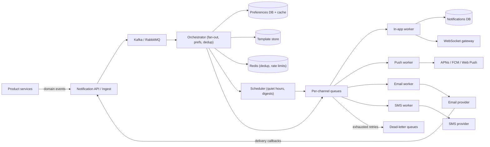
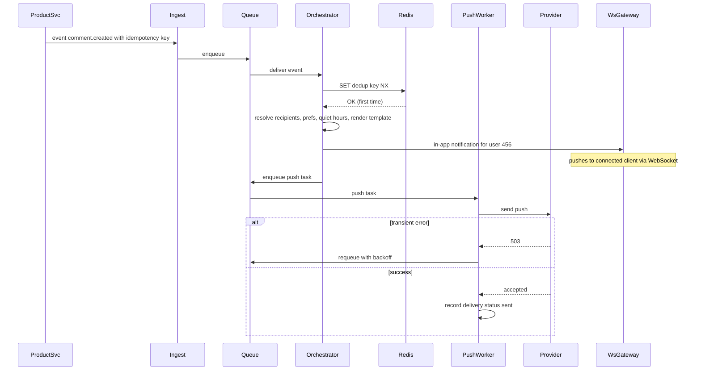

# Notification System

> **Reviewed:** 2026-09 · **Scope:** Full-stack (frontend + backend + scalability) · **Level:** Senior / Tech Lead

---

## Overview

Design a scalable notification system that delivers millions of notifications per day across multiple channels (in-app, email, push, SMS) with high reliability and real-time delivery.

---

## 1) Requirements

### Functional Requirements

**Core Features:**
- In-app notifications (real-time via WebSocket)
- Push notifications (browser and mobile)
- Email notifications
- SMS notifications (for critical alerts)
- Notification preferences (channel, category, frequency)
- Notification history
- Read/unread status tracking
- Notification grouping and batching

**Notification Types:**
- System notifications (app updates, maintenance)
- User activity (likes, comments, mentions, follows)
- Transaction notifications (payments, orders)
- Marketing notifications (promotions, offers)
- Security notifications (login alerts, password changes)

**User Preferences:**
- Channel preferences (which channels to receive)
- Category preferences (enable/disable categories)
- Frequency preferences (real-time, batched, digest)
- Quiet hours (don't send during specific times)

### Non-Functional Requirements

**Performance:**
- Real-time delivery: < 1 second
- High throughput: millions of notifications per day
- Low latency for critical alerts

**Reliability:**
- Guaranteed delivery for important notifications
- At-least-once delivery guarantee
- Retry mechanisms for failed deliveries
- Fault tolerance

**User Experience:**
- Non-intrusive (don't overwhelm users)
- Relevant (only send what users care about)
- Actionable (clear actions in notifications)

---

## 2) Component Hierarchy

The frontend is a React application with real-time notification handling. Here's the structure:

```
App
├── Layout
│   ├── Header
│   │   ├── Logo
│   │   ├── NotificationBell (shows unread count)
│   │   │   └── NotificationBadge (unread count)
│   │   └── UserMenu
│   └── MainContent
├── Components
│   ├── NotificationCenter
│   │   ├── NotificationDropdown
│   │   │   ├── NotificationHeader (Mark all read, Settings)
│   │   │   ├── NotificationList
│   │   │   │   └── NotificationItem
│   │   │   │       ├── NotificationIcon (type icon)
│   │   │   │       ├── NotificationContent (title, message)
│   │   │   │       ├── NotificationTime (relative time)
│   │   │   │       ├── UnreadIndicator
│   │   │   │       └── ActionButtons (Mark read, Dismiss)
│   │   │   └── ViewAllButton
│   │   └── NotificationToast (popup notifications)
│   ├── NotificationHistoryPage
│   │   ├── NotificationFilters (category, date, read status)
│   │   ├── NotificationList
│   │   │   └── NotificationItem (same as above)
│   │   └── Pagination
│   └── NotificationSettingsPage
│       ├── ChannelPreferences
│       │   ├── InAppToggle
│       │   ├── EmailToggle
│       │   ├── PushToggle
│       │   └── SMSToggle
│       ├── CategoryPreferences
│       │   ├── SystemNotificationsToggle
│       │   ├── UserActivityToggle
│       │   ├── TransactionToggle
│       │   └── MarketingToggle
│       ├── FrequencyPreferences
│       │   ├── RealTimeRadio
│       │   ├── BatchedRadio
│       │   └── DigestRadio
│       └── QuietHours
│           ├── StartTimePicker
│           └── EndTimePicker
└── SharedComponents
    ├── Toast (for notification toasts)
    └── LoadingSpinner
```

### Key Components Explained

**1. NotificationBell Component**
- Shows unread notification count
- Opens NotificationDropdown on click
- Badge shows unread count
- Updates in real-time via WebSocket

**2. NotificationDropdown Component**
- Dropdown menu with recent notifications
- Shows unread notifications first
- Mark all as read functionality
- Link to full notification history

**3. NotificationItem Component**
- Individual notification card
- Shows icon, title, message, time
- Unread indicator
- Actions: mark read, dismiss
- Clickable to navigate to related content

**4. NotificationToast Component**
- Popup toast notifications
- Appears for important notifications
- Auto-dismisses after few seconds
- Clickable to view full notification

**5. NotificationSettings Component**
- User preference management
- Channel preferences (which channels)
- Category preferences (which categories)
- Frequency preferences (real-time/batched/digest)
- Quiet hours configuration

---

## 3) Data Models

Here are the key data structures:

```typescript
// Notification
interface Notification {
  id: string;
  userId: string;
  type: "system" | "user_activity" | "transaction" | "marketing" | "security";
  category: string;  // "like", "comment", "payment", etc.
  title: string;
  message: string;
  icon?: string;
  imageUrl?: string;
  actionUrl?: string;  // URL to navigate when clicked
  channels: NotificationChannel[];  // Which channels to send to
  priority: "low" | "medium" | "high" | "critical";
  isRead: boolean;
  readAt?: string;
  createdAt: string;
  expiresAt?: string;  // Optional expiration
  metadata?: Record<string, any>;  // Additional data
}

// Notification channel
type NotificationChannel = "in_app" | "email" | "push" | "sms";

// Notification delivery status
interface NotificationDelivery {
  notificationId: string;
  channel: NotificationChannel;
  status: "pending" | "sent" | "delivered" | "failed";
  deliveredAt?: string;
  error?: string;
  retryCount: number;
}

// User notification preferences
interface NotificationPreferences {
  userId: string;
  channels: {
    in_app: boolean;
    email: boolean;
    push: boolean;
    sms: boolean;
  };
  categories: {
    [category: string]: boolean;  // Enable/disable per category
  };
  frequency: "realtime" | "batched" | "digest";
  quietHours: {
    enabled: boolean;
    startTime: string;  // "22:00"
    endTime: string;  // "08:00"
  };
}

// Notification batch (for batched/digest mode)
interface NotificationBatch {
  id: string;
  userId: string;
  notifications: string[];  // Notification IDs
  scheduledAt: string;
  sentAt?: string;
}

// Push notification subscription
interface PushSubscription {
  userId: string;
  endpoint: string;  // Push service endpoint
  keys: {
    p256dh: string;
    auth: string;
  };
  createdAt: string;
}
```

### Data Flow Explanation

**When a notification is created:**
1. System creates notification for user
2. Check user preferences (channels, categories, quiet hours)
3. Filter notifications based on preferences
4. Send to enabled channels (in-app, email, push, SMS)
5. Track delivery status for each channel
6. Retry failed deliveries

**In-app notification flow:**
1. Notification created on server
2. WebSocket sends notification to connected clients
3. Frontend receives notification via WebSocket
4. Show notification in NotificationDropdown
5. Show toast if high priority
6. Update unread count
7. Mark as read when user views/clicks

**Push notification flow:**
1. User subscribes to push notifications
2. Browser generates push subscription
3. Subscription saved to server
4. When notification created, server sends push
5. Browser shows native notification
6. User clicks notification → navigate to app

**Batching flow:**
1. User has frequency preference set to "batched"
2. Notifications are queued instead of sent immediately
3. Batch is sent at scheduled time (e.g., every hour)
4. Multiple notifications grouped in one email/push
5. User receives batched notifications

---

## 4) API Design

### REST Endpoints

**GET /api/v1/notifications**
- Get user notifications
- Query params: `page`, `limit`, `category`, `isRead`, `startDate`, `endDate`
- Returns: Paginated list of Notification objects

**GET /api/v1/notifications/unread-count**
- Get unread notification count
- Returns: `{ count: number }`

**PATCH /api/v1/notifications/:id/read**
- Mark notification as read
- Returns: Updated Notification object

**POST /api/v1/notifications/mark-all-read**
- Mark all notifications as read
- Returns: Success confirmation

**DELETE /api/v1/notifications/:id**
- Dismiss/delete a notification
- Returns: Success confirmation

**GET /api/v1/notifications/preferences**
- Get user notification preferences
- Returns: NotificationPreferences object

**PATCH /api/v1/notifications/preferences**
- Update user notification preferences
- Request body: Partial NotificationPreferences
- Returns: Updated NotificationPreferences

**POST /api/v1/notifications/push/subscribe**
- Subscribe to push notifications
- Request body: PushSubscription object
- Returns: Success confirmation

**POST /api/v1/notifications/push/unsubscribe**
- Unsubscribe from push notifications
- Returns: Success confirmation

### WebSocket Events

**Connection:** `wss://api.example.com/notifications`

**Events:**
- `notification` - New notification received
- `notification_read` - Notification marked as read
- `notification_dismissed` - Notification dismissed

**Message Format:**
```json
{
  "type": "notification",
  "data": {
    "id": "notif_123",
    "type": "user_activity",
    "title": "New like",
    "message": "John liked your post",
    "actionUrl": "/posts/123",
    "createdAt": "2024-01-15T10:00:00Z"
  }
}
```

### API Request/Response Examples

**Get Notifications:**
```json
// GET /api/v1/notifications?page=1&limit=20&isRead=false
// Response
{
  "success": true,
  "data": {
    "notifications": [
      {
        "id": "notif_123",
        "type": "user_activity",
        "category": "like",
        "title": "New like",
        "message": "John liked your post",
        "actionUrl": "/posts/123",
        "isRead": false,
        "createdAt": "2024-01-15T10:00:00Z"
      }
    ],
    "total": 45,
    "page": 1,
    "limit": 20
  }
}
```

**Get Unread Count:**
```json
// GET /api/v1/notifications/unread-count
// Response
{
  "success": true,
  "data": {
    "count": 5
  }
}
```

**Update Preferences:**
```json
// PATCH /api/v1/notifications/preferences
{
  "channels": {
    "in_app": true,
    "email": false,
    "push": true,
    "sms": false
  },
  "categories": {
    "like": true,
    "comment": true,
    "marketing": false
  },
  "frequency": "batched",
  "quietHours": {
    "enabled": true,
    "startTime": "22:00",
    "endTime": "08:00"
  }
}

// Response
{
  "success": true,
  "data": {
    "userId": "user_123",
    "channels": { ... },
    "categories": { ... },
    "frequency": "batched",
    "quietHours": { ... }
  }
}
```

---

## 5) Key Design Decisions

**1. WebSocket for Real-time In-app Notifications**
- Instant delivery for in-app notifications
- Low latency (< 1 second)
- Better user experience
- Auto-reconnect on connection loss

**2. Multi-channel Support**
- Different channels for different notification types
- User preferences control which channels
- Fallback to other channels if one fails
- Critical notifications use multiple channels

**3. Notification Preferences**
- Users control what they receive
- Reduces notification fatigue
- Improves user experience
- Respects quiet hours

**4. Batching and Digest Mode**
- Group multiple notifications together
- Reduces notification spam
- Better for less urgent notifications
- Scheduled delivery

**5. Delivery Status Tracking**
- Track delivery status per channel
- Retry failed deliveries
- Analytics on delivery rates
- Identify delivery issues

**6. Optimistic Updates**
- Show notifications immediately via WebSocket
- Use useOptimistic (React 19) for instant UI
- Better perceived performance
- Sync with server state

**7. Next.js App Router Considerations**
- The notification history and preferences pages can be Server Components that render the first page on the server; the bell, dropdown, and WebSocket listener are client components
- Web Push requires a service worker registered from the client; VAPID private keys stay server-side
- Server-Sent Events are a simpler alternative to WebSocket when the channel is server-to-client only

---

## 6) Backend High-Level Design

A notification platform is an **event-driven pipeline**: product services emit domain events ("comment created", "order shipped"), and the platform decides *who* gets notified, *on which channel*, *when*, and *with what content*, then hands off to channel providers.



**Components**

| Component | Responsibility | Notes |
|-----------|----------------|-------|
| Ingest API | Accepts events or direct "send" requests from internal services, validates, assigns `notificationId` | Requires caller-supplied idempotency key |
| Orchestrator | Resolves recipients (fan-out), applies preferences, quiet hours, dedup, rate limits, renders template | Stateless workers, horizontally scaled |
| Scheduler | Holds delayed notifications (quiet hours, digests, "send at 9am local") | Delayed queue or time-bucketed table polled by workers |
| Per-channel queues | Isolate channels so a slow SMS provider cannot delay push | RabbitMQ queues or Kafka topics per channel/priority |
| Channel workers | Call providers, handle provider-specific retries and rate limits | Celery workers with RabbitMQ are a natural fit; see [Celery](../backend/celery/index.md) and [RabbitMQ](../backend/rabbitmq/index.md) |
| WebSocket gateway | Pushes in-app notifications to connected clients | Looks up user connections via a presence registry |
| Template store | Versioned, localized templates per channel | Rendered server-side; attachments/images in object storage such as [MinIO](../backend/minio/index.md) |
| DLQ | Holds permanently failing messages for inspection and replay | Alert on DLQ growth |

### Fan-out

- **Targeted notifications** (one recipient): straight through the pipeline.
- **Group fan-out** (e.g., "new post in a group with 50,000 members"): the orchestrator pages through the membership list in batches (e.g., 1,000 recipients per task) and enqueues batch tasks, rather than one giant job.
- **Broadcast/marketing**: scheduled campaigns processed as batched jobs with a global send rate cap so providers and downstream systems are not overwhelmed.

### Priority and rate limiting

- Separate queues by priority: `critical` (OTP, security alerts), `transactional` (order shipped), `social`, `marketing`. Critical workers are never starved by marketing backlogs.
- **Per-user caps** (e.g., at most N push notifications per hour, illustrative), implemented with Redis counters or token buckets; over-cap notifications are collapsed into a digest.
- **Per-provider caps** respect provider throughput limits; workers use a shared token bucket.

### Retries and DLQ

- Retry transient errors (timeouts, 5xx, 429) with exponential backoff plus jitter, bounded attempts.
- Do not retry permanent errors (invalid device token, hard email bounce); instead clean up the token or mark the address as suppressed.
- After max attempts, route to a DLQ; operators can inspect and replay. For critical notifications, fall back to another channel (push failed, send SMS).

---

## 7) Data Model and Consistency

**Schema sketch**

```sql
CREATE TABLE notifications (          -- in-app inbox, one row per recipient
  user_id        BIGINT,
  notification_id UUID,
  category       TEXT,
  title          TEXT,
  body           TEXT,
  action_url     TEXT,
  group_key      TEXT,                 -- for collapsing "5 people liked your post"
  is_read        BOOLEAN DEFAULT FALSE,
  created_at     TIMESTAMPTZ,
  PRIMARY KEY (user_id, created_at, notification_id)
);
-- Unread count: partial index or a separate counter
CREATE INDEX idx_notifications_unread ON notifications (user_id) WHERE is_read = FALSE;

CREATE TABLE notification_deliveries (
  notification_id UUID,
  channel        TEXT,                 -- in_app | push | email | sms
  status         TEXT,                 -- queued | sent | delivered | failed | suppressed
  provider_msg_id TEXT,
  attempts       INT,
  last_error     TEXT,
  updated_at     TIMESTAMPTZ,
  PRIMARY KEY (notification_id, channel)
);

CREATE TABLE user_preferences (
  user_id BIGINT PRIMARY KEY, channels JSONB, categories JSONB,
  frequency TEXT, quiet_hours JSONB, timezone TEXT, updated_at TIMESTAMPTZ
);

CREATE TABLE device_tokens (
  user_id BIGINT, platform TEXT, token TEXT, last_seen_at TIMESTAMPTZ,
  PRIMARY KEY (user_id, token)
);

CREATE TABLE templates (
  template_id TEXT, version INT, channel TEXT, locale TEXT, body TEXT,
  PRIMARY KEY (template_id, version, channel, locale)
);
```

**Partitioning**
- The inbox is read by `user_id` ("my notifications, newest first"), so partition by `user_id`. A wide-column store (Cassandra-style) with `user_id` as partition key and `created_at` as clustering key fits this access pattern well; Postgres with hash partitioning also works at moderate scale.
- Apply a TTL/retention window on the inbox (e.g., 90 days, illustrative) to bound storage.
- Delivery logs are write-heavy and append-only; time-partition them.

**Consistency trade-offs**
- **Preferences:** read-your-writes for the user who just changed them (read from primary or bust the cache on write). Other readers (orchestrator) can use a short-TTL cache; a notification sent a few seconds after opting out is a known trade-off, except for legal opt-outs (marketing email unsubscribe) which must be honored strictly by checking the suppression list at send time.
- **Unread count:** eventually consistent counter (Redis) reconciled periodically with the DB.
- **Delivery status:** eventually consistent, updated by provider callbacks.

**Idempotency and dedup**
- Producers send an idempotency key (e.g., `comment:123:notify:user:456`); the orchestrator does `SET key NX EX <window>` in Redis and drops duplicates.
- Channel workers pass a stable message ID to providers where supported and check `notification_deliveries.status` before sending, so a redelivered queue message does not send a second email.
- Delivery is **at-least-once** end-to-end; dedup makes the user-visible effect close to exactly-once.

---

## 8) Scalability and Reliability

### Back-of-envelope estimate

> All numbers below are **ILLUSTRATIVE ASSUMPTIONS** for practice.

| Assumption | Value |
|------------|-------|
| Daily active users | 10M |
| Notifications per DAU per day | 5 |
| Channel mix | 60% in-app, 30% push, 8% email, 2% SMS |
| Marketing campaign | 10M recipients delivered within 30 minutes |
| In-app row size | about 1 KB |
| Inbox retention | 90 days |

Arithmetic:
- Steady state: 10M × 5 = 50M/day ÷ 86,400 ≈ **580 notifications/s**.
- Per channel steady state: push ≈ 174/s, email ≈ 46/s, SMS ≈ 12/s.
- Campaign burst: 10M ÷ 1,800 s ≈ **5,600/s** on top of steady state, which is the real sizing driver.
- Inbox storage: 50M × 60% in-app = 30M rows/day × 1 KB ≈ **30 GB/day**, × 90 days ≈ **2.7 TB**.
- SMS cost matters more than throughput: at 1M SMS/day (2%), even a small per-message price becomes a significant line item, which is why SMS is reserved for critical categories.

### Bottlenecks and how to remove them

| Bottleneck | Fix |
|------------|-----|
| Large group fan-out | Batch recipient pagination into many small tasks; async workers |
| Provider throughput limits | Per-provider token buckets, multiple provider accounts or vendors, backpressure into queues |
| Marketing blast starving transactional | Priority queues and dedicated worker pools |
| Preference lookups per recipient | Cache preferences in Redis, batch-load for fan-out batches |
| Unread count queries | Redis counter per user, recomputed on drift |
| WebSocket gateway connection count | Horizontal gateways plus presence registry mapping `user_id -> gateway` |

### Failure modes

| Failure | Impact | Mitigation |
|---------|--------|------------|
| Email/SMS provider outage | Delayed or lost messages | Retries with backoff, failover to secondary provider, DLQ with replay |
| Duplicate event from producer | User gets same notification twice | Idempotency key dedup in Redis with a time window |
| Worker crash mid-send | Message re-delivered | Ack after send; check delivery status before sending |
| Invalid device tokens accumulate | Wasted sends, provider throttling | Remove tokens on permanent errors, prune by `last_seen_at` |
| Orchestrator bug fans out to everyone | Spam incident | Campaign dry-run counts, global kill switch, send-rate cap, human approval for large audiences |
| Queue backlog grows | Notifications arrive hours late | Autoscale workers on queue depth, drop or collapse stale low-priority notifications (a "like" from 6 hours ago may be useless) |

### Most important flow: event to multi-channel delivery



---

## 9) Deep Dive Options (RADIO)

<details>
<summary>Deep dive 1: Fan-out to a 1M-member group without delaying other notifications</summary>

- **Requirements:** All members notified within minutes, transactional notifications unaffected.
- **Architecture:** Orchestrator splits recipients into batch tasks on a dedicated `bulk` queue with its own worker pool.
- **Data model:** `fanout_jobs(job_id, cursor, status)` for resumability.
- **Interface:** Internal `POST /notify/group` returns `jobId`; progress endpoint for ops.
- **Optimizations:** Skip inactive users, collapse into digests, send in-app only for low-priority categories.

</details>

<details>
<summary>Deep dive 2: Preferences, quiet hours, and digests</summary>

- **Requirements:** Respect channel/category opt-outs and local quiet hours; batch low-priority items.
- **Architecture:** Orchestrator evaluates rules; Scheduler holds deferred items in time buckets.
- **Data model:** `user_preferences` with timezone; `scheduled_notifications(send_at_bucket, user_id, payload)`.
- **Interface:** `PATCH /notifications/preferences` with read-your-writes.
- **Optimizations:** Bucket by minute and poll only the current bucket; aggregate digest content at send time.

</details>

<details>
<summary>Deep dive 3: Reliable delivery with retries, DLQ, and dedup</summary>

- **Requirements:** No lost critical notifications, no duplicate emails.
- **Architecture:** Per-channel queues, Celery/Node workers with ack-after-send, DLQ, replay tool.
- **Data model:** `notification_deliveries` as the idempotency record per channel.
- **Interface:** Provider callbacks `POST /callbacks/email` update status.
- **Optimizations:** Exponential backoff with jitter, circuit breaker per provider, fallback channel for critical categories.

</details>

---

## 10) Scaling with AI and Agentic Workflows

See [Agentic Workflows](../agentic-workflows/index.md) and [AI-Assisted Development](../ai/ai-assisted-development/index.md) for general practices.

**Where AI and agents help in engineering**
- **Brainstorm bottlenecks, then validate:** e.g., "what breaks during a 10M campaign?" and then check each answer against the burst math above and queue depth metrics.
- **Generate load tests for review:** k6 or Locust scripts simulating a campaign burst plus steady transactional traffic, with provider calls stubbed; humans set rates and verify stubs.
- **Summarize production signals:** summarize DLQ contents by error code, or cluster provider failures to speed up RCA.
- **Draft templates and localization** for human review, including checking placeholder consistency across locales.
- **Draft runbooks and infrastructure:** "provider outage failover" runbook, Kubernetes worker autoscaling on queue depth, Terraform for queues (see [DevOps](../devops/index.md)).

**AI in the product**
- **Send-time optimization:** predict when a user is likely to engage and delay non-urgent notifications. Trade-offs: needs engagement history (cold start for new users), adds scheduling complexity, and must never delay transactional or security messages.
- **Relevance filtering / ranking:** a model can decide which low-priority notifications are worth sending to reduce fatigue. Cost matters at 50M/day (illustrative), so prefer lightweight models or precomputed per-user scores over per-notification LLM calls.
- **Content generation:** LLM-drafted marketing copy is reasonable with review; per-user generated text adds latency, cost, and brand/safety risk.

**Human approval required for**
- Any campaign or fan-out above an audience threshold
- Changes to opt-out, unsubscribe, or suppression logic (legal requirements)
- New or modified templates for critical/transactional categories
- Replaying DLQ messages in bulk
- Applying generated infrastructure changes

**Do not trust AI for**
- Deciding legal consent or compliance (e.g., marketing opt-in rules by region)
- Sending critical notifications (OTP, security) without deterministic rules
- Claims about provider rate limits; check provider documentation and contracts
- Load test results as a substitute for production-like validation

---

## 11) Interview Talking Points

**When explaining this system, I'd focus on:**

1. **Requirements First**: Start with core functionality - multi-channel notifications, preferences, real-time delivery

2. **Component Structure**: Explain the React component hierarchy - notification bell, dropdown, settings, history

3. **Data Models**: Walk through Notification, NotificationPreferences, NotificationDelivery - and how preferences filter notifications

4. **API Design**: Show the REST endpoints and WebSocket protocol - get notifications, update preferences, real-time delivery

5. **Key Challenges**: 
   - Real-time delivery with low latency
   - Multi-channel delivery and status tracking
   - User preferences and filtering
   - Batching and digest mode
   - Handling millions of notifications per day

**Example explanation flow:**
> "So for a notification system, the core requirement is delivering notifications across multiple channels (in-app, email, push, SMS) with high reliability. The frontend is a React app with a notification bell component that shows unread count and opens a dropdown with recent notifications. For real-time in-app notifications, we use WebSocket to deliver notifications instantly (< 1 second). The data model includes Notification objects with type, category, channels, and delivery status. Users have NotificationPreferences that control which channels and categories they receive, plus frequency preferences (real-time, batched, or digest). The main API endpoints handle getting notifications, marking as read, and managing preferences. For push notifications, users subscribe and we send push notifications through the browser's push service. Key challenges include ensuring real-time delivery, respecting user preferences, handling batching for less urgent notifications, and tracking delivery status across multiple channels."

### Follow-up Questions

1. **How do you avoid sending the same notification twice?** Producer idempotency keys deduped in Redis (`SET NX` with a window), plus per-channel delivery records checked before sending. Delivery is at-least-once; dedup makes it effectively once.
2. **How do you keep a marketing blast from delaying OTPs?** Separate priority queues with dedicated worker pools and per-category rate limits.
3. **What happens when the email provider is down?** Retries with exponential backoff and jitter, circuit breaker, failover to a secondary provider, DLQ for exhausted messages, and alerting.
4. **How do you implement quiet hours?** Store user timezone; the orchestrator defers non-critical notifications to a scheduler bucket for the next allowed window.
5. **How do you fan out to a very large group?** Paginate membership into batch tasks on a bulk queue; make the job resumable with a cursor.
6. **Why Celery/RabbitMQ here?** Task-style work with retries, routing to per-channel queues, and ack-after-processing semantics map well to a task queue; Kafka is better when you need replayable event logs and high-throughput streaming.
7. **How is the unread badge kept fast?** A Redis counter per user, incremented on insert and decremented on read, periodically reconciled with the DB.

### Common Mistakes

- One shared queue for all channels and priorities
- Retrying permanent failures (invalid tokens, hard bounces) forever
- Checking preferences only at event time and not at send time for scheduled notifications
- No per-user rate limit, causing notification fatigue and uninstalls
- Treating unsubscribe as eventually consistent (legal risk)
- Rendering templates on the client for email/push (they must be rendered server-side)

---

## References

- [RabbitMQ: Reliability guide](https://www.rabbitmq.com/docs/reliability)
- [Celery documentation](https://docs.celeryq.dev/en/stable/)
- [Firebase Cloud Messaging documentation](https://firebase.google.com/docs/cloud-messaging)
- [MDN: Push API](https://developer.mozilla.org/en-US/docs/Web/API/Push_API)
- [MDN: Server-sent events](https://developer.mozilla.org/en-US/docs/Web/API/Server-sent_events)
- [Related case study: Chat Messaging System](./09-chat-messaging-system.md)

