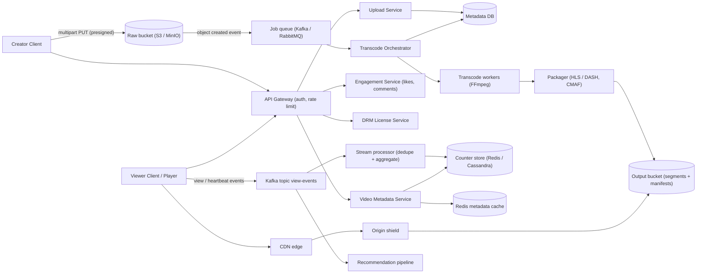
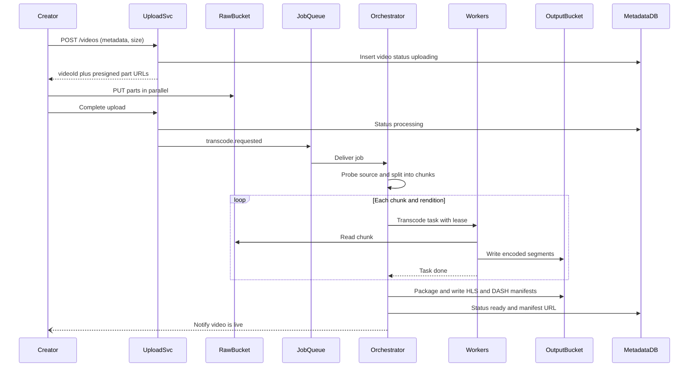

# Video Streaming Platform

> **Reviewed:** 2026-09 · **Scope:** Full-stack (frontend + backend + scalability) · **Level:** Senior / Tech Lead

---

## Overview

Design a video streaming platform like YouTube where users can upload, watch, and interact with videos. The system handles video processing, adaptive streaming, recommendations, and real-time engagement.

---

## 1) Requirements

### Functional Requirements

**Core Features:**
- Video upload with metadata (title, description, tags, thumbnail)
- Video playback with quality options (360p, 720p, 1080p, 4K)
- User channels and subscriptions
- Video search and discovery
- Likes, comments, and views tracking
- Playlists (create, add videos, share)
- Watch history and watch later
- Personalized recommendations
- Trending videos feed

**Advanced Features:**
- Live streaming
- Video editing tools
- Community features (channels, memberships)
- Video analytics for creators
- Monetization features
- Video chapters and timestamps

### Non-Functional Requirements

**Performance:**
- Fast video loading with minimal buffering
- Adaptive bitrate streaming (quality adjusts to network)
- CDN delivery for global reach
- Video processing after upload

**Scalability:**
- Handle 200M+ users
- 1B+ hours watched per day
- Millions of concurrent viewers
- Billions of hours of video content

**User Experience:**
- Responsive design (mobile-first)
- Smooth playback (no buffering)
- Fast search results
- Intuitive navigation

---

## 2) Component Hierarchy

The frontend is a React application for video streaming. Here's the structure:

```
App
├── Layout
│   ├── Header
│   │   ├── Logo
│   │   ├── SearchBar
│   │   ├── UploadButton
│   │   └── UserMenu
│   └── MainContent
├── Pages
│   ├── HomePage
│   │   ├── VideoGrid (recommended videos)
│   │   └── CategoryTabs
│   ├── VideoPlayerPage
│   │   ├── VideoPlayer
│   │   │   ├── VideoElement (HTML5 video with controls)
│   │   │   ├── QualitySelector
│   │   │   ├── PlaybackSpeedSelector
│   │   │   └── FullscreenToggle
│   │   ├── VideoInfo
│   │   │   ├── VideoTitle
│   │   │   ├── VideoMetadata (views, date, channel)
│   │   │   ├── EngagementBar
│   │   │   │   ├── LikeButton (with count)
│   │   │   │   ├── DislikeButton
│   │   │   │   ├── ShareButton
│   │   │   │   └── SaveButton
│   │   │   └── SubscribeButton
│   │   ├── VideoDescription
│   │   ├── CommentSection
│   │   │   ├── CommentList
│   │   │   │   └── CommentItem (with replies)
│   │   │   └── CommentInput
│   │   └── RelatedVideos (sidebar)
│   ├── ChannelPage
│   │   ├── ChannelHeader (banner, avatar, subscribe button)
│   │   ├── ChannelTabs (Videos, Playlists, About)
│   │   └── VideoGrid (channel's videos)
│   ├── SearchPage
│   │   ├── SearchResults
│   │   │   ├── VideoResults
│   │   │   ├── ChannelResults
│   │   │   └── PlaylistResults
│   │   └── Filters (Upload date, Type, Duration)
│   └── UploadPage
│       ├── VideoUploader (drag-and-drop)
│       ├── UploadProgress
│       └── VideoMetadataForm (title, description, tags, thumbnail)
└── SharedComponents
    ├── VideoCard (thumbnail, title, channel, views)
    ├── VideoPlayer
    └── LoadingSpinner
```

### Key Components Explained

**1. VideoPlayer Component**
- HTML5 video player with custom controls
- Adaptive bitrate streaming (HLS or DASH)
- Quality selector (360p, 720p, 1080p, 4K)
- Playback speed control
- Fullscreen support

**2. VideoCard Component**
- Displays video in grid/list
- Shows thumbnail, title, channel, views, date
- Clickable to navigate to video page
- Lazy load thumbnails

**3. CommentSection Component**
- Display comments with replies
- Comment input for new comments
- Like comments functionality
- Sort options (newest, top comments)

**4. VideoUploader Component**
- Drag-and-drop file upload
- Upload progress tracking
- Video metadata form
- Thumbnail selection/upload

**5. EngagementBar Component**
- Like/dislike buttons with counts
- Share button (copy link, social media)
- Save to playlist button
- Subscribe button

---

## 3) Data Models

Here are the key data structures:

```typescript
// Video
interface Video {
  id: string;
  title: string;
  description: string;
  channelId: string;
  channel: Channel;
  thumbnailUrl: string;
  videoUrl: string;  // Master playlist URL for adaptive streaming
  duration: number;  // Seconds
  views: number;
  likes: number;
  dislikes: number;
  commentsCount: number;
  tags: string[];
  category: string;
  isLive: boolean;
  publishedAt: string;
  createdAt: string;
}

// Channel
interface Channel {
  id: string;
  name: string;
  description: string;
  avatarUrl: string;
  bannerUrl: string;
  subscribersCount: number;
  videosCount: number;
  isSubscribed: boolean;
}

// Comment
interface Comment {
  id: string;
  videoId: string;
  userId: string;
  user: User;
  content: string;
  likesCount: number;
  repliesCount: number;
  replies?: Comment[];
  replyToId?: string;
  createdAt: string;
}

// Playlist
interface Playlist {
  id: string;
  name: string;
  description?: string;
  channelId: string;
  videos: PlaylistVideo[];
  isPublic: boolean;
  createdAt: string;
}

// Playlist video
interface PlaylistVideo {
  videoId: string;
  video: Video;
  position: number;  // Order in playlist
  addedAt: string;
}

// Watch history
interface WatchHistory {
  videoId: string;
  video: Video;
  watchedAt: string;
  watchTime: number;  // Seconds watched
  completed: boolean;
}
```

### Data Flow Explanation

**When a user watches a video:**
1. User clicks video card
2. Navigate to VideoPlayerPage
3. Fetch video metadata and streaming URLs
4. Video player loads adaptive streaming playlist
5. Player automatically selects quality based on network
6. Track watch time and update history
7. Increment view count (debounced)

**Video upload flow:**
1. User selects video file
2. Upload video file (chunked for large files)
3. Show upload progress
4. User enters metadata (title, description, tags)
5. Server processes video (transcoding, thumbnail generation)
6. Video appears in channel when processing complete

**Adaptive streaming:**
1. Video is transcoded into multiple qualities
2. Master playlist contains all quality URLs
3. Player selects quality based on network speed
4. Quality switches automatically during playback
5. Better user experience with minimal buffering

---

## 4) API Design

### REST Endpoints

**GET /api/v1/videos**
- Get videos (home feed, recommendations)
- Query params: `page`, `limit`, `category`, `sortBy`
- Returns: Paginated list of Video objects

**GET /api/v1/videos/:id**
- Get video details
- Returns: Video object with full details

**GET /api/v1/videos/:id/stream**
- Get video streaming URLs (adaptive streaming)
- Returns: Streaming URLs for different qualities

**POST /api/v1/videos**
- Upload a video
- Request: Multipart form data with video file and metadata
- Returns: Video object (processing status)

**POST /api/v1/videos/:id/like**
- Like or unlike a video
- Returns: Updated Video with like status

**GET /api/v1/videos/:id/comments**
- Get video comments
- Query params: `page`, `limit`, `sortBy`
- Returns: Paginated list of Comment objects

**POST /api/v1/videos/:id/comments**
- Add a comment
- Request body: `{ content: string, replyToId?: string }`
- Returns: Comment object

**GET /api/v1/channels/:id**
- Get channel details
- Returns: Channel object

**POST /api/v1/channels/:id/subscribe**
- Subscribe or unsubscribe to channel
- Returns: Updated Channel with subscription status

**GET /api/v1/search**
- Search videos, channels, playlists
- Query params: `q` (query), `type`, `page`, `limit`
- Returns: Search results

### API Request/Response Examples

**Get Videos:**
```json
// GET /api/v1/videos?page=1&limit=20&category=gaming
// Response
{
  "success": true,
  "data": {
    "videos": [
      {
        "id": "video_123",
        "title": "Amazing Gameplay",
        "channel": {
          "id": "channel_456",
          "name": "Gaming Channel",
          "avatarUrl": "https://cdn.example.com/avatar.jpg"
        },
        "thumbnailUrl": "https://cdn.example.com/thumb.jpg",
        "duration": 600,
        "views": 1250000,
        "likes": 45000,
        "publishedAt": "2024-01-15T10:00:00Z"
      }
    ],
    "total": 500,
    "page": 1,
    "limit": 20
  }
}
```

**Get Video Streaming URLs:**
```json
// GET /api/v1/videos/video_123/stream
// Response
{
  "success": true,
  "data": {
    "masterPlaylist": "https://cdn.example.com/video_123/master.m3u8",
    "qualities": [
      { "quality": "360p", "url": "https://cdn.example.com/video_123/360p.m3u8" },
      { "quality": "720p", "url": "https://cdn.example.com/video_123/720p.m3u8" },
      { "quality": "1080p", "url": "https://cdn.example.com/video_123/1080p.m3u8" }
    ]
  }
}
```

---

## Key Design Decisions

**1. Adaptive Bitrate Streaming**
- Transcode videos into multiple qualities
- Player selects quality based on network
- Automatic quality switching during playback
- Better experience with minimal buffering

**2. CDN for Video Delivery**
- Serve videos from CDN edge locations
- Faster global delivery
- Reduced server load
- Better scalability

**3. Lazy Loading for Thumbnails**
- Load thumbnails as user scrolls
- Improves initial page load
- Better performance with many videos

**4. Optimistic Updates for Engagement**
- Show likes/comments immediately
- Better perceived performance
- Sync with server state

**5. Infinite Scroll for Feed**
- Load more videos as user scrolls
- Cursor-based pagination
- Smooth scrolling experience

**6. Real-time View Count Updates**
- Debounce view count increments
- Batch updates for efficiency
- Real-time updates via polling or WebSocket

**7. Resumable Direct Uploads**
- Upload large source files directly to object storage with presigned multipart URLs
- Resume from the last completed part after network loss
- The API only creates the upload session and receives the completion call

---

## Backend High-Level Design

Two very different paths: the **upload/processing path** is a batch pipeline optimized for throughput and cost, and the **playback path** is a read-heavy delivery system where the CDN serves almost all bytes.



| Component | Responsibility |
|-----------|----------------|
| Upload Service | Creates upload session, issues presigned multipart URLs to the raw bucket, records metadata |
| Transcode Orchestrator | Splits the source into chunks (e.g., by GOP/scene), fans out tasks per chunk x rendition, tracks completion, retries failures, marks video ready |
| Transcode workers | FFmpeg (or hardware encoders) produce the bitrate ladder (e.g., 240p to 2160p) in H.264/HEVC/AV1. Workers can be Node or Python ([Celery](../backend/celery/index.md)) processes pulling from [RabbitMQ](../backend/rabbitmq/index.md) or Kafka |
| Packager | Segments renditions and writes HLS (`.m3u8`) and DASH (`.mpd`) manifests; CMAF lets one set of fMP4 segments serve both |
| DRM License Service | Issues content keys to authorized players (Widevine, FairPlay, PlayReady) via a multi-DRM provider |
| CDN + origin shield | Caches segments and manifests at the edge; the shield collapses edge misses so the origin sees a fraction of requests |
| View pipeline | Ingests view/heartbeat events, deduplicates, aggregates into counters and watch-time analytics |

**Adaptive bitrate (ABR) in one paragraph:** each rendition is cut into short segments (commonly 2-6 s). The master manifest lists renditions with bandwidth and resolution. The player measures throughput and buffer level and picks the next segment's rendition, so quality adapts mid-stream without rebuffering. HLS is required for native Apple playback; DASH is common elsewhere; CMAF reduces duplicate storage.

**DRM at a high level:** segments are encrypted (CENC / CBCS). The player requests a license from the License Service through the browser's Encrypted Media Extensions (EME) or native platform APIs; the service checks entitlement (subscription, region, concurrent streams) and returns keys. Premium content uses DRM; free user-generated content often uses only signed URLs or tokens.

> **Interview tip:** State early that the CDN serves the bytes. Your origin and API design matter for metadata, auth, and cache misses, not for raw playback throughput.

---

## Data Model and Consistency

```sql
CREATE TABLE videos (
  video_id      BIGINT PRIMARY KEY,
  channel_id    BIGINT NOT NULL,
  title         TEXT NOT NULL,
  description   TEXT,
  status        TEXT NOT NULL,        -- uploading | processing | ready | failed | blocked
  visibility    TEXT NOT NULL,        -- public | unlisted | private
  duration_s    INT,
  source_key    TEXT,                 -- raw bucket object key
  manifest_url  TEXT,                 -- set when ready
  published_at  TIMESTAMPTZ,
  created_at    TIMESTAMPTZ NOT NULL
);
CREATE INDEX idx_videos_channel ON videos (channel_id, published_at DESC);

CREATE TABLE renditions (
  video_id   BIGINT NOT NULL,
  rendition  TEXT NOT NULL,           -- e.g., 720p_h264
  bitrate    INT NOT NULL,
  status     TEXT NOT NULL,
  PRIMARY KEY (video_id, rendition)
);

CREATE TABLE transcode_tasks (
  task_id     TEXT PRIMARY KEY,       -- deterministic: video_id:rendition:chunk_index
  video_id    BIGINT NOT NULL,
  status      TEXT NOT NULL,          -- queued | running | done | failed
  attempts    INT NOT NULL DEFAULT 0,
  lease_until TIMESTAMPTZ             -- worker heartbeat / visibility timeout
);

-- View counts: approximate, sharded counters, not a row per view in OLTP.
-- counter key: views:{video_id}:{shard 0..N-1}
```

**Partitioning:**
- `videos` and `renditions` partition by `video_id`; channel listing uses a secondary index or a denormalized per-channel table.
- Comments partition by `video_id` with time-ordered clustering (wide-column stores fit well).
- View counters are **sharded per video** (N sub-counters summed on read) so a viral video does not create a single hot key.

**Consistency trade-offs:**
- Video status and visibility need strong consistency: a private or blocked video must never be served. Check at manifest/license issuance, not only in the UI.
- View counts, likes, and recommendations are **eventually consistent**; showing a slightly stale count is acceptable.
- Publish only when the minimum rendition set is ready (e.g., 360p + 720p); higher renditions can appear later.
- Segments are immutable, so they can be cached aggressively (long TTL). Manifests of live streams change constantly and need short TTLs.

**Idempotency:**
- Transcode task IDs are deterministic (`video_id:rendition:chunk`) and outputs have deterministic keys, so retries overwrite the same object instead of creating duplicates.
- Workers take a lease; if a worker dies, the lease expires and another picks up the task.
- View events carry an event ID; the stream processor deduplicates within a window.

**View counting:**
- Count a view only after a minimum watch threshold, deduplicated per `(viewer or session, video)` within a time window, with bot/abuse filtering.
- Pipeline: player heartbeat -> Kafka -> stream processor (windowed dedupe + count) -> increment sharded counters -> periodic flush to durable analytics store. Display the rounded value from cache.

---

## Scalability and Reliability

### Back-of-envelope estimate

> **ILLUSTRATIVE assumptions** (not real-world figures): 100,000 uploads/day, average 10 minutes each, source bitrate 10 Mbps, 5 renditions, transcode cost 2 CPU-minutes per minute of video per rendition, output ladder totals 60% of source size, 1M concurrent viewers at peak, 3 Mbps average delivered bitrate, 95% CDN cache hit ratio.

**Ingest storage:**
- Source size per minute: 10 Mbps x 60 s = 600 Mb = **75 MB/min**
- Per video: 75 MB x 10 = **750 MB**; per day: 100,000 x 750 MB = **75 TB/day raw**
- Output ladder: 75 TB x 0.6 = **45 TB/day** of renditions (raw can move to a cold tier after processing)

**Transcode compute:**
- Video minutes/day: 100,000 x 10 = **1,000,000 min**
- CPU-minutes/day: 1,000,000 x 5 renditions x 2 = **10,000,000 CPU-min**
- Average cores busy: 10,000,000 / 1,440 min = **~6,944 cores** continuously; peaks need more, which is why autoscaling (and spot/preemptible capacity with retries) matters

**Delivery:**
- Peak egress: 1,000,000 x 3 Mbps = **3 Tbps**
- Origin egress at 95% hit ratio: 3 Tbps x 0.05 = **150 Gbps**; an origin shield reduces this further
- Segment requests at 4 s segments: 1,000,000 / 4 = **250,000 requests/s** at the edge

**View events:**
- Heartbeat every 30 s for 1M viewers: 1,000,000 / 30 = **~33,000 events/s** into Kafka, fine for a partitioned topic

### Bottlenecks and fixes

| Bottleneck | Fix |
|-----------|-----|
| Transcoding a long video serially | Split into chunks and transcode in parallel, then stitch |
| Popular-video cache miss storms | Origin shield, request collapsing at the CDN, pre-warm for scheduled premieres |
| Hot counter key for viral video | Sharded counters, batched increments in the stream processor |
| Compute cost of the full ladder for every upload | Per-title or content-aware encoding; transcode higher renditions lazily for low-view videos |
| Storage growth | Lifecycle rules: raw to cold tier, delete unused renditions for long-tail content |
| Metadata reads on every play | Cache video metadata in Redis and at the CDN for public videos |

### Failure modes

| Failure | Impact | Mitigation |
|---------|--------|-----------|
| Transcode worker crash | Task stalls | Lease expiry and retry; deterministic output keys make retries safe |
| Corrupt or unsupported source file | Job fails repeatedly | Probe (ffprobe) before fan-out, cap retries, mark failed and notify creator |
| Queue backlog after upload spike | Long processing delay | Autoscale on queue depth, prioritize short videos and partner content |
| CDN region degraded | Buffering for a region | Multi-CDN with steering based on real-user metrics |
| Origin bucket unavailable | Cache misses fail | Cross-region replication, shield serves stale where allowed |
| License service down | DRM content unplayable | Multi-AZ deployment, cache licenses with rental durations, graceful error in player |
| Bot-inflated views | Wrong counts, monetization fraud | Dedupe windows, anomaly detection, delayed "verified" counts |

### Key flow: upload to playable



---

## Deep Dive Options (RADIO)

<details>
<summary>Deep dive 1: Transcoding pipeline</summary>

- **Requirements:** Short videos playable within minutes, long videos processed in parallel, tolerant of worker loss, cost-aware.
- **Architecture:** Event on raw object -> orchestrator (a workflow engine or a state machine in the DB) -> chunked fan-out to a worker pool -> packager -> publish. Workers are stateless and autoscaled; spot capacity is fine because tasks are retriable.
- **Data model:** `transcode_tasks` with deterministic IDs, status, attempts, and lease; `renditions` per video.
- **Interface:** Internal: `transcode.requested`, `transcode.task.completed`, `video.ready` events. External: `GET /videos/:id` exposes `status` for the creator UI.
- **Optimizations:** Publish with a minimal ladder first, per-title encoding, hardware encoders for popular codecs, skip renditions above the source resolution.

</details>

<details>
<summary>Deep dive 2: Adaptive delivery and CDN strategy</summary>

- **Requirements:** Fast start (low time-to-first-frame), minimal rebuffering, global reach, protected premium content.
- **Architecture:** Player -> CDN edge -> origin shield -> output bucket. Multi-CDN with steering for resilience. DRM license service for premium content; signed tokens for everything else.
- **Data model:** Immutable segment keys like `videos/{id}/{rendition}/{segment}.m4s`; manifests per video (and per region if geo-restricted).
- **Interface:** `GET /api/v1/videos/:id/stream` returns the master manifest URL plus a short-lived token; the player fetches from the CDN directly.
- **Optimizations:** Start with a lower rendition for quick startup, short first segments, prefetch the next video's first segment in feeds, long cache TTLs for segments, short TTLs for live manifests.

</details>

<details>
<summary>Deep dive 3: View counting at scale</summary>

- **Requirements:** Near-real-time counts, abuse resistance, no hot-key meltdown on viral videos, accurate numbers for monetization later.
- **Architecture:** Heartbeats to Kafka partitioned by `video_id`; stream processor dedupes per session within a window and writes batched increments to sharded counters; a batch job reconciles authoritative counts.
- **Data model:** `views:{video_id}:{shard}` counters; daily aggregates in an analytics store.
- **Interface:** `POST /api/v1/videos/:id/heartbeat { sessionId, positionS }`; counts read from `GET /videos/:id`.
- **Optimizations:** Approximate distinct counting (HyperLogLog) for unique viewers, client-side batching of heartbeats, delay public count updates for suspicious spikes.

</details>

---

## Scaling with AI and Agentic Workflows

See [agentic workflows](../agentic-workflows/index.md) and [AI-assisted development](../ai/ai-assisted-development/index.md).

**Engineering workflows:**
- **Brainstorm bottlenecks, then validate with math.** Ask an agent what breaks at "3 Tbps peak, 250k segment requests/s," then check the answers against the estimates above and real CDN logs.
- **Generate load tests for review.** An agent can draft a script that simulates players (manifest fetch, segment fetches at the segment cadence, heartbeats) against a staging CDN config. Review the request rate and target before running; accidental load on a production CDN costs real money.
- **Summarize metrics and traces for RCA.** Feed player QoE metrics (startup time, rebuffer ratio) grouped by CDN, region, and device to an assistant to spot the outlier segment; confirm with raw data.
- **Draft runbooks and IaC.** Agents can draft autoscaling policies for transcode workers, bucket lifecycle rules, and a multi-CDN failover runbook for review (see [DevOps](../devops/index.md)).

**Product AI features:**

| Feature | Value | Latency / cost / data trade-off |
|---------|-------|--------------------------------|
| Auto-tagging and chapter generation | Better search and navigation | Runs async after transcode; GPU cost per minute of video, so prioritize videos that get views |
| Thumbnail selection | Higher click-through | Score candidate frames offline; A/B test, and let creators override |
| Content moderation (nudity, violence, copyright match) | Safety and legal compliance | Block publish or limit visibility until checks pass for high-risk categories; false positives need a human appeal path |
| Captions and translation (speech-to-text) | Accessibility and reach | Costly for long videos; generate on publish for popular channels, on demand otherwise |
| Recommendations | Watch time and discovery | Two-stage (candidate generation + ranking) models, offline features plus real-time signals; privacy review for watch history |

**Human approval required for:**
- Takedowns and strikes against creators beyond automated low-risk actions
- Changes to moderation thresholds and recommendation objectives
- Transcoding ladder or codec changes that affect storage cost or device compatibility
- Running generated load tests against a production CDN

**Do not trust AI for:**
- Final moderation decisions on borderline or appealed content
- DRM key handling or entitlement logic
- Cost projections not derived from your bitrate, storage, and egress numbers
- Claims that a recommendation change is better without offline metrics and an A/B test

---

## Interview Talking Points

**When explaining this system, I'd focus on:**

1. **Requirements First**: Start with core functionality - upload videos, watch videos, subscriptions, engagement

2. **Component Structure**: Explain the React component hierarchy - video player, video cards, comments, channels

3. **Data Models**: Walk through Video, Channel, Comment, Playlist - and how they support the platform

4. **API Design**: Show the REST endpoints - videos, streaming, comments, channels, search

5. **Key Challenges**: 
   - Adaptive bitrate streaming for different network conditions
   - Video processing and transcoding
   - CDN delivery for global reach
   - Handling millions of concurrent viewers
   - Real-time engagement updates

**Example explanation flow:**
> "So for a video streaming platform, the core requirement is allowing users to upload and watch videos. The frontend is a React app with a video player component that uses adaptive bitrate streaming - videos are transcoded into multiple qualities (360p, 720p, 1080p), and the player automatically selects the best quality based on the user's network speed. The data model centers around Video objects with metadata, Channel objects for creators, and Comment objects for engagement. Videos are delivered through a CDN for fast global access. The main API endpoints handle video upload (with processing), video playback (with streaming URLs), comments, subscriptions, and search. Key challenges include adaptive streaming for different network conditions, video processing and transcoding after upload, CDN delivery for scalability, and handling millions of concurrent viewers during popular videos."

**Full-stack extension:**
> "On the backend, creators upload directly to a raw bucket with presigned multipart URLs. An object-created event triggers an orchestrator that splits the source into chunks and fans out transcode tasks to autoscaled FFmpeg workers, with deterministic task IDs so retries are safe. A packager writes HLS and DASH manifests, and the video is published once a minimum ladder is ready. Playback bytes come from the CDN through an origin shield; the API only issues manifest URLs, tokens, and DRM licenses. Views flow through Kafka into a stream processor that dedupes and writes sharded counters."

### Follow-up Questions

1. **HLS vs DASH?** HLS is needed for native Apple playback; DASH is an open standard common elsewhere. CMAF lets both share one set of segments.
2. **How do you make short videos available quickly?** Publish after the minimum renditions are ready, transcode chunks in parallel, and prioritize short jobs in the queue.
3. **What segment length would you choose?** Shorter segments adapt faster and start faster but add request overhead; a few seconds is a common middle ground. Live low-latency uses partial segments.
4. **How do you count views without a hot key?** Aggregate in a stream processor, write batched increments to sharded counters, and sum on read.
5. **How do you protect premium content?** Encrypt segments, issue licenses only to entitled sessions through EME/native DRM, and use short-lived signed URLs.
6. **What happens when a worker dies mid-transcode?** Its lease expires; the task is retried by another worker and overwrites the same deterministic output key.
7. **How do you handle a scheduled premiere with a huge audience?** Pre-warm CDN caches, use an origin shield and multi-CDN, and rate-limit metadata/API endpoints separately from delivery.

### Common Mistakes

- Serving video bytes from application servers instead of the CDN
- Transcoding synchronously in the upload request
- Writing one database row per view or incrementing a single counter row
- Checking visibility/blocked status only in the frontend
- Using the same cache TTL for immutable segments and changing live manifests
- Ignoring egress cost, which usually dominates the bill
- Forgetting a dead-letter path for corrupt uploads

---

## References

- Apple, *HTTP Live Streaming*: https://developer.apple.com/streaming/
- IETF RFC 8216, *HTTP Live Streaming*: https://datatracker.ietf.org/doc/html/rfc8216
- DASH Industry Forum: https://dashif.org/
- W3C, *Encrypted Media Extensions*: https://www.w3.org/TR/encrypted-media/
- FFmpeg Documentation: https://ffmpeg.org/documentation.html
- Amazon S3, *Uploading and copying objects using multipart upload*: https://docs.aws.amazon.com/AmazonS3/latest/userguide/mpuoverview.html
- Related case studies: [File Storage System](./03-file-storage-system.md), [Search System](./02-search-system.md), [Social Media Feed](./07-social-media-feed.md)

