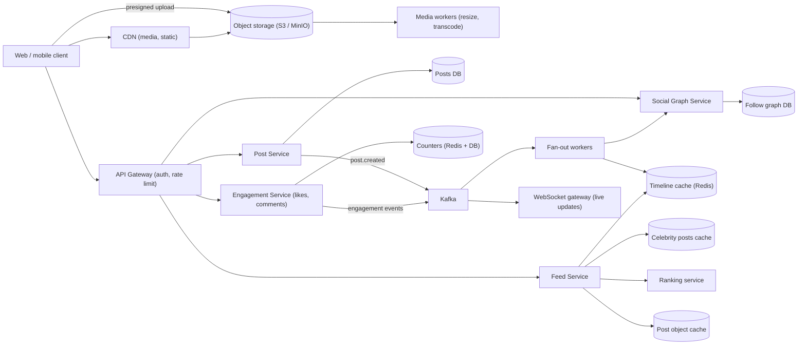
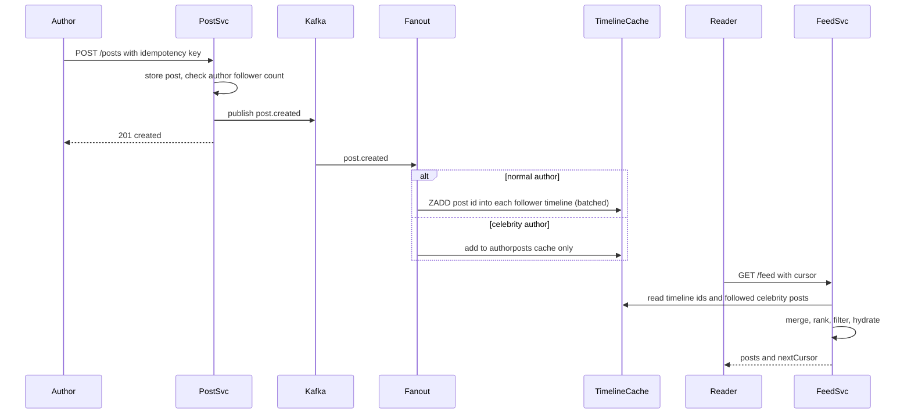

# Social Media Feed

> **Reviewed:** 2026-09 · **Scope:** Full-stack (frontend + backend + scalability) · **Level:** Senior / Tech Lead

---

## Overview

Design a social media feed system where users can create posts, follow other users, and view personalized content feeds in real-time. The system handles likes, comments, shares, and real-time engagement updates.

---

## 1) Requirements

### Functional Requirements

**Core Features:**
- User registration and authentication
- Create posts (text, images, videos)
- Follow/unfollow users
- Personalized feed (posts from followed users)
- Like, comment, and share posts
- User profiles with followers/following
- Real-time updates (likes, comments appear instantly)
- Hashtag support and trending topics
- Search (users, posts, hashtags)
- Explore feed (discover new content)

**Advanced Features:**
- Video posts
- Story feature (24-hour posts)
- Save posts
- Post editing and deletion
- Comment replies and threads
- Message reactions
- Notifications for interactions

### Non-Functional Requirements

**Performance:**
- Feed loading: < 1 second
- Smooth infinite scroll
- Optimized media (images, videos)
- Real-time updates: < 500ms latency

**Scalability:**
- Handle millions of users
- Billions of posts
- Thousands of concurrent real-time connections
- Traffic spikes (viral posts)

**User Experience:**
- Responsive design (mobile-first)
- Fast interactions (instant likes)
- Intuitive UI
- Accessible interface

---

## 2) Component Hierarchy

The frontend is a React application for social media. Here's the structure:

```
App
├── Layout
│   ├── Header
│   │   ├── Logo
│   │   ├── SearchBar
│   │   ├── NotificationBell
│   │   └── UserMenu
│   └── MainContent
├── Pages
│   ├── FeedPage
│   │   ├── PostComposer
│   │   │   ├── TextInput
│   │   │   ├── ImageUpload
│   │   │   └── PostButton
│   │   └── FeedList
│   │       └── PostCard
│   │           ├── UserHeader (avatar, name, time)
│   │           ├── PostContent (text, images, video)
│   │           ├── EngagementBar
│   │           │   ├── LikeButton (with count)
│   │           │   ├── CommentButton (with count)
│   │           │   ├── ShareButton
│   │           │   └── SaveButton
│   │           └── CommentSection
│   │               ├── CommentList
│   │               │   └── CommentItem (with replies)
│   │               └── CommentInput
│   ├── ExplorePage
│   │   ├── TrendingHashtags
│   │   └── ExploreFeed (trending posts)
│   ├── ProfilePage
│   │   ├── ProfileHeader (avatar, bio, followers/following)
│   │   ├── FollowButton
│   │   └── PostGrid (user's posts)
│   └── PostDetailPage
│       └── PostCard (full post with all comments)
└── SharedComponents
    ├── UserAvatar
    ├── LikeButton
    ├── CommentInput
    └── ImageViewer
```

### Key Components Explained

**1. FeedList Component**
- Displays personalized feed
- Infinite scroll for pagination
- Real-time updates via WebSocket
- Optimistic updates for likes/comments

**2. PostCard Component**
- Individual post display
- Shows user info, content, engagement
- Like button with real-time count updates
- Comment section with replies
- Share and save functionality

**3. PostComposer Component**
- Create new posts
- Text input with character count
- Image/video upload
- Preview before posting
- Post button with validation

**4. CommentSection Component**
- Display comments with replies
- Comment input for new comments
- Real-time comment updates
- Like comments functionality

**5. EngagementBar Component**
- Like, comment, share, save buttons
- Real-time count updates
- Optimistic updates for instant feedback

---

## 3) Data Models

Here are the key data structures:

```typescript
// User
interface User {
  id: string;
  username: string;
  name: string;
  avatar?: string;
  bio?: string;
  followersCount: number;
  followingCount: number;
  postsCount: number;
  isFollowing: boolean;
}

// Post
interface Post {
  id: string;
  userId: string;
  user: User;
  content: string;
  media?: Media[];
  hashtags: string[];
  likesCount: number;
  commentsCount: number;
  sharesCount: number;
  isLiked: boolean;
  isSaved: boolean;
  createdAt: string;
  location?: string;
}

// Media (image or video)
interface Media {
  id: string;
  type: "image" | "video";
  url: string;
  thumbnailUrl?: string;  // For videos
}

// Comment
interface Comment {
  id: string;
  postId: string;
  userId: string;
  user: User;
  content: string;
  likesCount: number;
  repliesCount: number;
  replies?: Comment[];  // Nested replies
  replyToId?: string;  // If this is a reply
  createdAt: string;
}

// Feed response
interface FeedResponse {
  posts: Post[];
  hasMore: boolean;
  nextCursor?: string;
}

// Like/Unlike request
interface LikeRequest {
  postId: string;
  isLiked: boolean;
}
```

### Data Flow Explanation

**When a user creates a post:**
1. User enters content in PostComposer
2. Optional: Upload images/videos
3. Extract hashtags from content
4. Submit post: POST /api/v1/posts
5. Optimistic update: post appears in feed immediately
6. On success, post is saved; on failure, rollback

**When a user likes a post:**
1. User clicks like button
2. Optimistic update: like count increments, button shows liked
3. API call: POST /api/v1/posts/:id/like
4. WebSocket broadcasts like to all connected clients
5. Other users see updated like count in real-time

**Feed generation:**
1. Fetch posts from followed users
2. Sort by engagement and recency
3. Paginate with cursor-based pagination
4. Infinite scroll loads more posts
5. Real-time updates via WebSocket for new posts

**Real-time updates:**
1. WebSocket connection per user
2. Server broadcasts new posts, likes, comments
3. Frontend receives updates and updates UI
4. Optimistic updates for instant feedback
5. Sync with server state

---

## 4) API Design

### REST Endpoints

**GET /api/v1/feed**
- Get personalized feed
- Query params: `cursor`, `limit`
- Returns: FeedResponse with posts

**POST /api/v1/posts**
- Create a post
- Request body: `{ content: string, media?: Media[], hashtags?: string[] }`
- Returns: Post object

**GET /api/v1/posts/:id**
- Get post details
- Returns: Post object with full details

**POST /api/v1/posts/:id/like**
- Like or unlike a post
- Returns: Updated Post with like status

**GET /api/v1/posts/:id/comments**
- Get post comments
- Query params: `page`, `limit`
- Returns: Paginated list of Comment objects

**POST /api/v1/posts/:id/comments**
- Add a comment
- Request body: `{ content: string, replyToId?: string }`
- Returns: Comment object

**GET /api/v1/users/:id**
- Get user profile
- Returns: User object

**POST /api/v1/users/:id/follow**
- Follow or unfollow a user
- Returns: Updated User with follow status

**GET /api/v1/explore**
- Get explore feed (trending posts)
- Query params: `cursor`, `limit`
- Returns: FeedResponse

**GET /api/v1/hashtags/:tag/posts**
- Get posts by hashtag
- Query params: `cursor`, `limit`
- Returns: FeedResponse

### WebSocket Events

**Connection:** `wss://api.example.com/feed`

**Events:**
- `new_post` - New post from followed user
- `post_liked` - Post was liked
- `comment_added` - New comment on post
- `user_followed` - User followed someone

**Message Format:**
```json
{
  "type": "post_liked",
  "data": {
    "postId": "post_123",
    "likesCount": 1250,
    "userId": "user_456"
  }
}
```

### API Request/Response Examples

**Get Feed:**
```json
// GET /api/v1/feed?cursor=abc123&limit=20
// Response
{
  "success": true,
  "data": {
    "posts": [
      {
        "id": "post_123",
        "userId": "user_456",
        "user": {
          "id": "user_456",
          "username": "johndoe",
          "name": "John Doe",
          "avatar": "https://cdn.example.com/avatar.jpg"
        },
        "content": "Check out this amazing sunset! #sunset #photography",
        "media": [
          {
            "type": "image",
            "url": "https://cdn.example.com/sunset.jpg"
          }
        ],
        "hashtags": ["sunset", "photography"],
        "likesCount": 1250,
        "commentsCount": 45,
        "isLiked": false,
        "createdAt": "2024-01-15T10:00:00Z"
      }
    ],
    "hasMore": true,
    "nextCursor": "xyz789"
  }
}
```

**Like Post:**
```json
// POST /api/v1/posts/post_123/like
// Response
{
  "success": true,
  "data": {
    "id": "post_123",
    "likesCount": 1251,
    "isLiked": true
  }
}
```

---

## 5) Key Design Decisions

**1. Optimistic Updates**
- Show likes/comments immediately (useOptimistic)
- Better perceived performance
- Rollback if API fails
- Instant user feedback

**2. Infinite Scroll**
- Cursor-based pagination
- Load more posts as user scrolls
- Smooth scrolling experience
- Efficient for large feeds

**3. Real-time Updates via WebSocket**
- Instant updates for likes, comments, new posts
- Low latency (< 500ms)
- Better user experience
- Auto-reconnect on connection loss

**4. Feed Generation Strategy**
- Personalized feed from followed users
- Sort by engagement and recency
- Cache feed for performance
- Real-time updates for new posts

**5. Media Optimization**
- Lazy load images and videos
- Use CDN for fast delivery
- Thumbnails for videos
- Responsive images

**6. Hashtag Extraction**
- Extract hashtags from post content
- Link hashtags to hashtag feeds
- Trending hashtags algorithm
- Search by hashtag

**7. Next.js App Router Considerations**
- Render the first page of the feed in a Server Component (fast first paint, no client waterfall), then hydrate a client component for infinite scroll and optimistic likes
- Stream slower sections (suggested users, trending) with Suspense boundaries
- Personalized feeds are per-user, so avoid caching them in a shared CDN layer; public profile pages and hashtag pages can be cached with revalidation

---

## 6) Backend High-Level Design

The central problem is **timeline assembly**: given a user, quickly return the most relevant recent posts from the accounts they follow.



**Components**

| Component | Responsibility | Notes |
|-----------|----------------|-------|
| Post Service | Create/read posts, extract hashtags, publish `post.created` | Posts are immutable-ish; edits create versions |
| Media pipeline | Client uploads directly to object storage via presigned URL; workers generate sizes/thumbnails | [MinIO](../backend/minio/index.md) or S3 behind a CDN |
| Social Graph Service | `followers(user)`, `following(user)`, follow/unfollow | Adjacency lists, sharded by user |
| Fan-out workers | On new post, push post ID into followers' timeline caches | Consume from Kafka; see [Messaging Systems](../backend/architecture/05-messaging-systems.md) |
| Timeline cache | Per-user list of recent post IDs (Redis sorted set or list) | Capped length |
| Feed Service | Merge precomputed timeline + celebrity posts, rank, hydrate, paginate | The read path |
| Ranking service | Score candidates (recency, affinity, engagement) | Starts as heuristic, can become ML |
| Engagement Service | Likes, comments, counters | High write rate on viral posts |

### Fan-out on write vs fan-out on read

| | Fan-out on write (push) | Fan-out on read (pull) |
|--|--|--|
| When work happens | At post time: write post ID to every follower's timeline | At read time: fetch recent posts from everyone you follow and merge |
| Read latency | Very fast (timeline precomputed) | Slower, many lookups per read |
| Write cost | Proportional to follower count (celebrity problem) | Constant per post |
| Wasted work | Writes timelines for inactive users | None |
| Freshness | Slight delay while fan-out runs | Always fresh |

**Hybrid (the usual answer):**
- Normal accounts (followers below a threshold, e.g., 10,000 as an illustrative choice): fan-out on write.
- Celebrity accounts (above threshold): **do not** fan out. Their recent posts are kept in a per-author cache, and the Feed Service pulls them at read time for users who follow them, then merges.
- Skip fan-out to users inactive for N days; rebuild their timeline lazily on next login (fan-out on read for them).

### Ranking

1. **Candidate generation:** timeline cache IDs + celebrity posts + optionally recommended/explore posts.
2. **Feature fetch:** author affinity, post age, engagement counts, media type.
3. **Scoring:** start with a transparent heuristic (e.g., weighted recency and engagement decay); move to an ML model when you have logged impressions and outcomes.
4. **Post-processing:** dedupe, diversity rules (not 5 posts in a row from one author), remove blocked/muted, policy filters.

---

## 7) Data Model and Consistency

**Schema sketch**

```sql
CREATE TABLE posts (
  post_id     BIGINT PRIMARY KEY,     -- Snowflake-style, time-sortable
  author_id   BIGINT NOT NULL,
  content     TEXT,
  media       JSONB,                  -- object keys, dimensions, blurhash
  visibility  TEXT,
  created_at  TIMESTAMPTZ NOT NULL,
  deleted_at  TIMESTAMPTZ NULL
);
CREATE INDEX idx_posts_author_time ON posts (author_id, post_id DESC);

CREATE TABLE follows (
  follower_id BIGINT, followee_id BIGINT, created_at TIMESTAMPTZ,
  PRIMARY KEY (follower_id, followee_id)
);
-- Reverse edge for "who follows X" (fan-out)
CREATE TABLE followers (
  followee_id BIGINT, follower_id BIGINT, created_at TIMESTAMPTZ,
  PRIMARY KEY (followee_id, follower_id)
);

CREATE TABLE likes (
  post_id BIGINT, user_id BIGINT, created_at TIMESTAMPTZ,
  PRIMARY KEY (post_id, user_id)       -- natural idempotency: like twice = one row
);

CREATE TABLE post_counters (
  post_id BIGINT PRIMARY KEY, likes BIGINT, comments BIGINT, shares BIGINT
);
```

Timeline cache (Redis):
- `timeline:{userId}` as a sorted set of `postId` scored by `postId` (time-sortable), trimmed to the latest N entries (e.g., 800, illustrative).
- `authorposts:{authorId}` for celebrity recent posts.
- `post:{postId}` hash for hydrated post objects.

**Partitioning**
- `posts`: shard by `post_id` (even distribution) with a secondary author index, or by `author_id` (keeps an author's posts together, but celebrities create hot shards). Many designs choose `post_id` plus a separate author-timeline table.
- `follows`/`followers`: shard by the first key column so each list is a single-shard range scan.
- Timeline cache: shard by `user_id`.

**Cursor pagination**
- Cursor = opaque, encoded `(score, postId)` of the last item returned, not an offset. New posts arriving at the top do not shift pages, avoiding duplicates and gaps.
- For ranked feeds, snapshot the ranked candidate list per session (short TTL) and paginate through the snapshot; otherwise re-ranking between pages causes duplicates.

**Consistency trade-offs**
- **Eventual consistency** is acceptable for timelines: a follower seeing a post a few seconds late is fine.
- **Read-your-writes for the author:** the author must see their own post immediately. The Feed Service merges the author's own recent posts from the posts DB/cache, independent of fan-out progress.
- **Counters** are approximate and eventually consistent (buffered increments). The `likes` table is the source of truth for "did I like this".
- **Deletes and blocks** must propagate: filter at read time (check deleted/blocked set during hydration) rather than trying to remove from every timeline synchronously.

**Idempotency**
- Likes use the `(post_id, user_id)` primary key, so retries are harmless; unlike deletes the row.
- `POST /posts` accepts a client-generated idempotency key so a retry on a flaky mobile network does not create two posts.
- Fan-out workers use `ZADD` (set semantics), so reprocessing an event does not duplicate timeline entries.

---

## 8) Scalability and Reliability

### Back-of-envelope estimate

> All numbers below are **ILLUSTRATIVE ASSUMPTIONS** for practice.

| Assumption | Value |
|------------|-------|
| Daily active users | 100M |
| Posts per DAU per day | 0.5 |
| Average followers per author (non-celebrity) | 200 |
| Feed loads per DAU per day | 10 |
| Peak-to-average | 3x |
| Timeline cache length | 800 post IDs × 8 bytes |

Arithmetic:
- Posts: 100M × 0.5 = 50M/day ÷ 86,400 ≈ **580 posts/s**, ≈ 1,740/s peak.
- Fan-out writes: 50M × 200 = 10B timeline inserts/day ÷ 86,400 ≈ **116,000 inserts/s** average. This is why fan-out is async and why celebrities are excluded.
- Feed reads: 100M × 10 = 1B/day ÷ 86,400 ≈ **11,600 reads/s**, ≈ 35,000/s peak.
- Timeline cache: 100M users × 800 × 8 B ≈ **640 GB** of raw IDs (more with Redis overhead), so a sharded Redis cluster; caching only active users reduces this.
- A single celebrity with 50M followers would mean 50M writes for one post with pure fan-out on write, which motivates the hybrid model.

### Bottlenecks and how to remove them

| Bottleneck | Fix |
|------------|-----|
| Celebrity fan-out | Hybrid: pull celebrity posts at read time |
| Hot post counters (viral likes) | Buffer increments in Redis and flush in batches, sharded counters |
| Feed hydration (N post lookups) | Multi-get from post cache, batch misses to DB |
| Timeline cache memory | Cap length, only keep active users, rebuild lazily |
| Ranking latency | Precompute features, limit candidates (e.g., top few hundred), cache ranked page for session |
| Media bandwidth | CDN, responsive image sizes, lazy loading |
| Abuse (spam posting) | Rate limiting per user, spam classifiers async |

### Failure modes

| Failure | Impact | Mitigation |
|---------|--------|------------|
| Fan-out workers lag | New posts appear late | Autoscale on consumer lag; author read-your-writes merge hides it for the author |
| Timeline cache shard lost | Empty feeds for some users | Rebuild on read from follows + recent posts (fan-out on read fallback) |
| Ranking service down | Feed fails | Fall back to reverse-chronological order |
| Viral post overloads engagement service | Like errors, slow feed | Counter buffering, rate limits, degrade live counts to periodic refresh |
| Kafka partition hot | Uneven lag | Partition by `author_id` hash with enough partitions; isolate celebrity events |
| Deleted/blocked content still in timelines | Policy/privacy violation | Read-time filtering during hydration |

### Most important flow: post creation and feed read (hybrid)



---

## 9) Deep Dive Options (RADIO)

<details>
<summary>Deep dive 1: Hybrid fan-out and the celebrity problem</summary>

- **Requirements:** Feed p99 read latency low, post visible to followers within seconds, no write storm for celebrity posts.
- **Architecture:** Fan-out workers for normal authors; per-author cache for celebrities merged at read time.
- **Data model:** `timeline:{userId}` sorted sets; `authorposts:{authorId}`; `followers` table sharded by followee.
- **Interface:** `GET /feed?cursor&limit`; internal `GetFollowedCelebrities(userId)`.
- **Optimizations:** Threshold tuning, skip inactive followers, batch `ZADD` pipelines.

</details>

<details>
<summary>Deep dive 2: Ranking and pagination consistency</summary>

- **Requirements:** Relevant ordering, no duplicates across pages, fallback when ranking is unavailable.
- **Architecture:** Candidate generation, feature store, scorer, post-processing; session snapshot of ranked IDs.
- **Data model:** `feed_session:{sessionId}` list with TTL; impression logs for training.
- **Interface:** Opaque cursor encoding session ID and offset in snapshot.
- **Optimizations:** Cap candidate count, cache features, async model updates.

</details>

<details>
<summary>Deep dive 3: Engagement counters on viral posts</summary>

- **Requirements:** Likes accepted at high rate on a single post, approximate live counts fine.
- **Architecture:** Engagement Service writes `likes` rows, increments Redis counter, flushes to `post_counters` periodically.
- **Data model:** `likes (post_id, user_id)` PK; sharded counter keys `likes:{postId}:{shard}`.
- **Interface:** `POST /posts/:id/like` idempotent; WebSocket pushes throttled count updates.
- **Optimizations:** Coalesce live updates (at most one count broadcast per second per post).

</details>

---

## 10) Scaling with AI and Agentic Workflows

See [Agentic Workflows](../agentic-workflows/index.md) and [AI-Assisted Development](../ai/ai-assisted-development/index.md).

**Where AI and agents help in engineering**
- **Brainstorm bottlenecks, then validate:** ask for risks in the fan-out design, then verify with the arithmetic above (for example, the 116,000 inserts/s figure) and consumer-lag metrics.
- **Generate load tests for review:** k6 or Locust scripts with a realistic follower distribution (many small accounts, a few very large ones) and feed read/write mix; a human validates the distribution and targets.
- **Summarize production signals:** summarize Kafka consumer lag, Redis memory, and feed latency traces to accelerate RCA.
- **Draft migration plans:** e.g., moving from fan-out on read to hybrid, or resharding the timeline cache, including dual-write and backfill steps for design review.
- **Draft runbooks and manifests:** timeline cache rebuild runbook, HPA configs for fan-out workers, Terraform for Redis clusters (see [DevOps](../devops/index.md)).

**AI in the product**
- **Feed ranking:** ML ranking is the classic use case. Trade-offs: needs impression and engagement logging (data volume and privacy), ranking latency must fit the feed budget, and models can optimize for engagement at the expense of user well-being, so define guardrail metrics. Start with a heuristic and add ML once logging exists.
- **Spam and abuse detection:** classifiers on posts, links, and account behavior run asynchronously after posting, with a fast path for known bad patterns; false positives need an appeal flow.
- **Content understanding:** image/text embeddings for topic tagging and recommendations; batch compute is far cheaper than per-request inference.

**Human approval required for**
- Ranking model launches and objective changes (A/B test with guardrails)
- Moderation policy changes and bulk takedowns
- Resharding or cache migrations in production
- Applying generated Terraform/Kubernetes changes

**Do not trust AI for**
- Final moderation decisions on borderline or high-impact content without human review
- Estimating traffic or follower distributions without real data
- Claiming a ranking change is "better" without controlled experiments
- Privacy decisions about which user signals may be used for ranking

---

## 11) Interview Talking Points

**When explaining this system, I'd focus on:**

1. **Requirements First**: Start with core functionality - create posts, follow users, personalized feed, real-time engagement

2. **Component Structure**: Explain the React component hierarchy - feed list, post card, post composer, comment section

3. **Data Models**: Walk through Post, User, Comment - and how they support the feed and engagement features

4. **API Design**: Show the REST endpoints and WebSocket protocol - feed, posts, likes, comments, real-time updates

5. **Key Challenges**: 
   - Real-time updates with low latency
   - Feed generation and personalization
   - Handling viral posts and traffic spikes
   - Optimistic updates for instant feedback
   - Infinite scroll with efficient pagination

**Example explanation flow:**
> "So for a social media feed, the core requirement is allowing users to create posts, follow others, and see a personalized feed. The frontend is a React app with a feed list component that displays posts from followed users. Users can like, comment, and share posts, with real-time updates via WebSocket so changes appear instantly. The data model centers around Post objects with content, media, engagement counts, and User objects with profile information. When a user likes a post, we use optimistic updates to show the like immediately, then sync with the server. The feed uses infinite scroll with cursor-based pagination for efficient loading. Real-time updates are delivered via WebSocket for likes, comments, and new posts. Key challenges include generating personalized feeds efficiently, handling real-time updates at scale, and managing traffic spikes when posts go viral."

### Follow-up Questions

1. **Fan-out on write or read?** Hybrid: push for normal accounts, pull for celebrities above a follower threshold, and lazy rebuild for inactive users.
2. **How does the author see their own post immediately?** The Feed Service merges the author's own recent posts at read time, independent of fan-out progress (read-your-writes).
3. **Why cursor pagination instead of offset?** New posts shift offsets and cause duplicates/gaps; a cursor anchored on `(score, postId)` is stable and index-friendly.
4. **How do you handle unfollow or block?** Filter at read time during hydration; optionally clean timeline entries asynchronously.
5. **What if the ranking service is down?** Fall back to reverse-chronological order from the timeline cache.
6. **How do you keep like counts from melting a DB row?** Buffer increments in Redis (optionally sharded counters) and flush periodically; the `likes` table is the source of truth for per-user state.
7. **How big is the timeline cache?** Show the arithmetic: users × capped length × ID size, and reduce it by caching only active users.

### Common Mistakes

- Pure fan-out on write without a celebrity strategy
- Offset pagination on a constantly changing feed
- Re-ranking between pages, producing duplicates
- Synchronous fan-out inside the `POST /posts` request
- Forgetting deletes/blocks/privacy filtering at read time
- Uploading media through the API servers instead of presigned URLs to object storage

---

## References

- [Designing Data-Intensive Applications (Martin Kleppmann)](https://dataintensive.net/)
- [Redis: Sorted sets](https://redis.io/docs/latest/develop/data-types/sorted-sets/)
- [Apache Kafka documentation](https://kafka.apache.org/documentation/)
- [AWS S3: Uploading objects with presigned URLs](https://docs.aws.amazon.com/AmazonS3/latest/userguide/PresignedUrlUploadObject.html)
- [Related case study: Time-Limited Content System](./11-time-limited-content-system.md)
- [Related case study: Video Streaming Platform](./06-video-streaming-platform.md)

