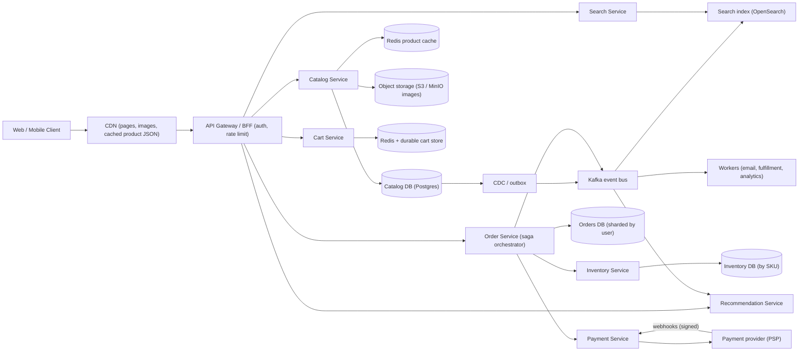
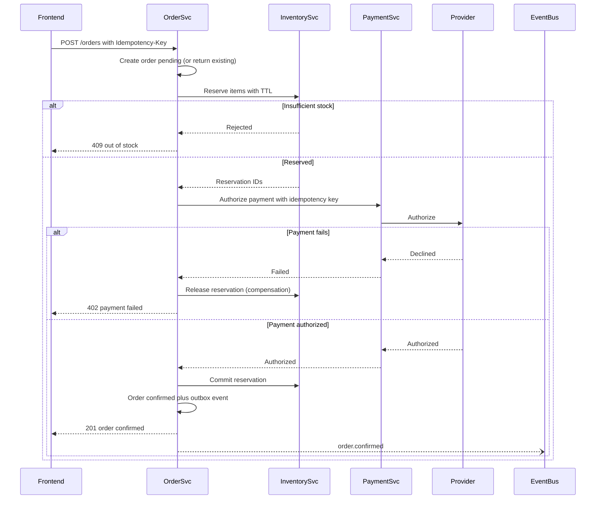

# E-commerce App

> **Reviewed:** 2026-09 · **Scope:** Full-stack (frontend + backend + scalability) · **Level:** Senior / Tech Lead

---

## Overview

Design a full-featured e-commerce platform where users can browse products, manage shopping carts, process secure payments, and track orders. The system handles inventory management, product recommendations, and order processing.

---

## 1) Requirements

### Functional Requirements

**Core Features:**
- Product browsing and search with filters (category, price, brand, rating)
- Product details with images, reviews, specifications
- Shopping cart management (add, update, remove items)
- Secure checkout with address and payment selection
- Order management (track orders, cancellation, returns)
- User accounts with order history
- Product reviews and ratings
- Wishlist functionality
- Product recommendations ("Customers who bought this also bought")

**Advanced Features:**
- Real-time inventory tracking
- Multiple payment methods (cards, UPI, wallets, COD)
- Coupon codes and discounts
- Order tracking with status updates
- Return and refund processing
- Product comparison
- Recently viewed products

### Non-Functional Requirements

**Performance:**
- Fast page loads: < 2 seconds
- Optimized product images (lazy loading, WebP format)
- Efficient search and filtering
- Smooth infinite scroll

**Scalability:**
- Handle traffic spikes (Black Friday, sales events)
- Support millions of products
- Thousands of concurrent users
- CDN for global asset delivery

**User Experience:**
- Responsive design (mobile-first)
- Smooth navigation and page transitions
- Search suggestions (autocomplete)
- Quick view product details

**Security:**
- PCI-DSS compliant payment processing
- Secure authentication
- XSS and CSRF protection
- Data encryption

---

## 2) Component Hierarchy

The frontend is a React e-commerce application. Here's the structure:

```
App
├── Layout
│   ├── Header
│   │   ├── Logo
│   │   ├── SearchBar (global product search)
│   │   ├── ShoppingCartIcon (with item count)
│   │   └── UserMenu
│   └── MainContent
├── Pages
│   ├── HomePage
│   │   ├── HeroBanner
│   │   ├── CategoryList
│   │   └── FeaturedProducts
│   ├── ProductListPage
│   │   ├── FilterSidebar
│   │   │   ├── CategoryFilter
│   │   │   ├── PriceFilter (range slider)
│   │   │   ├── BrandFilter (multi-select)
│   │   │   └── RatingFilter (star rating)
│   │   ├── ProductGrid
│   │   │   └── ProductCard
│   │   │       ├── ProductImage (lazy loaded)
│   │   │       ├── ProductName
│   │   │       ├── ProductPrice
│   │   │       ├── ProductRating
│   │   │       ├── StockIndicator
│   │   │       └── AddToCartButton
│   │   └── Pagination (or InfiniteScroll)
│   ├── ProductDetailPage
│   │   ├── ProductImages (image gallery with zoom)
│   │   ├── ProductInfo
│   │   │   ├── ProductTitle
│   │   │   ├── ProductPrice
│   │   │   ├── ProductRating
│   │   │   ├── StockIndicator
│   │   │   ├── QuantitySelector
│   │   │   ├── AddToCartButton
│   │   │   └── BuyNowButton
│   │   ├── ProductDescription
│   │   ├── ProductSpecifications
│   │   └── ProductReviews
│   │       ├── ReviewList
│   │       │   └── ReviewItem (rating, comment, helpful votes)
│   │       └── ReviewForm (write review)
│   ├── ShoppingCartPage
│   │   ├── CartItemList
│   │   │   └── CartItem
│   │   │       ├── ProductImage
│   │   │       ├── ProductName
│   │   │       ├── QuantitySelector
│   │   │       ├── Price
│   │   │       └── RemoveButton
│   │   └── CartSummary
│   │       ├── Subtotal
│   │       ├── Shipping
│   │       ├── Discount (coupon code)
│   │       └── Total
│   ├── CheckoutPage
│   │   ├── AddressForm (select or add address)
│   │   ├── PaymentMethodSelector
│   │   ├── OrderSummary
│   │   └── PlaceOrderButton
│   └── OrderHistoryPage
│       ├── OrderList
│       │   └── OrderCard
│       │       ├── OrderId
│       │       ├── OrderDate
│       │       ├── OrderStatus
│       │       ├── OrderItems
│       │       └── OrderActions (Track, Cancel, Return)
│       └── OrderFilters
└── SharedComponents
    ├── Button
    ├── Input
    ├── Card
    ├── Toast
    └── LoadingSpinner
```

### Key Components Explained

**1. ProductCard Component**
- Displays product in grid/list view
- Shows image, name, price, rating
- Add to cart button with optimistic updates
- Stock indicator (in stock, low stock, out of stock)
- Links to product detail page

**2. ProductDetailPage Component**
- Full product information
- Image gallery with zoom
- Quantity selector (validates against stock)
- Add to cart and buy now buttons
- Reviews and ratings section

**3. ShoppingCart Component**
- Displays cart items with quantities
- Update quantity or remove items
- Cart summary with totals
- Proceed to checkout button
- Optimistic updates for instant feedback

**4. CheckoutForm Component**
- Address selection/creation
- Payment method selection
- Order summary review
- Place order with validation
- Order confirmation

**5. FilterSidebar Component**
- Multiple filter types (category, price, brand, rating)
- Updates URL query parameters
- Triggers product refetch
- Clear filters functionality

---

## 3) Data Models

Here are the key data structures:

```typescript
// Product
interface Product {
  id: string;
  name: string;
  description: string;
  price: number;
  originalPrice?: number;  // For discounts
  images: string[];
  category: string;
  brand: string;
  rating: number;  // Average rating
  reviewCount: number;
  inStock: boolean;
  stockCount: number;
  sku: string;
  specifications: Record<string, string>;  // Key-value pairs
  createdAt: string;
}

// Cart item
interface CartItem {
  id: string;
  productId: string;
  product: Product;
  quantity: number;
  price: number;  // Price at time of adding
  addedAt: string;
}

// Shopping cart
interface ShoppingCart {
  id: string;
  userId: string;
  items: CartItem[];
  subtotal: number;
  shipping: number;
  discount: number;
  total: number;
  couponCode?: string;
}

// Order
interface Order {
  id: string;
  userId: string;
  items: OrderItem[];
  shippingAddress: Address;
  paymentMethod: PaymentMethod;
  status: "pending" | "confirmed" | "shipped" | "delivered" | "cancelled" | "returned";
  subtotal: number;
  shipping: number;
  discount: number;
  total: number;
  createdAt: string;
  updatedAt: string;
  trackingNumber?: string;
}

// Order item
interface OrderItem {
  id: string;
  productId: string;
  product: Product;
  quantity: number;
  price: number;  // Price at time of order
}

// Address
interface Address {
  id: string;
  userId: string;
  name: string;
  phone: string;
  addressLine1: string;
  addressLine2?: string;
  city: string;
  state: string;
  zipCode: string;
  country: string;
  isDefault: boolean;
}

// Product review
interface Review {
  id: string;
  productId: string;
  userId: string;
  userName: string;
  rating: number;  // 1-5
  comment: string;
  helpfulCount: number;
  createdAt: string;
  isVerifiedPurchase: boolean;
}
```

### Data Flow Explanation

**When a user adds to cart:**
1. User clicks "Add to Cart" on ProductCard
2. Frontend validates inventory (checks stockCount)
3. Optimistic update: item appears in cart immediately
4. API call: POST /api/v1/cart with productId and quantity
5. Server validates inventory again
6. On success, cart updates; on failure, rollback optimistic update

**When a user checks out:**
1. User reviews cart and clicks "Checkout"
2. User selects/enters shipping address
3. User selects payment method
4. User reviews order summary
5. User places order
6. Server reserves inventory atomically (prevents overselling)
7. Order is created with "pending" status
8. Payment is processed
9. Order status updates to "confirmed"
10. User receives order confirmation

**Inventory management:**
1. Product pages show real-time stock status
2. Add to cart validates inventory
3. Checkout validates inventory again
4. Order placement reserves inventory atomically
5. Inventory decrements on order confirmation
6. Real-time updates via polling or WebSocket

---

## 4) API Design

### REST Endpoints

**GET /api/v1/products**
- Get products with filters
- Query params: `category`, `brand`, `minPrice`, `maxPrice`, `rating`, `page`, `limit`, `sortBy`
- Returns: Paginated list of Product objects

**GET /api/v1/products/:id**
- Get product details
- Returns: Product object with full details

**GET /api/v1/products/:id/reviews**
- Get product reviews
- Query params: `page`, `limit`, `rating`
- Returns: Paginated list of Review objects

**POST /api/v1/products/:id/reviews**
- Add a product review
- Request body: `{ rating: number, comment: string }`
- Returns: Review object

**GET /api/v1/cart**
- Get user's shopping cart
- Returns: ShoppingCart object

**POST /api/v1/cart/items**
- Add item to cart
- Request body: `{ productId: string, quantity: number }`
- Returns: Updated ShoppingCart

**PATCH /api/v1/cart/items/:id**
- Update cart item quantity
- Request body: `{ quantity: number }`
- Returns: Updated ShoppingCart

**DELETE /api/v1/cart/items/:id**
- Remove item from cart
- Returns: Updated ShoppingCart

**POST /api/v1/orders**
- Create an order
- Request body: `{ addressId: string, paymentMethodId: string, couponCode?: string }`
- Returns: Order object

**GET /api/v1/orders**
- Get user's orders
- Query params: `page`, `limit`, `status`
- Returns: Paginated list of Order objects

**GET /api/v1/orders/:id**
- Get order details
- Returns: Order object

**PATCH /api/v1/orders/:id/cancel**
- Cancel an order
- Returns: Updated Order object

### API Request/Response Examples

**Get Products:**
```json
// GET /api/v1/products?category=electronics&minPrice=100&maxPrice=1000&page=1&limit=20
// Response
{
  "success": true,
  "data": {
    "products": [
      {
        "id": "prod_123",
        "name": "Wireless Headphones",
        "price": 99.99,
        "images": ["https://cdn.example.com/headphones.jpg"],
        "category": "electronics",
        "brand": "TechBrand",
        "rating": 4.5,
        "reviewCount": 1250,
        "inStock": true,
        "stockCount": 50
      }
    ],
    "total": 150,
    "page": 1,
    "limit": 20
  }
}
```

**Add to Cart:**
```json
// POST /api/v1/cart/items
{
  "productId": "prod_123",
  "quantity": 2
}

// Response
{
  "success": true,
  "data": {
    "id": "cart_123",
    "items": [
      {
        "id": "item_123",
        "productId": "prod_123",
        "product": { ... },
        "quantity": 2,
        "price": 99.99
      }
    ],
    "subtotal": 199.98,
    "shipping": 10.00,
    "total": 209.98
  }
}
```

**Create Order:**
```json
// POST /api/v1/orders
{
  "addressId": "addr_123",
  "paymentMethodId": "pm_123",
  "couponCode": "SAVE10"
}

// Response
{
  "success": true,
  "data": {
    "id": "order_123",
    "status": "confirmed",
    "items": [ ... ],
    "total": 189.98,
    "createdAt": "2024-01-15T10:00:00Z"
  }
}
```

---

## Key Design Decisions

**1. Optimistic Updates for Cart**
- Show items in cart immediately (useOptimistic)
- Better perceived performance
- Rollback if API call fails
- Instant user feedback

**2. Inventory Validation at Multiple Points**
- Validate before adding to cart
- Validate again at checkout
- Reserve inventory atomically on order placement
- Prevents overselling

**3. Real-time Inventory Updates**
- Poll inventory status for active product pages
- Or use WebSocket for real-time updates
- Show stock status accurately
- Disable add to cart when out of stock

**4. URL State for Filters**
- Store filters in URL query parameters
- Enables shareable filtered product URLs
- Browser back/forward works correctly
- Deep linking support

**5. Image Optimization**
- Lazy load product images
- Use WebP format for better compression
- CDN delivery for fast global access
- Responsive images (different sizes for different devices)

**6. Search with Autocomplete**
- Debounce search input
- Show suggestions as user types
- Fast search results
- Keyboard navigation support

**7. Idempotent Checkout Submission**
- Generate an idempotency key when the checkout page loads and send it with `POST /orders`
- Disable the submit button while pending, but rely on the key (not the button) to prevent duplicate orders on retries or double clicks

---

## Backend High-Level Design

Split by **bounded context** with different consistency needs: catalog and search are read-heavy and cache-friendly; cart is per-user and write-light; inventory, orders, and payments need correctness and are coordinated by a **checkout saga**.



| Service | Responsibility | Store |
|---------|----------------|-------|
| Catalog | Products, SKUs, prices, attributes, images | Postgres (source of truth), Redis cache, CDN for rendered pages and images |
| Search | Full-text + facets over products (see [Search System](./02-search-system.md)) | OpenSearch/Elasticsearch fed by CDC |
| Cart | Add/update/remove items; guest carts merged at login | Redis for speed plus a durable store (DynamoDB/Postgres) |
| Inventory | Stock per SKU per warehouse, reservations with expiry | Postgres, strongly consistent, partitioned by SKU |
| Order | Checkout saga, order state machine, idempotency | Postgres sharded by `user_id`, transactional outbox |
| Payment | Tokenized payments via a PSP, webhooks, refunds | Payment records with unique idempotency keys; card data stays at the PSP (reduces PCI scope) |
| Workers | Emails, fulfillment handoff, reservation expiry, analytics | Node workers or [Celery](../backend/celery/index.md) on [RabbitMQ](../backend/rabbitmq/index.md) / Kafka ([trade-offs](../backend/architecture/05-messaging-systems.md)) |

**Caching product pages:**
- Product detail pages are rendered with SSG/ISR or SSR and cached at the CDN with `stale-while-revalidate`.
- **Split static from dynamic:** description, images, and specs are cacheable for minutes to hours; price and stock badges are fetched separately (short TTL or client-side) so a cache hit never shows a wildly wrong price.
- Invalidate on catalog change events (purge by surrogate key/tag, e.g., `product:123`).
- Final price and availability are always re-validated server-side at checkout.

---

## Data Model and Consistency

```sql
CREATE TABLE skus (
  sku_id      BIGINT PRIMARY KEY,
  product_id  BIGINT NOT NULL,
  price_cents BIGINT NOT NULL,
  currency    CHAR(3) NOT NULL,
  attributes  JSONB                     -- size, color, ...
);

CREATE TABLE inventory (
  sku_id        BIGINT NOT NULL,
  warehouse_id  INT NOT NULL,
  on_hand       INT NOT NULL CHECK (on_hand >= 0),
  reserved      INT NOT NULL CHECK (reserved >= 0),
  PRIMARY KEY (sku_id, warehouse_id),
  CHECK (reserved <= on_hand)
);

CREATE TABLE reservations (
  reservation_id BIGINT PRIMARY KEY,
  order_id       BIGINT NOT NULL,
  sku_id         BIGINT NOT NULL,
  warehouse_id   INT NOT NULL,
  qty            INT NOT NULL,
  status         TEXT NOT NULL,          -- held | committed | released
  expires_at     TIMESTAMPTZ NOT NULL
);
CREATE INDEX idx_reservations_expiry ON reservations (status, expires_at);

CREATE TABLE orders (
  order_id        BIGINT PRIMARY KEY,
  user_id         BIGINT NOT NULL,
  status          TEXT NOT NULL,         -- pending | awaiting_payment | confirmed | cancelled | ...
  total_cents     BIGINT NOT NULL,
  idempotency_key TEXT NOT NULL,
  created_at      TIMESTAMPTZ NOT NULL,
  UNIQUE (user_id, idempotency_key)
);
CREATE INDEX idx_orders_user ON orders (user_id, created_at DESC);

CREATE TABLE payments (
  payment_id      BIGINT PRIMARY KEY,
  order_id        BIGINT NOT NULL,
  psp_reference   TEXT UNIQUE,
  status          TEXT NOT NULL,         -- authorized | captured | failed | refunded
  idempotency_key TEXT NOT NULL UNIQUE
);

CREATE TABLE outbox (                    -- written in the same transaction as the state change
  id           BIGSERIAL PRIMARY KEY,
  aggregate_id BIGINT NOT NULL,
  event_type   TEXT NOT NULL,
  payload      JSONB NOT NULL,
  published_at TIMESTAMPTZ
);
```

**Inventory reservation (no overselling):**

```sql
UPDATE inventory
SET reserved = reserved + :qty
WHERE sku_id = :sku AND warehouse_id = :wh
  AND on_hand - reserved >= :qty;
-- 1 row updated = reserved; 0 rows = insufficient stock
```

A conditional atomic update avoids read-then-write races without long-held locks. On payment success, commit (`on_hand -= qty, reserved -= qty`); on failure or expiry, release (`reserved -= qty`).

**Partition keys:**
- Orders and payments: `user_id` (order history queries stay single-shard).
- Inventory: `sku_id` (reservation is a single-row operation).
- Cart: `user_id` or `cart_id`.
- Catalog: small enough to replicate; read replicas and caches carry the load.

**Consistency trade-offs:**
- **Strong:** inventory reservation, order state transitions, payment records.
- **Eventual:** search index, recommendations, product page caches, review counts.
- Cart displays cached prices; checkout recomputes totals from the catalog and rejects if the price changed materially, prompting the user.
- There is no distributed transaction across services; the **saga** coordinates local transactions with compensations.

**Idempotency:**
- `POST /orders` requires an `Idempotency-Key`; the unique constraint returns the existing order on retry.
- Payment calls pass an idempotency key to the PSP so a network retry never charges twice.
- Webhook handlers dedupe by PSP event ID; consumers of the outbox are idempotent because delivery is at-least-once.

---

## Scalability and Reliability

### Back-of-envelope estimate

> **ILLUSTRATIVE assumptions** (not real-world figures): 10M daily active users, 20 page views per user per day, 95% CDN/cache hit ratio for product pages, 2% of DAU place an order, 3 items per order, normal peak 5x average, flash sale where 200,000 users try to buy one hot SKU in the first 60 s.

**Browse traffic:**
- Page views: 10M x 20 = **200M/day** = 200,000,000 / 86,400 = **~2,315 RPS** average, **~11,600 RPS** at 5x peak
- Origin load after 95% cache hit: 11,600 x 0.05 = **~580 RPS** at peak (plus uncached price/stock calls)

**Orders:**
- Orders: 10M x 2% = **200,000/day** = **~2.3 orders/s** average, **~12/s** at 5x peak
- Inventory reservations: 200,000 x 3 = **600,000/day**; trivial for a sharded DB in normal times

**Flash sale:**
- 200,000 attempts / 60 s = **~3,333 reservation attempts/s on one SKU row**
- A single hot row serializes updates; if each conditional update holds the row lock for about 1 ms (illustrative), the ceiling is ~1,000 updates/s, so requests queue and time out. Fixes are below.

### Bottlenecks and fixes

| Bottleneck | Fix |
|-----------|-----|
| Hot SKU row in a flash sale | Pre-load stock into Redis and use an atomic decrement (or Lua script) as a gate, then persist reservations asynchronously; or split stock into N sub-buckets |
| Traffic spike at sale start | Waiting room / virtual queue, admit users at a controlled rate (see [Ticket Booking System](./12-ticket-booking-system.md)) |
| Product page origin load | CDN + ISR with tag-based purge, request collapsing |
| Search load during sales | Cache popular queries, pre-warm, degrade facets under load |
| PSP latency or rate limits | Async payment confirmation via webhooks, circuit breaker, queue retries |
| Reservation leaks (abandoned checkouts) | TTL on reservations; expiry worker releases stock |

### Failure modes

| Failure | Impact | Mitigation |
|---------|--------|-----------|
| Payment succeeds but order service crashes | Customer charged, no confirmed order | Webhook + reconciliation job matches PSP records to orders; saga resumes from persisted state |
| Duplicate checkout submit | Double order or double charge | Idempotency keys on order and payment; unique constraints |
| Inventory service down | Cannot reserve, checkout blocked | Fail closed for checkout (do not oversell); browsing continues from cache |
| Event bus lag | Search/recommendations stale | Acceptable; alert on lag; checkout does not depend on them |
| Cache stampede after purge | Origin overload | Stale-while-revalidate, request coalescing, jittered TTLs |
| Reservation expires during slow payment | Stock released while payment pending | Hold TTL longer than PSP timeout; if payment succeeds after release, try re-reserve or auto-refund |
| Bot traffic in flash sale | Real users locked out | Rate limits, bot detection, per-user purchase limits, queue tokens |

### Key flow: checkout saga (orchestrated)



For 3-D Secure or redirect-based payment methods the flow becomes asynchronous: the order waits in `awaiting_payment` and the PSP webhook drives the next saga step.

---

## Deep Dive Options (RADIO)

<details>
<summary>Deep dive 1: Checkout saga and payments</summary>

- **Requirements:** Never charge without an order, never confirm without payment, no double charge, recover from crashes at any step.
- **Architecture:** Orchestrated saga in the Order Service (or a workflow engine such as Temporal). Each step is a local transaction; failures trigger compensations (release reservation, void/refund payment). State changes emit events via a transactional outbox.
- **Data model:** `orders.status` state machine, `saga_steps(order_id, step, status, attempts)`, `payments` with unique idempotency key and PSP reference.
- **Interface:** `POST /orders` (Idempotency-Key header), `GET /orders/:id` for polling status, PSP webhook endpoint with signature verification.
- **Optimizations:** Authorize at checkout and capture at shipment, reconciliation job against PSP reports, timeouts per step with retries and backoff.

</details>

<details>
<summary>Deep dive 2: Flash sales and inventory hot spots</summary>

- **Requirements:** Sell exactly N units, stay responsive under a sudden spike, fair access, per-user limits.
- **Architecture:** Waiting room issues signed admission tokens at a controlled rate. A Redis counter per SKU (`DECRBY` guarded by a Lua script that refuses to go below zero) acts as the fast gate; successful decrements create a reservation record asynchronously in the inventory DB, which remains the source of truth.
- **Data model:** `stock:{sku}` counter in Redis, `reservations` table, per-user purchase counter `limit:{sale}:{user}`.
- **Interface:** `POST /sales/:id/reserve` returns reservation ID or sold-out; the client then proceeds to checkout within the TTL.
- **Optimizations:** Pre-warm caches and scale ahead of the announced start, static sold-out page at the CDN, reconcile Redis and DB after the sale.

</details>

<details>
<summary>Deep dive 3: Product page performance and caching</summary>

- **Requirements:** Fast product pages (LCP target), SEO-friendly, prices and stock never badly stale.
- **Architecture:** Next.js ISR/SSR behind a CDN with surrogate-key purge; dynamic price/stock island fetched from a lightweight endpoint; images through an image CDN with responsive formats.
- **Data model:** Denormalized product read model (product + SKUs + media + rating summary) built from catalog events.
- **Interface:** `GET /products/:id` (cacheable), `GET /products/:id/availability` (short TTL or no cache).
- **Optimizations:** Tag-based invalidation on catalog events, stale-while-revalidate, preload above-the-fold image, edge caching per locale/currency.

</details>

---

## Scaling with AI and Agentic Workflows

See [agentic workflows](../agentic-workflows/index.md) and [AI-assisted development](../ai/ai-assisted-development/index.md).

**Engineering workflows:**
- **Brainstorm bottlenecks, then validate with math.** Ask an agent what fails in a "200,000 buyers in 60 s" flash sale; verify its answers with the hot-row arithmetic above and a load test, not intuition.
- **Generate load tests for review.** Agents can draft k6 scenarios for browse-heavy traffic, cart churn, and a flash-sale burst with realistic think times. Review the scenario mix and run against staging with a PSP sandbox, never real payments.
- **Summarize metrics and traces for RCA.** Have an assistant summarize a failed checkout spike by grouping traces by saga step and PSP error code; confirm the root cause in raw traces and PSP dashboards.
- **Draft migrations, runbooks, and IaC.** Agents can draft the flash-sale readiness runbook, autoscaling configs, or a migration from dual-write to transactional outbox (see [DevOps](../devops/index.md)). Humans review and execute.

**Product AI features:**

| Feature | Value | Latency / cost / data trade-off |
|---------|-------|--------------------------------|
| Recommendations ("also bought", personalized home) | Discovery and basket size | Precompute candidates offline, rank with lightweight real-time features; cache per segment; privacy review for behavioral data |
| Semantic / hybrid product search | Better results for descriptive queries | Embedding cost per product and query; rerank only top N (see [Search System](./02-search-system.md)) |
| Auto-generated product descriptions and attribute extraction | Faster catalog onboarding | Must be reviewed for accuracy and claims; wrong specs cause returns and legal risk |
| Fraud scoring at checkout | Fewer chargebacks | Adds a synchronous call in checkout; keep it fast with a timeout and a safe default path; false positives lose sales |
| Review summarization | Faster decisions | Generate async and cache; label as AI-generated |

**Human approval required for:**
- Publishing AI-generated product copy, pricing, or promotions
- Changes to fraud thresholds or automatic order cancellation rules
- Refunds or cancellations above a threshold recommended by an agent
- Production changes to inventory, payment, or saga logic

**Do not trust AI for:**
- Inventory counts or anything that decides whether stock exists
- Payment state; the PSP and your ledger are the source of truth
- Tax, legal, or compliance claims (PCI scope, consumer law)
- Capacity numbers without your own measured baseline

---

## Interview Talking Points

**When explaining this system, I'd focus on:**

1. **Requirements First**: Start with core functionality - browse products, shopping cart, checkout, orders

2. **Component Structure**: Explain the React component hierarchy - product list, product detail, cart, checkout

3. **Data Models**: Walk through Product, CartItem, Order, Address - and how they relate

4. **API Design**: Show the REST endpoints - products, cart, orders, reviews

5. **Key Challenges**: 
   - Inventory management and preventing overselling
   - Optimistic updates for better UX
   - Real-time inventory tracking
   - Handling traffic spikes during sales
   - Secure payment processing

**Example explanation flow:**
> "So for an e-commerce app, the core requirement is allowing users to browse products, add them to a cart, and complete purchases. The frontend is a React app with a product list page showing products in a grid with filters. Users can view product details, add items to cart with optimistic updates for instant feedback, and proceed to checkout. The data model centers around Product objects with inventory tracking, CartItem objects for the shopping cart, and Order objects for completed purchases. Inventory is validated at multiple points - before adding to cart, at checkout, and atomically reserved when placing an order to prevent overselling. The main API endpoints handle product browsing with filters, cart management, order creation, and order tracking. Key challenges include managing inventory accurately to prevent overselling, providing real-time stock updates, handling traffic spikes during sales events, and ensuring secure payment processing."

**Full-stack extension:**
> "On the backend I split catalog, search, cart, inventory, order, and payment into services with different consistency needs. Catalog is cached aggressively at the CDN, with price and stock fetched separately. Checkout is an orchestrated saga: create the order idempotently, reserve inventory with a conditional atomic update and a TTL, authorize payment through the PSP with an idempotency key, then commit or compensate. Events go out through a transactional outbox to Kafka for search, emails, and fulfillment. For flash sales I add a waiting room and a Redis stock gate in front of the inventory database."

### Follow-up Questions

1. **How do you prevent overselling?** Conditional atomic update (`on_hand - reserved >= qty`) or row locks in the inventory DB, reservations with TTL, and DB constraints as a backstop.
2. **Why a saga instead of a distributed transaction?** Services own separate databases and the PSP is external; two-phase commit is not available or practical. Sagas use local transactions plus compensations.
3. **Orchestration or choreography?** Orchestration for checkout: one place owns the state machine, which makes timeouts and debugging easier. Choreography suits loosely coupled side effects like emails.
4. **How do you avoid double charges?** Idempotency keys from client to Order Service and from Payment Service to PSP, unique constraints, and webhook dedupe by event ID.
5. **How do you cache product pages without showing wrong prices?** Cache static content at the CDN, fetch price/stock separately with short TTLs, purge by tag on change, and re-validate at checkout.
6. **When do you reserve inventory: add-to-cart or checkout?** Usually at checkout (or payment start) with a short TTL; reserving at add-to-cart locks stock for users who never buy. Flash sales may reserve at "buy now."
7. **How do you merge a guest cart after login?** Merge by SKU on login, re-validate prices and stock, and keep the result in the user's cart.

### Common Mistakes

- Read-then-write inventory checks without atomicity
- Trusting client-sent prices or totals
- Calling the PSP inside a database transaction
- Publishing events with dual-writes instead of an outbox
- Caching the whole product page including price and stock for a long TTL
- No reconciliation job between orders and PSP records
- Treating a flash sale like normal traffic instead of adding a queue and a stock gate

---

## References

- microservices.io, *Saga pattern*: https://microservices.io/patterns/data/saga.html
- microservices.io, *Transactional Outbox*: https://microservices.io/patterns/data/transactional-outbox.html
- Stripe, *Idempotent requests*: https://docs.stripe.com/api/idempotent_requests
- Stripe, *Webhooks*: https://docs.stripe.com/webhooks
- PCI Security Standards Council: https://www.pcisecuritystandards.org/
- IETF RFC 9111, *HTTP Caching*: https://www.rfc-editor.org/rfc/rfc9111
- Related case studies: [Payment System](./04-payment-system.md), [Search System](./02-search-system.md), [Ticket Booking System](./12-ticket-booking-system.md)

